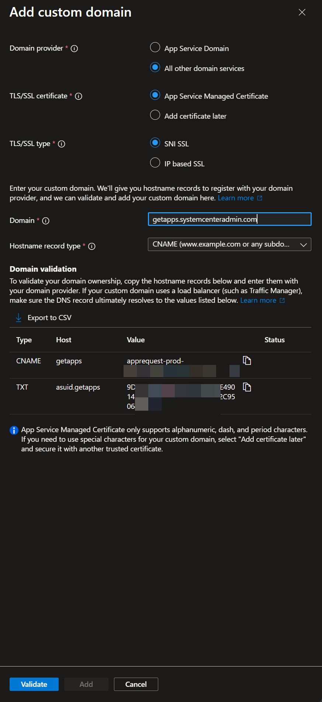

# Custom domain configuration

This guide explains how to configure a custom domain (e.g., `apps.yourdomain.com`) for your App Store for Intune deployment on Azure App Service.

## Overview

By default, your portal is accessible via an Azure-assigned URL like:
```
https://apprequestportal-xxxx.azurewebsites.net
```

You can configure a custom domain to provide a more professional, branded experience:
```
https://apps.yourdomain.com
```

## Prerequisites

- Azure App Service running your portal (Basic tier or higher for custom domains with SSL)
- Access to your domain's DNS management
- Admin access to your Entra ID App Registration

## Configuration order

DNS records have to be in place **before** Azure validates the domain (Azure reads the TXT and CNAME you create at registration time). The portal's in-product Settings tab guides admins through these steps in this order, and so does this reference doc:

1. Configure DNS records at your provider
2. Add the custom domain to Azure (one-click button or manual)
3. Update Entra ID redirect URIs
4. Update the portal's Portal URL setting

## Step 1: Configure DNS records

### For subdomains (recommended)

If using a subdomain like `apps.yourdomain.com`:

| Type | Name | Value | TTL |
|------|------|-------|-----|
| CNAME | `apps` | `your-app.azurewebsites.net` | 3600 |
| TXT | `asuid.apps` | `<Custom Domain Verification ID>` | 3600 |

!!! note "Naming the TXT record"
    The TXT record name is always `asuid.` followed by the subdomain portion of your custom domain. Examples:

    - `apps.yourdomain.com` → `asuid.apps`
    - `getapps.contoso.io` → `asuid.getapps`
    - `portal.example.net` → `asuid.portal`

    Some DNS providers (Cloudflare, GoDaddy, Route 53) auto-append the zone when you enter the name. Others want the full FQDN (`asuid.apps.yourdomain.com`). If validation fails after DNS propagation, confirm what was actually published with `nslookup -q=TXT asuid.apps.yourdomain.com`.

To get the **Custom Domain Verification ID**:

1. Go to **Azure Portal** → **App Services** → your App Service. The App Service name is the `appName` value you captured from the [deployment outputs](../installation/setup-guide/deploy-to-azure.md#capture-the-deployment-outputs).
2. Go to **Settings** → **Custom domains**.
3. Select **+ Add custom domain**. The **Custom Domain Verification ID** is shown in the dialog. Copy it for your DNS TXT record above. You'll come back here to actually save in Step 2.

### For apex/root domains

If using your root domain (e.g., `yourdomain.com`):

| Type | Name | Value | TTL |
|------|------|-------|-----|
| A | `@` | `<App Service IP Address>` | 3600 |
| TXT | `asuid` | `<Custom Domain Verification ID>` | 3600 |

**Note:** Get the App Service IP address from **Settings** → **Custom domains** → **IP address** in Azure Portal.

### DNS propagation

DNS changes can take anywhere from a few minutes to 48 hours to propagate globally. You can verify propagation using:
- [dnschecker.org](https://dnschecker.org)
- `nslookup apps.yourdomain.com`
- `dig apps.yourdomain.com`

## Step 2: Add custom domain + SSL certificate to Azure

### Option A: One-click deployment (recommended)

!!! note "First-time setup? Skip to Option B."
    Option A is launched from inside the portal (**Admin → Settings → Custom Domain Setup**), which means you have to be signed in to the portal already. If you're configuring a custom domain as part of your initial deploy (before you've ever signed in), use Option B instead. You can always come back to Option A for future certificate renewals.

The portal ships an ARM template that adds the custom domain hostname binding **and** provisions a free Azure-managed SSL certificate in a single deployment. From the portal: **Admin → Settings → Custom Domain Setup → Configure Custom Domain in Azure**.

The template lives at:

```
https://raw.githubusercontent.com/powerstacks-corp/app-store-for-intune/main/azuredeploy-customdomain.json
```

DNS records (Step 1) must already be propagated, otherwise Azure's domain validation will fail at deployment time.

### Option B: Manual configuration

Microsoft's official tutorial is the canonical reference: [Tutorial: Map custom domain to App Service (Microsoft Learn)](https://learn.microsoft.com/en-us/azure/app-service/app-service-web-tutorial-custom-domain?tabs=root%2Cazurecli#configure-a-custom-domain).

Quick summary:

1. Go to **Azure Portal** → **App Services** → your App Service. The App Service name is the `appName` value you captured from the [deployment outputs](../installation/setup-guide/deploy-to-azure.md#capture-the-deployment-outputs).
2. Go to **Settings** → **Custom domains**.
3. Select **+ Add custom domain**.
4. In the **Add custom domain** dialog, set:
    - **Domain provider**: **All other domain services** (use **App Service Domain** only if you purchased the domain through Azure itself).
    - **TLS/SSL certificate**: **App Service Managed Certificate** for the free Azure-managed cert. Pick **Add certificate later** if you'll bring your own — see [Other certificate options](#other-certificate-options-manual-only) below.
    - **TLS/SSL type**: **SNI SSL**.
    - **Hostname record type**: **CNAME** for subdomains (recommended), **A** for apex/root domains.
    - **Domain**: enter your custom domain (e.g., `apps.yourdomain.com`).

    Once the domain is entered, the **Domain validation** section shows the DNS records Azure expects and their current resolution status — useful for confirming your Step 1 DNS records are propagated before you click Validate.

    

5. Select **Validate**. This succeeds because DNS from Step 1 is in place.
6. Select **Add**. The custom domain is added and — if you chose **App Service Managed Certificate** — the certificate is provisioned and bound automatically. Allow up to 10 minutes for the certificate to issue.

If you selected **Add certificate later** in Step 4, finish with these extra steps to add and bind your own cert:

7. Go to **Settings** → **Certificates** → **+ Add certificate**.
8. Select your certificate source (Key Vault import, upload, or Managed Certificate) and complete the dialog.
9. Return to **Settings** → **Custom domains** → select your domain → **Add binding** → choose your certificate with **SNI SSL**.

### Other certificate options (manual only)

The one-click template uses an Azure-managed certificate, which has these limitations:

- Available for App Service Basic tier and above only
- No wildcard domains
- No apex/root domains (use Azure Front Door or a third-party cert)

If your scenario requires a different certificate path, replace step 7 above with one of these:

**Azure Key Vault certificate:**

1. Upload or generate a certificate in Azure Key Vault
2. In App Service → **Settings** → **Certificates** → **+ Add certificate**
3. Select **Import from Key Vault**
4. Choose your Key Vault and certificate
5. Bind to your custom domain

**Bring your own certificate:**

1. Obtain a certificate from a Certificate Authority (CA)
2. Export as PFX/PEM with private key
3. In App Service → **Settings** → **Certificates** → **+ Add certificate**
4. Select **Upload certificate**
5. Upload your PFX/PEM file
6. Bind to your custom domain

## Step 3: Update Microsoft Entra ID redirect URIs (frontend SPA app registration)

Redirect URIs need to be added to the **Frontend SPA** app registration only. The Backend API app is a confidential client that receives tokens from the SPA, so it doesn't use redirect URIs and doesn't need any change here.

1. Go to **Microsoft Entra admin center** → **App registrations**
2. Select your **Frontend SPA** app registration (commonly named *App Store for Intune - Frontend* or similar; if unsure, check `src/AppRequestPortal.Web/src/authConfig.ts`. The `clientId` it imports identifies the SPA app.)
3. Go to **Authentication** → **Platform configurations** → **Single-page application**
4. Add the following redirect URIs:

   ```text
   https://apps.yourdomain.com
   https://apps.yourdomain.com/auth/callback
   ```

5. **Important:** Keep the existing Azure URLs during transition so any open tabs and bookmarks keep working:

   ```text
   https://your-app.azurewebsites.net
   https://your-app.azurewebsites.net/auth/callback
   ```

6. Select **Save**

## Step 4: Update application configuration

### Update Portal URL setting

1. Sign in to your portal as an admin
2. Go to **Admin** → **Settings**
3. On the **Communications** tab, update the **Portal URL** to your custom domain:

   ```text
   https://apps.yourdomain.com
   ```

4. Select **Save Settings**

This controls the base URL used in email notifications and Teams bot notification links.

### Update frontend configuration (if needed)

If you're using environment variables for the API URL, update `REACT_APP_API_URL`:

```env
REACT_APP_API_URL=https://apps.yourdomain.com/api
```

## Step 5: Force HTTPS (recommended)

Ensure all traffic uses HTTPS:

1. In Azure Portal → App Service → **Settings** → **Configuration**
2. Go to **General settings**
3. Set **HTTPS Only** to **On**
4. Select **Save**

## Step 6: Update Teams bot configuration (if enabled)

If you have the Teams Bot enabled for proactive notifications, two things need updating:

### Update Azure Bot messaging endpoint

1. Go to **Azure Portal** → **Azure Bot** resource → **Configuration**
2. Change **Messaging endpoint** from:
   ```
   https://your-app.azurewebsites.net/api/messages
   ```
   to:
   ```
   https://apps.yourdomain.com/api/messages
   ```
3. Select **Apply**

### Update Teams app manifest

1. Edit `manifest.json` and add your custom domain to `validDomains`:
   ```json
   "validDomains": [
       "apps.yourdomain.com",
       "your-app.azurewebsites.net"
   ]
   ```
2. Optionally update the `developer` URLs (`websiteUrl`, `privacyUrl`, `termsOfUseUrl`) to use the custom domain
3. Re-zip the manifest files (`manifest.json`, `color.png`, `outline.png`)
4. In **Teams Admin Center** → **Teams apps** → **Manage apps**, find the existing App Store for Intune bot, select it, and upload the updated package

!!! note
    Keeping both domains in `validDomains` ensures the bot continues to work during the transition. You can remove the `.azurewebsites.net` entry later once the custom domain is fully verified.

## Verification checklist

After configuration, verify:

- [ ] DNS resolves correctly (`nslookup apps.yourdomain.com`)
- [ ] HTTPS works without certificate warnings
- [ ] Portal loads at custom domain
- [ ] Sign-in/authentication works
- [ ] All navigation links use the custom domain
- [ ] Email notifications contain correct URLs
- [ ] Teams bot notifications still arrive (if enabled)

## Troubleshooting

### "Domain verification failed"

- Verify TXT record is correctly configured
- Wait for DNS propagation (up to 48 hours)
- Ensure the verification ID matches exactly

### "Certificate error" or "Not secure"

- Verify SSL certificate is bound to the custom domain
- Check certificate hasn't expired
- Ensure certificate covers your domain (exact match or wildcard)

### "Authentication failed" after domain change

- Verify redirect URIs are updated in Microsoft Entra ID
- Clear browser cookies and cache
- Check both old and new URLs are in redirect URIs during transition

### "Mixed content" warnings

- Ensure all API calls use HTTPS
- Update any hardcoded HTTP URLs in configuration

## Multiple environments

If you have multiple environments (dev, staging, production), configure separate custom domains:

| Environment | Custom Domain |
|-------------|---------------|
| Production | `apps.yourdomain.com` |
| Staging | `apps-staging.yourdomain.com` |
| Development | `apps-dev.yourdomain.com` |

Each requires its own:
- DNS records
- SSL certificate
- Microsoft Entra ID redirect URIs
- Portal URL setting

## Related documentation

- [Azure App Service Custom Domains](https://docs.microsoft.com/en-us/azure/app-service/app-service-web-tutorial-custom-domain)
- [Azure App Service SSL Certificates](https://docs.microsoft.com/en-us/azure/app-service/configure-ssl-certificate)
- [Microsoft Entra ID Redirect URIs](https://docs.microsoft.com/en-us/azure/active-directory/develop/reply-url)
