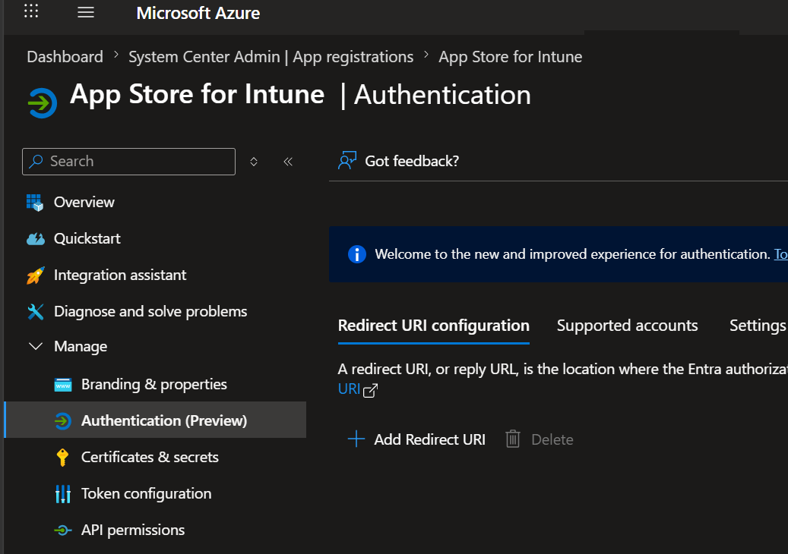
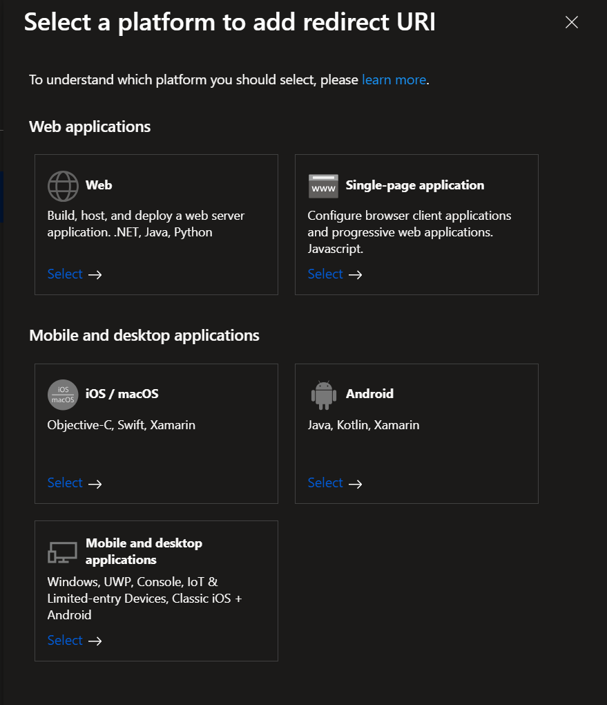
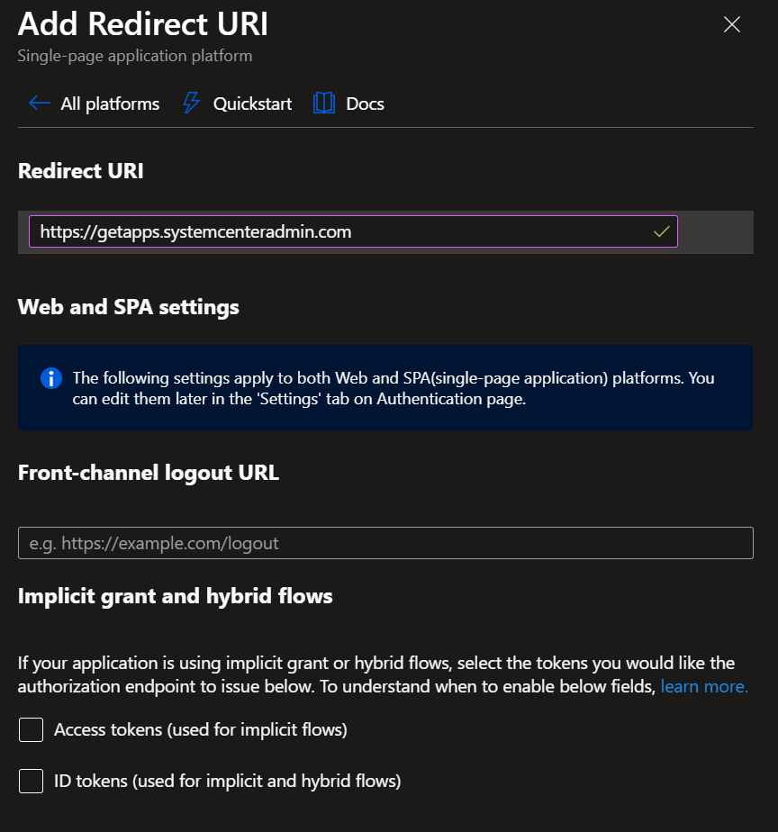

# Add the production redirect URI

Before anyone can sign in to the portal, the App Store app registration needs to know which URL the user will be redirected to after authentication. The App Service URL is generated during deploy and is shown in the deployment outputs.

!!! tip "Planning to use a custom domain?"
    If you'll access the portal through a custom domain (e.g., `apps.yourdomain.com`), set the custom domain up **before** completing this page — follow [Custom Domains](../../administration/custom-domains.md). You'll need the App Service URL from the next section for the CNAME record on that page. Once the custom domain is configured, return here and use the custom domain URL as the redirect URI instead of the App Service URL.

## Find the App Service URL

If you captured the `appUrl` value from the deployment outputs during [Deploy to Azure](deploy-to-azure.md#capture-the-deployment-outputs), use that. It looks like `https://<sitename>.azurewebsites.net`.

If you didn't capture it, retrieve it now:

1. Go to **Azure Portal** > your resource group > **Deployments**.
2. Select the deployment that just completed.
3. Select **Outputs** in the left navigation.
4. Copy the value of **appUrl**.

Or, from the App Service directly: **Azure Portal** > **App Service** > your App Store App Service > **Overview** > **Default domain**.

## Add the redirect URI

1. Go to **Microsoft Entra admin center** > **App registrations**.
2. Select your App Store app registration.
3. Select **Authentication (Preview)** in the left navigation. Some tenants may still show this as just **Authentication** during Microsoft's rollout — both paths reach the same configuration.
4. Select **+ Add Redirect URI**.

    

5. In the **Select a platform to add redirect URI** dialog, select **Single-page application**.

    

6. In the **Add Redirect URI** dialog, fill in:

    - **Redirect URI**: your App Service URL or custom domain URL, with **no trailing slash and no path**. For example: `https://<sitename>.azurewebsites.net` or `https://apps.yourdomain.com`.
    - **Front-channel logout URL**: leave blank.
    - **Implicit grant and hybrid flows**: leave both **Access tokens** and **ID tokens** checkboxes unchecked. The App Store frontend uses MSAL.js v2 with the Authorization Code + PKCE flow, which doesn't need either of those legacy tokens.

    

7. Select **Save** at the bottom of the dialog.

!!! warning "No trailing slash"
    Entra matches redirect URIs exactly. The App Store frontend's MSAL config uses `window.location.origin`, which produces the URL with no trailing slash and no path. Registering `https://<sitename>.azurewebsites.net/` (with a trailing slash) would not match what MSAL sends, and sign-in would fail with `AADSTS50011: The reply URL specified in the request does not match the reply URLs configured for the application.`

## Next step

Continue to [Sign in and verify](sign-in.md).
