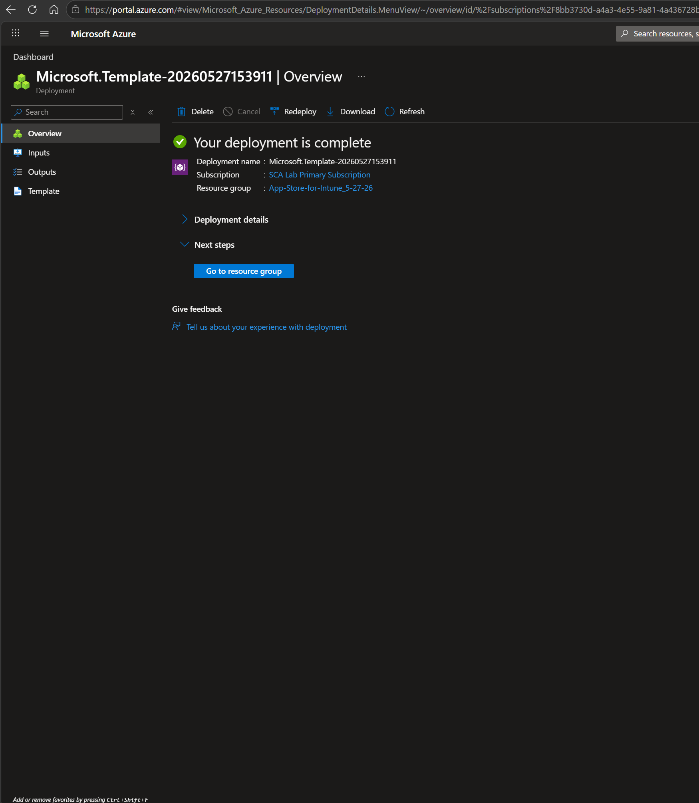
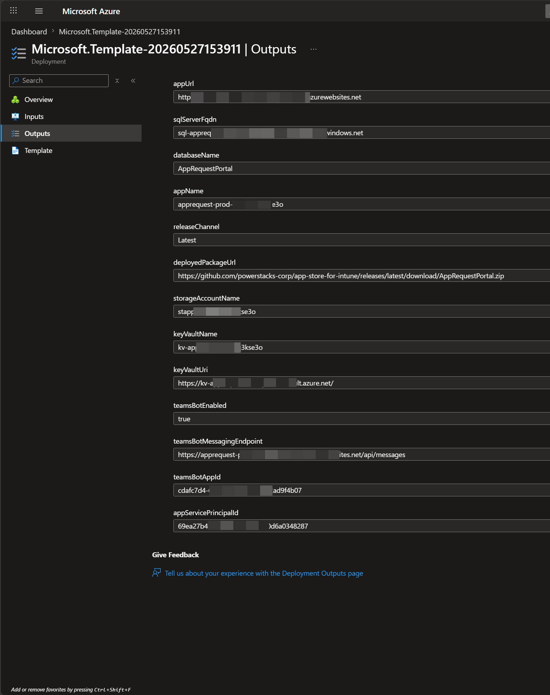

# Deploy to Azure

The custom-deployment wizard provisions every Azure resource App Store for Intune needs in a single deployment. Migrations apply on first start. Plan for 10 to 15 minutes of total deployment time.

## Before you start

Have these values ready from [Create Entra app registrations](create-entra-app-registrations.md):

- **Backend application (client) ID**
- **Frontend application (client) ID**

You'll also choose a SQL administrator username and password during the wizard. Save them in your password manager so you have them for any future direct database access.

## Launch the wizard

Select the **Deploy to Azure** button on the [App Store for Intune GitHub repository](https://github.com/powerstacks-corp/app-store-for-intune). Azure Portal opens the custom deployment wizard.

## Complete the custom deployment wizard

### Basics

- **Subscription**: select the Azure subscription that will host App Store for Intune.
- **Resource group**: select an existing resource group, or select **Create new**.
- **Region**: select the Azure region for all resources.

Select **Next**.

### Entra ID Configuration

- **API Application (Backend) > API Client ID**: the backend application (client) ID from the previous step.
- **Frontend Application (SPA) > Frontend Client ID**: the frontend application (client) ID from the previous step.

Select **Next**.

### SQL Database

- **SQL Admin Username**: a new administrator login name for the Azure SQL Server that will be created.
- **SQL Admin Password**: a strong password meeting Azure SQL complexity requirements.
- **Confirm password**: re-enter the password.

Select **Next**.

### Advanced

- **Release Channel**: select **Stable (Recommended)** for the current stable release. The other option, **Staging (Preview Features)**, gets early access to upcoming features but should only be used on non-production deployments.
- **App Service Plan Size**: select the App Service plan SKU. **B2** is the recommended starting point and can be scaled later.
- **Instance Count**: number of App Service plan instances. Start with **1** unless you have a known scale requirement.
- **Enable Auto-Heal (Recommended)**: leave selected. Automatically restarts the app when issues are detected.
- **Enable Health Check (Recommended)**: leave selected. Routes traffic away from unhealthy instances.
- **Enable Teams Bot Notifications (Recommended)**: select if you want personal Teams Adaptive Card notifications for approvers and requestors. Provisioning the bot resource at deploy time is the cleanest path; you can also enable Teams notifications later from the Admin Settings tab.

Select **Next**.

### Review + create

After you select **Next** on the Advanced tab, the wizard runs a final round of validation against your inputs. The page may appear unresponsive for a few seconds while these checks complete — this is expected, don't refresh or navigate away.

Once validation passes, review the deployment summary and select **Create**. The deploy takes 10 to 15 minutes.

!!! tip "Stay on the deployment page until it completes"
    The next step needs a value from this deployment's **Outputs** blade. If you navigate away you can still retrieve it later, but it's easiest to grab it before you leave the page.

## What the template provisions

- **Azure App Service Plan** and the **App Service** itself with system-assigned managed identity enabled. The managed identity is the runtime identity for Microsoft Graph calls.
- **Azure SQL Server** plus the **App Store database**. Database migrations apply automatically on first start.
- **Azure Key Vault** containing the SQL connection string and the storage connection string. The App Service's managed identity has **Get** and **List** permissions on the vault.
- **Azure Storage account** used by the packaging pipeline.
- **Application Insights** workspace for application logging and telemetry.
- **Azure Bot** resource, Teams channel registration, and a dedicated **user-assigned managed identity** for the bot, when **Enable Teams Bot Notifications** is selected.
- **App Service application settings**, pre-populated with every value the API needs.

## After the deploy completes

### Capture the deployment outputs

Once the wizard reports a successful deployment, you'll see the deployment overview page:

Open the deployment's **Outputs** blade (in the left navigation) and capture the values below before navigating away.

Path: **Azure Portal** > your resource group > **Deployments** > the deployment that just completed > **Outputs**.

| Output | Used for |
| --- | --- |
| `appUrl` | **Required.** The portal URL. You'll add it as the production redirect URI on the frontend app registration. Also available later from **App Service** > **Overview** > **Default domain**. |
| `sqlServerFqdn` | SQL Server FQDN. Used for direct SSMS access during troubleshooting. |
| `databaseName` | Database name. Used with the SQL Server FQDN for direct access. |
| `appName` | App Service name. Useful for finding logs and configuring scaling. |
| `storageAccountName` | Referenced by the app catalog packaging pipeline. |
| `keyVaultName` | Holds the SQL and storage connection strings. Referenced when rotating secrets. |
| `keyVaultUri` | Full Key Vault URI. Useful for scripted secret access. |
| `teamsBotMessagingEndpoint` | Teams bot configuration (only if **Enable Teams Bot Notifications** was selected). |
| `teamsBotAppId` | Teams bot configuration (only if **Enable Teams Bot Notifications** was selected). |
| `appServicePrincipalId` | **Required for the next step.** Paste into the PowerShell snippet that grants Microsoft Graph permissions to the App Service. Also available later from **App Service** > **Identity** > **System assigned** > **Object (principal) ID**. |

Save these values in your internal runbook or password manager alongside the SQL credentials you chose during the wizard.

### Wait for the managed identity to propagate

After capturing the outputs, wait 10 to 15 minutes for the App Service's system-assigned managed identity to propagate across Microsoft Entra ID before continuing. Running the next step before this completes returns a "service principal not found" error.

### Continue with the setup

Work through these pages in order:

1. [Grant Microsoft Graph permissions to the App Service](grant-graph-permissions.md) — uses `appServicePrincipalId`
2. [Add the production redirect URI](add-redirect-uri.md) — uses `appUrl`
3. [Sign in and verify](sign-in.md)

If anything during or after the deploy goes wrong, see [Troubleshooting](troubleshooting.md).
