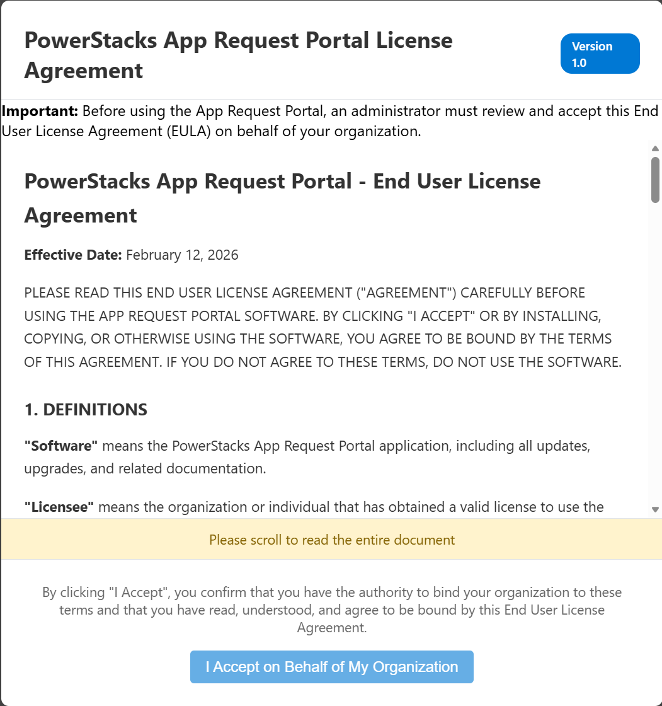
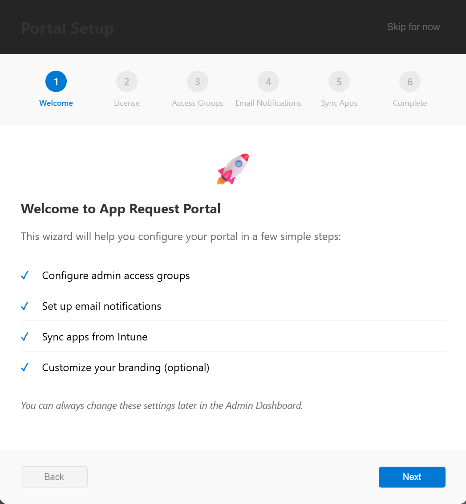
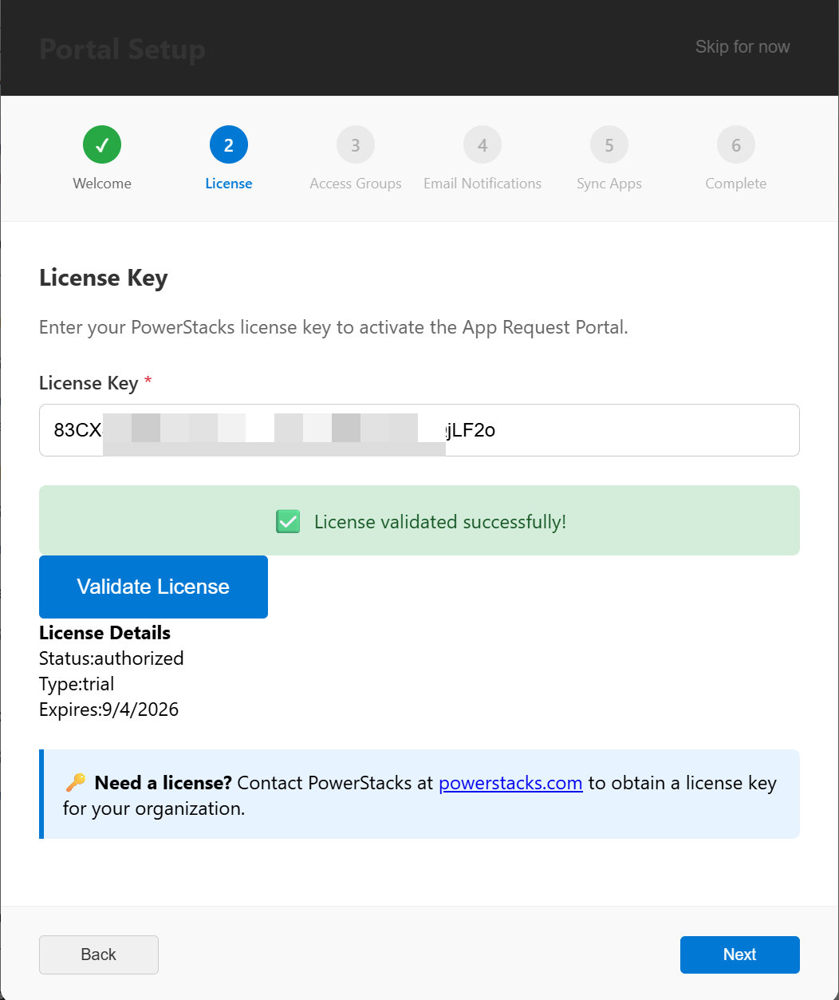
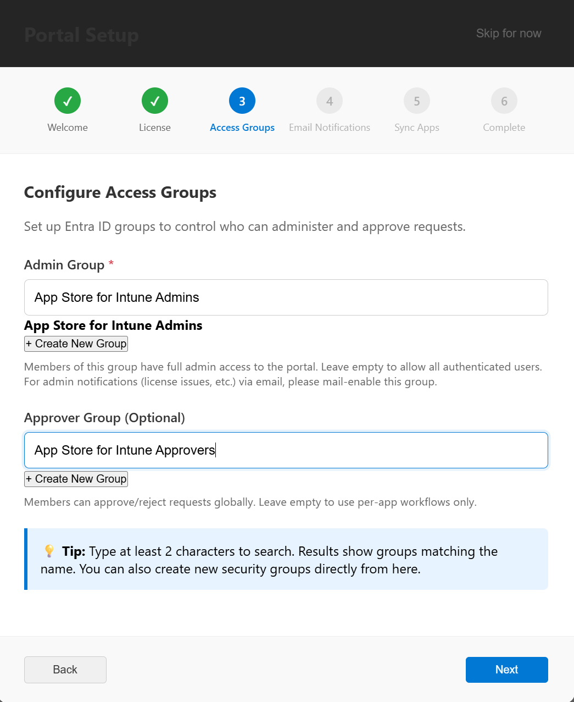
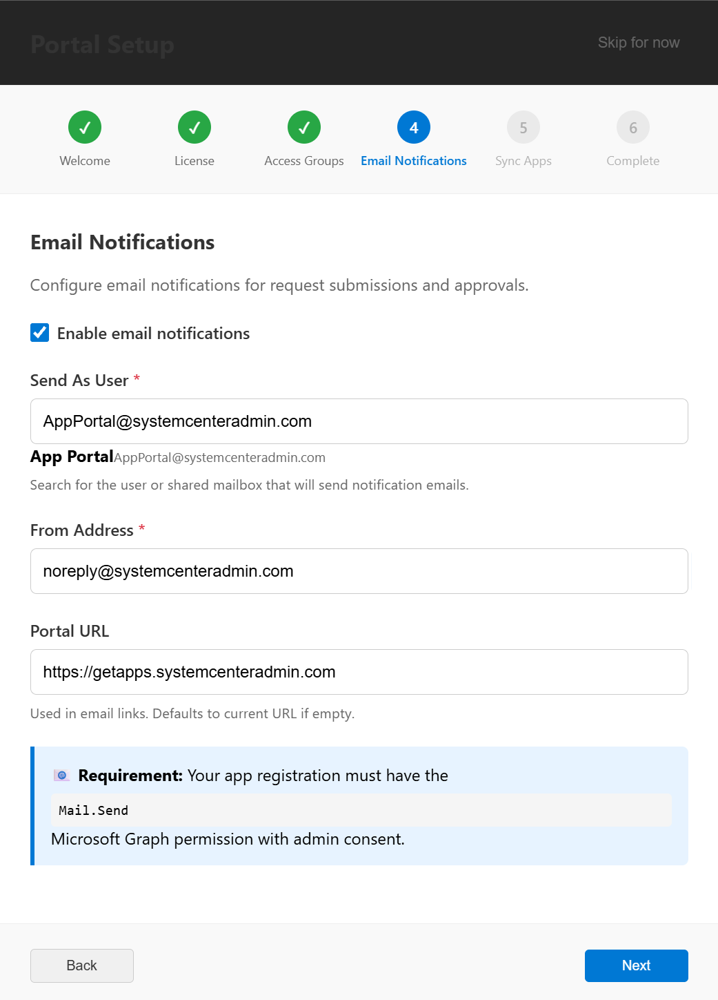
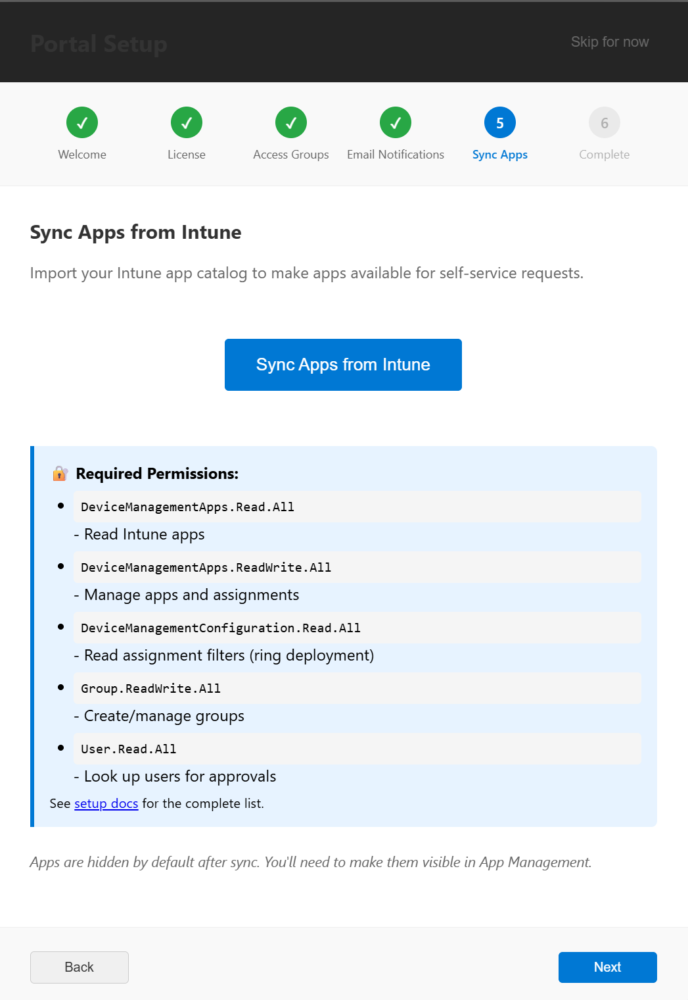
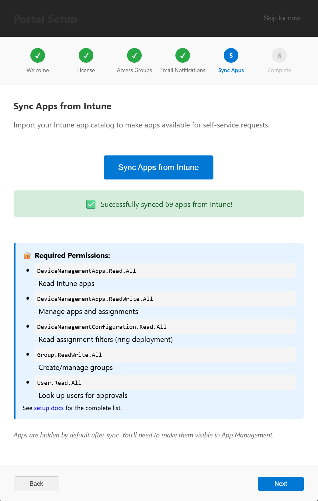
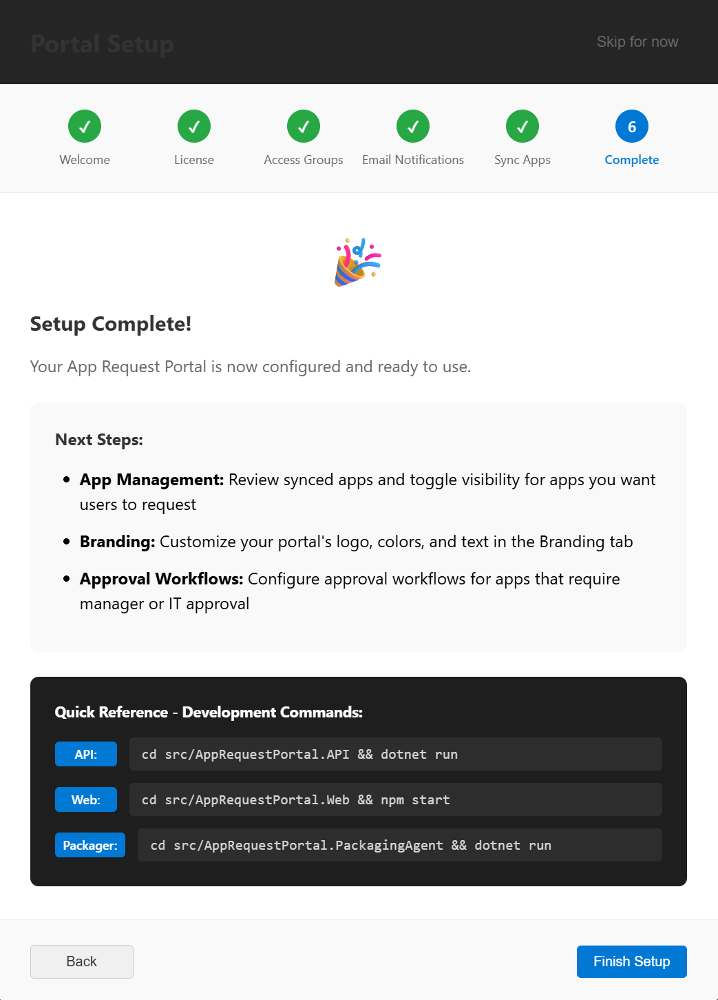

# Sign in and verify

The portal is deployed, the App Service has its Graph permissions, and the App Store app registration has the production redirect URI. This page walks through the first sign-in and the in-portal Setup Wizard that finishes configuration.

!!! note "Custom domain or App Service URL?"
    If you set up a [custom domain](../../administration/custom-domains.md), use your custom domain URL (e.g., `https://apps.yourdomain.com`) wherever this page shows `https://<sitename>.azurewebsites.net`. Both URLs serve the same App Service.

## Verify the portal is healthy

Open these two URLs in a browser:

- `https://<sitename>.azurewebsites.net/health` — returns `200 OK` when the portal is running and the Key Vault references resolve.
- `https://<sitename>.azurewebsites.net/health/migrations` — returns `"pendingCount": 0` when all database migrations have applied.

If either endpoint reports an error, see [Troubleshooting](troubleshooting.md).

## Configure the admin security group

The portal's admin gate checks Entra group membership. On a fresh install, no group is configured yet — so the first sign-in returns "Admin access required" on the license-accept gate. Set up an admin group before signing in:

1. In **Microsoft Entra admin center → Groups**, create a security group (e.g., "App Store Admins") or pick an existing one. Add your sign-in account as a member.
2. Copy the group's **Object ID** from the group's Overview blade.
3. In **Azure Portal → your App Service → Settings → Environment variables**, find or add `AppSettings__AdminGroupId` (double underscore is the ASP.NET Core config separator). Paste the group's Object ID as the value. Save.
4. The App Service restarts automatically. Wait ~30 seconds.

You can optionally do the same with `AppSettings__ApproverGroupId` if you want a separate group of approvers; otherwise leave it for now and configure per-app approvers later from the admin portal.

## First sign-in

1. Open your portal URL in a browser.
2. Sign in with the Entra ID account you added to the admin group above. Any account that's a member of the group is recognized as an admin; no Entra directory role (Global Admin, etc.) is required.
3. The license-acceptance gate appears on first sign-in. Select **Accept** to acknowledge the terms.

   

## Complete the Setup Wizard

Once you're signed in as an admin, open the Setup Wizard from **Admin → Settings → Setup Wizard**. The wizard opens on a welcome screen, then walks through four steps before a completion screen.

1. **Activate your license.** Enter the license key supplied by PowerStacks. The wizard validates the key against the licensing service and displays the expiration date and enabled features. If you don't have a key yet, choose a plan or start a trial at [powerstacks.com/plans](https://powerstacks.com/plans/).

   

2. **Choose your admin security group.** This step writes the admin group selection into the portal database. If you used the bootstrap step above, you can keep the same group here. (Once the database value is set, the `AppSettings__AdminGroupId` environment variable becomes a fallback and can be removed if you prefer to manage the group from inside the portal.)

   

3. **Configure email notifications.** Optional. Select an Entra ID user mailbox to send notifications from, and enter the From address that recipients will see. You can skip this step and configure email later from **Admin** > **Communications**.

   

4. **Run the first Intune sync.** Pulls the existing Intune app catalog into the portal so the admin App Catalog tab is populated immediately. This typically takes 30 to 60 seconds depending on catalog size.

   

   

Select **Finish**. The wizard saves the settings to the database and routes you to the admin dashboard.

## What "done" looks like

After **Finish**, the admin dashboard loads. **Admin** > **App Catalog** shows the apps synced from Intune. **Admin** > **Settings** > **Group-Based Authorization** shows the admin group you selected. The portal is fully operational.

## Next step

The install is complete. Continue with optional configuration as needed:

- [Configure email notifications](configure-email-notifications.md) — if you skipped this step in the wizard or want to refine the settings.
- [Configure Microsoft Teams Bot](configure-teams-bot.md) — finish the Teams app manifest upload if you enabled the bot at deploy time.
- [Configure Application Insights](configure-application-insights.md) — application logging and telemetry.
- [Custom domains](../../administration/custom-domains.md) — replace the default `*.azurewebsites.net` URL with a custom domain (if you didn't already set one up during the install).

For ongoing administration, see the [Admin Guide](../../administration/index.md).
