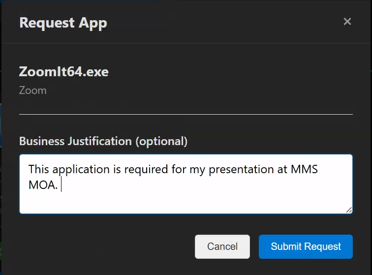

# Request an app

Use these steps to request an app that's already in the catalog. To request an app that isn't listed, see [Ask IT to add an app](ask-it-to-add-an-app.md).

## Basic request

1. Find the app you want to install.
2. Select **Request** on the app card.
3. Fill out the request form:
   - **Justification** (required): explain why you need this app
   - **Device** (for device-targeted apps): select which device should receive the app
4. Select **Submit Request**.

*The app request form with justification field*

## Device selection

Some apps are deployed to specific devices rather than your user account. For these apps:

- You'll see a **Select Device** dropdown
- Choose from your enrolled Intune-managed devices
- The app installs only on the selected device

## Approval requirements

Apps may have different approval requirements:

- **No approval required**: automatically approved and deployed
- **Manager approval**: your direct manager must approve
- **Designated approver**: a specific person or group must approve
- **Multi-stage approval**: multiple approvers in sequence

You'll see the approval requirements before submitting.
