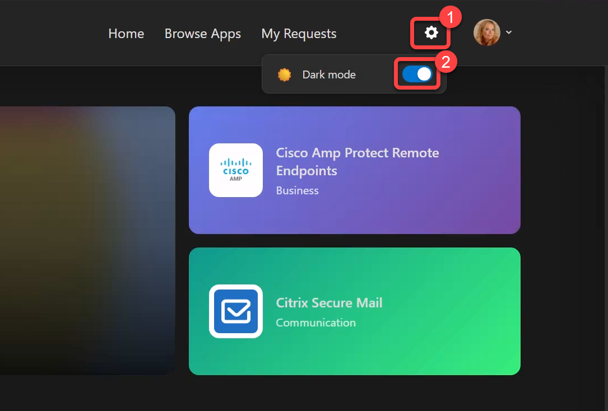

# Settings and preferences

## User profile

Select your profile picture or name in the top-right corner to:

- View your profile information
- Sign out

## Dark mode

Toggle dark mode from:

- The settings gear icon in the header
- Your profile dropdown menu

Your preference is saved and persists across sessions.

*Settings panel with dark mode toggle*
