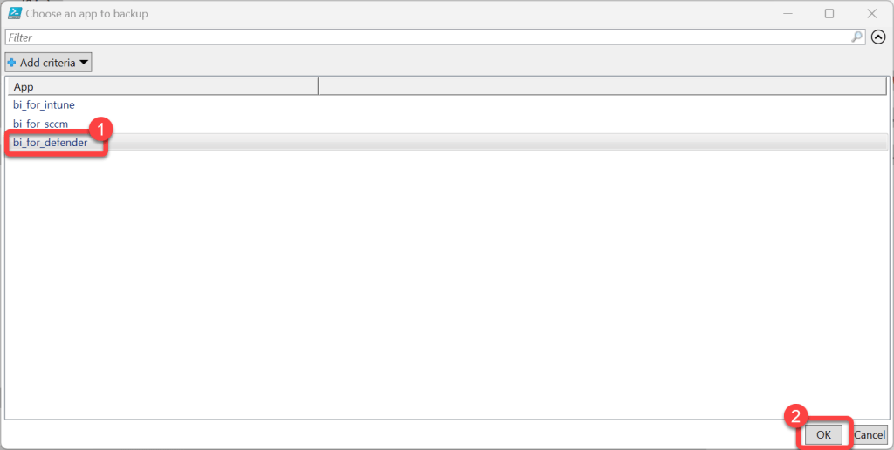
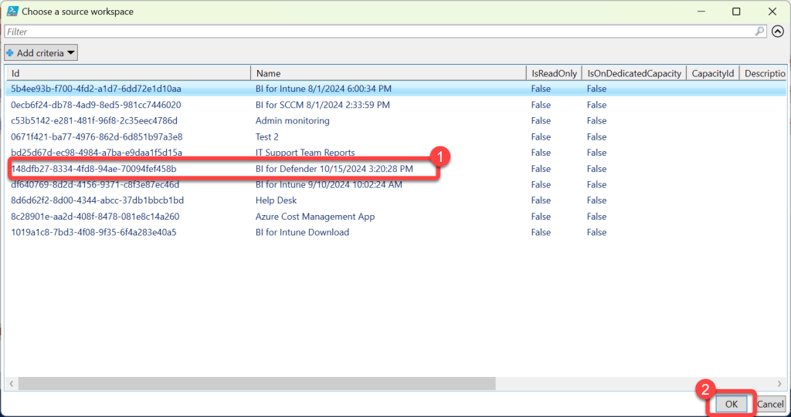
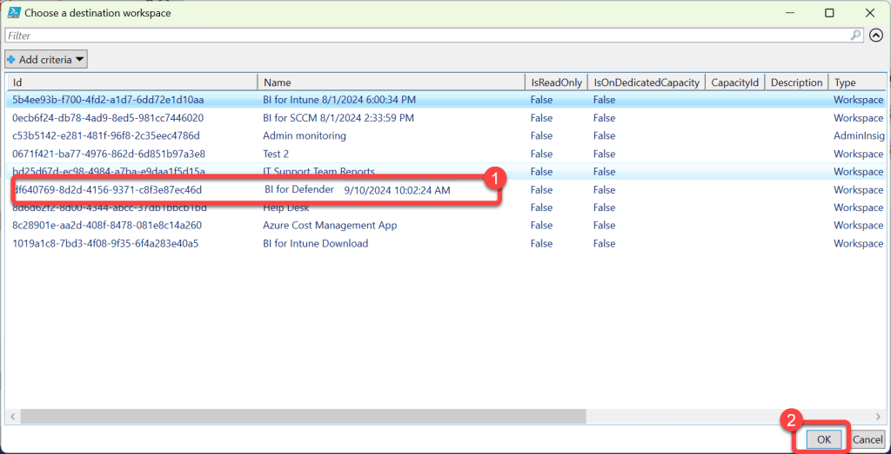
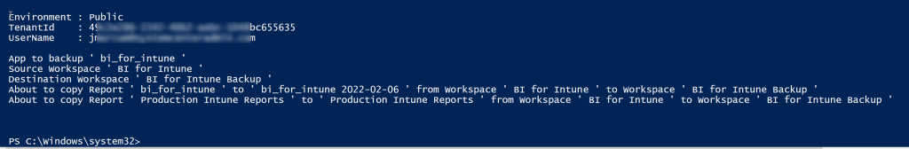

# Backing Up Custom Reports
We strongly advise customers to always backup  their custom reports before performing any in-place upgrades. Failure to do so could result in the loss of your custom reports!

**Prerequisites:**

1. The user executing these steps should be the owner of the BI for Defender workspace(s).
1. A second install of BI for Defender to be used as a backup workspace. You do not need to configure the dataset parameters, this workspace is simply a place-holder to store a copy of your custom reports.

### Step 1: Save the PowerShell Script

1. Copy the **PowerShell** code above, save it as a .ps1 file or paste it into your favorite code editor.

### Step 2: Run the Script and Sign In

1. Execute the code in the **code editor** or by running the .ps1 file.
1. When prompted, **sign in** to Power BI.

### Step 3: Select the App to Backup

1. When prompted, select the app you would like to backup (**BI for Defender**)
1. Select **OK**.

v*

### Step 4: Select the Production Workspace

1. When prompted, select your production **BI for Defender** workspace. This is the **source** from which reports will be copied.
1. Select **OK**.

### Step 5: Select the Backup Workspace

1. When prompted, select your backup **BI for Defender** workspace. This is the **destination** which reports will be copied to.
1. Select **OK**.

### Step 6: Verify the Backup Output

1. When running in a shell you should see **output** describing what was **copied** to the **backup workspace**.
1. Log in to the **backup workspace** to confirm that your **custom reports** have been **copied** there.

