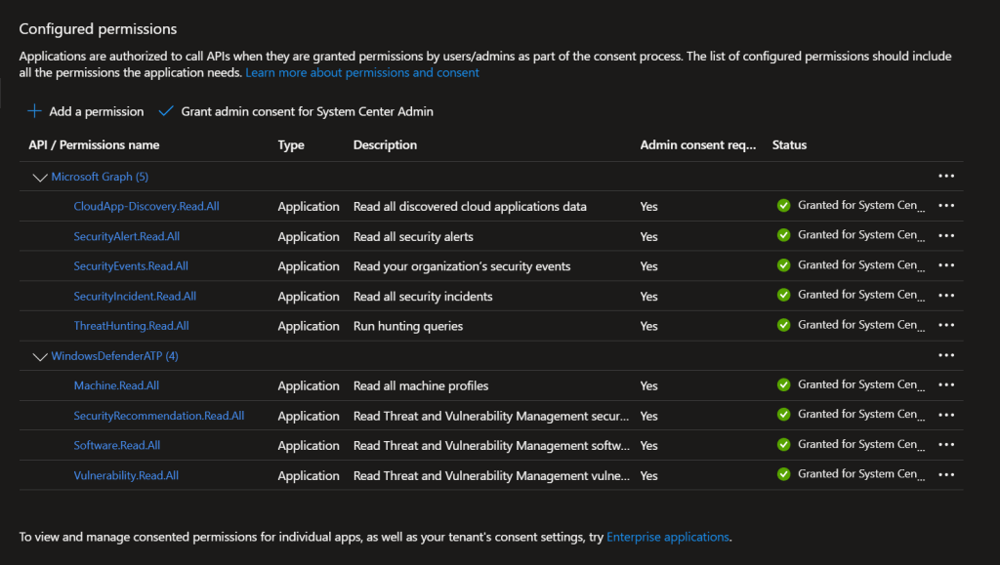

# Azure AD Application Required Permissions
Below are all of the permissions required to be configured on the BI for Defender Azure AD App Registration. See [Create Azure AD App Registration](create-azure-ad-app-registration.md) for more information.

**Prerequisites:**The user configuring these permissions requires Global Admin and Subscription Admin rights.

### 1

															**Required for basic functionality:**

- **API:**
  Microsoft Graph
- **Permission Type:**
  Application
- **Permissions:**
  SecurityEvents.Read.All
  SecurityAlert.Read.All
  SecurityIncident.Read.All
  ThreatHunting.Read.All
  Directory.Read.All
  CloudApp-Discovery.Read.All

- **API:**
  WindowsDefenderATP
- **Permission Type:**
  Application
- **Permissions:**
  Security.Recommendation.Read.All
  Software.Read.All
  Vulnerability.Read.All
  Machine.Read.All

