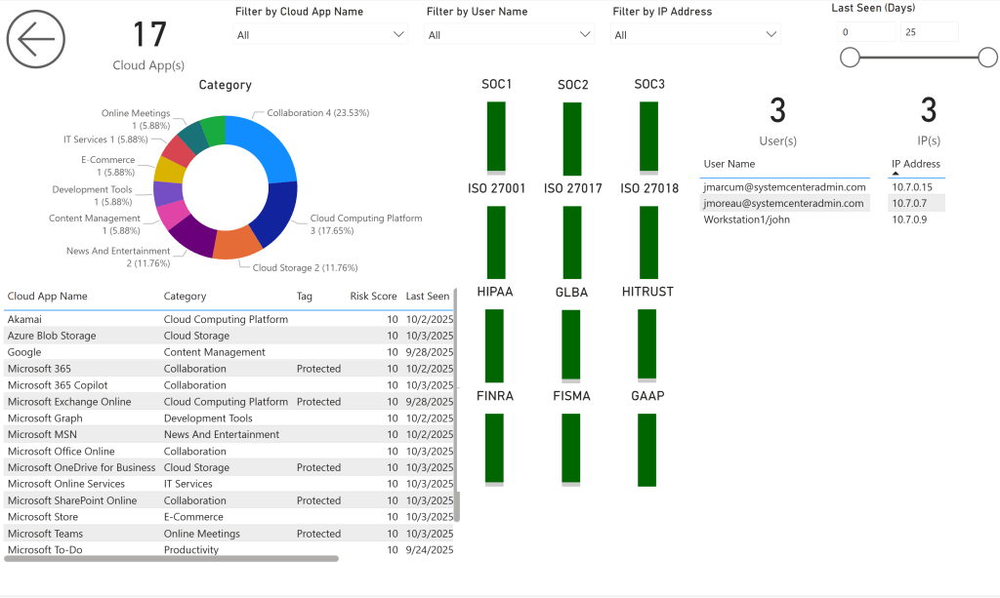
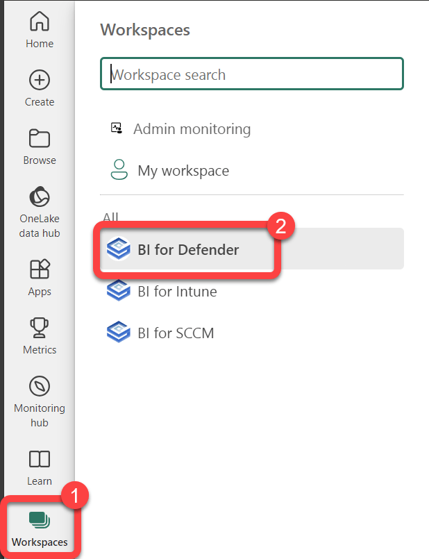
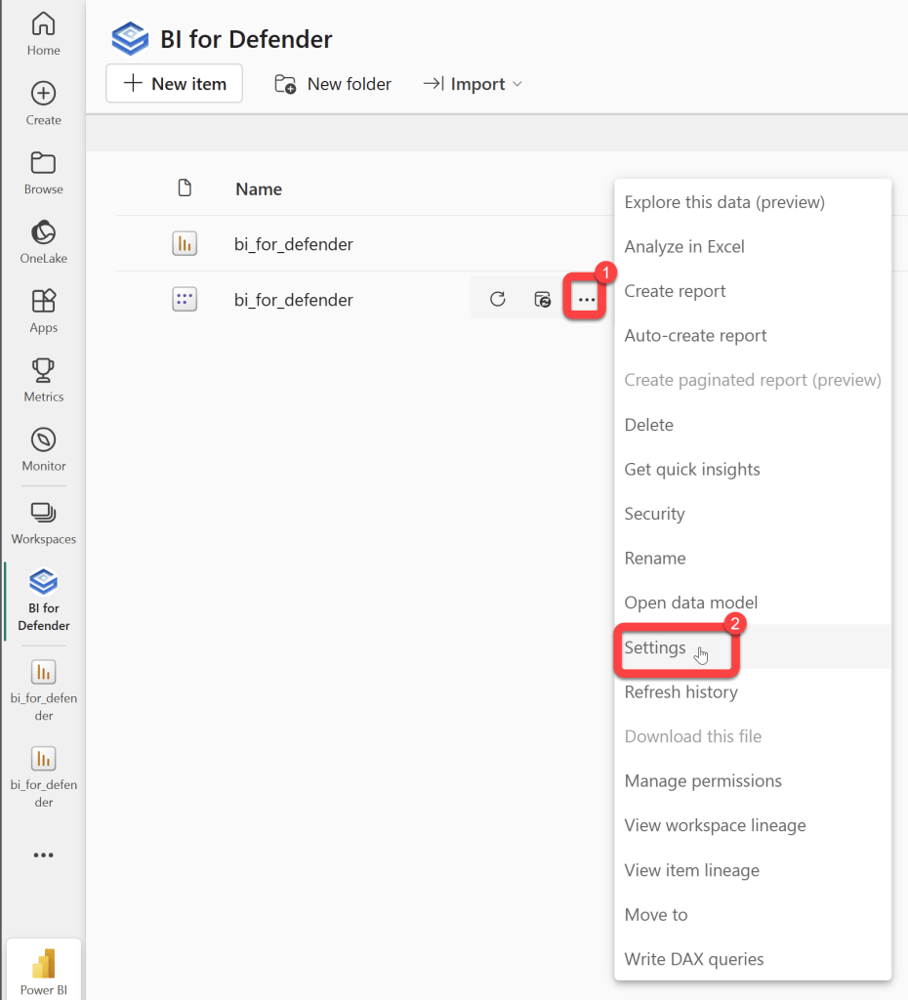
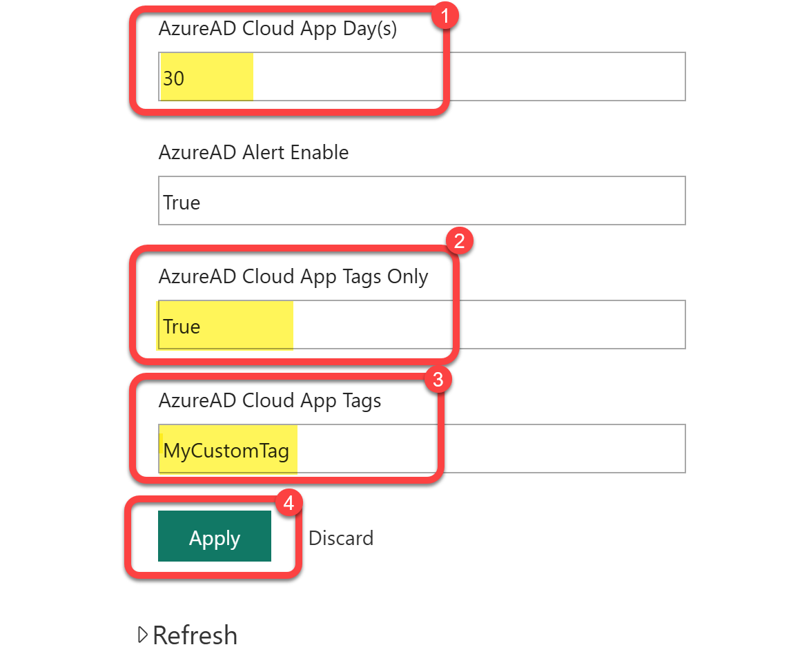

# Capture Cloud App usage data

The Cloud App page in BI for Defender lists the cloud apps discovered across your fleet, with each app's category, data volume, and a count of users, IP addresses, and devices. By default, the detailed breakdown, which specific users accessed an app and how the app rates against compliance frameworks, is not pulled.

If the User(s) and IP(s) panels are blank, that is expected until you complete the steps below.

## Why the detail is off by default

The cloud app discovery data comes from a Microsoft API that is slow. Pulling the per-user and compliance detail for every discovered app would return far too much data and cause refresh problems. So BI for Defender pulls the per-app summary for all apps, but pulls the detailed user and compliance information only for the apps you specifically ask for.

You ask for an app by tagging it in Microsoft Defender, then telling the semantic model which tag to look for.

## Step 1: Tag the apps in Microsoft Defender

In the Microsoft Defender portal, apply a custom tag to each cloud app you want detail on.

!!! warning "Use a custom tag, not the built-in tags"
    Do not use Microsoft's built-in tags. The API cannot return that much data for them, and using them causes refresh issues. Create and apply your own custom tag (for example, `MyCustomTag`), and tag only the apps you genuinely need user or compliance detail for. Every tagged app adds load to a slow API, so keep the list short.

## Step 2: Add the tag to the semantic model

In the Power BI service:

1. Select **Workspaces**, then open the **BI for Defender** workspace.

    

2. Find the **bi_for_defender** semantic model, select its **...** menu, then select **Settings**.

    

3. Expand **Parameters**.

    

4. Set the Cloud App parameters:

    - **AzureAD Cloud App Day(s)** — the lookback window in days (for example, `30`).
    - **AzureAD Cloud App Tags Only** — set to **True** so only tagged apps get the detailed pull.
    - **AzureAD Cloud App Tags** — enter the custom tag you applied in Microsoft Defender (for example, `MyCustomTag`).
    - Select **Apply**.

    

5. Refresh the semantic model.

After the refresh completes, the User(s) and IP(s) detail and the compliance badges (SOC 1, SOC 2, SOC 3, ISO 27001, ISO 27017, HIPAA) populate for the apps carrying your tag.
