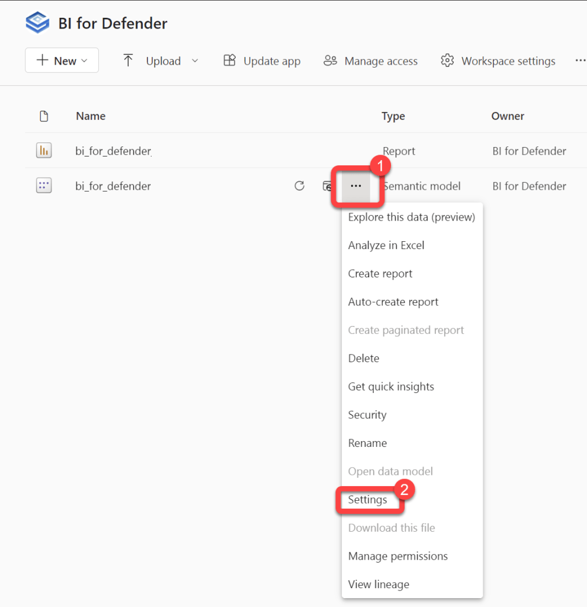
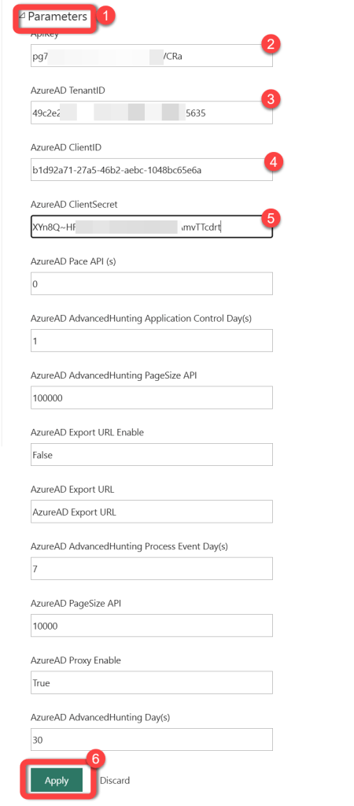
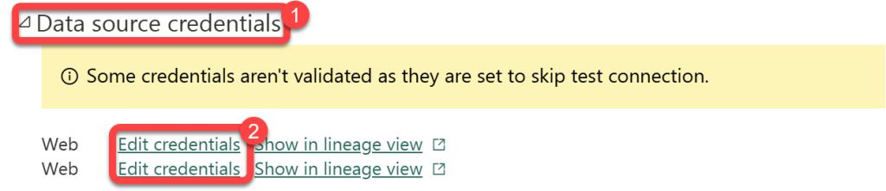
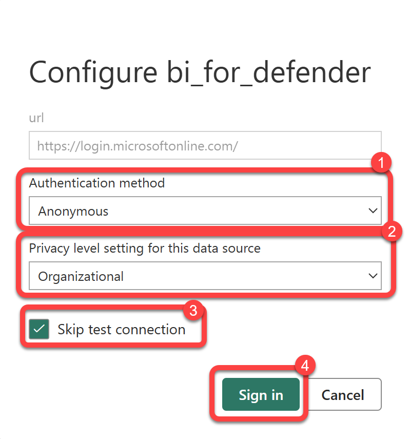
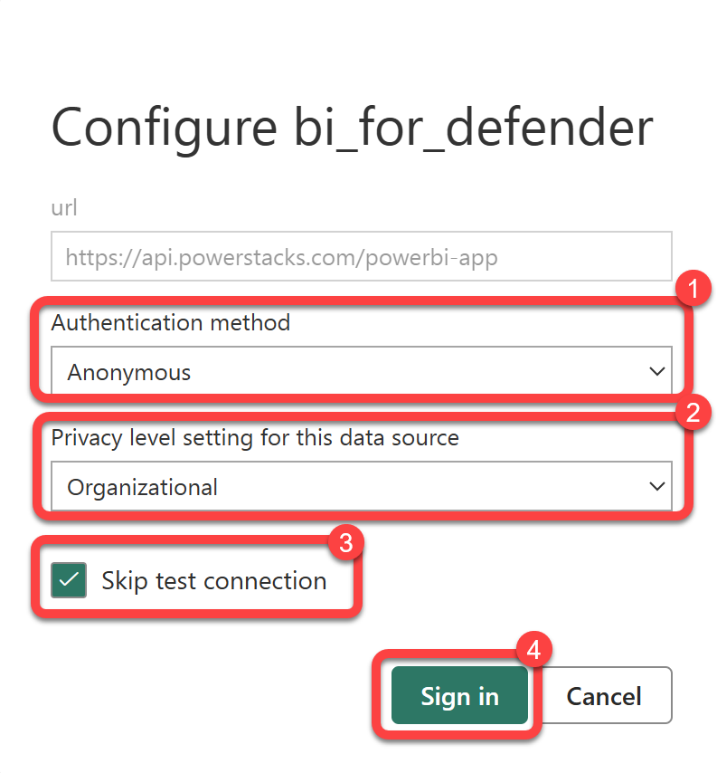

# Configure The Dataset Parameters
The BI for Defender dataset contains some parameters that must be configured in order to synchronize data from Defender for Endpoint to Power BI. Following the steps below to configure the dataset parameters and sync your data.

### Step 1

1. Select **Workspaces**.
1. Select the **BI for Defender** workspace.

### Step 2

1. Hover over the **bi_for_defender** Semantic model to reveal a **kebab menu** (three vertical dots).
1. Select the **kebab menu**.
1. Select **Settings**.

### Step 3

1. Expand **Parameters**.
1. Enter the **API Key** that you received from us after completing the [**Request a Trial Key**](http://ec2-35-87-121-112.us-west-2.compute.amazonaws.com/wordpress/getting-started/) form.
1. Enter the **Azure AD Client ID** that you recorded during the configuration of the [**Azure AD App Registration**](http://ec2-34-213-160-174.us-west-2.compute.amazonaws.com/wordpress/bi-for-defender-kb/bi-for-defender-create-azure-ad-app-registration/)[.](/bi-for-intune/guides/create-azure-ad-app-registration.md)
1. Enter the **Azure AD Client Secret** that you recorded during the configuration of the [**Azure AD App Registration**](http://ec2-34-213-160-174.us-west-2.compute.amazonaws.com/wordpress/bi-for-defender-kb/bi-for-defender-create-azure-ad-app-registration/). As mentioned in the previous article the **Client Secret** **does not** have dashes (-) in it. The **Client Secret** **looks similar** to this: aBcDE~fGh.I.JKlmnopqRsTuVwXyZ1234567890
1. Enter you **Azure AD tenant ID**that you recorded during the configuration of the [**Azure AD App Registration**](http://ec2-34-213-160-174.us-west-2.compute.amazonaws.com/wordpress/bi-for-defender-kb/bi-for-defender-create-azure-ad-app-registration/).
1. Select **Apply**.

### Step 4

1. Expand **Data Source Credentials**.

### Step 5

1. Select each occurrence of **Edit credentials** one by one and configure each as follows:Select **Anonymous** as the **Authentication method** and **Organizational** as the **Privacy level**for all credentials.
1. Select **Skip test connection** on both.
Select **Sign in** on each of the credentials.

### Step 6

1. Select each occurrence of **Edit credentials** one by one and configure each as follows:Select **Anonymous** as the **Authentication method** and **Organizational** as the **Privacy level**for all credentials.
1. Select **Skip test connection** on both.
Select **Sign in** on each of the credentials.

