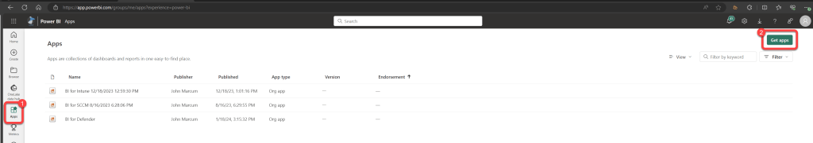
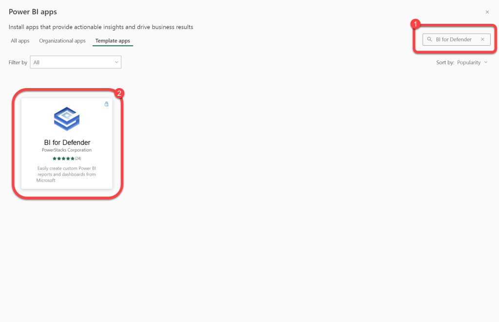
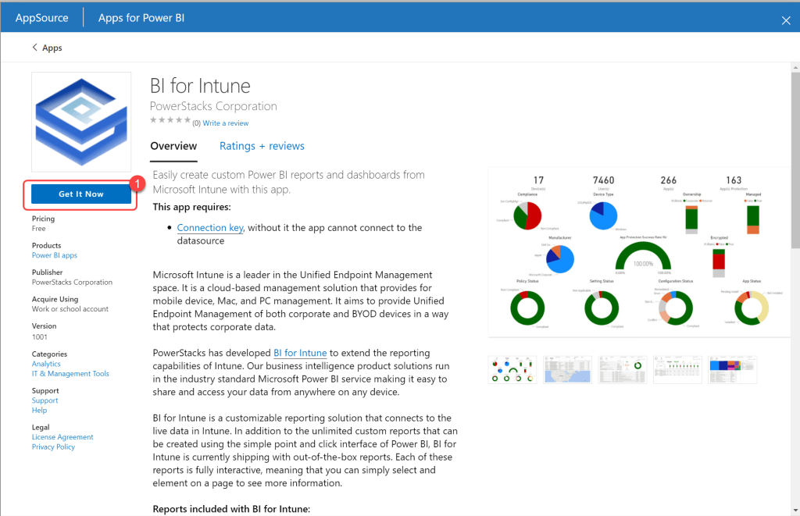
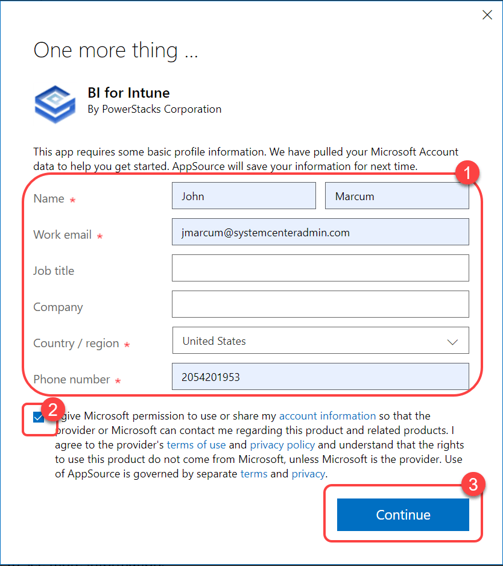
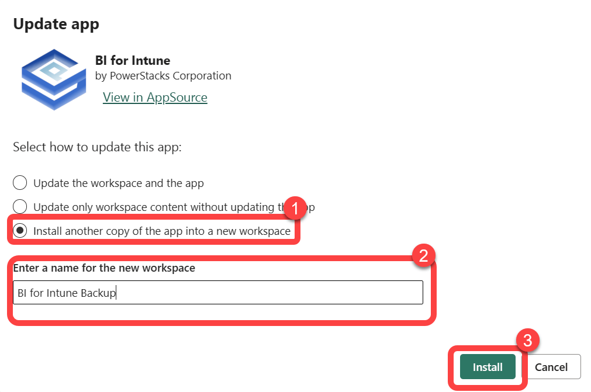
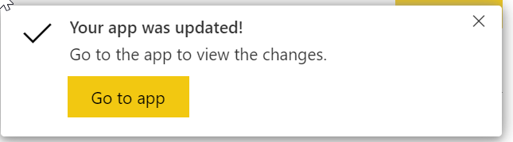

# Create a Backup Workspace
We strongly advise customers to always backup their custom reports before performing any in-place upgrades. Failure to do so could result in the loss of your custom reports!

Our backup process consists of creating a new workspace by installing a second instance of BI for Defender. There is no need to configure this instance, it's just a placeholder to which our script, documented in our "[Backup Custom Reports](backup-custom-reports.md)" document, copies all of your custom reports in case something goes wrong during the upgrade. In the unlikely event that the upgrade fails it may be necessary to configure the backup workspace and move it to production.

**Prerequisites:** The user executing these steps should be an administrator of the BI for Defender workspace.

### Step 1: Open the Power BI App Store

1. Login to **Power BI**.
1. Select **Apps**.
1. Select **Get apps**.

### Step 2: Search for BI for Defender

1. Select **Template apps**.
1. Search for **BI for Defender**.
1. Select **BI for Defender**.

### Step 3: Get the App

1. Select **Get It Now**.

### Step 4: Accept the Microsoft Agreement

1. Accept the **Microsoft agreement**.
1. Select **Continue**.

### Step 5: Install Into a New Workspace

1. Select **Install another copy of the app into a new workspace**.
1. Enter a name for the new workspace.
1. Select **Install**.

### Step 6: Confirm Installation Completed

1. Watch for the **update completed** notification in your browser.
1. There's no need to configure the dataset in this workspace, it's just a placeholder for the backup of your custom reports. Do not forget to run the backup script to copy your reports to the backup workspace.

