# Dataset Parameters Explained
The BI for Defender dataset contains some parameters that must be configured in order to synchronize data from Defender for Endpoint to Power BI. Other parameters add additional functionality to BI for Defender. This article explains each of the parameters in detail.

### Step 1

1. To view or modify the dataset parameters select **Workspaces**.
1. Select the **BI for Defender** workspace.
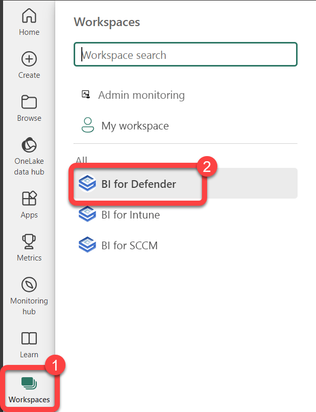
### Step 2

1. Hover over the bi_for_defender **Sematic mode**l to reveal a **kebab menu** (three vertical dots).
1. Select the **kebab menu**.
1. Select **Settings**.
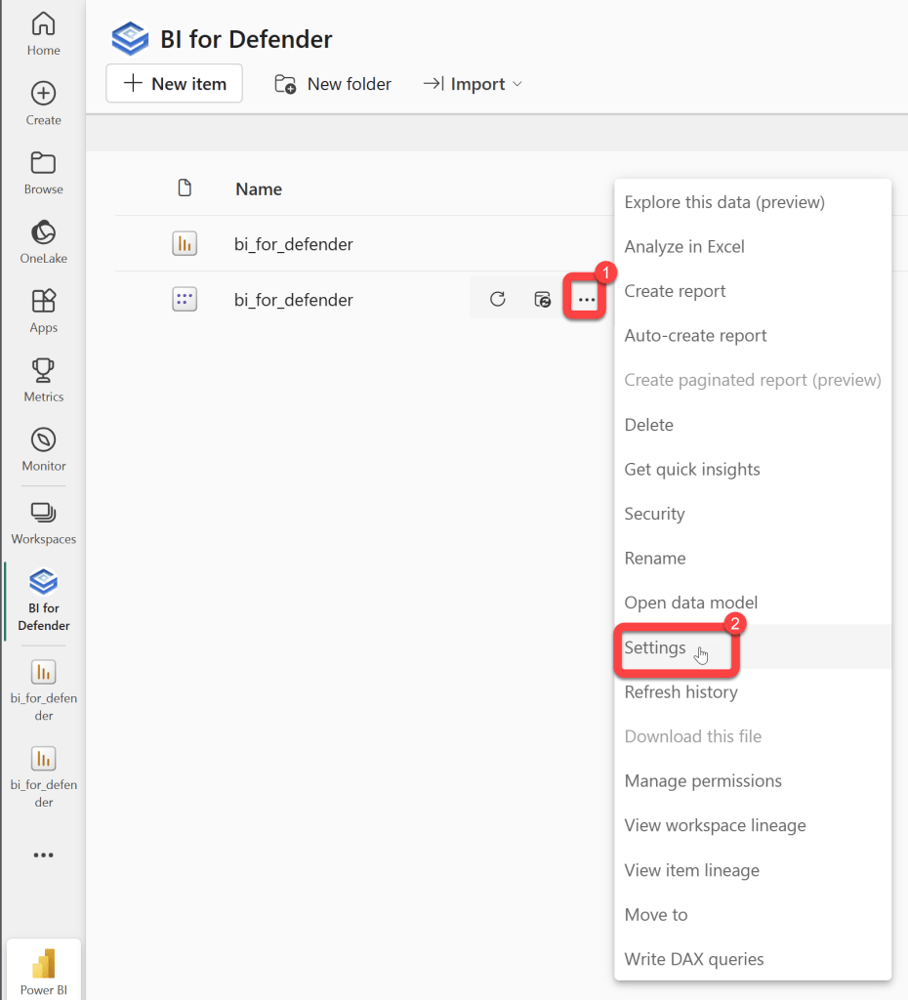
### Step 3

1. Expand **Parameters**.
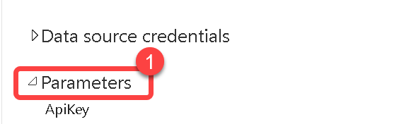
### Step 4
				ApiKey

1. Required configuration: Yes
1. Default value: Blank
1. This should be the API Key that you received from us after completing the [**Request a Trial Key**](http://ec2-34-214-10-137.us-west-2.compute.amazonaws.com/wordpress/getting-started/) form.
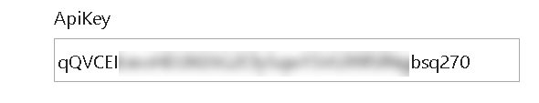
### Step 5
				AzureAD TenantID

1. Required configuration: **Yes**
1. Default value: **Blank**
1. This should be your **Azure AD tenant ID**.
1. **Note**: An easy way to get this is to go to [https://www.whatismytenantid.com/](https://www.whatismytenantid.com/)
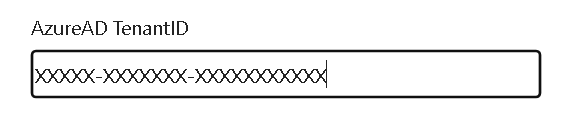
### Step 6
				AzureAD ClientID

1. Required configuration: **Yes**
1. Default value: **Blank**
1. The **Application (client) ID** from the [**Azure AD App Registration**](/bi-for-intune/guides/create-azure-ad-app-registration.md).
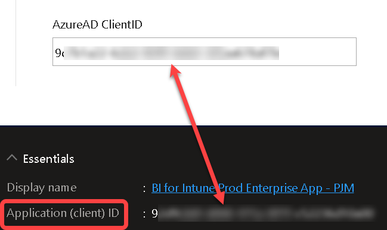
### Step 7
				AzureAD ClientSecret

1. Required configuration: **Yes**
1. Default value: **Blank**
1. **The Azure AD Client Secret is the most common mistake that customers make when installing BI for Defender**.  It is shown as the "Value" when adding the client secret to the [**Azure AD App Registration**](create-azure-ad-app-registration.md). The **Client Secret** **does not** have dashes (-) in it. The **Client Secret** **looks similar** to this: **aBcDE~fGh.I.JKlmnopqRsTuVwXyZ1234567890**
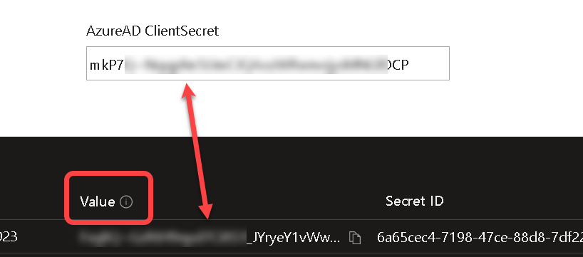
### Step 8
				AzureAD Pace API (s)

1. Required configuration: **None**
1. Default value: **0**
1. Determines the amount of time the sync process waits for a response from the Pace API's and then it loops until a response is received. Do not change this value unless instructed to do so by PowerStacks support.
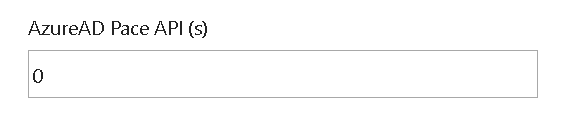
### Step 9
				AzureAD AdvancedHunting Application Control Day(s)

1. Required configuration: **None**
1. Default value: **3** days
1. Max value: **30**
1. -1 disables this feature.
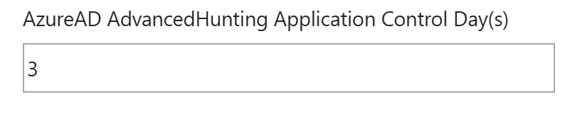
### Step 10
				AzureAD AdvancedHunting PageSize API

1. Required configuration: **None**
1. Default value: **10000**
1. Determines the page size for MS Graph queries. **Do not change** this value unless instructed to do so by PowerStacks support.
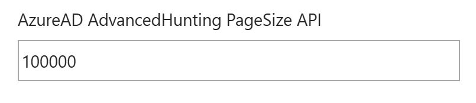
### Step 11
				AzureAD Export URL Enable

1. Required configuration: **Yes**, only if the **AzureAD Export URL** has been populated.
1. Default value: **FALSE**
1. Determines if the URL from the AzureAD Export URL is used or if the URL is found automatically by the app.
1. Setting this parameter to TRUE will create a new data source credential that must be configured. Authentication method: **Anonymous**
1. Privacy Level: **Organizational**
1. Check "**Skip test connection**"
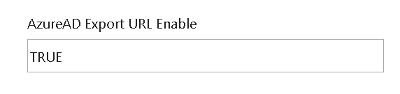
### Step 12
				AzureAD Export URL

1. Required configuration: **None**
1. Default value: **Blank**
1. The export URL varies from one Azure tenant to another. If this value is not populated our code will find the correct URL that your Intune environment uses to export data, however, to avoid redirection and improve security it is recommended to set this parameter.
1. Be sure to also set AzureAD Export URL Enable = TRUE when using this parameter.
1. To learn more please see our Configure Defender Export API documentation.
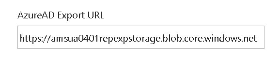
### Step 13
				AzureAD AdvancedHunting Process Day(s)

1. Required configuration: **None**
1. Default value: **1** days
1. Max value: **30**
1. **-1** disables this feature.
1. Allows you to configure the number of days of process data to pull from Advanced Hunting.
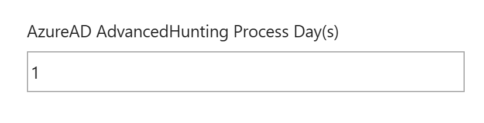
### Step 14
				AzureAD PageSize API

1. Required configuration: **None**
1. Default value: **10000**
1. Determines the page size of queries. **Do not change** this value unless instructed to do so by PowerStacks support.
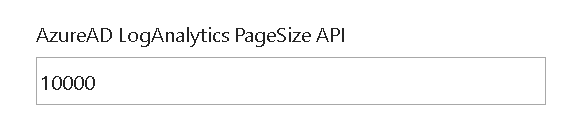
### Step 15
				AzureAD Proxy Enable

1. Required configuration: **Yes**
1. Default value: **True**
1. Should **ALWAYS** be **False** unless you are viewing the reports with the demo data.
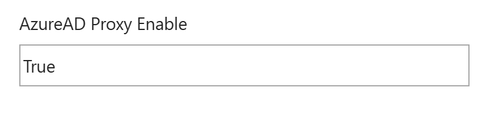
### Step 16
				AzureAD AdvancedHunting Day(s)

1. Required configuration: **None**
1. Default value: **30**
1. Allows you to configure the number of days of data to pull from Advanced Hunting.

### Step 17
				AzureAD Export URL Wait (s)

1. Required configuration: **None**
1. Default value: **1**
1. Determines the amount of time the sync process waits for each Intune export job to report a status and then loops until a status is received. **Do not change** this value unless instructed to do so by PowerStacks support.
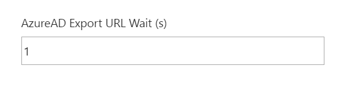
### Step 18
				AzureAD Export URL Timeout (s)

1. Required configuration: **None**
1. Default value: **3600**
1. Determines the amount of time the sync process waits for each Intune export job before it times out. **Do not change** this value unless instructed to do so by PowerStacks support.
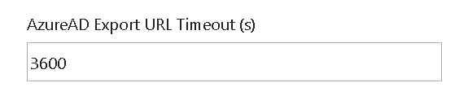
### Step 19
				AzureAD Login URL

1. Required configuration: **None**
1. Default value: **https://login.microsoftonline.com**
1. This parameter is only used in edge cases where customers have some things in GCC or HCC High and other things in the commercial cloud.
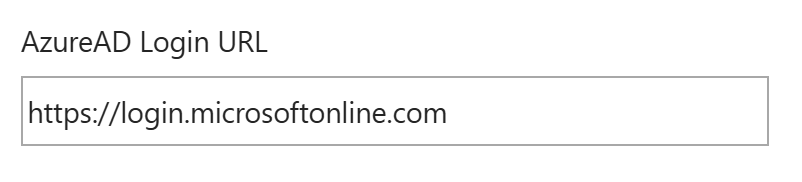
### Step 20
				AzureAD Graph URL

1. Required configuration: **None**
1. Default value: **https:/graph.microsoft.com**
1. This parameter is only used in edge cases where customers have some things in GCC or HCC High and other things in the commercial cloud.
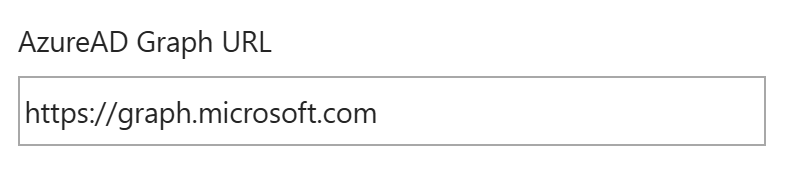
### Step 21
				AzureAD SecurityCenter URL

1. Required configuration: **None**
1. Default value: **https://api.securitycenter.microsoft.com**
1. This parameter is only used in edge cases where customers have some things in GCC or HCC High and other things in the commercial cloud.
1.
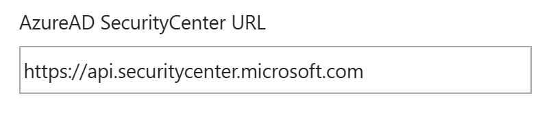
### Step 22
				AzureAD Vulnerability History Day(s)

1. Required configuration: **None**
1. Default value: **1**
1. By default, only vulnerability data from the last 1 day are available in the reports. Getting more days of vulnerability data will result in slower synchronizations and possibly cause synchronization timeouts. The max value is 30.
1. Note, vulnerability data can be completely disabled by setting this value to -1.
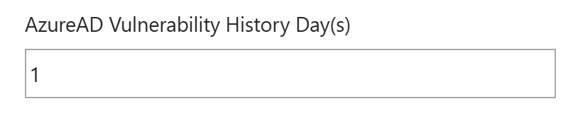
### Step 23
				AzureAD Vulnerability History PageSize API

1. Required configuration: **None**
1. Default value: **200000**
1. **Do not change** this value unless instructed to do so by PowerStacks support.
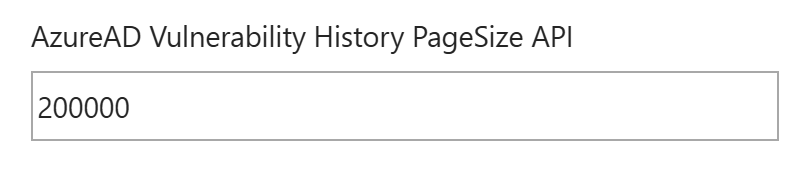
