# How to Install Custom Power BI Templates
### Introduction to BI for Intune Custom Templates

Welcome to an exciting addition to the BI for Intune ecosystem! At PowerStacks, we are dedicated to providing innovative solutions that elevate your Microsoft Intune reporting experience. With BI for Intune, our game-changing Power BI template app available on Microsoft AppSource, we’ve made it easier than ever to access, share, and install comprehensive Intune reports.

Now, we’re taking things a step further by introducing a GitHub repository to host additional custom report templates. This new initiative is designed to bring you an expanding collection of specialized reports, such as KPI dashboards, support desk analytics, and other purpose-driven insights that go beyond the default templates included with BI for Intune. These templates are crafted to save you time and effort while delivering unique perspectives tailored to your organizational needs.

In addition to accessing our curated templates, you’ll have the opportunity to collaborate with the broader Intune and PowerStacks communities. We encourage our customers to contribute their own templates to the repository, fostering a space for shared knowledge and innovation.

Please note that these custom templates are provided "as-is," without warranty or formal support. This allows us to keep this repository a dynamic and collaborative resource for everyone involved.

We’re thrilled to offer this new way to enhance your BI for Intune experience and look forward to seeing how these templates help you unlock even greater value from your Intune data. Let’s get started!

*Templates Repository*

### Step 1

1. Ensure that you have the latest version of Power BI desktop installed.
1. Ensure that BI for Intune has been [upgraded](/bi-for-intune/guides/perform-in-place-upgrade.md) to the latest version.
1. Download a .pbit file from our [Github](https://github.com/PowerStacks-BI/BI-for-Intune).
1. Open Power BI desktop and login using the same credentials that you use to view BI for Intune reports in the Power BI service.
1. Open the .pbit file in Power BI desktop.
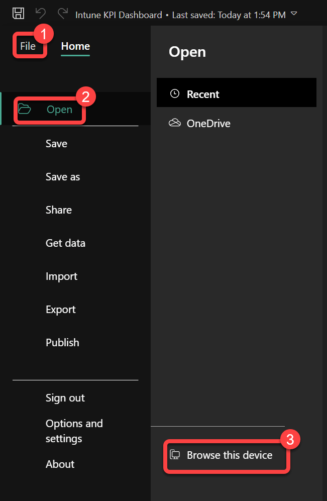
### Step 2

1. On the **Unable to Connect** dialog box select **Edit.**
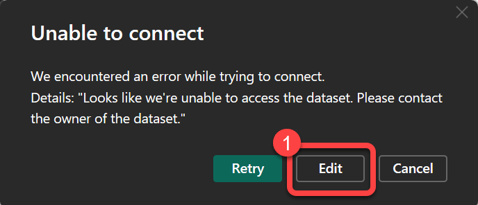
### Step 3

1. If you see any warnings messages simply ignore them.
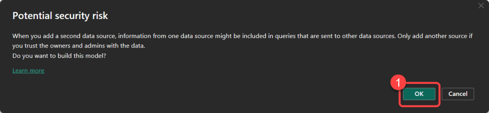
### Step 4

1. On the **Select a dataset to create a report** dialog box select your production **BI_for_Intune** dataset then select **Create**.
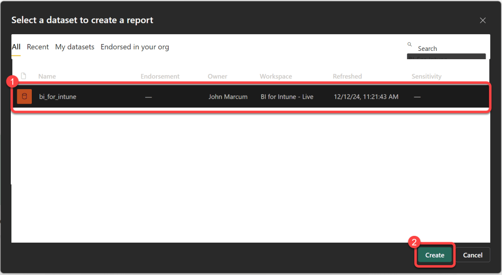
### Step 5

1. In Power BI Desktop Select **File** > **Save as** then Select a location to save the file. Provide a name for the file, for example **Intune KPI Dashboard**. (this will be visible when you publish to the Power BI service). Select .**pbix** as the file type. Select **Save**.
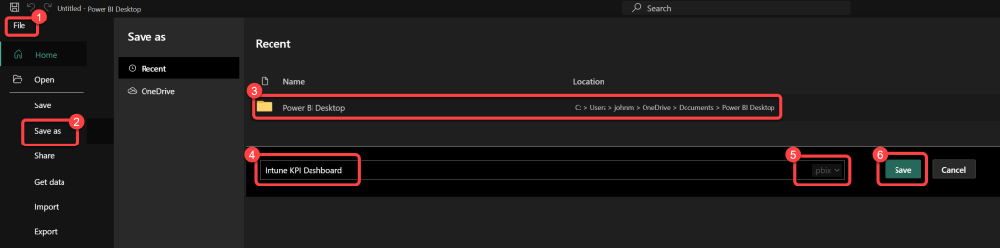
### Step 6

1. On the **Home** ribbon of Power BI desktop select **Publish**.
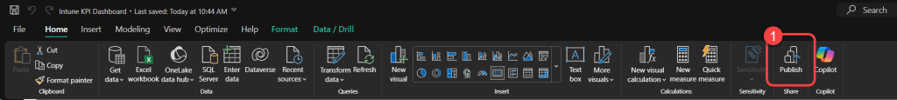
### Step 7

1. If prompted to save your changes, select **Save**.
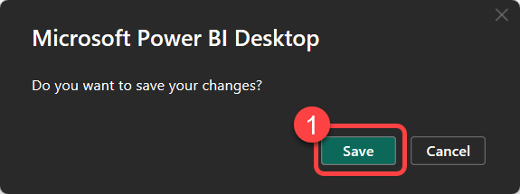
### Step 8

1. On the Publish to Power BI dialog select your production **BI for Intune** Select **Save**.
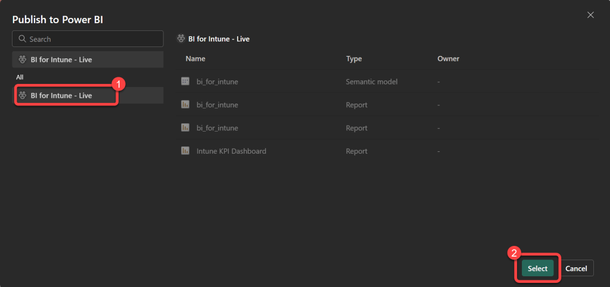
### Step 9

1. At the **Publishing to Power BI** Success message select **Got it**.
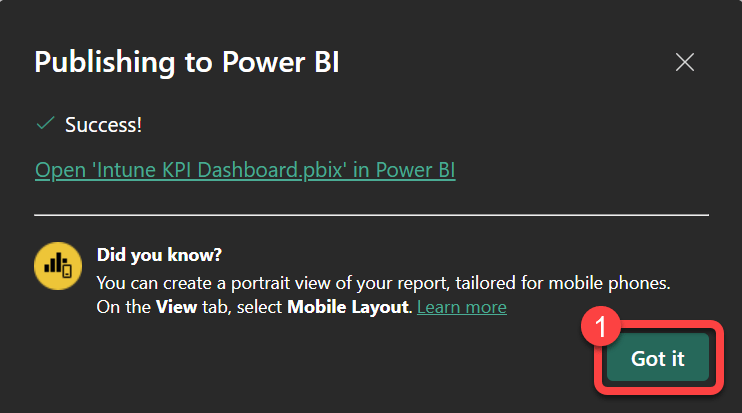
### Step 10

1. Login to the [Power BI service](https://app.powerbi.com) using your favorite browser.
1. Go to your production BI for Intune workspace.
1. Open the **Intune KPI Dashboard**. (The name might vary; it will be whatever you saved the .pbix file as in step 9 above.
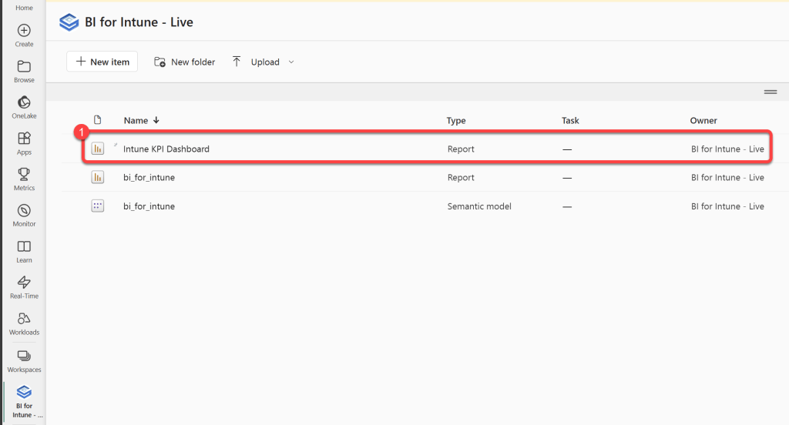
### Step 11

1. Enjoy your new reports!

###### Side Note:

For the best experience, we advise that you edit custom templates exclusively in Power BI Desktop and maintain a local backup of your changes as a .pbix file on your computer. While not mandatory, this practice helps prevent conflicting versions of your reports that can arise from making edits in both Power BI Desktop and the Power BI Service, which can be confusing.
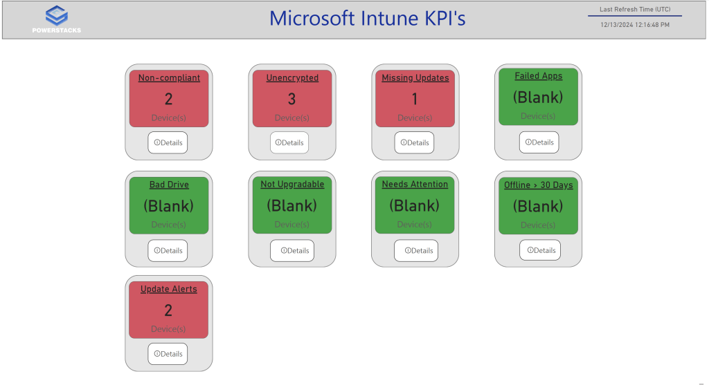
