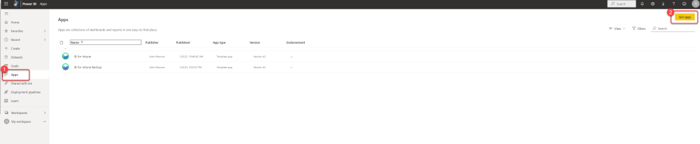
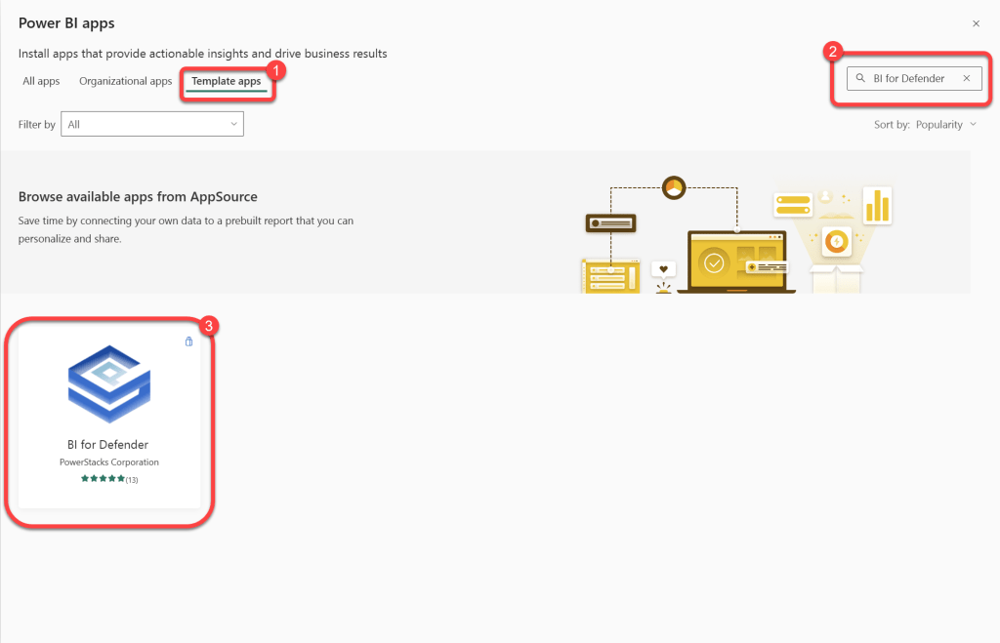
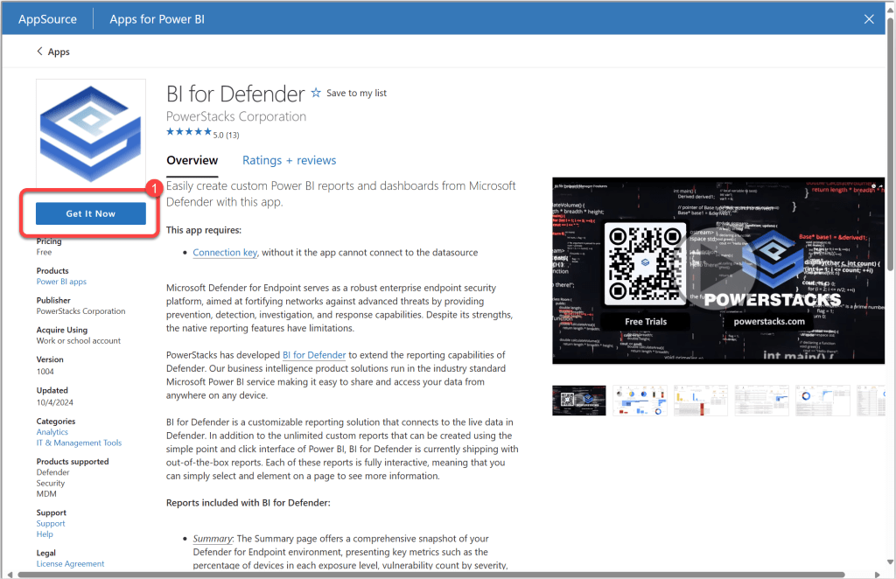
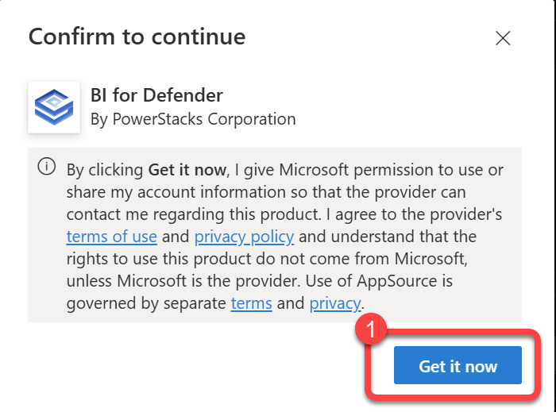
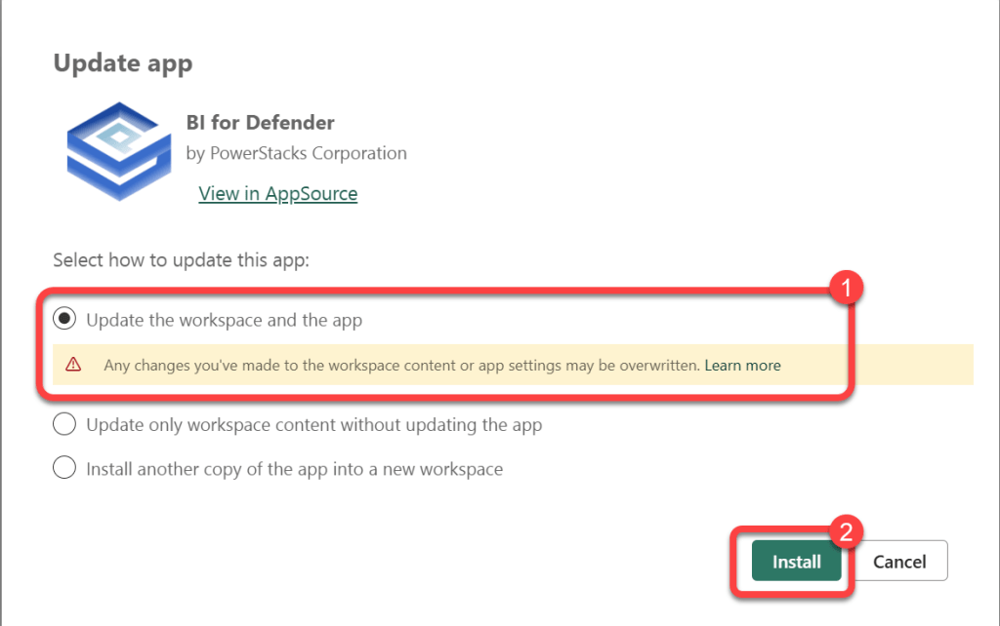

# Perform In-place Upgrade
We strongly advise customers to always [backup](backup-custom-reports.md) their custom reports before performing any in-place upgrades. Failure to do so could result in the loss of your custom reports!

**Prerequisites:**The user executing these steps should be the owner of the BI for Defender workspace.

### Step 1

1. Login to **Power BI**.
1. Select **Apps**.
1. Select **Get apps**.

### Step 2

1. Select **Template apps**.
1. Search for **BI for Defender**.
1. Select **BI for Defender**.

### Step 3

1. Select **Get It Now**.

### Step 4

1. Select **Get it Now**.

### Step 5

1. Select **Update the workspace and the app**.
1. If prompted, select your **production**BI for Defender **workspace**.
1. Select **Install**.

### Step 6

1. Watch for the **update completed** notification in your browser.
1. The data will revert back to the sample data that comes with BI for Defender.
1. Start a manual refresh to sync your data if a refresh does not start automatically.

