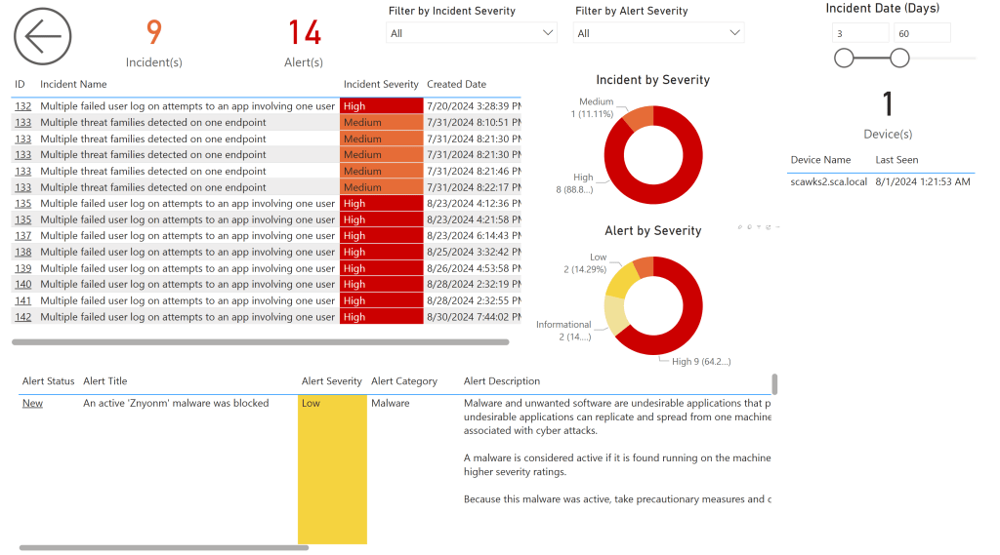
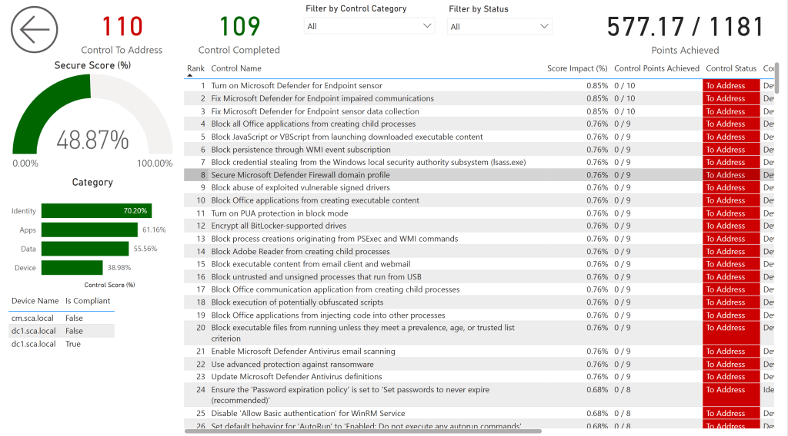

# Version 3.0 (AppSource Version 1003)
BI for Defender Version 3.0, shown as version 1001 in AppSource, was released on September 3, 2024. Version 3 includes many requested improvements such as Secure Score and Incidents and Alerts.

**Important Notes:**

- New permissions are required on the [App Registration](azure-ad-app-permissions.md) in Azure. Reports will be blank if these are not added.SecurityEvents.Read.All
- SecurityAlert.Read.All
- SecurityIncident.Read.All
Several customers have recently reported upgrade failures resulting in the loss of their custom reports. Please do not forget to [backup before you upgrade](create-backup-workspace.md)!

## Below Are The Changes in Version 3.0

- **Features:**Added new "Incidents & Alerts" page.
- Added new "Secure Score" page.
- New "Alert" category added to the Semantic Model. Fields include:Alert Category
- Alert Classification
- Alert Count
- Alert Description
- Alert Detection Source
- Alert Determination
- Alert Link
- Alert Recommended Actions
- Alert Severity
- Alert Status
- Alert Title
- Created Date
- Created Date (Days)
- First Activity Date
- First Activity Date (Days)
- Last Activity Date
- Last Activity Date (Days)
- Last Update Time
- Last Update Time (Days)
- Resolved Date
- Resolved Date (Days)
New "Secure Score Control" category added to the Semantic Model. Fields include:
- Control Category
- Control Completed
- Control Description
- Control ID
- Control Max Score
- Control Name
- Control Points Achieved
- Control Rank
- Control Score
- Control Score (%)
- Control Score Impact (%)
- Control Status
- Control to Address
- Implementation Status
- Last Synced
- Last Synced (Days)
New "Secure Score Benchmark" category added to the Semantic Model. Fields include:
- Apps Score (%)
- Average Score (%)
- Basis
- Data Score (%)
- Device Score (%)
- Identity Score (%)
- Seat Size Range Lower Value
- Seat Size Range Upper Value
**Enhancements:**
- Updated the "Summary" page.Added Incident(s)
- Added Alert(s)
- Removed Inactive Device(s)
- Added Secure Score
- Added Incident by Severity
- Added Alert by Severity Removed
- Managed by
- Removed OS
Updated the "Device Info" page.
- Added "OS Build Number"
New fields added to the "Device" category in the Semantic Model:
- Device Exploitable (%)
- OS Build Number
**Bug Fixes:**
- Fixed issue causing devices without IP Address not showing up on the Device Info page.
**Important Notes:**
- New permissions are required on the App Registration in Azure. Reports will be blank if these are not added.SecurityEvents.Read.All
- SecurityAlert.Read.All
- SecurityIncident.Read.All
Always backup your custom reports using our [backup process.](create-backup-workspace.md)

## New Incidents & Alerts Page

## New Secure Score Page

