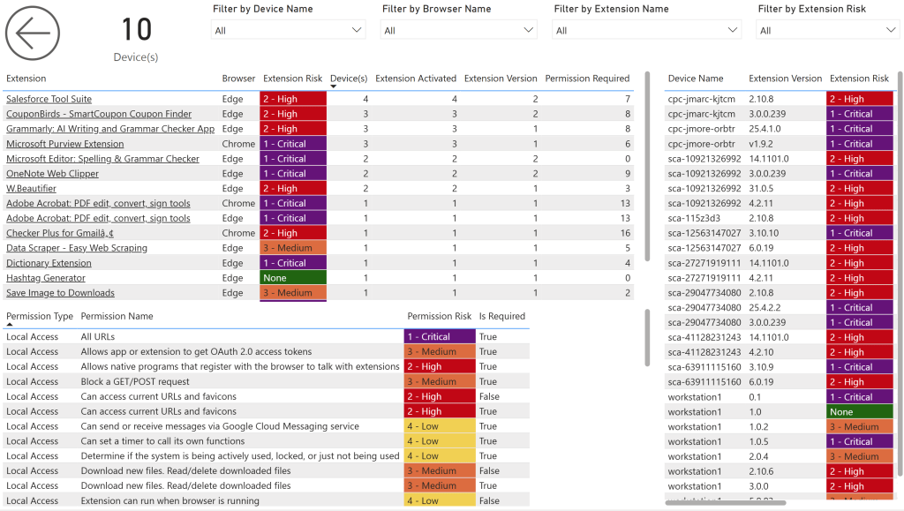

# Version 9.0 (AppSource Version 1009)
Version 9.0 introduces powerful new reporting features, including comprehensive browser extension visibility and key enhancements to device and license management. This update also adds a new semantic model parameter and continues to build on highly requested capabilities.

**Important Notes:**
If you missed version 8.0, please [review the critical change](http://ec2-35-94-201-107.us-west-2.compute.amazonaws.com/wordpress/bi-for-defender-change-log/version-8-0-march-10-2025/) related to vulnerabilities and security update filtering.  And as always—before upgrading, [back up your custom reports](../administration/create-backup-workspace.md) to prevent data loss.

## Below are the Changes in Version 9.0

### New pages added to the BI for Defender report

**Browser Extensions** – The new Browser Extensions page provides visibility into installed browser extensions, their versions, risk ratings, and required permissions.
**Note**: To copy the new pages to your custom reports, see the article [How to Copy Pages](http://ec2-35-94-201-107.us-west-2.compute.amazonaws.com/wordpress/how-to-copy-pages/).

### New objects added to the semantic model

**Browser Extension** object – The new fields in the **Browser Extension** object include:

- Extension Activated
- Extension Install Date
- Extension Install Date (Days)
- Extension Risk
- Extension Risk Highest
- Extension Version
- Extension Version Count
- Is Extension Activated
- Is Permission Required
- Permission Required
- Permission Risk

**Browser Extension Details** object – The new fields in the Browser Extension Details object include:

- Browser Name
- Extension Description
- Extension ID
- Extension Link
- Extension Name
- Extension Vendor

**Browser Extension Permission** object – The new fields in the **Browser Extension Permission** object include:

- Permission Description
- Permission ID
- Permission Name
- Permission Type

-

### New parameters added to the semantic model

**AzureAD Incident Enable**

- Type: Boolean
- Default: TRUE
- When FALSE, the Incidents are not reported on.
- **Known issue**: This API supports a maximum of 50 results per call and 20 calls per minute. Large incident volumes may cause timeouts which will require disabling incident reporting.

### Product enhancements

Additions to the **Device** object in the semantic model:

- Device Sub Type
- Is Excluded
- Exclusion Reason

Changes to the **Device Info** page. New fields to main table and filter pane:

- Device Sub Type
- Is Excluded
- Exclusion Reason

Changes to what PowerStacks considers a "valid device" for licensing purposes. BI for Defender licensing now counts only devices where:

- License Status = Active
- Is Excluded = FALSE
- Previously we counted all active devices regardless of exclusion.

## The New Browser Extensions Page

We've added a new **Browser Extensions** report page to BI for Defender, providing detailed visibility into installed browser extensions across your environment. This report helps you identify potential risks, track versioning, and understand permission requirements at scale. By surfacing extension-level risk ratings and activation status, it supports proactive threat assessment and helps ensure that only trusted extensions are in use. Use this report to enhance visibility, tighten browser security, and reduce your overall attack surface.

