# Semantic model parameters

This page is a **reference** for every parameter in the BI for Intune semantic model. Each parameter is described with its default value, whether configuration is required, and what it controls.

If you are setting up BI for Intune for the first time, follow [Configure the semantic model](../installation/setup-guide/configure-the-semantic-model.md) — it walks through only the parameters required for the initial install. For optional integrations, see [Advanced Configuration](../advanced-configuration.md).

## Open the parameters page

1. In the Power BI service, select **Workspaces**.
1. Select the **BI for Intune** workspace.

    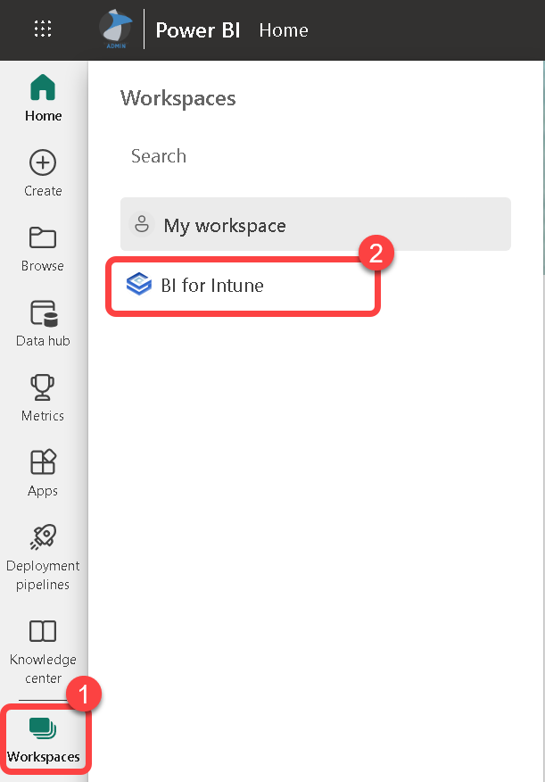

1. Point to the **bi_for_intune** semantic model to reveal the more options menu (three vertical dots), select the menu, then select **Settings**.

    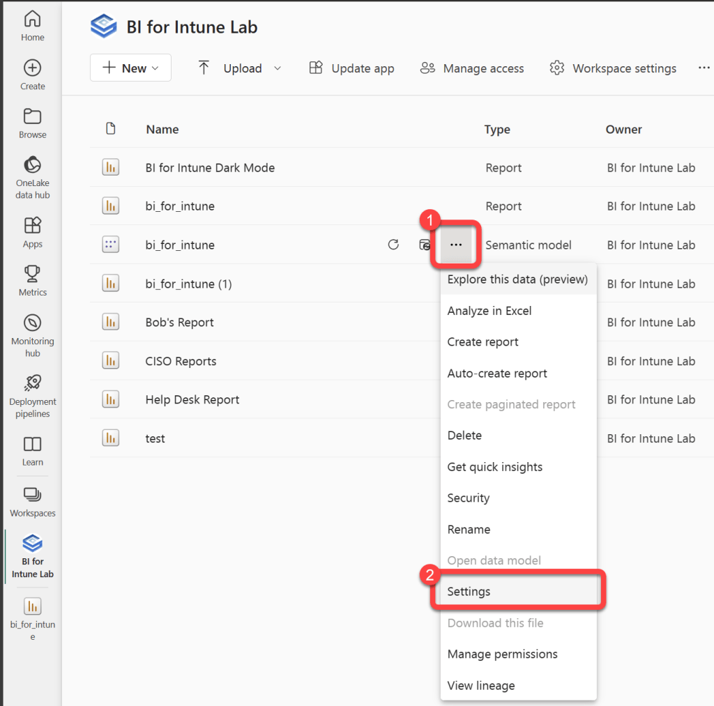

1. Expand **Parameters**.

    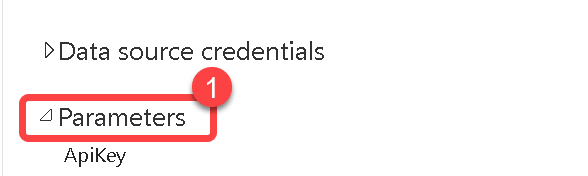

## Authentication

These parameters identify your tenant and authenticate BI for Intune to read data from Microsoft Graph. All four are required for the initial install.

### ApiKey

**Required:** Yes
**Default:** Blank

The API Key you received from PowerStacks after completing the [Request a Trial License](../installation/getting-started/request-a-license.md) form.

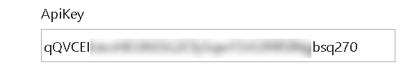

### AzureAD TenantID

**Required:** Yes
**Default:** Blank

Your Microsoft Entra tenant ID. An easy way to find this is to go to [whatismytenantid.com](https://www.whatismytenantid.com/).

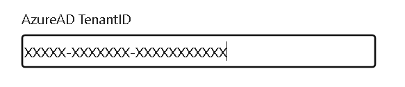

### AzureAD ClientID

**Required:** Yes
**Default:** Blank

The **Application (client) ID** recorded during the [Microsoft Entra app registration](../installation/setup-guide/create-entra-app-registration.md).

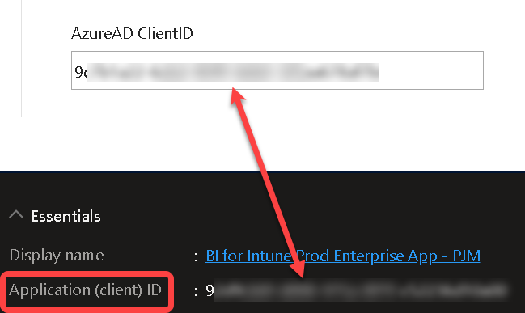

### AzureAD ClientSecret

**Required:** Yes
**Default:** Blank

The Microsoft Entra Client Secret recorded during the [Microsoft Entra app registration](../installation/setup-guide/create-entra-app-registration.md).

!!! warning "Most common installation mistake"
    Use the **Value** column from the client secret page, not the **Secret ID** column. The Client Secret does not have dashes in it. It looks similar to this: `aBcDE~fGh.I.JKlmnopqRsTuVwXyZ1234567890`

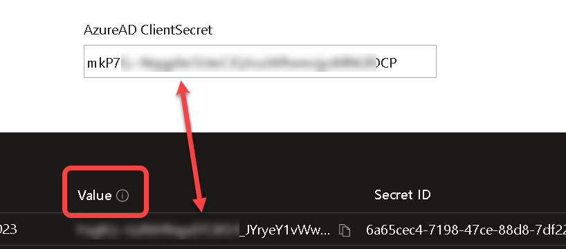

## Sign-in data

### AzureAD Sign-Ins Failure Only

**Required:** No
**Default:** TRUE

Determines whether successful sign-ins are available in the reports. By default, only failed sign-in data is loaded. Loading successful sign-in data slows synchronization and can cause sync timeouts.

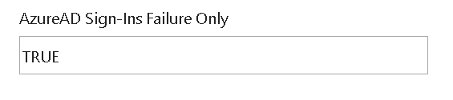

### AzureAD Sign-Ins Day(s)

**Required:** No
**Default:** 1
**Max value:** 7

Number of days of sign-in data to load. Setting this higher slows synchronization and can cause sync timeouts. Set to `-1` to disable sign-in data entirely.

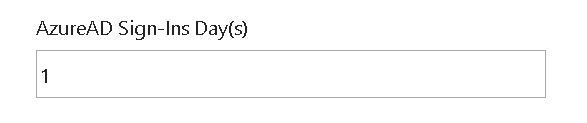

## Log Analytics

These parameters connect BI for Intune to a Log Analytics workspace for Windows Update for Business reports and Custom Inventory data. Required only if you use one or both of those add-ons.

### AzureAD LogAnalytics Enable

**Required:** Yes, for [Windows Update for Business reports](../installation/log-analytics/wufb-reports.md) and/or [Custom Inventory](../installation/custom-inventory.md)
**Default:** FALSE

Enables BI for Intune to read from Log Analytics.

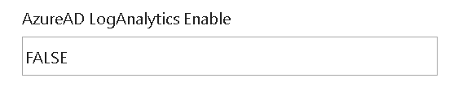

### AzureAD LogAnalytics WorkspaceID

**Required:** Yes, for Windows Update for Business reports and/or Custom Inventory
**Default:** Blank

The Workspace ID of the Log Analytics workspace where Custom Inventory and Windows Update for Business reports data are stored. Both add-ons must use the same workspace.

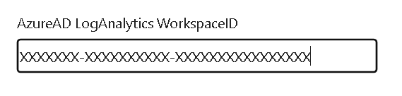

### AzureAD LogAnalytics Day(s)

**Required:** No
**Default:** 30

Number of days of data to pull from Log Analytics.

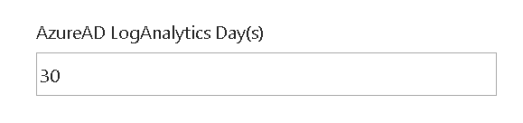

### AzureAD LogAnalytics PageSize API

**Required:** No
**Default:** 10000

Page size for Log Analytics queries. Do not change unless instructed by PowerStacks support.

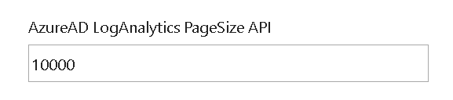

### AzureAD LogAnalytics App Inventory PageSize API

**Required:** No
**Default:** 10000

Page size for Log Analytics app inventory queries. Do not change unless instructed by PowerStacks support.

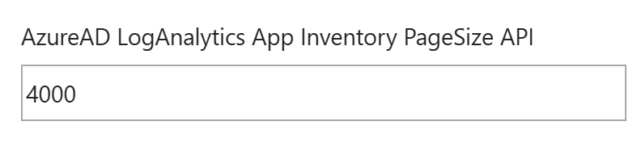

## Intune Export API

These parameters control whether BI for Intune uses the [Intune Export API](../installation/setup-guide/export-api-parameter.md) directly or routes through the PowerStacks redirect API. Direct use is more secure and avoids the PowerStacks redirect API.

### AzureAD Export URL Enable

**Required:** Yes, if AzureAD Export URL is populated
**Default:** FALSE

Determines whether to use the URL set in **AzureAD Export URL** or to discover it automatically.

Setting this to TRUE creates a new data source credential that must be configured:

- Authentication method: Anonymous
- Privacy Level: Organizational
- Check "Skip test connection"

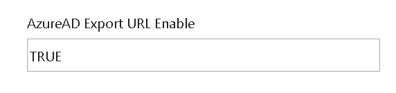

### AzureAD Export URL

**Required:** No
**Default:** Blank

The Export URL varies by tenant. If left blank, BI for Intune finds the correct URL automatically through the PowerStacks redirect API. For better security, set this parameter and also set **AzureAD Export URL Enable** to TRUE. See [Configure Intune Export API](../installation/setup-guide/export-api-parameter.md) for the steps to find your URL.

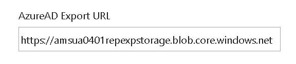

### AzureAD Export URL Timeout (s)

**Required:** No
**Default:** 3600

How long (in seconds) the sync process waits for each Intune export job before timing out. Do not change unless instructed by PowerStacks support.

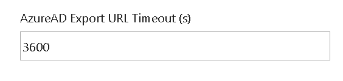

### AzureAD Export URL Wait (s)

**Required:** No
**Default:** 1

How long (in seconds) the sync process waits between status checks on each Intune export job. Do not change unless instructed by PowerStacks support.

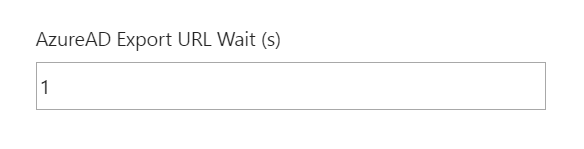

### AzureAD Export URL Batch

**Required:** No
**Default:** Refer to product defaults

Controls batching behavior for Intune Export API requests. Do not change unless instructed by PowerStacks support.

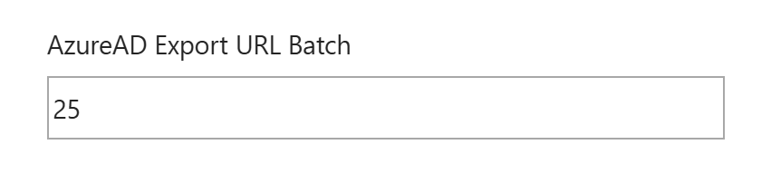

### AzureAD Export URL CloudPC

**Required:** No (only for Windows 365 / Cloud PC environments)
**Default:** `https://graph.microsoft.com`

Only needs to be configured in environments using Windows 365 (Cloud PC) AND that have configured **AzureAD Export URL**.

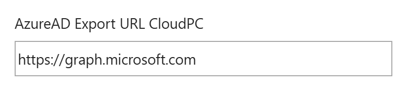

## Group memberships

### AzureAD Group Members Enable

**Required:** No
**Default:** TRUE

Whether Microsoft Entra group memberships are available in the reports. Tenants with a large number of groups may need to disable this to avoid synchronization failures. By default, only members of dynamic groups are loaded; this is controlled by **AzureAD Group Dynamic Members Only**.

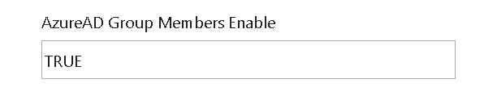

### AzureAD Group Dynamic Members Only

**Required:** No
**Default:** TRUE

When TRUE, only members of dynamic groups are loaded. Setting to FALSE also loads members of assigned groups, but this is more intensive and can cause sync timeouts.

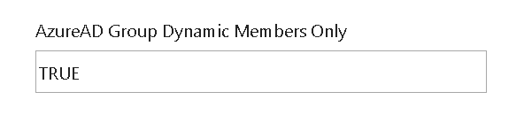

### AzureAD Group Members Filter Starts With

**Required:** No
**Default:** `%` (filter disabled)

A group-name prefix to limit which groups are synchronized. Only groups starting with the prefix are loaded.

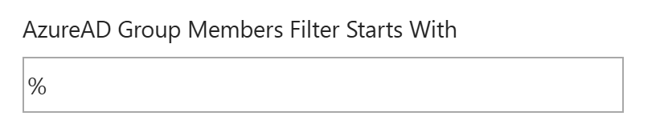

### AzureAD Group Members Nested Crawler Enable

**Required:** No
**Default:** FALSE

Only applies when a prefix is set in **AzureAD Group Members Filter Starts With**. When TRUE, transitive (nested) group memberships are included. By default (filter = `%`), transitive memberships are always loaded.

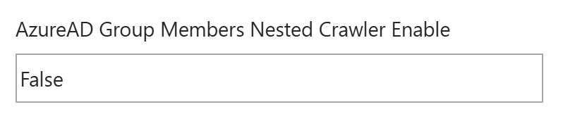

## Sync performance

### AzureAD PageSize API

**Required:** No
**Default:** 10000

Page size for Microsoft Graph queries. Do not change unless instructed by PowerStacks support.

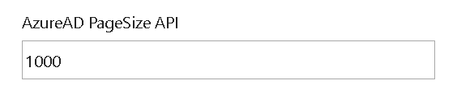

### AzureAD Pace API (s)

**Required:** No
**Default:** 0

How long the sync process waits for a response from paced APIs before looping. Do not change unless instructed by PowerStacks support.

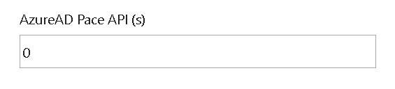

## Feature toggles

These parameters enable or disable specific data sources within the sync.

### AzureAD Compliance Policy Setting State Enable

**Required:** No
**Default:** TRUE

Controls synchronization of Configuration Profiles of the Settings Catalog type. Added to mitigate periodic sync failures in a small number of Azure data centers. Leave at the default unless instructed by PowerStacks support.

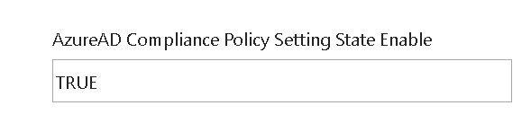

### AzureAD Application State Enable

**Required:** No
**Default:** TRUE

Whether application state data is included in the synchronization. Leave at the default unless instructed by PowerStacks support.

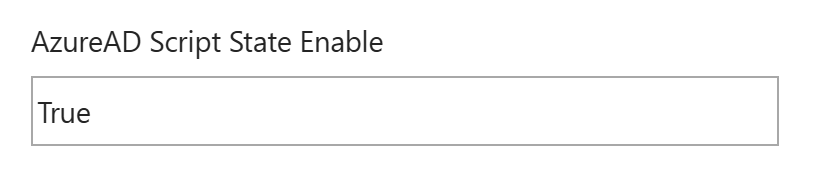

### AzureAD Script State Enable

**Required:** No
**Default:** TRUE

Whether device script execution state data is included in the synchronization. Leave at the default unless instructed by PowerStacks support.

### AzureAD Driver Updates Enable

**Required:** No
**Default:** TRUE

Whether Windows Driver Updates data is included in the synchronization. Setting to FALSE can significantly reduce sync time in environments with thousands of approved drivers. For best results, be selective about which drivers are approved.

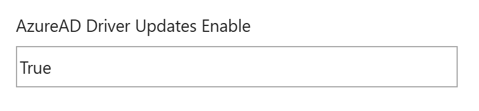

### AzureAD Timeline Event Day(s)

**Required:** No (Microsoft Intune Suite add-on customers only)
**Default:** 7
**Max value:** 30

Number of days of [device timeline](https://learn.microsoft.com/en-us/mem/analytics/enhanced-device-timeline) data to pull from Endpoint Analytics. Set to `-1` to disable.

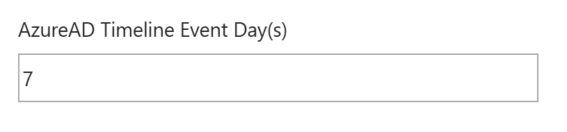

## Disk health thresholds

These parameters set the thresholds used to calculate device disk health. Defaults are based on Microsoft's [MSFT_StorageReliabilityCounter](https://learn.microsoft.com/en-us/windows-hardware/drivers/storage/msft-storagereliabilitycounter) class.

### AzureAD Disk Max Wear

**Required:** No
**Default:** 90

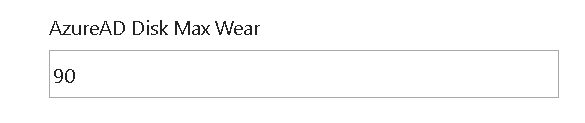

### AzureAD Disk Max Read Errors

**Required:** No
**Default:** 100

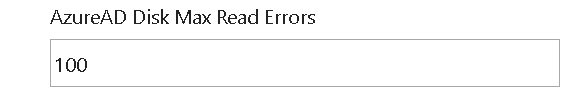

### AzureAD Disk Max Write Errors

**Required:** No
**Default:** 100

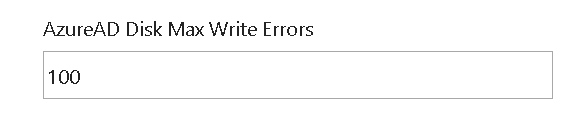

## Multi-cloud URLs

These parameters override Microsoft's default endpoint URLs. Only used in multi-cloud or sovereign-cloud environments (for example, customers using both the public cloud and a Government cloud).

### AzureAD Login URL

**Required:** No
**Default:** `https://login.microsoftonline.com`

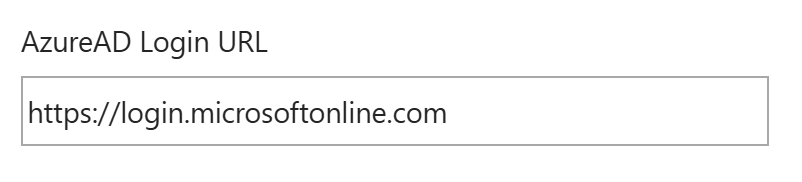

### AzureAD Graph URL

**Required:** No
**Default:** `https://graph.microsoft.com`

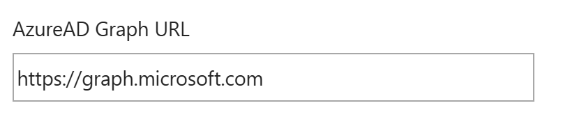

### AzureAD LogAnalytics URL

**Required:** No
**Default:** `https://api.loganalytics.io`

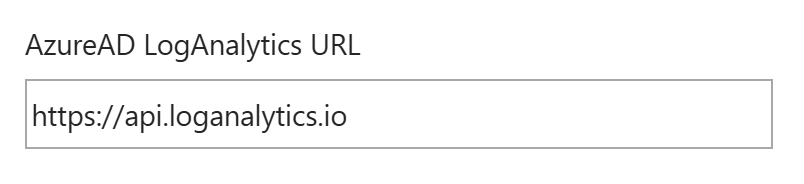
