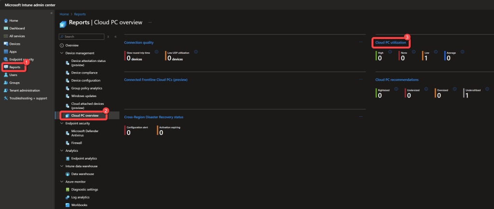
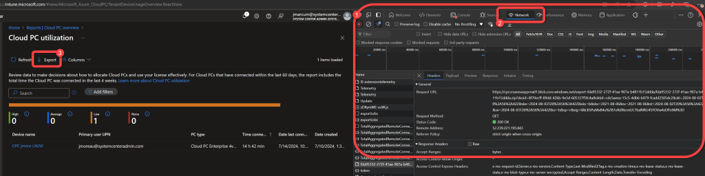
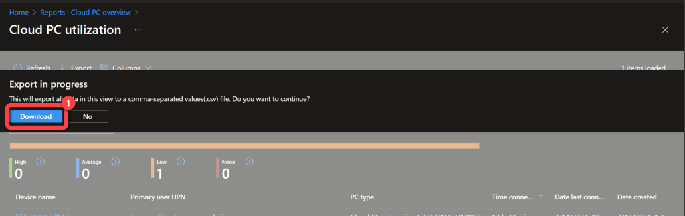
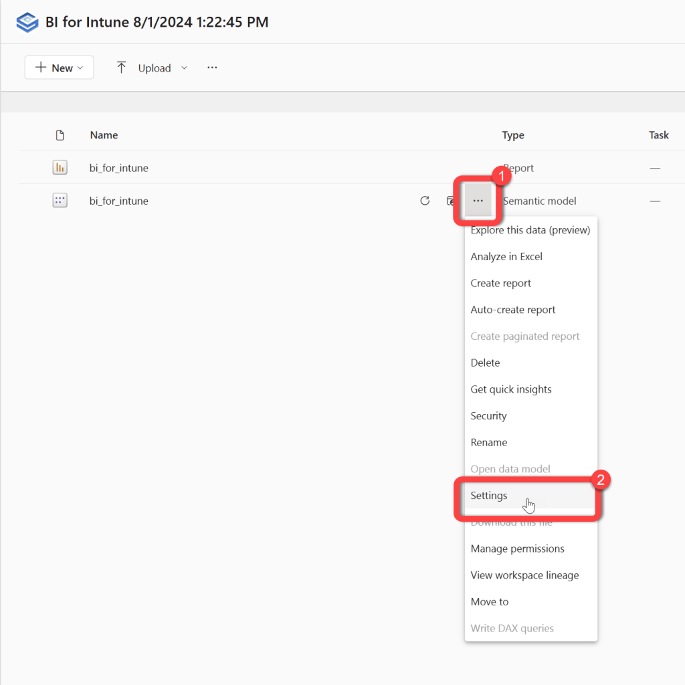
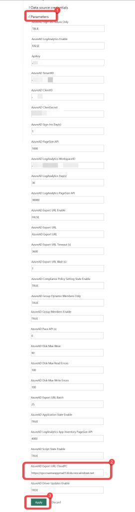

# Configure Cloud PC Export API
This is only required for customers who want to use the Cloud PC report pages.

### Step 1: Open Cloud PC utilization report

1. In the **Intune console** select the **Reports** blade.
1. Select **Cloud PC overview**.
1. Select **Cloud PC utilization**.

### Step 2: Open developer tools and export

1. Press **F12** to open the **developer pane** in your browser.
1. Select the **Network tab** in the **developer pane**.
1. Select **Export**.

### Step 3: Download the export file

1. Select **Download**.

### Step 4: Copy the export Request URL

1. On the **Network tab** of the Developer pane in the browser you will see several lines that start with **TotalAggregatedRemoteConnectionReports_** followed by a line that has a seemingly **random GUID** as the name.
1. Select the first line after the last instance of lines starting with **TotalAggregatedRemoteConnectionReports_**, this should be the line starting with a **GUID**.
1. The header of this line will contain the **Request URL**.
1. Copy the **Request URL**from**https to .net**(you don't need anything after .net) and save it for use later. It should look something like this, "**https://cpccrsaresexpprna01.blob.core.windows.net**".

### Step 5: Open semantic model settings

1. In **Power BI** go to the **BI for Intune workspace**.
1. Select the **Semantic model settings**.

### Step 6: Enter the Cloud PC export URL

1. Expand **Parameters**.
1. Enter the **Export URL** that you previously saved in the **AzureAD Export URL CloudPC** parameter.
1. Select **Apply**.

