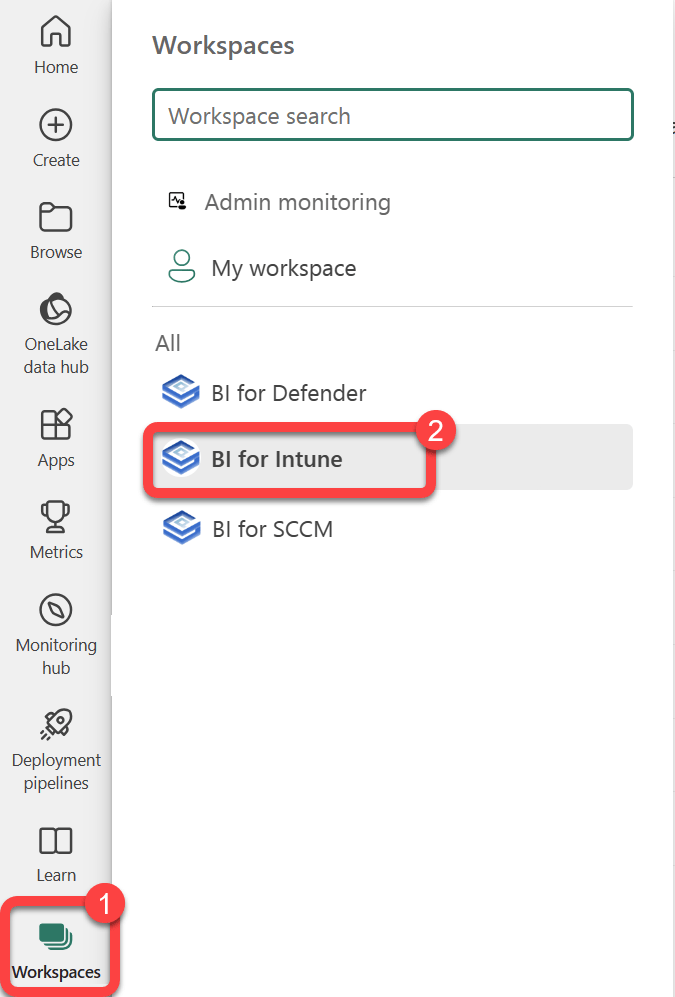
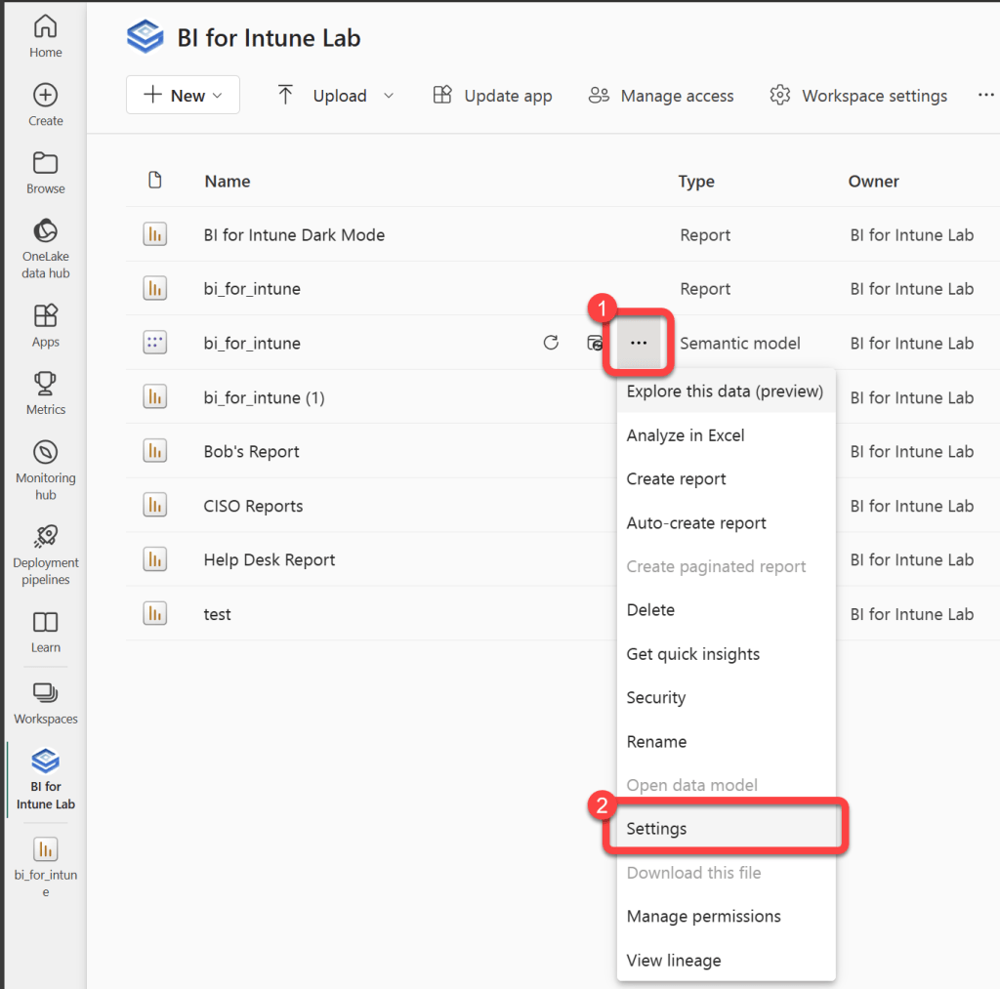
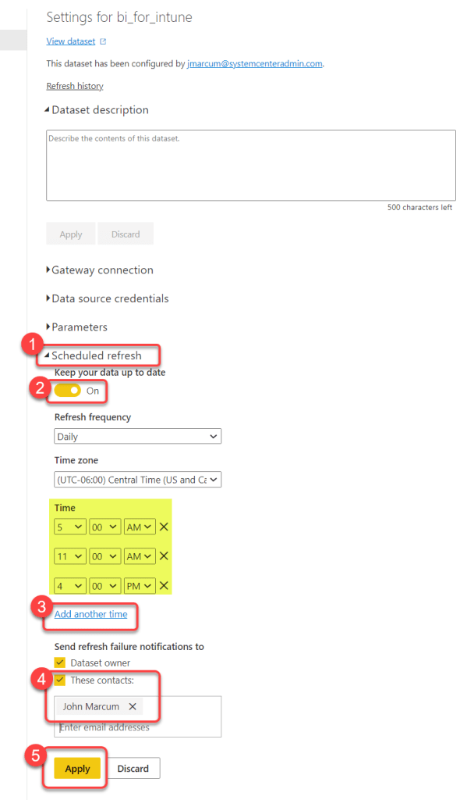

# Configure Data Synchronization
Data is synchronized from the data sources to Power BI on a schedule as described here. Most customers sync approximately 3 times per day.

### Step 1

1. Select **Workspaces**.
1. Select the **BI for Intune** workspace.

### Step 2

1. Hover over the bi_for_intune **Semantic model** dataset to reveal a **kebab menu** (three vertical dots).
1. Select the **kebab menu**.
1. Select **Settings**.

### Step 3

1. Expand **Scheduled refresh**.
1. Move the **Keep your data up to date** slider to **On**.
1. Select **Add another time** and enter up to 8 times for the data synchronization to happen.
1. Optionally, enter **contacts** to be notified of synchronization failures.
1. Select **Apply**.

