# Create Azure App Registration
Synchronizing data from Intune, Azure AD, Log Analytics, and other cloud data sources is done using application permissions. Here we are configuring the permissions required for Power BI to connect to the data sources to get the data.

**Prerequisites:**The user performing this step requires Global Admin and Subscription Admin rights.

### Step 1: Open App registrations in Azure

1. Login to **portal.azure.com**or **entra.microsoft.com** using a global administrator account.
1. Search for and select **App registrations**.
1. Select **New registration**.

### Step 2: Register a new application

1. Enter a **Name** for the application. (This will not be seen by anyone other than admins.)
1. Specify who can use the application as **Accounts in this organizational directory** only.
1. Select **Register**.
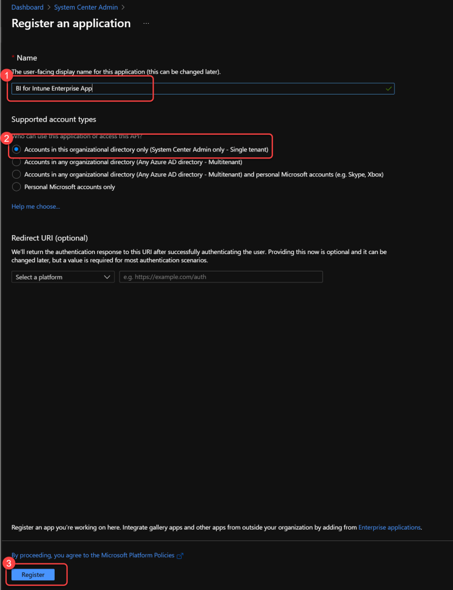
### Step 3: Navigate to API Permissions

1. On the Enterprise App page select **API Permissions**.

### Step 4: Remove the User.Read permission

1. Remove the **User.Read** permission.
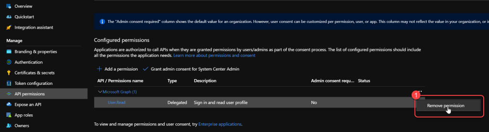
### Step 5: Confirm permission removal

1. When prompted to remove the permission, select **Yes, remove**.
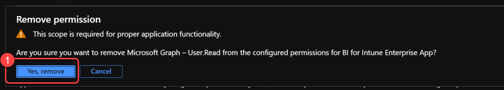
### Step 6: Add a new permission

1. Select **Add a permission**.

### Step 7: Select Microsoft Graph

1. Select **Microsoft Graph**.

### Step 8: Select Application permissions

1. Select **Application permissions**.

### Step 9: Add DeviceManagement permissions

1. Search for **DeviceManagement**.
1. Select the following permissions:**DeviceManagementApps.Read.All**
1. **DeviceManagementConfiguration.Read.All**
1. **DeviceManagementManagedDevices.Read.All**
1. **DeviceManagementRBAC.Read.All**
1. **DeviceManagementServiceConfig.Read.All**
**Do not select the Add permissions button until told to do so in a later step within this document.**
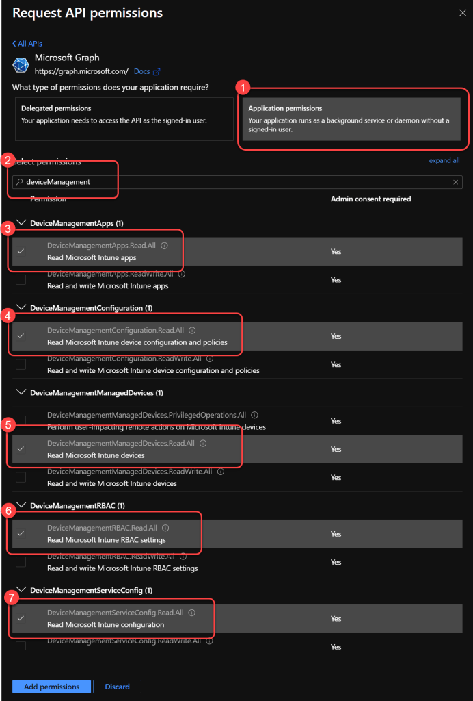
### Step 10: Add Directory.Read.All permission

1. Search for **Directory**.
1. Select the following permissions:**Directory.Read.All**
**Do not select the Add permissions button until told to do so in a later step within this document.**
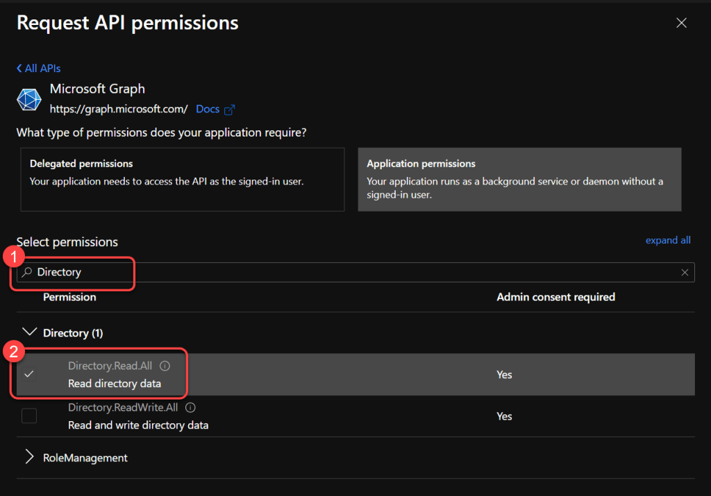
### Step 11: Add AuditLog.Read.All permission

1. Search for **AuditLog**.
1. Select the following permissions:**AuditLog.Read.All**
**Do not select the Add permissions button until told to do so in a later step within this document.**
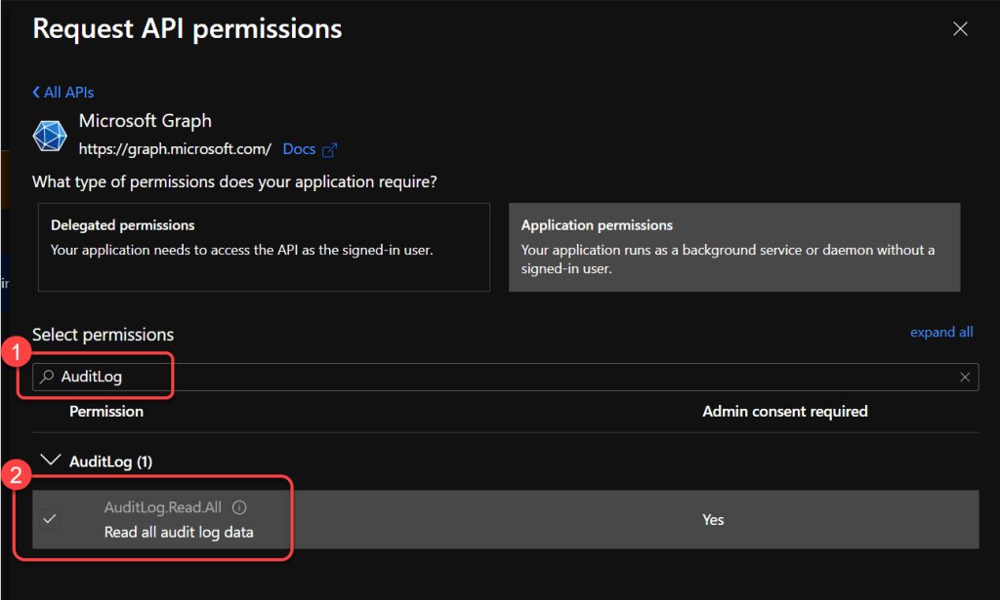
### Step 12: Add Policy.Read.All permission

1. Search for **Policy**.
1. Select the following permissions:**Policy.Read.All**
**Do not select the Add permissions button until told to do so in a later step within this document.**
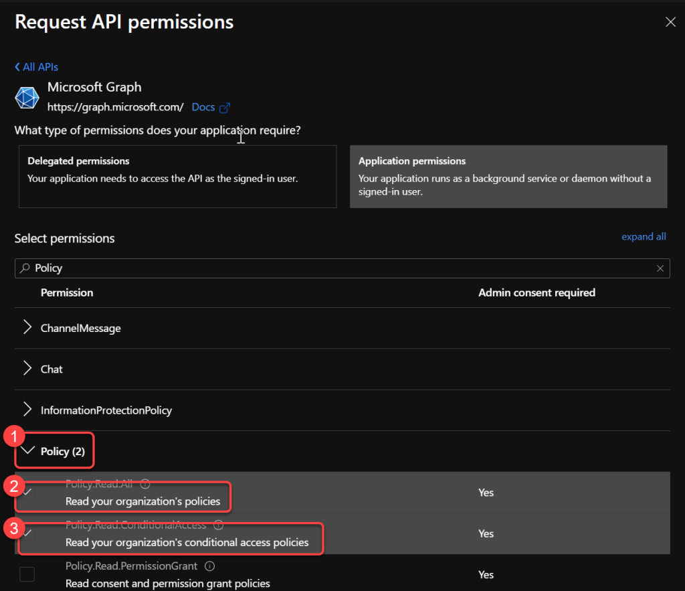
### Step 13: Add CloudPC.Read.All permission
				Only Required for Windows 365 (Cloud PC)

1. Search for **CloudPC**.
1. Select the following permissions:**CloudPC.Read.All**
**Do not select the Add permissions button until told to do so in a later step within this document.**
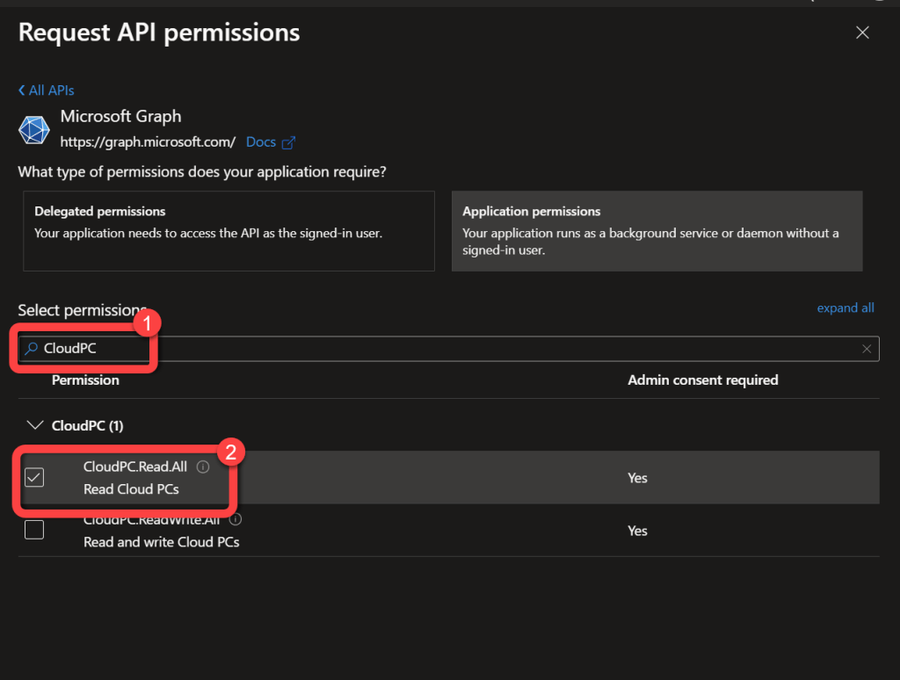
### Step 14: Add Reports.Read.All and apply

1. Search for **Reports**.
1. Select the following permissions:**Reports.Read.All**
Select the **Add permissions**button.
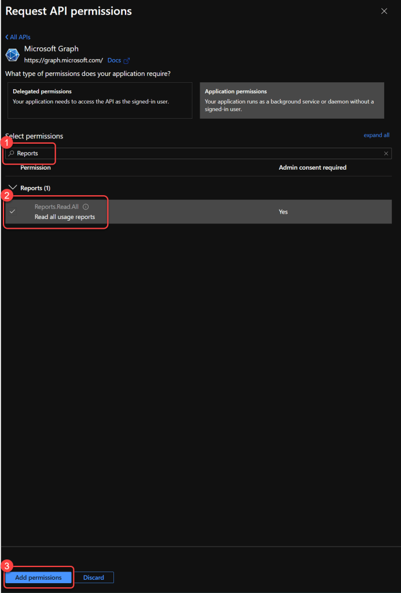
### Step 15: Add another permission
				Skip Directly to Step 19 if You Do Not Plan to Use Our Custom Inventory Solution

1. Select **Add a permission**.

### Step 16: Select organization APIs
				Only Required for Custom Inventory for Windows

1. Select **APIs my organization uses**.

### Step 17: Select Log Analytics API
				Only Required for Custom Inventory for Windows

1. Search for **Log Analytics**.
1. Select **Log Analytics API**.

### Step 18: Select Application permissions
				Only Required for Custom Inventory for Windows

1. Select **Application Permissions**.

### Step 19: Add Data.Read permission
				Only Required for Custom Inventory for Windows

1. Select **Data.Read**.
1. Select **Add permissions**.

### Step 20: Grant admin consent

1. Select **Grant admin consent for **.

### Step 21: Confirm admin consent

1. Select **Yes**at the prompt.

### Step 22: Create a new client secret

1. Select **Certificates & secrets**.
1. Select **New client secret**.
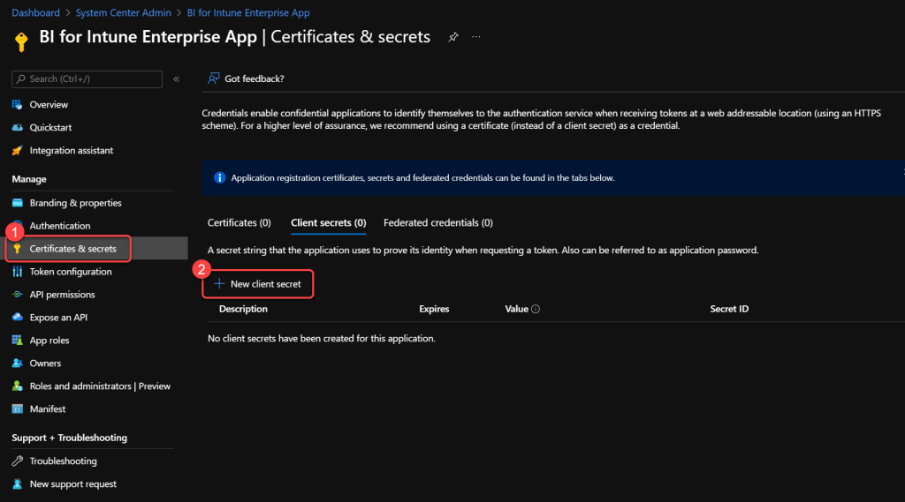
### Step 23: Configure the client secret

1. Enter a **Description**.
1. Select a value for **Expires**.
1. Select **Add**.
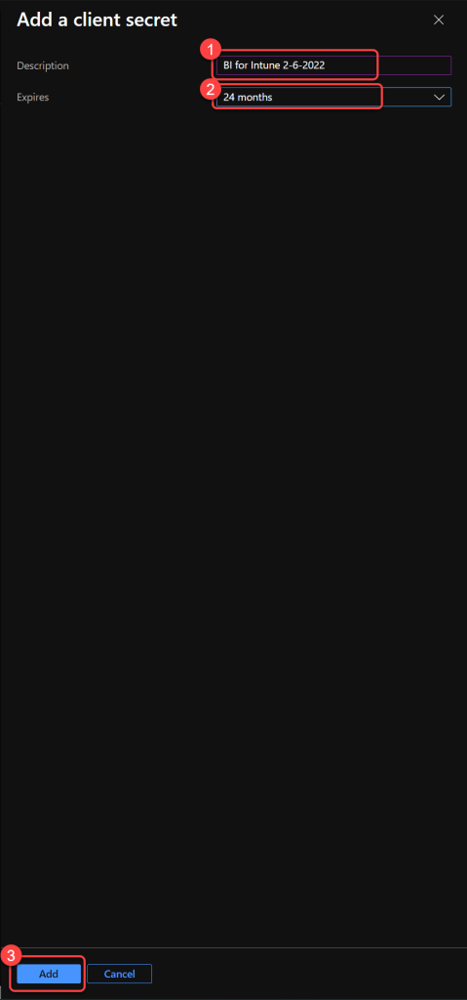
### Step 24: Record the client secret value

1. Record the **Value** data as the **Azure AD Client Secret**. This will be used later in the installation process. The value can only be displayed once, if you fail to record it here you will have to create a new one.
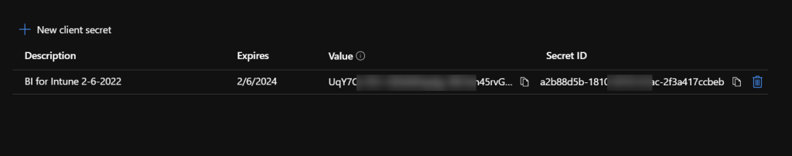
### Step 25: Record the application IDs

1. Select **Overview**.
1. Record the **Application (client) ID** as the **Azure AD Client ID**. This will be used later in the installation process.
1. Record the **Directory (tenant) ID** as the **Azure AD Tenant ID**. This will be used later in the installation process.
1. The **Azure AD Application registration** is now **complete**.
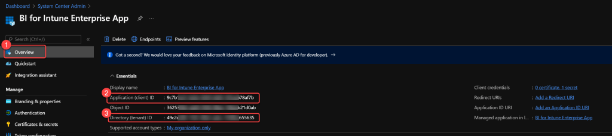
