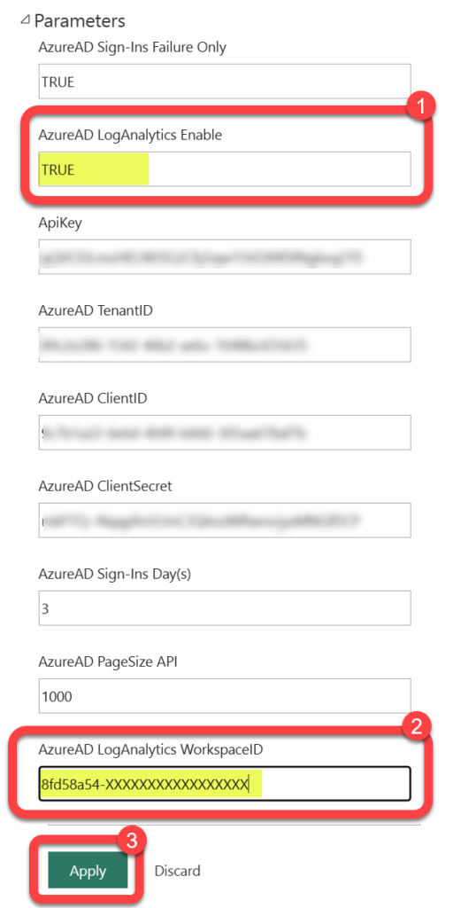
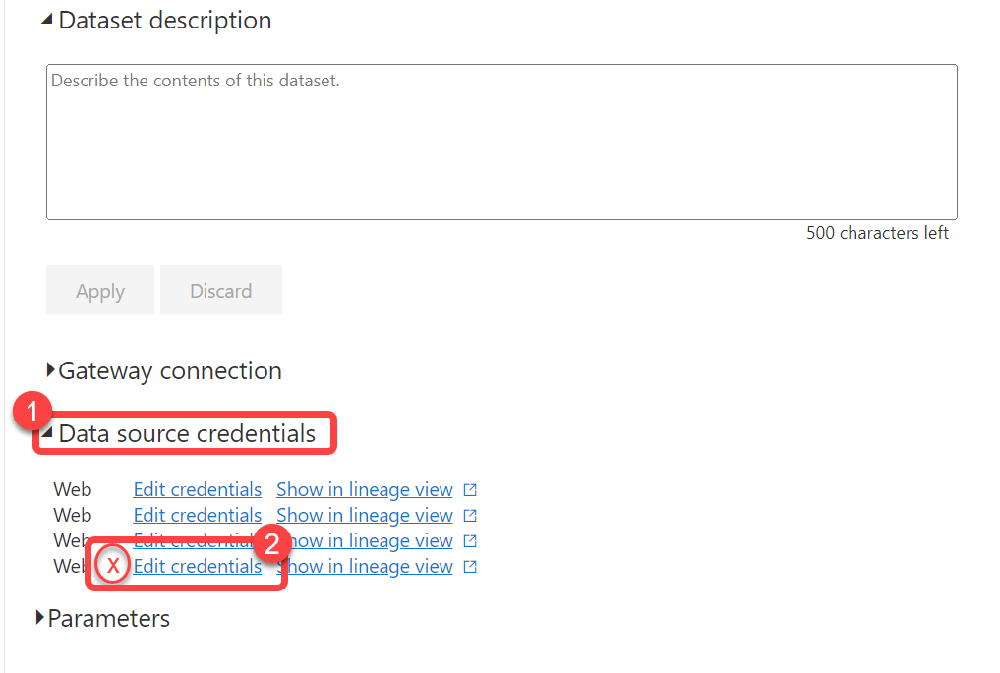
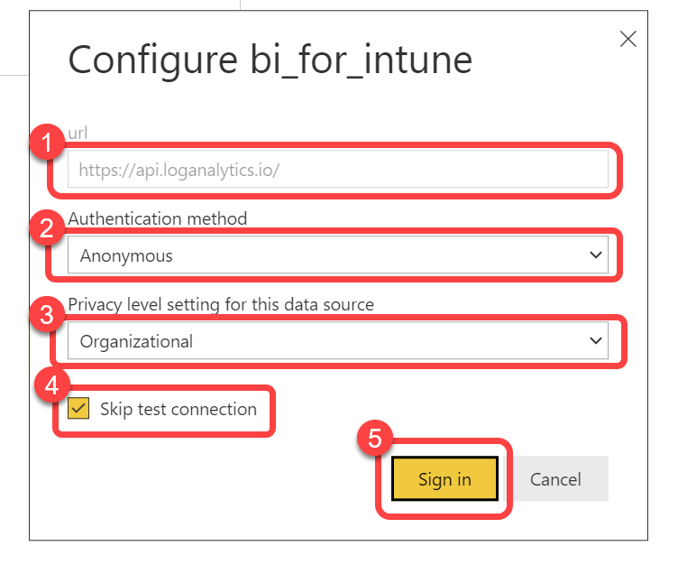

# Dataset Settings for Log Analytics
The BI for Intune dataset contains some parameters that must be configured in order to synchronize data from Intune to Power BI. Other parameters, such as this one, add additional functionality to BI for Intune. In this article we configure the parameters required for **Log Analytics integration** (used by both [Custom Inventory](configure-log-analytics.md) and [WUfB Reports](wufb-reports.md)).

### Step 1: Open the BI for Intune workspace

1. Select **Workspaces**.
1. Select the **BI for Intune** workspace.

### Step 2: Open semantic model settings

1. Hover over the bi_for_intune **Semantic model** to reveal a **kebab menu** (three vertical dots).
1. Select the **kebab menu**.
1. Select **Settings**.

### Step 3: Enable Log Analytics parameters

1. Expand **Parameters**.
1. Locate the **AzureAD LogAnalytics Enable** field and change the value from FALSE to **TRUE**.
1. Locate the **AzureAD LogAnalytics WorkspaceID** field and enter the **Log Analytics Workspace ID** recorded during [Deploy Custom Inventory Resources](configure-log-analytics.md) Step 4, or from the workspace **Overview** page in the Azure portal.
1. Select **Apply**.

### Step 4: Edit gateway source credentials

1. Expand **Gateway source credentials**.
1. One of the four **Web** data sources should have an "**X**" next to it, select **Edit credentials** on that line.

### Step 5: Configure Log Analytics credentials

1. Confirm the **URL** is **https://api.loganalytics.io/**. If not, you have selected an incorrect **Edit credentials**. Go back to the previous step and ensure that you select the correct line.
1. Select **Anonymous** as the **Authentication method**.
1. Select **Organizational** as the **Privacy level setting for this data source**.
1. Check the box to **Skip test connection**.
1. Select **Sign in**.

