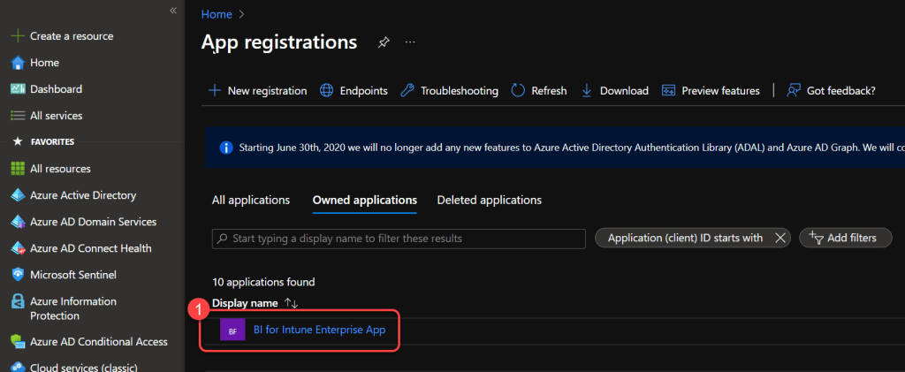
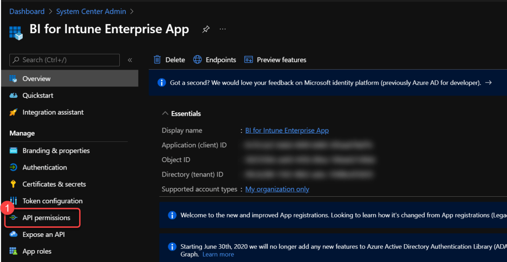
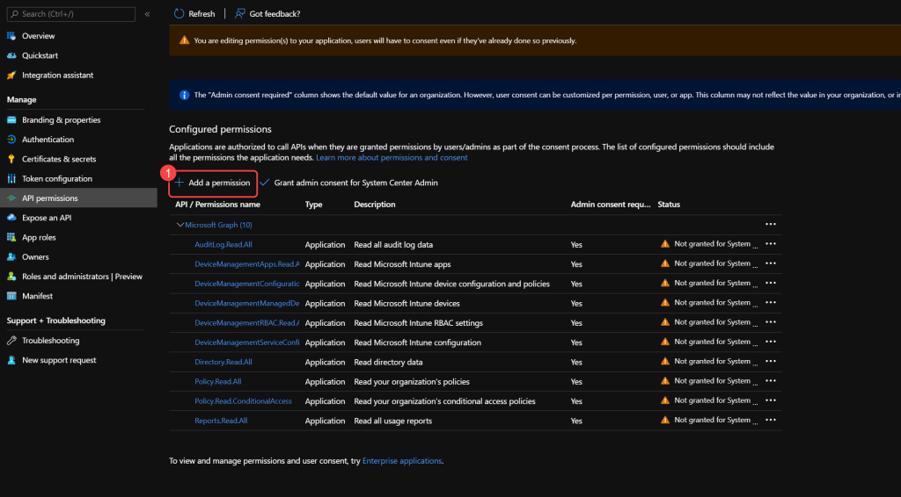
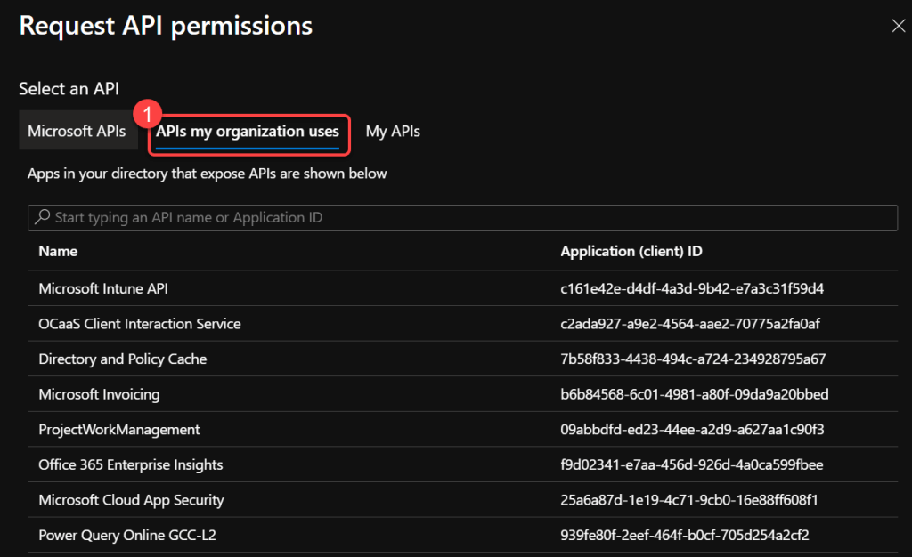
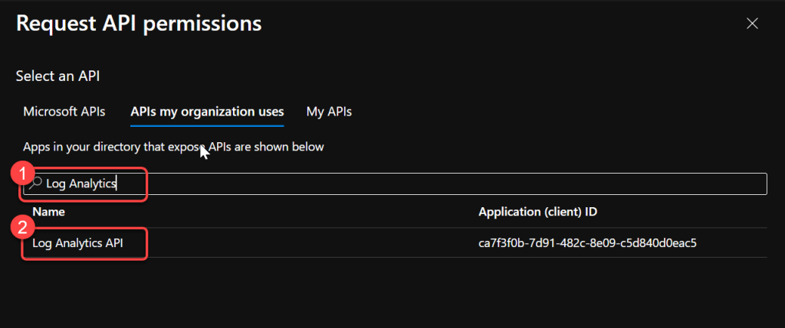
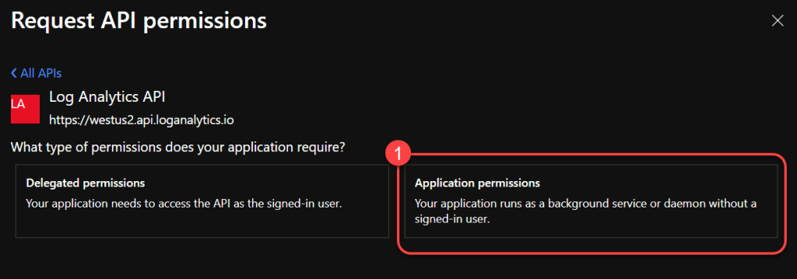
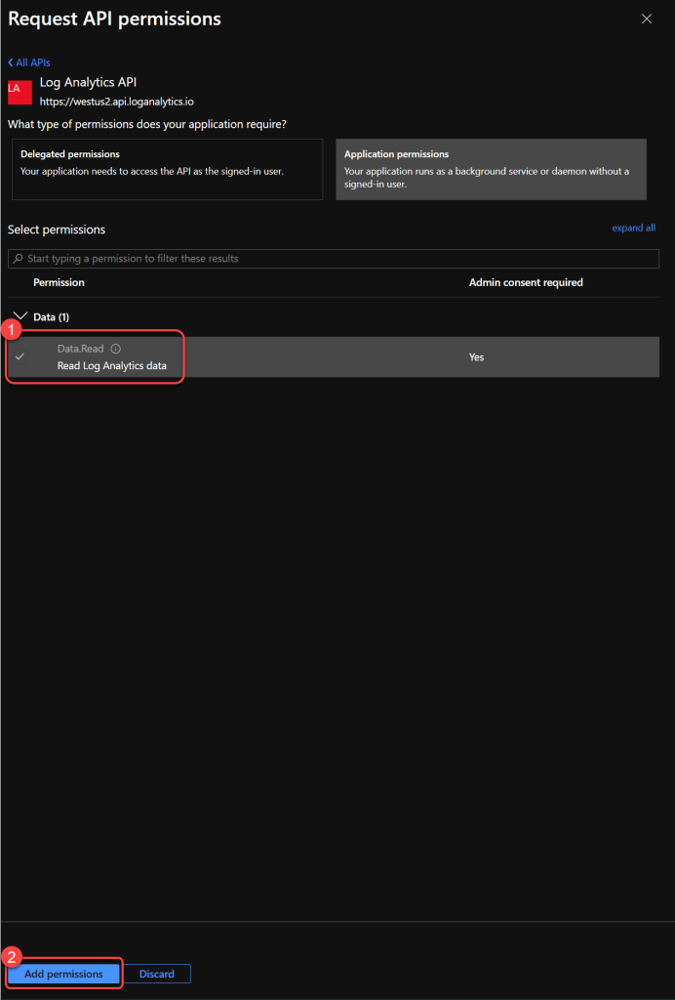
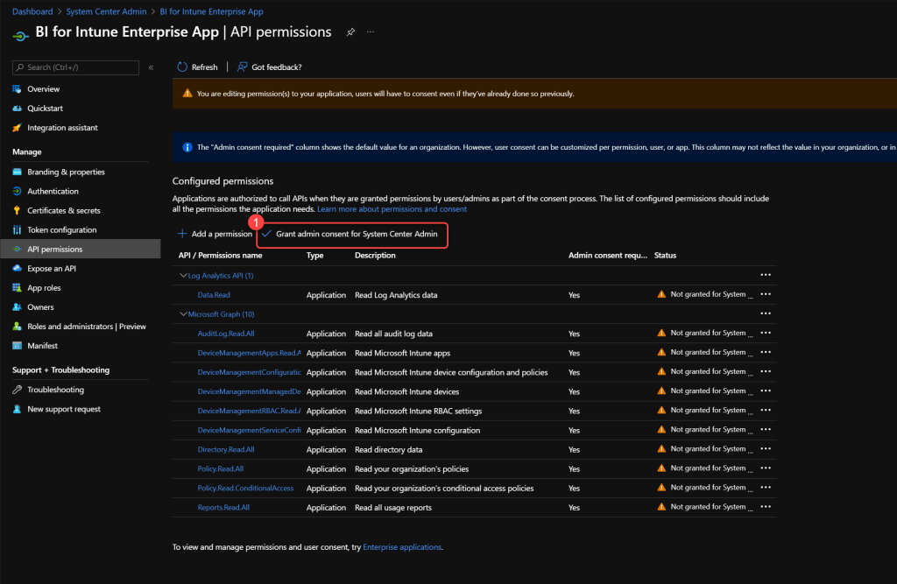
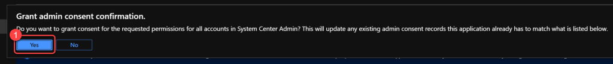

# Edit the Power BI App Registration for Log Analytics
Before Power BI can read custom inventory data from the Log Analytics workspace, you must add the **Log Analytics API** permissions to your **Power BI app registration** (the one created during the [BI for Intune installation](create-azure-ad-app-registration.md)).

!!! note
    These steps may have been performed when originally creating the app registration (Steps 15-19 of [Create Azure AD App Registration](create-azure-ad-app-registration.md)). If so, you can skip this page.

!!! info
    This is for the **Power BI app registration** only. The [inventory app registration](configure-log-analytics.md) (used by the collection scripts) does not need this permission.

**Prerequisites:** The user performing this step requires Global Admin and Subscription Admin rights.

### Step 1: Open App registrations in Azure

1. Login to **entra.microsoft.com** or **portal.azure.com** using a global administrator account.
1. Search for and select **App registrations**.
1. Select your **Power BI app registration** for BI for Intune. (**Note:** The name may vary from what is shown in this doc.)

### Step 2: Navigate to API Permissions

1. On the app registration page select **API Permissions**.

### Step 3: Add a new permission

1. Select **Add a permission**.

### Step 4: Select organization APIs

1. Select **APIs my organization uses**.

### Step 5: Select Log Analytics API

1. Search for **Log Analytics**.
1. Select **Log Analytics API**.

### Step 6: Select Application permissions

1. Select **Application Permissions**.

### Step 7: Add Data.Read permission

1. Select **Data.Read**.
1. Select **Add permissions**.

### Step 8: Grant admin consent

1. Select **Grant admin consent** for your tenant.

### Step 9: Confirm admin consent

1. Select **Yes** at the prompt.
1. You have now completed the steps required.

