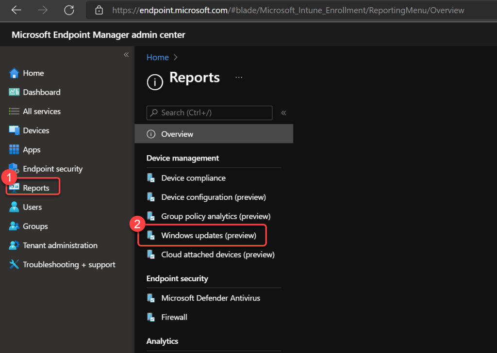
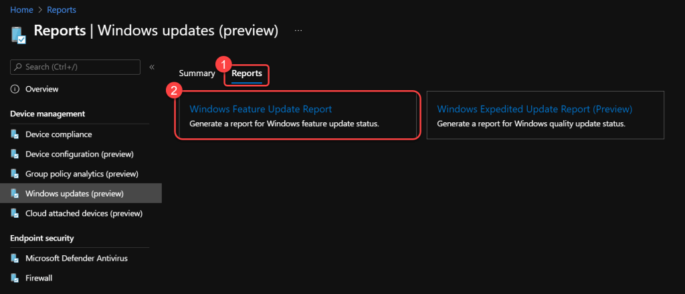
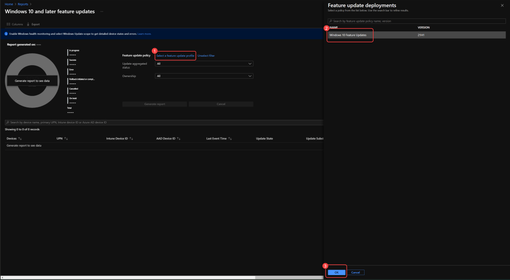
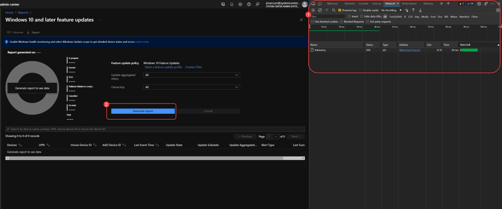
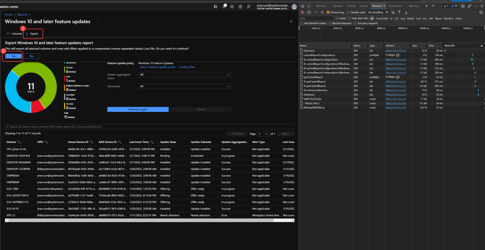
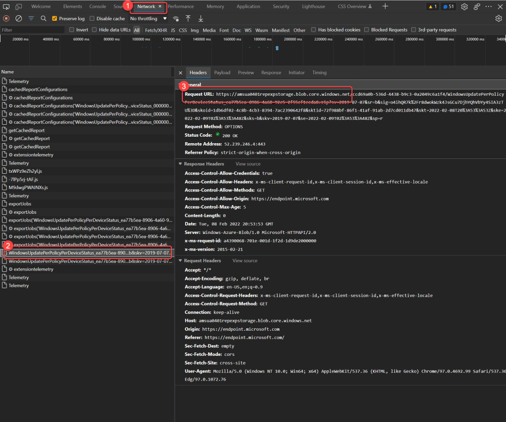
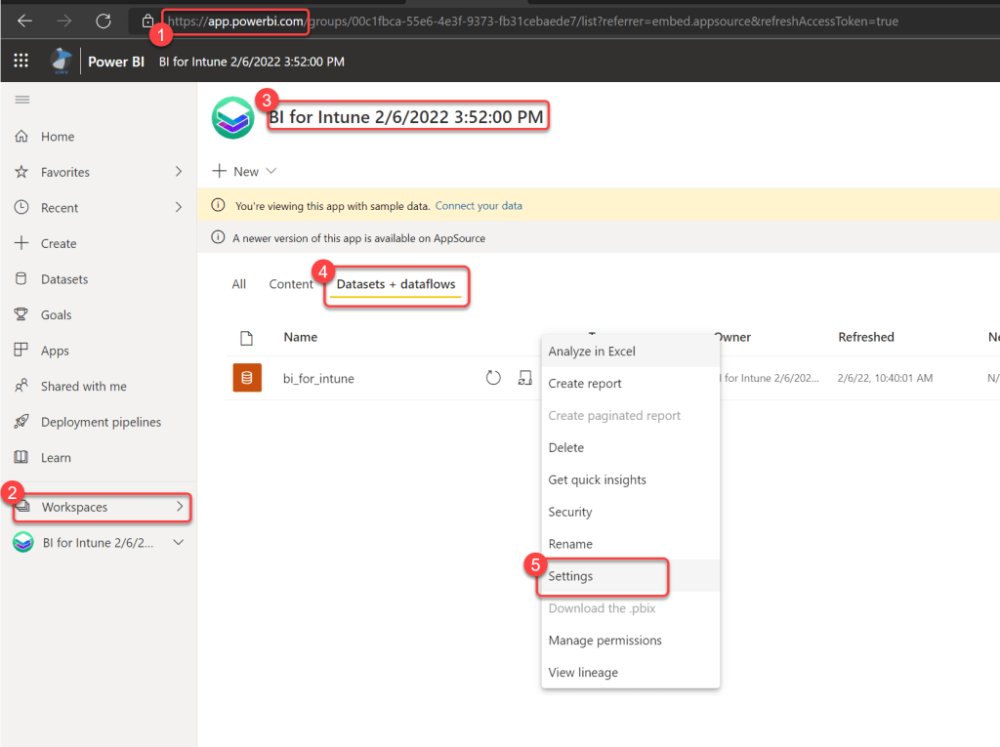
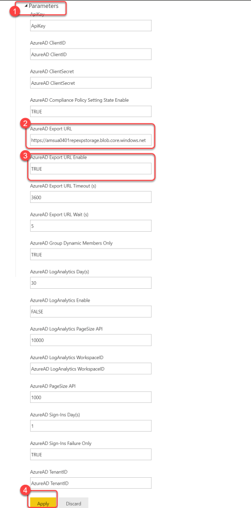

# Configure Intune Export API
Microsoft have migrated some of the data that BI for Intune uses to the new Intune Export API. Each region in which Microsoft host Intune has a unique download URL that is sent as a response to queries made against this API. For this reason we have introduced new dataset parameters that should be configured in order for this data be imported into Power BI. Configuring these parameters are not mandatory, however if you do not configure these parameters as described here BI for Intune will make a call to a redirect API owned by [Fatstacks](http://ec2-34-220-217-132.us-west-2.compute.amazonaws.com/wordpress/migrate-from-fatstacks-to-powerstacks-bi-for-intune/). The purpose of the redirect API is to automate locating the correct download URL for your Intune tenant and pass that URL back to BI for Intune in order to download content from the Export API to Power BI. No protected data is passed through Fatstacks if you leverage the redirect API. However, we recommend that customers follow this guide to bypass using our redirect API altogether.

### Step 1

1. In the **Intune console** select the **Reports** blade.
1. Select **Windows Updates (preview)**.

### Step 2

1. Select the **Reports** tab.
1. Select the **Windows Feature Update report**.

### Step 3

1. Select a **feature update profile**.
1. Select **Ok**.

### Step 4

1. Press **F12** to open the **developer pane** in your browser.
1. Select **Generate report**.

### Step 5

1. Select **Export**.
1. Select **Yes**at the prompt to export a .csv.

### Step 6

1. On the **Network tab** of the Developer pane in the browser watch for the the line starting with **WindowsUpdatePerPolicyPerDeviceStatus**.
1. Select the line starting with **WindowsUpdatePerPolicyPerDeviceStatus**, this will contain the the **Request URL**.
1. Copy the **Request URL**and save it for use later. It should look something like this, "**https://amsua0401repexpstorage.blob.core.windows.net**".

### Step 7

1. In **Power BI** go to the **BI for Intune workspace**.
1. Select the **dataset settings**.

### Step 8

1. Expand **Parameters**.
1. Enter the **Export URL** that you previously saved in the **AzureAD Export URL** parameter.
1. Enter **TRUE** in the **AzureAD Export URL Enable** parameter.
1. Select **Apply**.

