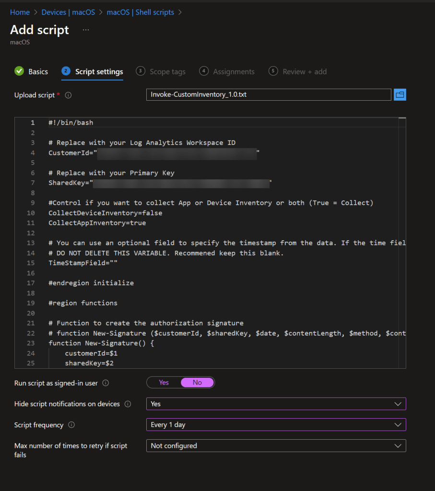

# macOS Inventory Script
Many customers have requested the ability to report on things that are either not collected or not accurately collected by Intune. In an effort to fill these gaps in we have implemented a custom solution to collect some of the most commonly requested items. It is highly likely that new features will be added to this script just as they have been added to its Windows counterpart. Keep an eye out for updates in upcoming releases. Currently the script collects:

1. Software installed on macOS devices.

This data is collected via a bash script, sent to a Log Analytics workspace, and then pulled into Power BI.

We created this script at the request of a customer. It collects the installed software from macOS and sends that to Log Analytics just like our PowerShell script does on Windows. You can deploy the script as a Shell script from Intune. Ideally the script should be run once per day on each device. This way any changes to the device get captured.

You can copy the bash script from our [GitHub](https://github.com/powerstacks-corp/Mac-Custom-Inventory) repository.

### Step 1: Configure the script for Log Ingestion API

1. Paste the **script** code into your favorite **script editor**.
1. Locate the line starting with **LogAPIMode** and ensure it is set to **"LogIngestionAPI"**.
1. Enter the following values from the [Create Inventory App Registration](create-inventory-app-registration.md) and [Deploy Custom Inventory Resources](configure-log-analytics.md) guides:
    - **TenantId** — Directory (Tenant) ID from [Create Inventory App Registration](create-inventory-app-registration.md)
    - **ClientId** — Application (Client) ID from [Create Inventory App Registration](create-inventory-app-registration.md)
    - **ClientSecret** — Client Secret Value from [Create Inventory App Registration](create-inventory-app-registration.md)
    - **DceURI** — Data Collection Endpoint URI from [Deploy Custom Inventory Resources](configure-log-analytics.md) Step 2
    - **DcrImmutableId** — DCR Immutable ID from [Deploy Custom Inventory Resources](configure-log-analytics.md) Step 2
1. Save the edited script.
### Step 2: Deploy the script in Intune

1. Create a **Shell Script** in Intune.
1. Run script as signed-in user: **No**.
1. Script frequency: **Every 1 day**.

