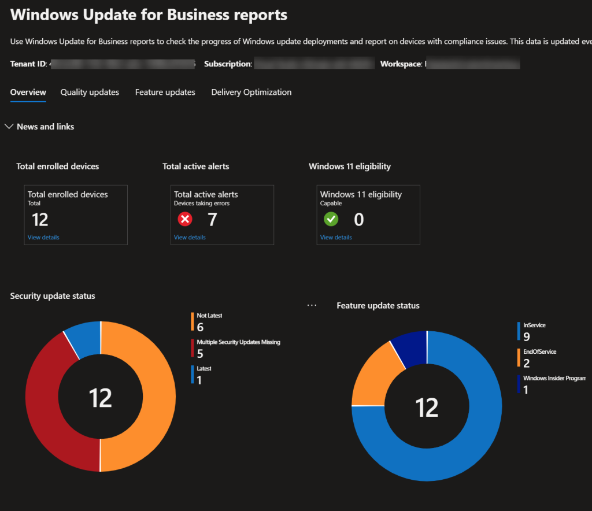
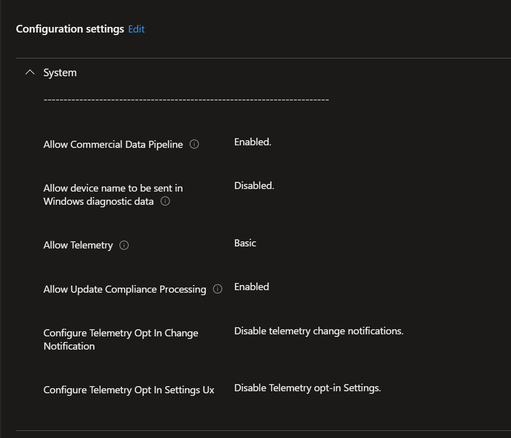
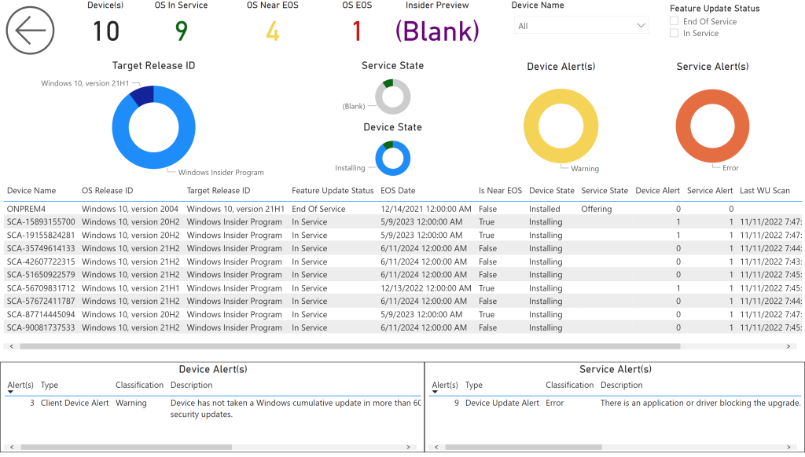

# Windows Update for Business Reports
Microsoft recommends that customers using Intune should onboard devices to [Windows Update for Business reports](https://techcommunity.microsoft.com/t5/windows-it-pro-blog/public-preview-of-azure-workbooks-for-update-compliance/ba-p/3601310) (formerly named "Azure Update Compliance") to monitor Windows Updates and patch compliance. We have made this data available in BI for Intune and have included Update Compliance Quality Updates and Update Compliance Feature Updates reports right out of the box. In order to populate the data for those reports you must onboard your devices to the new Windows Update for Business reports service.

Below are the high-level steps required to onboard devices to the service. I won't go into great details here because Microsoft has good documentation on this, but it is easy to overlook some of the steps so I will point them out here.

### Before You Begin

Choose the tab that matches your situation:

=== "Fresh start (no Log Analytics workspace)"

    You will need to:

    1. Complete **Steps 1 and 2** on this page to enable WUfB Reports in Azure and deploy the configuration profile. Microsoft's onboarding process will create the Log Analytics workspace.
    2. [Connect Power BI to Log Analytics](edit-azure-ad-app-registration.md) — Add the Log Analytics API permission to the Power BI app registration.
    3. [Dataset Settings for Log Analytics](dataset-settings-for-custom-inventory.md) — Enable Log Analytics and enter the Workspace ID in the Power BI dataset.

    !!! tip
        If you also plan to set up **Custom Inventory**, use the workspace created by WUfB Reports when you later [Deploy Custom Inventory Resources](configure-log-analytics.md) — select **Use an existing workspace** and point it to this workspace.

=== "Already have a workspace from Custom Inventory"

    Your Log Analytics workspace already exists. Complete **Steps 1 and 2** on this page to enable WUfB Reports and deploy the configuration profile. When selecting a workspace in Microsoft's guide, point it to your **existing** workspace.

    If you have already completed the [Log Analytics Setup](edit-azure-ad-app-registration.md) pages, no additional Power BI configuration is needed — WUfB data will automatically flow to the same workspace and appear in your reports on the next refresh.

=== "Already have a workspace from WUfB (adding Custom Inventory)"

    You're looking for the Custom Inventory guides. Head to [Create Inventory App Registration](create-inventory-app-registration.md) to get started, then [Deploy Custom Inventory Resources](configure-log-analytics.md) and select **Use an existing workspace** to add custom inventory to your existing WUfB Reports workspace.

### Step 1: Enable WUfB reports in Azure

1. Follow the [guide by Microsoft](https://learn.microsoft.com/en-us/windows/deployment/update/wufb-reports-enable) to Add Windows Update for Business reports to your Azure subscription.

### Step 2: Deploy the configuration profile

1. Follow the Microsoft documentation to create a [Configuration Profile in Intune](https://learn.microsoft.com/en-us/windows/deployment/update/wufb-reports-configuration-intune) and deploy to Windows computers.

### Step 3: Verify Power BI Log Analytics integration

If you have already completed the [Log Analytics Setup](edit-azure-ad-app-registration.md) pages, no further action is needed. If not, complete them now:

- [Connect Power BI to Log Analytics](edit-azure-ad-app-registration.md) — Add the Log Analytics API Data.Read permission to the Power BI app registration
- [Dataset Settings for Log Analytics](dataset-settings-for-custom-inventory.md) — Enable Log Analytics and enter the Workspace ID in the Power BI dataset

According to Microsoft you will start seeing data in about 24 hours however, we've had customers report that it took much longer.

### Step 4: View the WUfB reports data

1. Once the initial Windows Update for Business Reports data processing has completed you will see data in our "UC Quality Updates" and "UC Feature Updates" pages.

