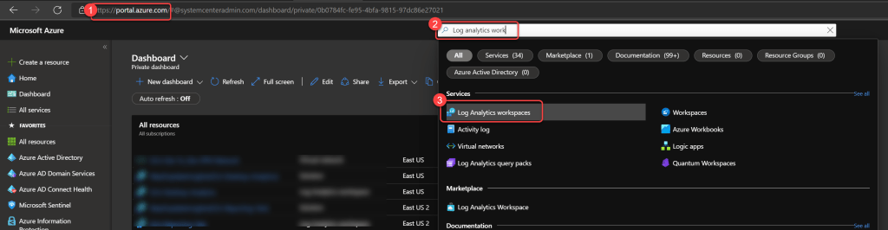
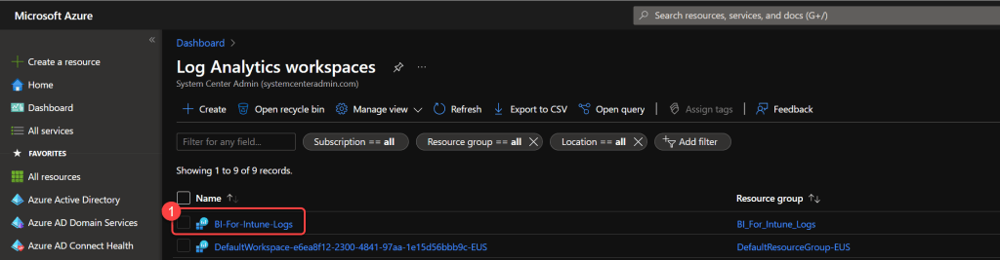
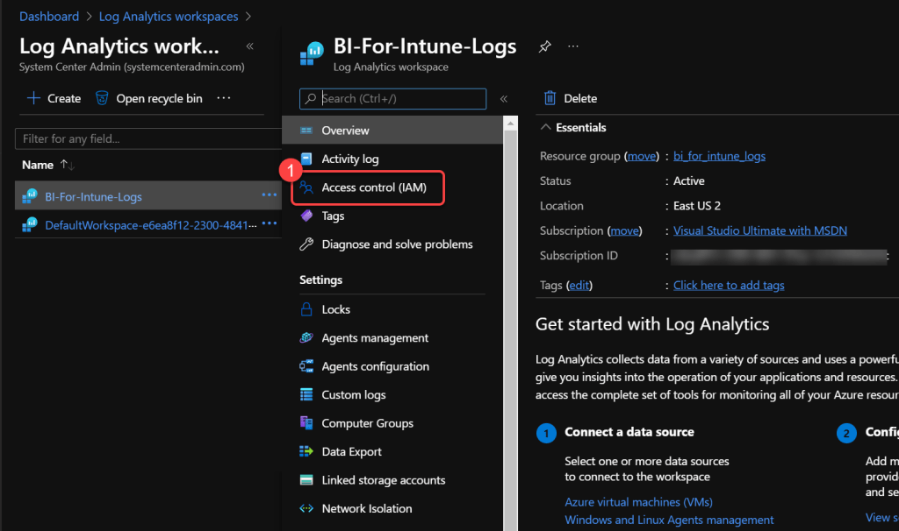
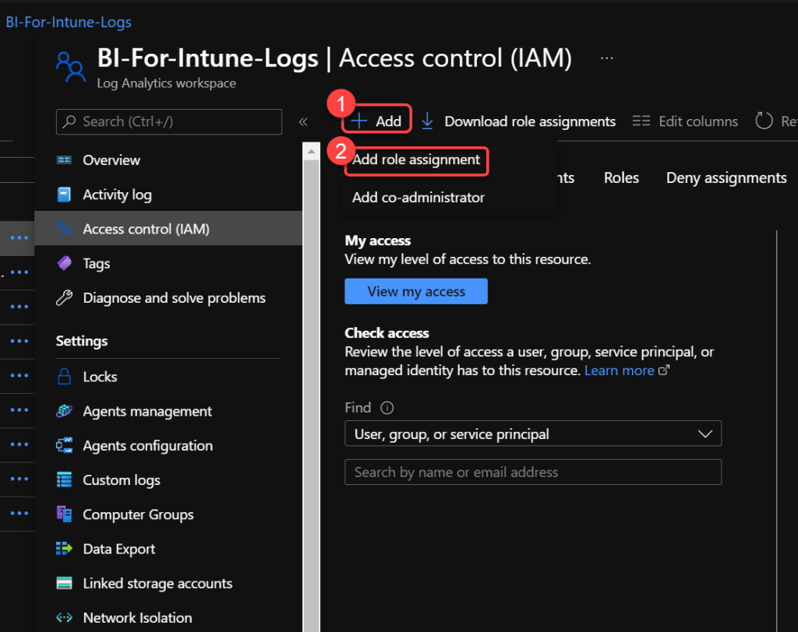
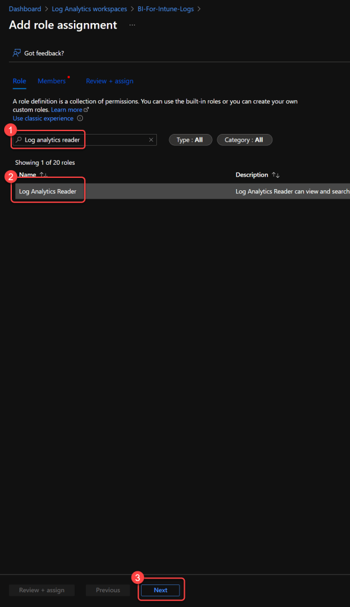
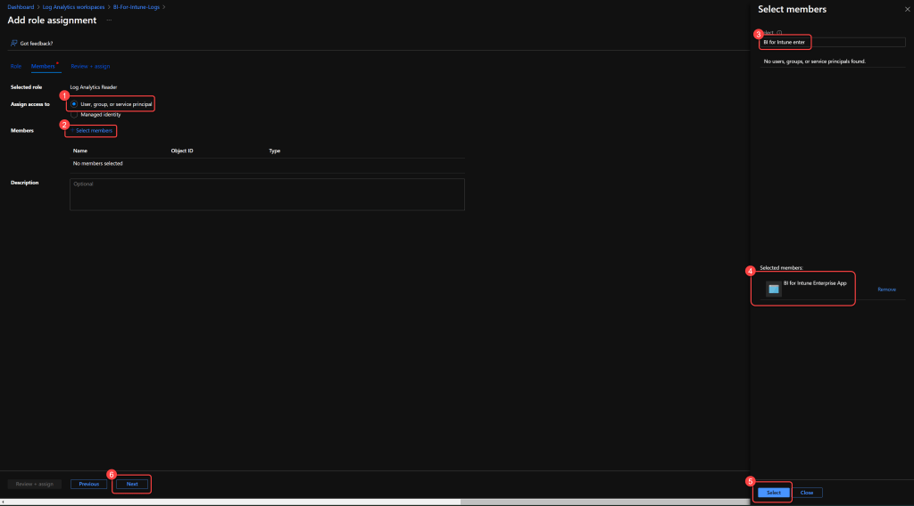

# Deploy Custom Inventory Resources
Log Analytics is a tool in the Azure portal to edit and run log queries. We leverage Log Analytics as an inexpensive storage medium for storing custom inventory data collected from Windows and macOS devices. This data is then synchronized to Power BI to be used in BI for Intune.

Custom inventory data is sent to Log Analytics using the **Azure Monitor Logs Ingestion API**. This requires deploying a set of Azure resources (Data Collection Endpoint, Data Collection Rule, and custom tables) which can be automated using our ARM template.

!!! info "Already have a Log Analytics workspace?"
    If you previously set up [WUfB Reports](../log-analytics/wufb-reports.md) and already have a Log Analytics workspace, select **Use an existing workspace** in Step 1 below and point it to that workspace. Custom inventory and WUfB Reports **must share the same workspace**.

**Prerequisites:**

1. You must have already [created the Inventory App Registration](create-inventory-app-registration.md) and recorded the **Enterprise App Object ID**.
2. The user deploying the ARM template requires **Owner** or **Contributor + User Access Administrator** on the target Azure subscription or resource group.

### Step 1: Deploy Azure Resources

1. Navigate to the [Enhanced Inventory Deploy](https://github.com/powerstacks-corp/EnhancedInventoryDeploy) repository on GitHub.
1. Select the **Deploy to Azure** button.
1. Select your target **Subscription** and **Resource group**.
1. Choose whether to **create a new** Log Analytics workspace or **use an existing** one.
1. When prompted for **Enterprise App Object Id**, paste the Object ID from the [Create Inventory App Registration](create-inventory-app-registration.md) guide.
1. Select **Review + create** and then **Create**.

!!! tip
    If you leave the Enterprise App Object Id field blank, the deployment will still succeed but you will need to manually assign the **Monitoring Metrics Publisher** role to your inventory app registration on the Data Collection Rule after deployment.

The deployment creates the following resources:

- **Log Analytics Workspace** (new or uses existing)
- **Custom tables**: `PowerStacksDeviceInventory_CL`, `PowerStacksAppInventory_CL`, `PowerStacksDriverInventory_CL`
- **Data Collection Endpoint (DCE)**
- **Data Collection Rule (DCR)**
- **RBAC role assignment** (if Enterprise App Object Id was provided)

### Step 2: Record Deployment Outputs

1. After the deployment completes, navigate to your **Resource group**.
1. Select **Deployments** from the left menu.
1. Select the completed deployment.
1. Select the **Outputs** tab.
1. Record the following values for later use:
    - **DceURI** — the Data Collection Endpoint URI
    - **DcrImmutableId** — the immutable ID of the Data Collection Rule

### Step 3: Assign Log Analytics Reader to the Power BI App Registration

In this step you assign the **Log Analytics Reader** role to your **Power BI app registration** so that Power BI can read the custom inventory data from the workspace.

1. In the **Azure portal** search for, and select, **Log Analytics workspaces**.

1. Select the **Log Analytics workspace** where you deployed the custom inventory resources.

1. Select **Access control (IAM)**.

1. Select **Add** > **Add role assignment**.

1. Search for and select **Log Analytics Reader**, then select **Next**.

1. Select **Assign access** to: **User, group, or service principal**.
1. Select **+Select Members**.
1. Search for and select the name of the **Power BI App Registration** (the one created when you installed BI for Intune — not the inventory app registration).
1. Select **Next**, then **Review and assign**.

### Step 4: Record the Workspace ID

1. Open the **Log Analytics workspace** in the Azure portal.
1. On the **Overview** page (or **Properties**), locate and record the **Workspace ID**.
1. This value is needed for the [Dataset Settings for Log Analytics](../log-analytics/semantic-model-settings-for-log-analytics.md).

!!! note
    The Workspace Primary Key is no longer needed. The inventory scripts now authenticate using the Logs Ingestion API with the app registration credentials from the [Create Inventory App Registration](create-inventory-app-registration.md) guide.

### Summary

You should now have the following values recorded:

| Value | Source | Used In |
|-------|--------|---------|
| **Tenant ID** | [Inventory App Registration](create-inventory-app-registration.md) | [Windows](windows-inventory-collection-script.md) / [macOS](macos-inventory-collection-script.md) inventory scripts |
| **Client ID** | [Inventory App Registration](create-inventory-app-registration.md) | [Windows](windows-inventory-collection-script.md) / [macOS](macos-inventory-collection-script.md) inventory scripts |
| **Client Secret** | [Inventory App Registration](create-inventory-app-registration.md) | [Windows](windows-inventory-collection-script.md) / [macOS](macos-inventory-collection-script.md) inventory scripts |
| **DceURI** | Step 2 — Deployment Outputs | [Windows](windows-inventory-collection-script.md) / [macOS](macos-inventory-collection-script.md) inventory scripts |
| **DcrImmutableId** | Step 2 — Deployment Outputs | [Windows](windows-inventory-collection-script.md) / [macOS](macos-inventory-collection-script.md) inventory scripts |
| **Workspace ID** | Step 4 — Log Analytics Workspace | [Dataset Settings for Log Analytics](../log-analytics/semantic-model-settings-for-log-analytics.md) |

### Next Steps

- **Deploy inventory scripts:** [Windows Inventory Collection Script](windows-inventory-collection-script.md) or [macOS Inventory Collection Script](macos-inventory-collection-script.md)
- **Connect Power BI to Log Analytics:** If you haven't already, complete the [Log Analytics Setup](../log-analytics/edit-entra-app-registration.md) pages to allow Power BI to read data from the workspace.
- **Also setting up WUfB Reports?** See [WUfB Reports](../log-analytics/wufb-reports.md). The workspace you created (or selected) above will be shared.
