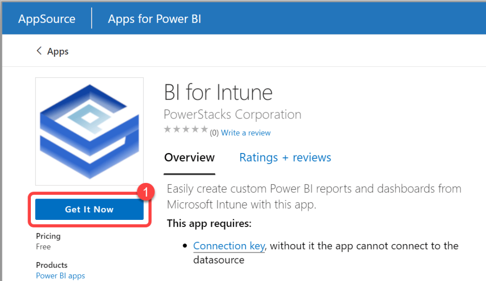
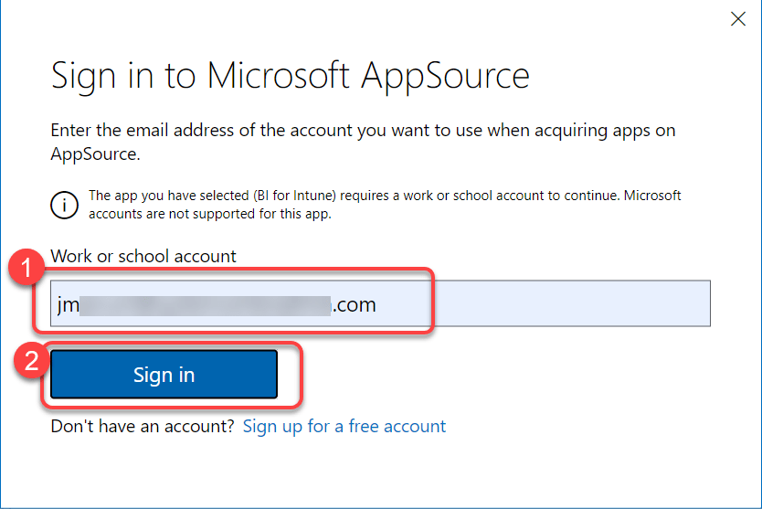
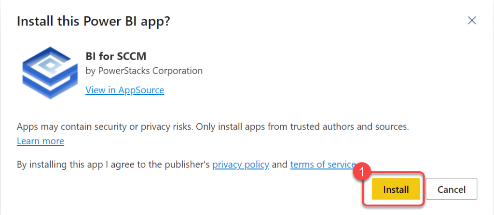
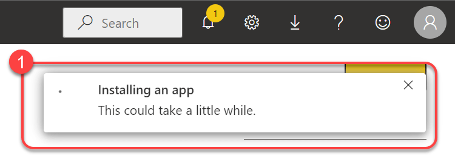
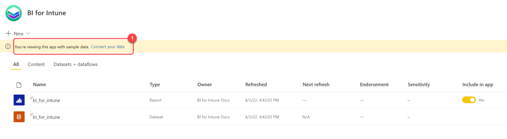

# Install BI for Intune

BI for Intune installs from the Microsoft Marketplace directly into your Power BI tenant. No on-premises infrastructure is required. After installing, you can preview the app with sample data or [request a 30-day trial license](request-a-license.md) to connect your own data.

## Prerequisites

- A Power BI Pro license, Power BI Premium Per User license, or a Power BI tenant licensed for Power BI Premium. Microsoft offers a free Power BI Pro trial license via self-service sign-up for those who want to [try BI for Intune](request-a-license.md) before purchasing Microsoft licenses.
- Permissions to create an app registration in Microsoft Entra ID. Required to configure the trial.

## Step 1: Install BI for Intune from the Microsoft Marketplace

[Install Now :material-open-in-new:](https://marketplace.microsoft.com/en-us/product/powerstackscorporation1641419080242.biforintune?tab=Overview){ .md-button .md-button--primary }

1. On the **BI for Intune** page in the Microsoft Marketplace, select **Get it now**.
   
1. Enter your **work email address** and select **Sign in**.
   
1. Select **Install**.
   
1. Wait for the installation to complete. When it finishes successfully, a notification tells you that your new app is ready.
   

## Step 2: View the app with sample data

The app installs with sample data so you can preview the reports immediately.

1. In the Power BI service, open the **BI for Intune** app from your **Apps** list.
1. A banner across the top says, "**You're viewing this app with sample data. Connect your data**." Ignore this banner while you preview the reports. To connect your own data, [request a trial license key](request-a-license.md) and continue with the setup guide.
   
