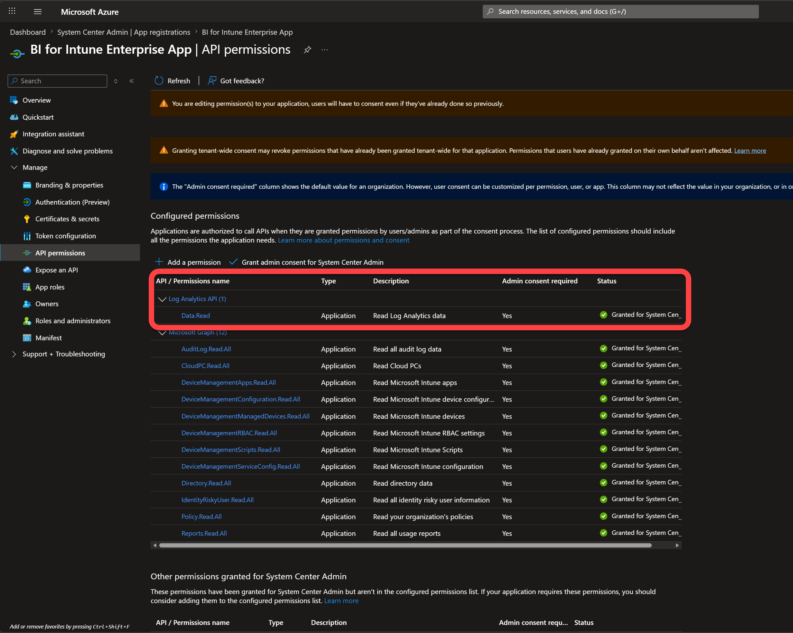
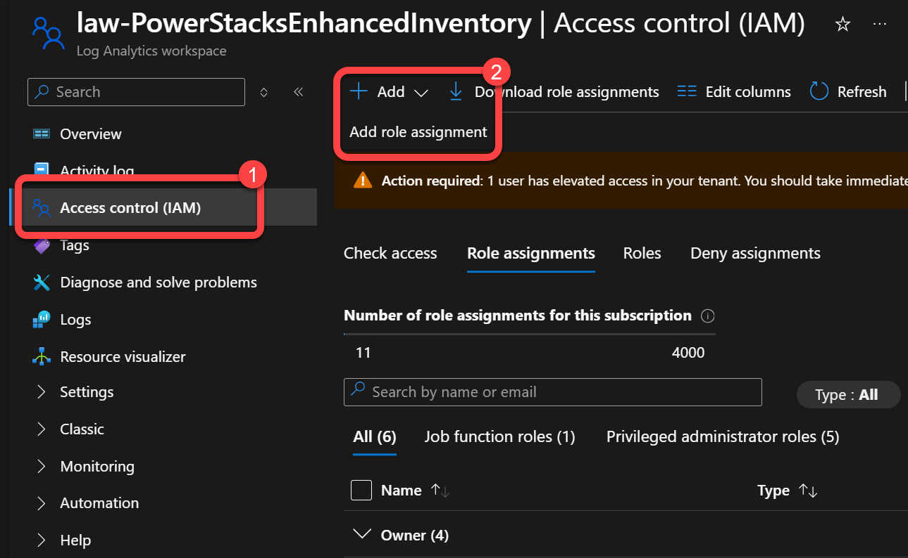
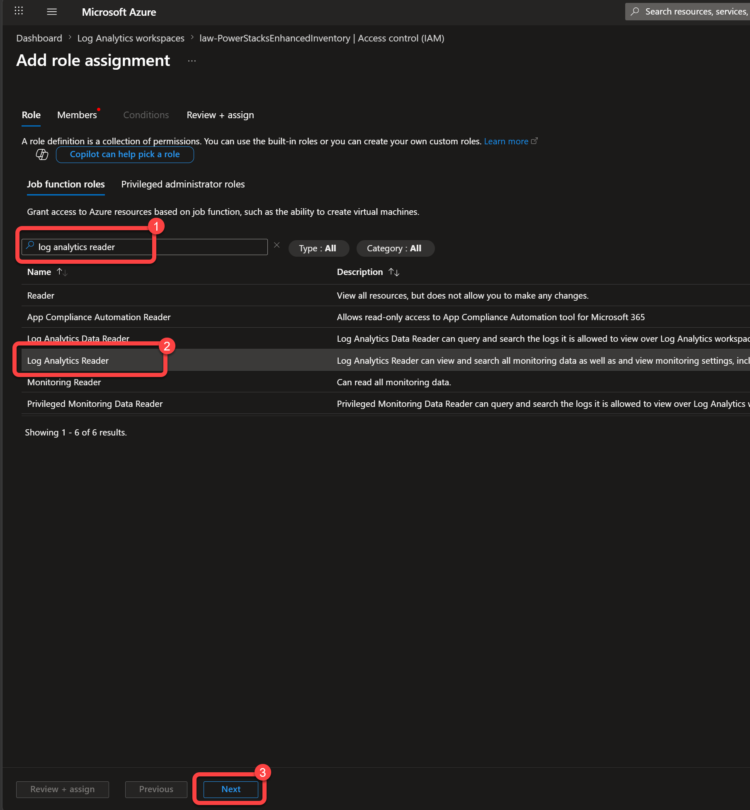
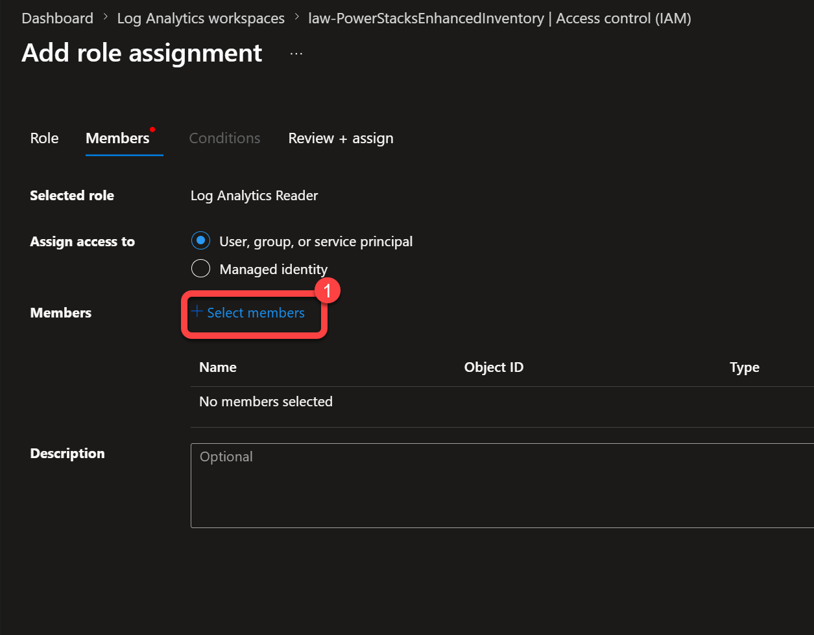
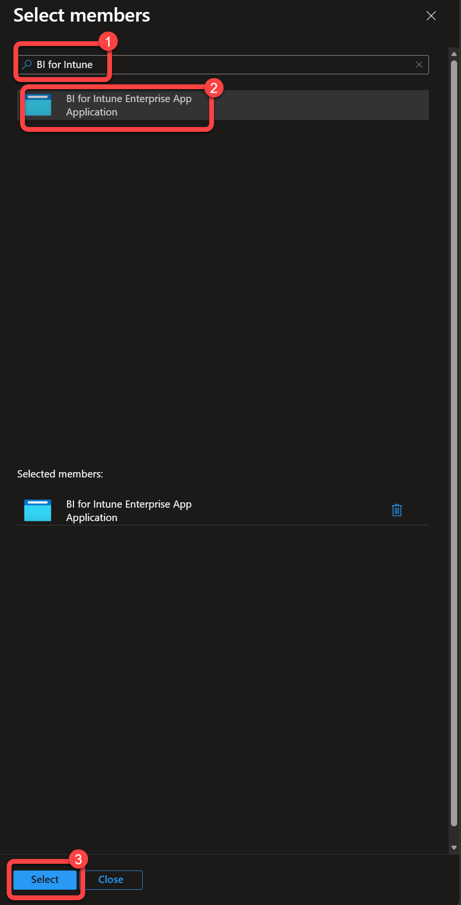
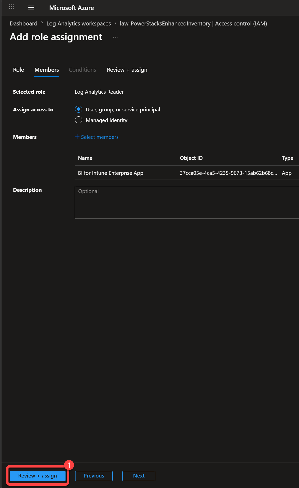
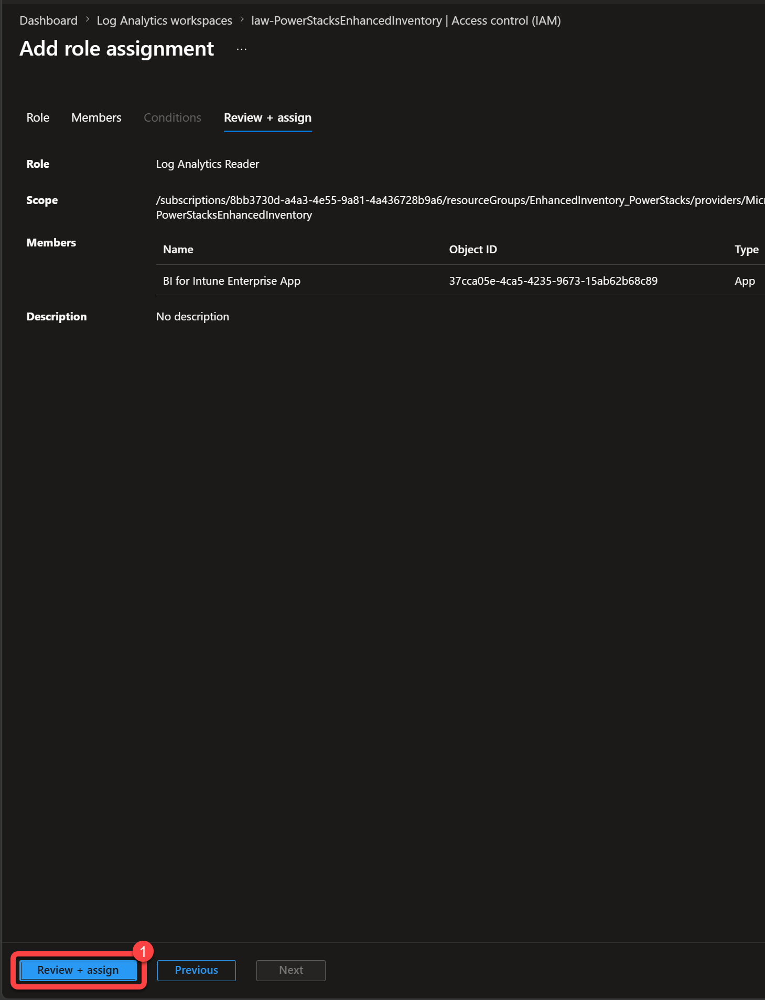
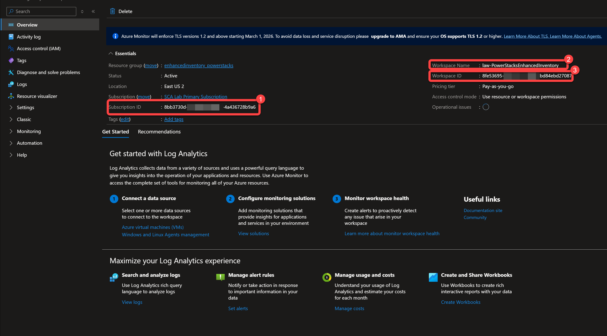

# Set up the Log Analytics workspace

Two BI for Intune data sources read from an Azure Log Analytics workspace: [Windows Update for Business reports](wufb-reports.md) and [Enhanced Inventory](../custom-inventory.md). Both read from the **same** workspace, so you only ever need one.

For BI for Intune to read that data, three things have to be in place:

- A Log Analytics workspace.
- The **Log Analytics API Data.Read** permission on the BI for Intune app registration.
- The **Log Analytics Reader** role granted to that app registration on the workspace.

This page is the single place those are configured. The Windows Update for Business reports and Enhanced Inventory pages both point back here.

!!! note "Already set up Windows Update for Business reports?"
    Do not create a new workspace. Enrolling in Windows Update for Business reports already created one, and both add-ons must read from the same workspace. Skip Step 1 and go to [Step 2](#step-2-add-the-log-analytics-permission-to-the-app-registration) to add the Data.Read permission to the app registration, then [Step 3](#step-3-grant-the-app-registration-read-access-to-the-workspace) to grant it the Log Analytics Reader role on the workspace you already have.

## Step 1: Create a Log Analytics workspace

Skip this step if you already have a workspace, including one created by Windows Update for Business reports. Both add-ons share a single workspace.

1. Sign in to the [Azure portal](https://portal.azure.com).
1. Search for and select **Log Analytics workspaces**.
1. Select **Create**.
1. Choose a **Subscription** and **Resource group**, enter a **Name**, and choose a region. If you plan to use Windows Update for Business reports, pick a [region that service supports](https://learn.microsoft.com/en-us/windows/deployment/update/wufb-reports-prerequisites#log-analytics-regions).
1. Select **Review + create**, then **Create**.

For the full Microsoft procedure, see [Create a Log Analytics workspace](https://learn.microsoft.com/en-us/azure/azure-monitor/logs/quick-create-workspace).

## Step 2: Add the Log Analytics permission to the app registration

The BI for Intune app registration needs the **Log Analytics API Data.Read** application permission so it can call the Log Analytics API.

!!! note "May already be done"
    This permission is also part of the [app registration setup](../setup-guide/create-entra-app-registration.md#step-3-add-log-analytics-permissions). If you added it there, confirm it is present and granted, then continue to Step 3.

1. In the [Azure portal](https://portal.azure.com), go to **Microsoft Entra ID** > **App registrations** and open your BI for Intune app registration.
1. Select **API permissions** > **Add a permission** > **APIs my organization uses**.
1. Search for and select **Log Analytics API**.
1. Select **Application permissions**, select **Data.Read**, and select **Add permissions**.
1. Select **Grant admin consent** and confirm.

When complete, the **Log Analytics API** shows **Data.Read** with admin consent granted, alongside the Microsoft Graph permissions.

## Step 3: Grant the app registration read access to the workspace

The Data.Read permission lets the app call the Log Analytics API, but it does not grant access to any specific workspace. Assign the **Log Analytics Reader** role to the BI for Intune app registration on the workspace. Without it, data flows into the workspace but the BI for Intune dashboards stay blank.

1. In the [Azure portal](https://portal.azure.com), go to **Log Analytics workspaces** and select your workspace. Select **Access control (IAM)**, then **Add** > **Add role assignment**.

    

1. On the **Role** tab, search for **Log Analytics Reader**, select it, and select **Next**.

    

1. On the **Members** tab, leave **Assign access to** set to **User, group, or service principal**, then select **Select members**.

    

1. Search for your BI for Intune app registration by name, select it, and select **Select**.

    

1. Select **Review + assign**.

    

1. Select **Review + assign** again to confirm the assignment.

    

## Step 4: Record the workspace ID

You need the **Workspace ID** when you connect BI for Intune to the workspace in the semantic model parameters.

1. In the Azure portal, open your **Log Analytics workspace** and select **Overview**.
1. Record the **Workspace ID**. Note the **Subscription** and **Workspace Name** for reference.

Use this **Workspace ID** for the **AzureAD LogAnalytics WorkspaceID** parameter when you set up [Windows Update for Business reports](wufb-reports.md) or [Enhanced Inventory](../custom-inventory.md).

!!! note "Enhanced Inventory uses a second application"
    Enhanced Inventory also uses a separate application that *writes* data to the workspace: an Enterprise Application granted the **Monitoring Metrics Publisher** role on the Data Collection Rule. That is different from the BI for Intune app registration configured here, which *reads* the workspace. The write side is set up in [Set up Enhanced Inventory](../custom-inventory.md).
