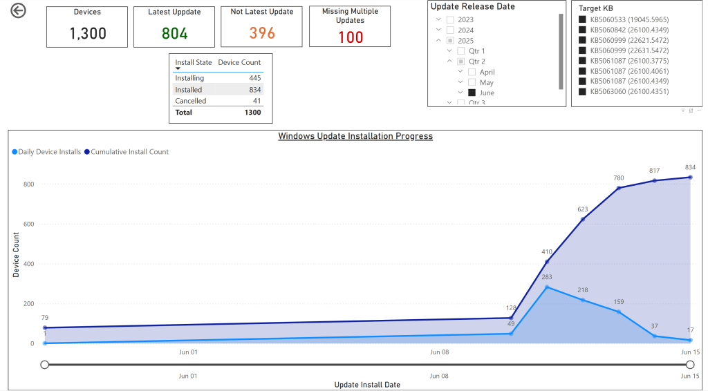
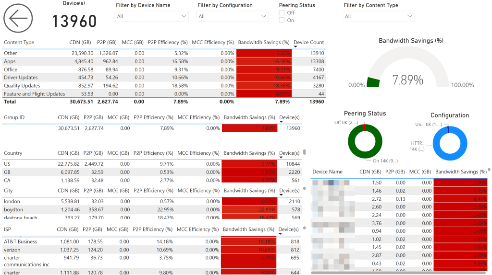
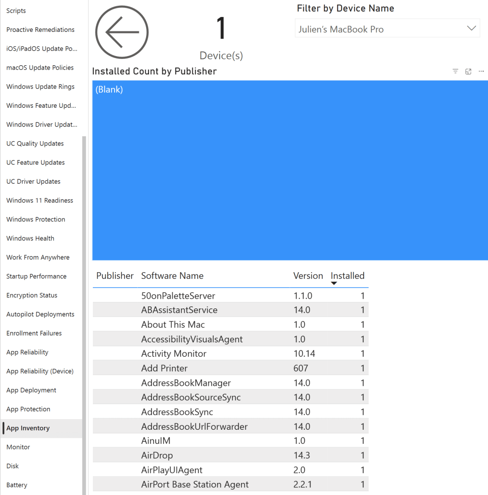
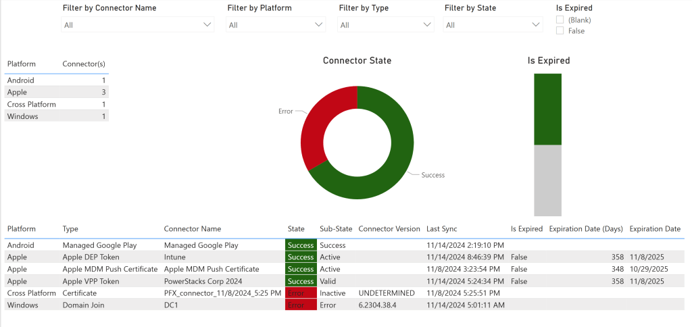

# BI for Intune Release Notes

## Version 65.0 Feb. 21, 2026

# What's New in BI for Intune v65
**Release Date**: February 21, 2026
**App Source Version**: 1057

BI for Intune v65 introduces expanded authentication reporting capabilities.

This release adds the new User Sign-Ins Auth Details object, providing deeper visibility into authentication methods, requirements, and outcomes.

These enhancements support improved investigation and reporting of user sign-in activity across your environment.


# Version 65.0 Release Details


### New Features

- Added new object **User Sign-Ins Auth Details** to provide expanded visibility into authentication activity and sign-in requirements.

### Semantic Model Changes

- Added new fields to the **User Sign-Ins Auth Details** object: Authentication Date, Authentication Date (Days), Authentication Method, Authentication Method Detail, Requirement, Result Detail, Succeeded.

### Important Notes

- Always [backup your custom reports](backup-custom-reports.md) before upgrading!

---

## Version 64.0 Feb. 15, 2026

# What's New in BI for Intune v64
**Release Date**: February 15, 2026
**App Source Version**: 1056

BI for Intune v64 introduces expanded Microsoft Defender for Endpoint and Microsoft Entra ID risk visibility.

This release adds the new User Risk object and Risky Users page, providing insight into user risk posture and sign-in risk state. It also enhances Windows Protection reporting with additional onboarding and sensor status fields.

Improved sync reliability and updated policy reporting ensure more accurate visibility across devices and users.

**Important Notes:**

- [**Action Required**] This version requires an additional Microsoft Graph permission to be added to the app registration in **Microsoft Entra ID**. Please add **Read.All**. Without this permission, the **Risky Users** page and related sync processes will not populate properly. Update your installation documentation to include this permission.
- Several customers have recently reported upgrade failures resulting in the loss of their custom reports. Please do not forget to [backup before you upgrade](backup-custom-reports.md)!


# Version 64.0 Release Details


### Product Enhancements

- Updated the **Configuration Policy** data to ensure all policy types are properly displayed, including Elevation settings policy and Local user group membership.
- Updated the **Windows Protection** data source for improved reliability and completeness.
- Added new fields to the **Device Info** page: **OS Quality Update Version**, **OS Quality Update Release Date**, and **OS Quality Update Type** to improve visibility into Windows servicing status.
- Updated the **Windows Protection** page filters by removing **Filter by ATP Status** and adding **Filter by MDE Onboarding Status**.
- Added new fields to the **User** object: Last Interactive Sign-In, Last Interactive Sign-In (Days), Last Non-Interactive Sign-In, Last Non-Interactive Sign-In (Days), Last Successful Sign-In, Last Successful Sign-In (Days).
- Updated the **Group** object to include **Distribution** as a supported **Group Type**.
- Added **Risk State** and **Risk Level** to the **Sign-Ins** page main table and added related filters to improve visibility into sign-in risk posture.

### New Features

- Added new object **User Risk** to provide visibility into user risk posture and remediation status.
- Added new page **Risky Users** to support reporting on Microsoft Entra ID risky users.

### Semantic Model Changes

- Removed object **Windows Defender ATP** and associated fields: ATP Compliant, ATP Conflict, ATP Error, ATP Non Compliant, ATP Not Applicable, ATP Not Assigned, ATP Remediated, ATP State, ATP Status, ATP Unknown.
- Added new fields to the **Windows Protection** object: Critical Failure, MDE Can Be Onboarded, MDE Failed, MDE Insufficient Info, MDE Not Onboarded, MDE Onboarded, MDE Onboarding Status, MDE Sensor State, MDE Unsupported, Pending Full Scan, Pending Manual Steps, Pending Offline Scan, Pending Reboot, Tamper Protection Enabled.
- Added new object **User Risk** with fields: Risk Lasted Updated, Risk Lasted Updated (Days), User Risk Count, User Risk Level, User Risk Level Hidden, User Risk Level High, User Risk Level Low, User Risk Level Medium, User Risk Level None, User Risk Level Unknown Future Value, User Risk State, User Risk State At Risk, User Risk State Confirmed Compromised, User Risk State Confirmed Safe, User Risk State Dismissed, User Risk State None, User Risk State Remediated, User Risk State Unknown Future Value.
- Added new fields to the **User Sign-Ins** object: Sign-In Risk Level, Sign-In Risk Level Hidden, Sign-In Risk Level High, Sign-In Risk Level Low, Sign-In Risk Level Medium, Sign-In Risk Level None, Sign-In Risk Level Unknown Future Value, Sign-In Risk State, Sign-In Risk State At Risk, Sign-In Risk State Confirmed Compromised, Sign-In Risk State Confirmed Safe, Sign-In Risk State Dismissed, Sign-In Risk State None, Sign-In Risk State Remediated, Sign-In Risk State Unknown Future State.

### Bug Fixes

- Resolved an issue where some **Configuration Policy** types were not appearing in reports.

### Important Notes

- [**Action Required**] This version requires an additional Microsoft Graph permission to be added to the app registration in **Microsoft Entra ID**. Please add **Read.All**. Without this permission, the **Risky Users** page and related sync processes will not populate properly. Update your installation documentation to include this permission.
- Removed the **Windows Defender ATP** Custom reports referencing ATP fields must be updated to use **Windows Protection** fields.
- Microsoft Graph API instability (HTTP 503/504) continues to affect some tenants intermittently. The new **"AzureAD Application Assignment Enable"** parameter provides a temporary workaround. Please contact us if you have this issue. We need more support cases opened with Microsoft so they will prioritize resolving this!
- Always [backup your custom reports](backup-custom-reports.md) before upgrading!

---

## Version 63.0 Jan. 8, 2026

# What's New in BI for Intune v63
**Release Date**: January 8, 2026
**App Source Version**: 1055

Version 63 brings additional configuration profile type data to BI for Intune.

**Important Notes:**
Several customers have recently reported upgrade failures resulting in the loss of their custom reports. Please do not forget to [backup before you upgrade](backup-custom-reports.md)!


# Version 63.0 Release Details


### Product Enhancements

- N/A

### New Features

- Added Endpoint Security **Configuration Policy** types to the data model. Policy types include:**App and Browser Isolation**
- **App Control for Business**
- **BitLocker**
- **Microsoft Defender Antivirus**
- **Endpoint Detection and Response**
- **Windows Firewall**
- **macOS FileVault**

### Bug Fixes

- N/A

### Semantic Model Changes

- Extended the data model to include Endpoint Security **Configuration Policy** objects.

### Important Notes

- Microsoft Graph API instability (HTTP 503/504) continues to affect some tenants intermittently. The new **"AzureAD Application Assignment Enable"** parameter provides a temporary workaround. Please contact us if you have this issue. We need more support cases opened with Microsoft so they will prioritize resolving this!
- Always [backup your custom reports](backup-custom-reports.md) before upgrading!

---

## Version 62.0 Jan 4, 2026

# What's New in BI for Intune v62
**Release Date**: January 4, 2026
**App Source Version**: 1054

Version 62 adds a new data source, the "Windows Distribution Report" data from Intune, to provide greater details about installed Windows versions.

**Important Notes:**
Several customers have recently reported upgrade failures resulting in the loss of their custom reports. Please do not forget to [backup before you upgrade](backup-custom-reports.md)!


# Version 62.0 Release Details


### Product Enhancements

- Windows devices managed by **MAM-WE** now display a friendly **Device Type** of **“Windows”** instead of **“1”**.

### New Features

- Added a new data source: **Windows Distribution Report**.
- Added new fields under the **Device** category (sourced from **Windows Distribution Report**):Device Tag
- OS Build Number
- OS Build Revision
- OS Quality Update Release Date
- OS Quality Update Release Date (Months)
- OS Quality Update Type
- OS Quality Update Version
- WU Distribution Enrolled
**“OS Release ID”** in the **Device** category is now populated by **Windows Distribution Report** data.Added a new **Device Tag** category to the model with a new field:
- **Tag** *(Note: This is only populated for Windows devices.)*
Changes to the **Device Info** page:
- Added **OS Quality Update Version**
- Added **OS Quality Update Release Date**
- Added **OS Quality Update Type**

### Bug Fixes

- N/A

### Semantic Model Changes

- Added new **Device** fields sourced from the **Windows Distribution Report**:Device Tag
- OS Build Number
- OS Build Revision
- OS Quality Update Release Date
- OS Quality Update Release Date (Months)
- OS Quality Update Type
- OS Quality Update Version
- WU Distribution Enrolled
**“OS Release ID”** in the **Device** category is now populated by **Windows Distribution Report** data.Added a new **Device Tag** category with the new **Tag** field *(Windows devices only)*.
### Important Notes

- Microsoft Graph API instability (HTTP 503/504) continues to affect some tenants intermittently. The new **"AzureAD Application Assignment Enable"** parameter provides a temporary workaround. Please contact us if you have this issue. We need more support cases opened with Microsoft so they will prioritize resolving this!
- Always [backup your custom reports](backup-custom-reports.md) before upgrading!

---

## Version 61.0 Oct. 28, 2025

# What's New in BI for Intune v61
**Release Date**: October 27, 2025
**App Source Version**: 1053

Version 61 mainly brings improved stability and better synchronization performance to BI for Intune.

**Important Notes:**
Several customers have recently reported upgrade failures resulting in the loss of their custom reports. Please do not forget to [backup before you upgrade](backup-custom-reports.md)!


# Version 61.0 Release Details


### Product Enhancements

- Added a retry function for all API calls that use redirects to improve reliability in unstable network conditions.
- Updated the **"Device Timeline Event"** parameter — default value is now **-1 (Disabled)** instead of **7 days**, to prevent unnecessary calls for customers not using Intune Advanced Analytics.

### New Features

- N/A

### Bug Fixes

- Added a new parameter "**AzureAD Application Assignment Enable"** *(Default:**TRUE**)* to disable **"Application Assignment"** data collection in environments where the Microsoft Graph API intermittently returns 503 or 504 errors.
- Fixed issue in **"Autopilot Enrollment"** where some Autopilot devices were missing their assigned profiles.
- Resolved issues with parameters **"AzureAD Group Members Filter Starts With"** and **"AzureAD Group Members Nested Crawler Enable"**, which previously caused timeouts.
- Updated the [**Custom Inventory for Windows**](https://github.com/PowerStacks-BI/Windows-Custom-Inventory) script to resolve a bug in the driver matching process.

### Semantic Model Changes

- Updated the **"Compliance State Device”** object — removed summarization on **"Update Installed Time (Days)"** and **"Update Release Time (Days)"** for more granular reporting.
- Updated the **"Authorization"** object to include a new **"Viewer Email"** field.
- Renamed object “Renamed object **"User Proxy Addresses"** to **"User Proxy Address"** for naming consistency.

### Important Notes

- Microsoft Graph API instability (HTTP 503/504) continues to affect some tenants intermittently. The new **"AzureAD Application Assignment Enable"** parameter provides a temporary workaround. Please contact us if you have this issue. We need more support cases opened with Microsoft so they will prioritize resolving this!
- If you have existing custom reports referencing the renamed object **"User Proxy Addresses"**, you must update them to use **"User Proxy Address"**.
- Always [backup your custom reports](backup-custom-reports.md) before upgrading!

---

## Version 60.0 June 14, 2025

# What's New in BI for Intune v60
**Release Date**: June 14, 2025
**App Source Version**: 1052

Version 60 brings some very exciting new features. Most notably the ability to track actions over time. We've added measures added new fields and measures for tracking device enrollments, OS installations, and cumulative update installations over time.  This will be very handy for reporting on how many days it takes to reach compliance after updates are released, tracking the progress of migrating to Intune, and/or tracking the progress of migrating to a new OS version.

**Important Notes:**
Several customers have recently reported upgrade failures resulting in the loss of their custom reports. Please do not forget to [backup before you upgrade](backup-custom-reports.md)!


# Version 60.0 Release Details


### Product Enhancements

- For "**Startup Performance**" data we now use the Export API instead of Graph. This will improve sync performance times.
- For "**Device Enrollment Failure**" data we now use the Export API instead of Graph. This will improve sync performance times.
- For "**Proactive Remediation State**" data we now use the Export API instead of Graph. This will improve sync performance times.
- The [Custom Inventory Script for Windows](windows-inventory-collection-script.md) has been updated to include HP warranty information. (**Note**: In our testing the HP API has shown to be highly unreliable so it might take a while to get inventory data back for all of your HP devices.)
- The **Custom Inventory Script for Windows** now caches warranty data to a .json file locally on each device so that it is no longer necessary to call the warranty API's monthly.

### New Features

- Added the ability to track device enrollments per day.
- Added the ability to track cumulative update installations per day.
- Added the ability to track Windows OS installations per day. (**Note**: OS Install date is updated during feature updates as well as Windows upgrades)

### Bug Fixes

- Renamed "**Battery Design Capacity (MWh)**" to "**Battery Design Capacity (mWh)**" on the "**Device Details**" object. (**Note**: This is a breaking change. Please see the important notes section.)
- Renamed "**Battery Full Charge Capacity (MWh)**" to "**Battery Full Charge Capacity (mWh)**" on the "**Device Details**" object. (**Note**: This is a breaking change. Please see the important notes section.)

### Semantic Model Changes

- Added “**Autopilot ID**” column to the “**Device**” object. This is the “**ID**” column returned by the “**windowsAutopilotDeviceIdentities**” API. (**Note**: Intune uses this as an object key, but Autopilot doesn’t use the value at all.)
- Renamed “**Enrolled Date**” to “**Enrolled Time**” on the “**Device**” object.
- Renamed “**Enrolled Date (Days)**” to “**Enrolled Time (Days)**” on the Device object.
- Added new “**Enrolled Date**” column to the “**Device**” object. This is used to track enrollment history per day. It’s simply the enrolled date without the exact time.
- Added “**Enrolled Cumulative Count**” column to the “**Device**” object. This is a cumulative count of devices enrolled on each day.
- Added “**Update Installed Date**” column to the “**Update Compliance State Device**” object.
- Added “**Update Installed Cumulative Count**” column to the “**Update Compliance State Device**” object. This is a cumulative count of devices that installed a given update each day.
- Added "**OS Install Time**" column to the “**Device Details**” object.
- Added "**OS Install Time (Days)**" column to the “**Device Details**” object.
- Added "**OS Install Date**" column to the “Device Details” object.
- Added "**OS Install Cumulative Count**" column to the “**Device Details**” object.

### Important Notes

- Changes to the “**Device Details**” object will break the Battery page in custom reports. Replace the old column(s) “**Battery Design Capacity (MWh)**” and “**Battery Full Charge Capacity (MWh)**” with the new column(s) "**Battery Design Capacity (mWh)**" and "**Battery Full Charge Capacity (mWh)**".
- The OS install date information requires upgrading to the latest version of the Custom Inventory script for Windows.$ComputerOSInstallDate=$ComputerInfo.OsInstallDate.ToUniversalTime().ToString("yyyy-MM-ddTHH:mm:ss.fffffffZ")
- $Inventory | Add-Member -MemberType NoteProperty -Name "OSInstallDate" -Value "$ComputerOSInstallDate" -Force

- Always [backup your custom reports](backup-custom-reports.md) before upgrading!


## Example Report of Cumulative Updates Installed Per Day


This report has been added to the Windows Update for Business custom report available on [GitHub](https://github.com/PowerStacks-BI/BI-for-Intune/tree/main/Windows%20Update%20for%20Business%20Reports). For more information, please see [this blog](https://powerstacks.com/windows-update-for-business-reports-reimagined-a-simpler-way-to-analyze-updates/).


---

## Version 59.0 May 27, 2025

# What's New in BI for Intune v59
**Release Date**: May 27, 2025
**App Source Version**: 1051

Version 59 is a small release that adds some newly requested features and improves performance. Some features in this release require an updated version of the [Custom Inventory Script for Windows](windows-inventory-collection-script.md). Please see the full details below.

**Important Notes:**
Several customers have recently reported upgrade failures resulting in the loss of their custom reports. Please do not forget to [backup before you upgrade](backup-custom-reports.md)!


## Version 59.0 Release Details


**Product Enhancements:**

- Changes to the Driver Inventory page:Moved the Last Update field from the Summary Visual to the Device Visual
Changes to the App Inventory page:
- Added new filter: App Inventory Type (available in the filters pane)
Optimized code to reduce memory usage from the recently added Driver Inventory object
**New Features:**

- None in this release.

**Bug Fixes:**

- None in this release.

**Semantic Model Changes:**

- **Updates to existing objects:**App Inventory object:Added field: App Inventory Type**Note:** Requires an updated version of the [Custom Inventory Script for Windows](windows-inventory-collection-script.md). The script must collect UWP apps and populate a new field named AppType with values Win32 or UWP.
Configuration State, iOS/iPadOS Update Policy State, macOS Update Policy State, Windows Update Ring State objects:
- These objects now report Device Status only. Previously, status was derived from Device + User Status, which caused updates to be missed for devices with a primary owner but no associated user status.

**Important Notes:**

- Always back up your custom reports before upgrading!

---

## Version 58.0 April 12, 2025

# Versions 58.0 (AppSource Versions 1050)
**BI for Intune Version 58 (April 12, 2025)**

Version 58 is a very large release with many additions to the [custom inventory for Windows process](windows-inventory-collection-script.md). These are some highly requested features. See the details below.

**Important Notes:**
Several customers have recently reported upgrade failures resulting in the loss of their custom reports. Please do not forget to [backup before you upgrade](backup-custom-reports.md)!


## Below Are the Changes in Version 58.0


- **New Report Pages:** (**Note**: To copy the new pages to your custom reports see the article [how to copy pages](http://ec2-52-40-133-66.us-west-2.compute.amazonaws.com/wordpress/how-to-copy-pages/).)New page: **Driver Inventory** (**Note**: Requires updated version of the [Custom Inventory Script](https://github.com/PowerStacks-BI/Windows-Custom-Inventory) for Windows.)The new **Driver Inventory** page provides a means of reporting on the installed drivers on Windows devices.
New page: **Microsoft 365** (**Note**: Requires updated version of the [Custom Inventory Script](https://github.com/PowerStacks-BI/Windows-Custom-Inventory) for Windows.)
- The new **Microsoft 365** page and corresponding semantic model object use an unsupported Microsoft API to report on the security update compliance of installed Microsoft 365 updates. There’s no guarantee that Microsoft will not remove the API.
New page: **Warranty** (**Note**: Requires updated version of the [Custom Inventory Script](https://github.com/PowerStacks-BI/Windows-Custom-Inventory) for Windows.)
- Reports on the warranty status of Dell, Lenovo, and Getac computers. See the Collect Warranty Data article for more information.
**New Features:**
- **Additions to the semantic model:**Added new object: **Driver Inventory** (**Note**: Requires updated version of the [Custom Inventory Script](https://github.com/PowerStacks-BI/Windows-Custom-Inventory) for Windows.) New fields in the Driver Inventory object include:Driver Inventory Classification
- Driver Inventory Count
- Driver Inventory Description
- Driver Inventory Hardware ID
- Driver Inventory ID
- Driver Inventory INF Filename
- Driver Inventory Location
- Driver Inventory Manufacturer
- Driver Inventory Name
- Driver Inventory Provider
- Driver Inventory Status
- Driver Inventory Version
- Last Update
- Last Update (Days)
- Published On
- Published On (Days)
- Release Date
- Release Date (Days)
- Windows Update Name
Added new object: **Device Chassis**(**Note**: Requires updated version of the Custom Inventory Script for Windows.) New fields in the **Device Chassis** object include:
- Chassis Count
- Chassis Tag
- Chassis Type
- Hardware Type
- Last Update
- Last Update (Days)
Added new object: **Device Microsoft 365**(**Note**: Requires updated version of the Custom Inventory Script for Windows.) New fields in the **Device Microsoft 365** object include:
- End Of Support Date
- End Of Support Date (Days)
- Installed Version
- Is Secure
- Last Update
- Last Update (Days)
- Last Release Type
- Last Release Version
- M365 Release ID
- M365 Status
- M365 Status (%)
- Release Date
- Release Date (Days)
- Update Channel
Added new object: **Device Warranty**(**Note**: Requires updated version of the Custom Inventory Script for Windows.) New fields in the **Device Warranty** object include:
- Last Update
- Last Update (Days)
- Service Level Description
- Service Model
- Service Provider
- Service Tag
- Warranty Days Left
- Warranty End Date
- Warranty End Date (Days)
- Warranty Start Date
- Warranty Start Date (Days)
- Warranty Status
**Product Enhancements:**
- Changes to the **Device Info** page:Added filters in the filters pane:OS
- Hardware Type
- Driver Inventory Enrolled
- Device Microsoft 365 Enrolled
- Device Warranty Enrolled
Added fields to the main table:
- Hardware Type
- Driver Inventory Enrolled
- Device Microsoft 365 Enrolled
- Device Warranty Enrolled
Changes to the **Custom Inventory Script for Windows**:
- Default value for **$RemoveBuiltInMonitors**changed to **$false**This was done to remediate a known issue. If the built-in laptop screen was not on when the script ran this variable was caused the first external monitor to not get reported.
Added new parameters:
- **$CollectDriverInventory** = **$true**Control if you want to collect Device, App, and Driver Inventory (True = Collect)
**$CollectMicrosoft365** = **$false**
- Sub-control under Device Inventory
- Data is sent to the Log Analytics as device inventory, but it can have different schedule.
**$CollectWarranty** = **$false**
- **Very Important!**You might not need the warranty to be update each time you collect inventory (API call throttling can be problematic), so instead you can create a proactive remediation script with that on warranty collect enabled only, and run it every 30 days.
- Data is sent to the Log Analytics as device inventory, but it can have different schedule.
**$WarrantyDellClientID** = **$null**
- Add your API key for Dell warranty API.
**$WarrantyDellClientSecret** = **$null**
- Add your secret key for Dell warranty API.
**$WarrantyLenovoClientID** = **$null**
- Add your Client ID for Lenovo warranty API.
**Bug Fixes:**
- Beginning with version 57 we calculated the value of the “OS” field to display as “Windows 10” or “Windows 11” based upon the third octet of the OS version. This caused issues for customers who manage server OS Defender settings using Intune. In this version we corrected this by only calculating the OS field value for known workstation operating systems. For unknown operating systems you will simply see “Windows”, the default value returned by the Microsoft API, instead of “Windows 10” or “Windows 11”.
**Important Notes:**
- Always [backup your custom reports](backup-custom-reports.md) before upgrading!


## The New Warranty Status Page


Many organizations align their hardware lifecycle strategy with warranty coverage to minimize support costs and avoid unexpected failures. Most companies purchase devices with a fixed-term warranty—typically three or four years—and plan to retire or replace them once that warranty expires. The new Warranty Status report in BI for Intune provides clear visibility into each device's warranty start and end dates, enabling customers to proactively plan for replacements, manage budgets, and maintain a healthy, supportable device fleet.​

Extending the use of computers beyond their warranty period can lead to increased costs. These costs stem from higher failure rates, increased maintenance expenses, and potential productivity losses due to outdated hardware. Industry analyses suggest that the total cost of ownership (TCO) for aging devices can rise significantly, sometimes exceeding the cost of newer, more efficient replacements.​

Implementing a Warranty Status report, like the one in BI for Intune, allows organizations to monitor warranty timelines effectively. This proactive approach aids in budgeting for timely replacements, ensuring devices are retired before they become a financial or operational burden.


## The New Driver Inventory Page


The new Drivers Inventory page in BI for Intune gives customers comprehensive visibility into the drivers installed across their device fleet. Reporting on driver inventory helps organizations identify outdated or problematic drivers that may be associated with known vulnerabilities or system instability. By surfacing key details like driver version, release date, and provider, this report enables IT teams to proactively address issues that could lead to crashes, security risks, or performance degradation—helping to improve overall endpoint reliability and reduce support costs.


## The New M365 Updates Page


The new M365 Updates report in BI for Intune gives IT leaders a clear, unified view of both Windows and Office update compliance—without the need to navigate multiple Microsoft portals. Instead of jumping between different tools to track update status, this report brings everything together in one place. By consolidating data across the Microsoft 365 ecosystem, it helps organizations quickly identify gaps, reduce risk, and make more informed decisions around update management. It also makes it easier to tie update compliance to broader business or security goals, with powerful filtering and slicing options built in.


---

## Version 57.0 Feb. 27, 2025

# Versions 57.0 (AppSource Versions 1049)
**BI for Intune Version 57 (February 27, 2025)**

Version 57 resolves an issue in some environments that use Windows 365 (Cloud PC). This version also brings many new features that have been requested by customers. Please see the full list below.

**Important Notes:**
Several customers have recently reported upgrade failures resulting in the loss of their custom reports. Please do not forget to [backup before you upgrade](backup-custom-reports.md)!


## Below Are the Changes in Version 57.0


- **Product Enhancements:**

  Updated the Device Info page:

  Added the new fields "Sign-In User" and "Sign-In"

  **Note**: These might be blank for all devices depending upon your dataset parameters "AzureAD Sign-Ins Failure Only" and "AzureAD Sign-Ins Day(s)".


Added filters "Has Enrolled User", "Has Last Logon User", "Has Primary User", "Has Sign-in user"


**Semantic Model Changes:**

- Updates to existing objects:

  Added new fields to the “Device” object:

  Has Enrolled User
- Has Last Logon User
- Has Primary User
- Has Sign-in user


Updated values in the “OS” field in the “Device” object. It now displays “Windows 10” for Windows OS versions starting with “10.0.1*” and “Windows 11” for OS Versions starting with “10.0.2*”. Previously it only showed “Windows” for both.
Added new fields to the “User Devices” object:

- Sign-in
- Sign-in (Days)
- Sign-in User
- **Note**: These new "Sign-in" fields are using sign-in data which, by default, only collects failed sign-ins and only collects data for the last 1 day.


Updated values in the "Control Name" field of the "Conditional Access Control" object. Previously the value displayed as "Require Domain-Joined Device" now it is displayed as "Require Hybrid-Joined Device".


Added new semantic model parameter(s):

- AzureAD Group Members Filter Starts With

  Default: % (Filter is disabled)
- Add a prefix to limit group sync to only get members of groups beginning with the prefix.


AzureAD Group Members Nested Crawler Enable:

- Default: False
- If True the sync will crawl any nested group, and bring back all their transitive members. **Note**: This mode only works when "AzureAD Group Dynamic Members Only" is "False"


**Bug Fixes:**

- Fixed Sync Error:

  Customers using CloudPC might see the error, “Error: Column 'Intune Device ID' in Table 'Cloud PC Insight' contains blank values and this is not allowed for columns on the one side of a many-to-one relationship or for columns that are used as the primary key of a table.” This is because there is a delay between when a CloudPC is deleted, and when the Cloud PC Insight Report is updated. **Note:** This might cause the Insight data to report on deleted devices.

---

## Version 53.0 Jan. 7, 2025

# Versions 53.0 (AppSource Versions 1047)
**BI for Intune Version 53 (January 7, 2025)**

Version 53 resolves a critical issue caused by a recent change to a Microsoft API, which disrupted the functionality of our Autopilot Deployments report page. This update restores full functionality and ensures compatibility with the latest API standards.


**Important Notes:**

Several customers have recently reported upgrade failures resulting in the loss of their custom reports. Please do not forget to [backup before you upgrade](backup-custom-reports.md)!


## Below Are the Changes in Version 53.0


- **Bug fixes:**The "**Autopilot Deployments**" page was not showing any data.This was due a change in the Microsoft API. "Order By" is no longer supported by the API.
**Semantic Model Changes:**
- **Updates to Existing Objects:**Added new fields to the "**Cloud PC Provisioning Status**" object:**notProvisioned**
- **provisioning**
- **provisioned**
- **inGracePeriod**
- **deprovisioning**
- **failed**
- **provisionedWithWarnings**
- **resizing**
- **restoring**
- **pendingProvision**
- **unknownFutureValue**
- **movingRegion**
- **resizePendingLicense**
- **modifyingSingleSignOn**
- **preparing**
Added new semantic model parameter "**AzureAD Export URL CloudPC Enable**" to enable/disable the redirection of the CloudPC Download URL. Default value is False.
- Previously this was controlled by "AzureAD Export URL Enable".
**Product Enhancements:**
- Implemented retry logic for the Export API when the download file is corrupted or empty.
**Updates to Existing Pages:**
- Updated the "**Cloud PC Provisioning Status**" page to show items with no data when “join type” or “connection” information is missing.

---

## Version 51.0 Dec. 16, 2024

# Versions 51.0 (AppSource Versions 1046)
On December 11, 2024, we released BI for Intune version 51. This update is primarily targeted to GCC and GCC high customers.

**Important Notes:**
Several customers have recently reported upgrade failures resulting in the loss of their custom reports. Please do not forget to [backup before you upgrade](backup-custom-reports.md)!


## Below Are the Changes in Version 51.0


- **Semantic Model Changes**:New parameters on the semantic model allows changing the cloud sources. This means that Power BI can be in the commercial cloud and Intune in GCC or GCC high for example. AzureAD Login URL: Commercial & GCC (Default) "https://login.microsoftonline.com", GCC High "https://login.microsoftonline.us"
- AzureAD Graph URL: Commercial & GCC (Default) "https://graph.microsoft.com", GCC High "https://graph.microsoft.us"
- AzureAD LogAnalytics URL: Commercial & GCC (Default) "https://api.loganalytics.io", GCC High "https://api.loganalytics.us"
**Bug fix**:
- In some environments devices were missing from the "Autopilot Enrollment Status" page.

---

## Version 48.0 Oct. 14, 2024

# Version 48.0 (AppSource Version 1043)
Versions 47 and 48 were released to address a very specific error caused by a Microsoft API change. All customers must upgrade to version 48 to prevent sync issues.

**Important Notes:**

- Several customers have recently reported upgrade failures resulting in the loss of their custom reports. Please do not forget to [backup before you upgrade](backup-custom-reports.md)!


## Below Are the Changes in Version 48.0


**New Features:**

- **N/A**

**Product Enhancements:**

- N/A

**Bug Fixes:**

- Sync failures occurring due to a Microsoft API change. Microsoft changed a return code in their export API which resulted in all BI for Intune customers to experience sync failures. This is resolved in version 48.

**Important Notes:**

- N/A

-

---

## Version 46.0 Sept. 17, 2024

# Version 46.0 (AppSource Version 1041)
Version 46 was released to address a very specific error caused by a Microsoft API bug that seems to only be affecting a single Azure data center in Europe but could spread to others regions.

**Important Notes:**

- Several customers have recently reported upgrade failures resulting in the loss of their custom reports. Please do not forget to [backup before you upgrade](backup-custom-reports.md)!


## Below Are the Changes in Version 46.0


**New Features:**

- **N/A**

**Product Enhancements:**

- N/A

**Bug Fixes:**

- Sync failures occurring due to a Microsoft API bug. The error shows "Table App Protection  contains a duplicate value".

**Important Notes:**

- N/A

-

---

## Version 45.0 Sept. 15, 2024

# Version 45.0 (AppSource Version 1040)
Version 45 was released to address a very specific edge case that was discovered by one customer.

**Important Notes:**

- Several customers have recently reported upgrade failures resulting in the loss of their custom reports. Please do not forget to [backup before you upgrade](backup-custom-reports.md)!


## Below Are the Changes in Version 45.0


**New Features:**

- **N/A**

**Product Enhancements:**

- N/A

**Bug Fixes:**

- Sync failures occurring when the "UCServiceUpdateStatus" table in the Windows Update for Business Log Analytics table is blank.

**Important Notes:**

- N/A

-

---

## Version 44.0 Aug. 31, 2024

# Version 44.0 (AppSource Version 1039)
Prior to version 44 we only showed application deployment status for devices which had a primary user. This was a design decision that was made very early in the development of BI for Intune. We did this to work around issues in the quality of the data provided by Intune. Specifically, it is not uncommon to see more than one installation status for a given app on a given device and those statuses may not be the same. In most cases it is impossible for an app to both succeed and fail. Our research indicated that the most likely "real" status was the one reported in the context of the primary user, so this was the one we decided to show to eliminate the confusion. Unfortunately, by design, not all devices have a primary user, so we had to change this behavior.

**Important Notes:**

- The "Device Info" page might break after the upgrade. The easiest way to fix broken pages is described in this blog: [How To Copy Pages or Visuals from One to Another Report - PowerStacks](https://powerstacks.com/how-to-copy-pages/)
- Several customers have recently reported upgrade failures resulting in the loss of their custom reports. Please do not forget to [backup before you upgrade](backup-custom-reports.md)!


## Below Are the Changes in Version 44.0


**New Features:**

- **N/A**

**Product Enhancements:**

- Application deployment status was not previously shown for devices with no primary user. We now report Application deployment for Primary User, Enrolled User, and Last Logon User.

**Bug Fixes:**

- Version 43, which was released only for a short time, decreased sync performance. This was resolved in version 44.

**Important Notes:**

- If you want to know the unique status of Application deployed by Device, you will need to use the "Device Count" Measure, and filter on "App Status"

-


##### Below is an example of adding the required filter for accurate app status by device.


---

## Version 42.0 July 23, 2024

# Version 42.0 (AppSource Version 1037)
This version introduces several new features and enhancements, focusing on Cloud PC management and Autopilot Enrollment. Notable additions include new pages for monitoring enrollment status and cloud provisioning, as well as comprehensive updates to data models with new categories and fields.

**Important Notes:**

- The "Device Info" page might break after the upgrade. The easiest way to fix broken pages is described in this blog: [How To Copy Pages or Visuals from One to Another Report - PowerStacks](https://powerstacks.com/how-to-copy-pages/)
- Several customers have recently reported upgrade failures resulting in the loss of their custom reports. Please do not forget to [backup before you upgrade](backup-custom-reports.md)!
- A new permission must be added to the Azure AD App Registration "CloudPC.Read.All" in order for the Cloud PC pages to populate. (See detailed instructions at the [bottom of this page](#CPCPerm).)
- A new dataset parameter must be configured in order for the Cloud PC pages to populate. Please see the [install documentation](cloud-pc-export-api-parameter.md) to learn how to configure this new parameter.


## Below Are the Changes in Version 42.0


**New Features:**

**New Report Pages:**

- **Autopilot Enrollment Status** - Provides a comprehensive view of all Autopilot devices, including their enrollment status, deployment profile, serial number, manufacturer, model, Autopilot tag, and join type.
- **Co-Managed Workloads** - This page helps you easily identify which management tool—Intune or Configuration Manager (ConfigMgr)—is responsible for specific workloads on your devices. It displays detailed information about the allocation of workloads such as Compliance, Windows Update policies, and Device Configuration, allowing you to quickly assess and manage your hybrid environment. The report provides a clear overview, ensuring that IT administrators can efficiently manage devices across both on-premises and cloud-based infrastructures.
- **Cloud PC Provisioning Status** - Provides a comprehensive view of the provisioning status of your Cloud PC devices, including their provisioning policy, image, join type, and status.
- **Cloud PC Usage** - This report enables you to effectively monitor and optimize Cloud PC usage within your organization. It provides insights into user engagement, including the duration of time spent on Cloud PCs and the most recent connection activity. Additionally, it details the current and recommended sizes for each Cloud PC, offering opportunities to resize them as needed. Optimizing the size of Cloud PCs can enhance the user experience and potentially reduce costs by ensuring that resources are appropriately allocated.

**New Category Added to the Data Model: "Autopilot Enrollment State"**
**New fields in the Autopilot Enrollment State category:****"Ap Enrollment Blocked""Ap Enrollment Enrolled""Ap Enrollment Failed""Ap Enrollment Not Enrolled""Ap Enrollment Pending Reset""Ap Enrollment State""Ap Enrollment Unknown"**New Category Added to the Data Model: "Device Workload"****New fields in the Device Workload category:** "Compliance""Device Configuration""Endpoint Protection""Modern Apps""Office Apps""Resource Access""Windows Update for Business"**New Category Added to the Data Model: "Device Timeline Event"** (Only for customers with "Microsoft Intune Suite Add-on")**New fields in the Device Timeline Event category:** "Event Count""Event Details""Event Level""Event Name""Event Source""Event Time""Event Time (Days)"**New Category Added to the Data Model: "Cloud PC Connection"****New fields in the Cloud PC Connection category:** "AD Domain Name""Connection Name""Join Type""Subscription Name""Virtual Network""Virtual Network Region"**New Category Added to the Data Model: "Cloud PC Connection State"****New fields in the Cloud PC Connection State category:** "Cloud PC Connection Failed""Cloud PC Connection Informational""Cloud PC Connection Passed""Cloud PC Connection Pending""Cloud PC Connection Running""Cloud PC Connection Status""Cloud PC Connection Unknown Future Value""Cloud PC Connection Warning"**New Category Added to the Data Model: "Cloud PC Connection Tag"****New field in the Cloud PC Connection Tag category:** "Tag"**New Category Added to the Data Model: "Cloud PC Image"****New fields in the Cloud PC Image category:** "Expiration Date""Expiration Date (Days)""Image Name""Image OS Release ID""Image Type""Image Version""Last Modified Date""Last Modified Date (Days)"**New Category Added to the Data Model: "Cloud PC Image OS State"****New fields in the Cloud PC Image OS State category:** "Cloud PC Image OS Status""Cloud PC Image OS Supported""Cloud PC Image OS Supported With Warning""Cloud PC Image OS Unknown""Cloud PC Image OS Unknown Future Value"**New Category Added to the Data Model: "Cloud PC Image State"****New fields in the Cloud PC Image State category:** "Cloud PC Image Failed""Cloud PC Image Pending""Cloud PC Image Ready""Cloud PC Image Status""Cloud PC Image Unknown Future Value"**New Category Added to the Data Model: "Cloud PC Image Tag"****New field in the Cloud PC Image Tag category:** "Tag"**New Category Added to the Data Model: "Cloud PC Insight"****New fields in the Cloud PC Insight category:** "Cloud PC Insight""Cloud PC Oversized""Cloud PC Rightsized""Cloud PC Undersized""Cloud PC Underutilized""CPU Current Size""CPU Recommended Size""CPU Usage (%)""Current Size""DISK Current Size (GB)""DISK Recommended Size (GB)""RAM Current Size (GB)""RAM Recommended Size (GB)""RAM Usage (%)""Recommended Size"**New Category Added to the Data Model: "Cloud PC Provisioning Policy"****New fields in the Cloud PC Provisioning Policy category:** "Is Assigned""Provisioning Policy Name"**New Category Added to the Data Model: "Cloud PC Provisioning Policy Assignment"****New fields in the Cloud PC Provisioning Policy Assignment category:** "Assignment Group""Assignment Type"**New Category Added to the Data Model: "Cloud PC Provisioning Policy Tag"****New field in the Cloud PC Provisioning Policy Tag category:** "Tag"**New Category Added to the Data Model: "Cloud PC Provisioning State"****New fields in the Cloud PC Provisioning State category:** "Cloud PC Failed""Cloud PC In Grace Period""Cloud PC Not Provisioned""Cloud PC Provisioned""Cloud PC Provisioned With Warning""Cloud PC Provisioning""Cloud PC Provisioning Status"**New Category Added to the Data Model: "Cloud PC Utilization"****New fields in the Cloud PC Utilization category:** "Cloud PC Utilization Average""Cloud PC Utilization High""Cloud PC Utilization Low""Cloud PC Utilization None""Created Date""Created Date (Days)""Last Active Time""Last Active Time (Days)""Time Connected""Time Connected (h)""Time Connected (m)"**Product Enhancements:****Updated Category "Device":** Removed fields: "Autopilot State""Autopilot Deployment Profile"Added field: "Autopilot Enrolled" (TRUE/FALSE)Renamed Value in the "Managed By" field: "MDE" changed to "Defender"**Updated Category "Application":** Added field: "Notes"**Bug Fixes:**N/A**Important Notes:****New Dataset Parameters:****"AzureAD Driver Updates Enable" (Default: TRUE):** If set to FALSE, "Windows Driver Updates" & "WUfB Drivers Updates" are not loaded. This can significantly reduce sync times in environments with more than 3,000 approved drivers.**"AzureAD Export URL CloudPC" - **Used for the CloudPC Export API when "AzureAD Export URL Enable" is TRUE. **Default: "[https://graph.microsoft.com](https://graph.microsoft.com)" - Default value is simply a placeholder; data will not load without proper value.**Please see the [install documentation](cloud-pc-export-api-parameter.md) to learn how to configure this new parameter.


## Below are the New Pages in Version 42


### Autopilot Enrollment Status


### Co-Managed Workloads


### Cloud PC Provisioning Status


### Cloud PC Usage


### Add CloudPC.Read.All to Enterprise App Registration

		For the new Windows 365 (Cloud PC) pages we must add a new permission to the Enterprise App Registration that was configured when BI for Intune was installed. For reference, please see the documentation on [creating the app registration](create-azure-ad-app-registration.md). **Prerequisites:  **The user performing this step requires Global Admin and Subscription Admin rights.

### Step 1


								Login to **portal.azure.com **or **entra.microsoft.com** using a global administrator account.Search for and select App used for BI for Intune.**

### Step 2


1. On the Enterprise App page select **API Permissions**.

### Step 3


1. Select **Add a permission**.

### Step 4


1. Select **Microsoft Graph**.

### Step 5


1. Select **Application permissions**.

### Step 6


1. Search for **Cloud PC**.
1. Select the following permissions:**CloudPC.Read.All**
Select **Add permissions**.

### Step 7


1. Select **Grant admin consent for **.

### Step 8


1. Select **Yes**at the prompt.
1. You've completed all required steps for adding the new permission to the app registration.


---

## Version 41.0 June 17, 2024

# Version 41.0 (AppSource Version 1036)
BI for Intune Version 41.0, shown as version 1036 in AppSource, was released on June 17, 2024.


## Below Are the Changes in Version 41.0


- **Features:**N/A
**Enhancements:**
- On the "Device Info" page we added filters for Device Manufacturer and Device Model.
- On the "Proactive Remediations" page we added a filter for Device Name.
- On the "Summary" page we now show counts for "See ConfigMgr" rather than simply showing those as "Not Applicable".
- On the "App Deployment" page we changed the color of Install Pending.
**Bug Fixes:**
- Fixed an issue that was causing sync failures. Root cause was determined to be inconsistencies in data formatting returned by Microsoft API's in various regions.
**Important Notes:**
- Always backup your custom reports using our [backup process.](backup-custom-reports.md)

---

## Version 40.0 June 8, 2024

# Version 40.0 (AppSource Version 1035)
BI for Intune Version 40.0, shown as version 1035 in AppSource, was released on June 8, 2024. This version includes some modifications to our Windows custom inventory script. Customers should update to the latest version of the [custom inventory script](windows-inventory-collection-script.md).


## Below Are the Changes in Version 40.0


- **Features:**Windows custom inventory script changes:Collect friendly model name from Lenovo computers.
- Remove built-in laptop LCD's from inventory. This is configurable with a new parameter in the script.
- New script parameter to change the format for inventory date so that we Americans don't get too confused by seeing the format the rest of the World uses. (Examples: "MM-dd HH:mm", "dd-MM HH:mm")
**Enhancements:**
- On the App Deployment page, we replaced "App Pending Install" with "App Install Pending".
- On the Device Configurations page, we replaced the "Not Applicable" KPI with a "Conflict" KPI.
- Renamed all "UC" pages to use the prefix "WUfB" for clarity.
**Bug Fixes:**
- Implemented a fix for a Microsoft issue in Log Analytics.For large customers in the Illinois Azure data center, the Log Analytics pagination is not working properly, some records are pulled multiple times, and others are never pulled.
Fixed "Last Logon" being blank.
- Format in the Microsoft API was changed from EPOCH to Datetime. We had to make changes to accommodate for this.
**Important Notes:**
- Always backup your custom reports using our [backup process.](backup-custom-reports.md)

---

## Version 39.0 May 13, 2024

# Version 39.0 (AppSource Version 1034)
BI for Intune Version 39.0, shown as version 1033 in AppSource, was released on May 13, 2024. This version introduces a new Delivery Optimization report, a new Windows 11 Readiness Report, and Windows Firewall status.


## Below Are the Changes in Version 39.0


- **Features:**Add new "UC Windows 11 Readiness" page.
- Added new "UC Delivery Optimization" page.
- Added new "Firewall Status" page.
- New "Update Compliance Delivery Optimization" category and fields in the data model to report upon bandwidth savings with Delivery Optimization. This data is coming from the Windows Update for Business Reports logs. Fields include:DO BW (%)
- DO BW (GB)
- DO BW (MB)
- DO BW (TB)
- DO CDN (%)
- DO CDN (GB)
- DO CDN (MB)
- DO CDN (TB)
- DO City
- DO Configuration
- DO Content Type
- DO Country
- DO Group ID
- DO ISP DO MCC (%)
- DO MCC (GB)
- DO MCC (MB)
- DO MCC (TB)
- DO P2P (%)
- DO P2P (GB)
- DO P2P (MB)
- DO P2P (TB)
- DO Peering Status
- Last Update
- Last Update (Days)
New "Update Compliance Windows Readiness" category and fields in the data model to report on Windows 11 readiness using Windows Update for Business Reports data. Fields include:
- CPU Cores Ready
- CPU Family Ready
- Last Readiness Scan
- Last Readiness Scan (Days)
- Last Update
- Last Update (Days)
- Other Ready
- Other Reason
- RAM Ready
- Secure Boot Ready
- Storage Ready
- Target OS
- Target Release ID
- Target Version
- TPM Ready
New "Device Firewall" category and fields in the data model. Fields include:
- Firewall Disabled
- Firewall Enabled
- Firewall Limited
- Firewall Not Applicable
- Firewall Status
- Firewall Temporarily Disabled (default)
**Enhancements:**
- N/A
**Bug Fixes:**
- N/A
**Important Notes:**
- Always backup your custom reports using our [backup process.](backup-custom-reports.md)


## New UC Delivery Optimization Page


---

## Version 38.0 April 17, 2024

# Version 38.0 (AppSource Version 1033)
BI for Intune Version 38.0, shown as version 1033 in AppSource, was released on April 17, 2024.


## Below Are the Changes in Version 38.0


- **Features:**New “Application Category” category and fields in the data model to get the category information assigned to application deployments. Fields include:App Category Name
New fields added to the "Autopilot Deployment State" category. Fields include:
- Ap Deployment Duration (m)
- Ap Deployment Duration (h)
**Enhancements:**
- Added "App Category Name" to the default filters on the App Deployment page.
- Added "Group Name" and "Device Name" default filters to the App Inventory page.
**Bug Fixes:**
- In some Azure datacenters there is an issue that was causing the number of devices in Windows Update for Business Reports to decrease on Monday - Thursday and increase on Friday - Sunday. We implemented a code change to work around this issue.
**Important Notes:**
- Always backup your custom reports using our [backup process.](backup-custom-reports.md)

---

## Version 36.0 March 22, 2024

# Version 36.0 (AppSource Version 1032)
BI for Intune Version 36.0, shown as version 1032 in AppSource, was released on March 22, 2024.


## Below Are the Changes in Version 36.0


- **Features:**N/A
**Enhancements:**
- Query optimization to improve performance of sync from Log Analytics.
**Bug Fixes:**
- N/a
**Important Notes:**
- Always backup your custom reports using our [backup process.](backup-custom-reports.md)

---

## Version 35.0 March 11, 2024

# Version 35.0 (AppSource Version 1031)
BI for Intune Version 35.0, shown as version 1031 in AppSource, was released on March 11, 2024.

Quick release to fix a bug affecting large environments.


## Below Are the Changes in Version 35.0


- **Features:**N/A
**Enhancements:**
- N/A
**Bug Fixes:**
- Fixed a bug that caused large customers to experience inconsistent or incomplete results from the sync.
**Important Notes:**
- Always backup your custom reports using our [backup process.](backup-custom-reports.md)

---

## Version 34.0 March 4, 2024

# Version 34.0 (AppSource Version 1030)
BI for Intune Version 34.0, shown as version 1030 in AppSource, was released on March 4, 2024.

This version introduces our custom inventory for macOS.


## Below Are The Changes in Version 34.0


- **Features:**Custom inventory for macOS. See below for details.A new field "App Inventory Install Path" has been added for MacOS
**Enhancements:**
- Optimized code for faster refresh times when large number of drivers are approved.
**Bug Fixes:**
- N/A
**Important Notes:**
- Always backup your custom reports using our [backup process.](backup-custom-reports.md)


## Introducing Custom Inventory for macOS


We have been using PowerShell to collect information that Intune does not natively collect from Windows devices for quite a while. Most customers using a remediation script as a method to schedule the script to run on a reoccurring basis. We are now doing the same for macOS using a bash script. We created this script at the request of a customer. It collects the installed software from macOS and sends that to Log Analytics just like our PowerShell script does on Windows. You can deploy the script as a Shell script from Intune. Ideally the script should be run once per day on each device. This way any changes to the device get captured.

Below is the inventory script for macOS. Make sure you configure the **CustomerID** and **SharedKey** according to our [documentation here](macos-inventory-collection-script.md).

					Batch

```
#!/bin/bash
# Replace with your Log Analytics Workspace ID
CustomerId=""
# Replace with your Primary Key
SharedKey=""
#Control if you want to collect App or Device Inventory or both (True = Collect)
CollectDeviceInventory=false
CollectAppInventory=true
# You can use an optional field to specify the timestamp from the data. If the time field is not specified, Azure Monitor assumes the time is the message ingestion time
# DO NOT DELETE THIS VARIABLE. Recommened keep this blank.
TimeStampField=""
#endregion initialize
#region functions
# Function to create the authorization signature
# function New-Signature ($customerId, $sharedKey, $date, $contentLength, $method, $contentType, $resource) {
function New-Signature() {
    customerId=$1
    sharedKey=$2
    date=$3
    contentLength=$4
    method=$5
    contentType=$6
    resource=$7
    xHeaders="x-ms-date:$date"
    stringToHash="$methodn$contentLengthn$contentTypen$xHeadersn$resource"
    # Convert the message and secret to bytes
    bytesToHash=$(echo -ne "$stringToHash" | xxd -p -u -c 256)
    keyBytes=$(echo "$sharedKey" | base64 -d | xxd -p -u -c 256)
    # Calculate HMAC-SHA256
    calculatedHash=$(echo -n "$bytesToHash" | xxd -r -p | openssl dgst -sha256 -mac HMAC -macopt hexkey:$keyBytes -binary | base64)
    authorization=$(echo "SharedKey" $customerId:$calculatedHash)
    echo $authorization
}
# Function to create and post the request
# Function Send-LogAnalyticsData($customerId, $sharedKey, $body, $logType)
function Send-LogAnalyticsData() {
    customerId=$1
    sharedKey=$2
    body=$3
    logType=$4
    method="POST"
    contentType="application/json"
    resource="/api/logs"
    rfc1123date=$(date -u +%a, %d %b %Y %H:%M:%S GMT)
    #contentLength=${#body}
    bodyEncoded=$(echo -n "$body" | iconv -f UTF-8 -t WINDOWS-1252 | iconv -f WINDOWS-1252 -t UTF-8)
    contentLength=$(echo -n "$bodyEncoded" | wc -c | tr -d '[:space:]')
    signature=$(New-Signature "$customerId" "$sharedKey" "$rfc1123date" "$contentLength" "$method" "$contentType" "$resource")
    uri="https://$customerId.ods.opinsights.azure.com$resource?api-version=2016-04-01"
    # Define the maximum payload size limit in bytes
    max_payload_size=$(echo -n "scale=2; 31.9 * 1024 * 1024" | bc)
    # Calculate the payload size in bytes
    payload_size=$(echo "scale=2; $(echo -n "$body"| wc -c)"| bc)
    # Convert the payload size to megabytes with one decimal place
    payload_size_mb=$(echo -n "scale=2; $payload_size / 1024 / 1024" | bc)
    # Check if the payload size exceeds the limit
    if [ $(bc -l <<< "$payload_size > $max_payload_size") -eq 1 ]; then
        statusmessage="Upload payload is too big and exceeds the 32Mb limit for a single upload. Please reduce the payload size. Current payload size is: $payload_size_mb Mb"
    else
        payloadsize_kb=$(echo "Upload payload size is " $(echo "scale=2; $(echo -n "$body"| wc -c)/ 1024"| bc)"Kb")
        response=$(curl --location "$uri" -w "%{http_code}" --header "Authorization: $signature" --header "Log-Type: $logType" --header "x-ms-date: $rfc1123date" --header "time-generated-field;" --header "Content-Type: $contentType" --data "$body" --silent)
        statusmessage="$response : $payloadsize_kb"
    fi
    echo $statusmessage
}
#endregion functions
#region script
#Get Common data for App and Device Inventory:
#Get Intune DeviceID and ComputerName
# Retrieve Intune DeviceID
ManagedDeviceID=$(security find-certificate -a | awk -F= '/issu/ && /MICROSOFT INTUNE MDM DEVICE CA/ { getline; gsub(/"/, "", $2); print $2}' | head -n 1)
# Retrieve ComputerName
ComputerName=$(scutil --get ComputerName)
#region APPINVENTORY
if [ "$CollectAppInventory" = true ]; then
    #Set Name of Log
    AppLog="PowerStacksAppInventory"
    #installedApps=$(Get-InstalledApplications)
    installedApps=$(system_profiler SPApplicationsDataType -json)
    # Use awk to parse JSON data and extract fields
    InstalledAppJson=$(echo "$installedApps" | awk -F'[:,]' '
        $1 ~ /_name/ {
            name = $2
            gsub(/"/, "", name)
            gsub(/^[[:space:]]+|[[:space:]]+$/, "", name)
        }
        $1 ~ /lastModified/ {
            lastModified = $0
            sub(/.*: /, "", lastModified)
            gsub(/"/, "", lastModified)
            gsub(/,$/, "", lastModified)
            gsub(/^[[:space:]]+|[[:space:]]+$/, "", lastModified)
        }
        $1 ~ /path/ {
            path = $2
            gsub(/"/, "", path)
            gsub(/^[[:space:]]+|[[:space:]]+$/, "", path)
        }
        $1 ~ /version/ {
            version = $2
            gsub(/"/, "", version)
            gsub(/^[[:space:]]+|[[:space:]]+$/, "", version)
            print "{"AppName":"" name "","AppVersion":"" version "","AppInstallDate":"" lastModified "","AppInstallPath":"" path ""}"
        }
    ' | paste -sd "," -)
    # Encode to UTF-8, compress, and then encode to base64
    InstalledAppJson=$(echo -n "[$InstalledAppJson]" | iconv -t utf-8 | gzip -c -n | base64 | tr -d 'n')
    # Define chunk size
    chunk_size=31744
    # Split the string into chunks and store in an array
    InstalledAppJsonArr=()
    while [ -n "$InstalledAppJson" ]; do
        chunk=$(echo "$InstalledAppJson" | cut -c 1-$chunk_size)
        InstalledAppJsonArr+=("$chunk")
        InstalledAppJson=$(echo "$InstalledAppJson" | cut -c $(($chunk_size + 1))-)
    done
    # Print each chunk
    i=0
    InstalledApps=""
    for chunk in "${InstalledAppJsonArr[@]}"; do
        i=$(echo $i + 1 | bc)
        if [ "$i" == "1" ]; then
            InstalledApps=$(echo ""InstalledApps$i":"$chunk"")
        else
            InstalledApps="$InstalledApps,$(echo ""InstalledApps$i":"$chunk"")"
        fi
    done
    #echo $InstalledApps
    # Define the maximum installapps size limit in bytes
    max_installapps_size=$(echo -n "scale=2; 10.0 * 31 * 1024" | bc)
    #max_installapps_size=$((1 * 1 * 1))
    # Calculate the installapps size in bytes
    installapps_size=$(echo "scale=2; $(echo -n "$InstalledApps"| wc -c)"| bc)
    # Convert the installapps size to kilobytes with one decimal place
    installapps_size_kb=$(echo -n "scale=2; $installapps_size / 1024" | bc)
    if [ $(bc -l <<< "$installapps_size > $max_installapps_size") -eq 1 ]; then
        echo "InstalledApp is too big and exceed the 32kb limit per column for a single upload. Please increase number of columns (#10). Current payload size is: $installapps_size_kb kb"
        exit 1
    fi
    MainApp="[{"ComputerName":"$ComputerName","ManagedDeviceID":"$ManagedDeviceID",$InstalledApps}]"
    ResponseAppInventory=$(Send-LogAnalyticsData "$CustomerId" "$SharedKey" "$MainApp" "$AppLog")
fi
#endregion APPINVENTORY
#Report back status
# Get current date in the specified format
date=$(date -u +"%d-%m %H:%M")
# Initialize output message
output_message="InventoryDate: $date"
# Check CollectDeviceInventory flag
if [ "$CollectDeviceInventory" = true ]; then
    # Check response for DeviceInventory
    if [[ "$ResponseDeviceInventory" =~ "200 :" ]]; then
        output_message="$output_message DeviceInventory: OK $ResponseDeviceInventory"
    else
        output_message="$output_message DeviceInventory: Fail - $ResponseDeviceInventory"
        exit 1
    fi
fi
# Check CollectAppInventory flag
if [ "$CollectAppInventory" = true ]; then
    # Check response for AppInventory
    if [[ "$ResponseAppInventory" =~ "200 :" ]]; then
        output_message="$output_message AppInventory: OK $ResponseAppInventory"
    else
        output_message="$output_message AppInventory: Fail - $ResponseAppInventory"
        exit 1
    fi
fi
echo "$output_message"
exit 0
#endregion script
```

			#!/bin/bash
# Replace with your Log Analytics Workspace ID
CustomerId="<ENTER YOUR LOG ANALYTICS WORKSPACE ID>"
# Replace with your Primary Key
SharedKey="<ENTER YOUR LOG ANALYTICS PRIMARY KEY HERE>"
#Control if you want to collect App or Device Inventory or both (True = Collect)
CollectDeviceInventory=false
CollectAppInventory=true
# You can use an optional field to specify the timestamp from the data. If the time field is not specified, Azure Monitor assumes the time is the message ingestion time
# DO NOT DELETE THIS VARIABLE. Recommened keep this blank.
TimeStampField=""
#endregion initialize
#region functions
# Function to create the authorization signature
# function New-Signature ($customerId, $sharedKey, $date, $contentLength, $method, $contentType, $resource) {
function New-Signature() {
    customerId=$1
    sharedKey=$2
    date=$3
    contentLength=$4
    method=$5
    contentType=$6
    resource=$7
    xHeaders="x-ms-date:$date"
    stringToHash="$methodn$contentLengthn$contentTypen$xHeadersn$resource"
    # Convert the message and secret to bytes
    bytesToHash=$(echo -ne "$stringToHash" | xxd -p -u -c 256)
    keyBytes=$(echo "$sharedKey" | base64 -d | xxd -p -u -c 256)
    # Calculate HMAC-SHA256
    calculatedHash=$(echo -n "$bytesToHash" | xxd -r -p | openssl dgst -sha256 -mac HMAC -macopt hexkey:$keyBytes -binary | base64)
    authorization=$(echo "SharedKey" $customerId:$calculatedHash)
    echo $authorization
}
# Function to create and post the request
# Function Send-LogAnalyticsData($customerId, $sharedKey, $body, $logType)
function Send-LogAnalyticsData() {
    customerId=$1
    sharedKey=$2
    body=$3
    logType=$4
    method="POST"
    contentType="application/json"
    resource="/api/logs"
    rfc1123date=$(date -u +%a, %d %b %Y %H:%M:%S GMT)
    #contentLength=${#body}
    bodyEncoded=$(echo -n "$body" | iconv -f UTF-8 -t WINDOWS-1252 | iconv -f WINDOWS-1252 -t UTF-8)
    contentLength=$(echo -n "$bodyEncoded" | wc -c | tr -d '[:space:]')
    signature=$(New-Signature "$customerId" "$sharedKey" "$rfc1123date" "$contentLength" "$method" "$contentType" "$resource")
    uri="https://$customerId.ods.opinsights.azure.com$resource?api-version=2016-04-01"
    # Define the maximum payload size limit in bytes
    max_payload_size=$(echo -n "scale=2; 31.9 * 1024 * 1024" | bc)
    # Calculate the payload size in bytes
    payload_size=$(echo "scale=2; $(echo -n "$body"| wc -c)"| bc)
    # Convert the payload size to megabytes with one decimal place
    payload_size_mb=$(echo -n "scale=2; $payload_size / 1024 / 1024" | bc)
    # Check if the payload size exceeds the limit
    if [ $(bc -l <<< "$payload_size > $max_payload_size") -eq 1 ]; then
        statusmessage="Upload payload is too big and exceeds the 32Mb limit for a single upload. Please reduce the payload size. Current payload size is: $payload_size_mb Mb"
    else
        payloadsize_kb=$(echo "Upload payload size is " $(echo "scale=2; $(echo -n "$body"| wc -c)/ 1024"| bc)"Kb")
        response=$(curl --location "$uri" -w "%{http_code}" --header "Authorization: $signature" --header "Log-Type: $logType" --header "x-ms-date: $rfc1123date" --header "time-generated-field;" --header "Content-Type: $contentType" --data "$body" --silent)
        statusmessage="$response : $payloadsize_kb"
    fi
    echo $statusmessage
}
#endregion functions
#region script
#Get Common data for App and Device Inventory:
#Get Intune DeviceID and ComputerName
# Retrieve Intune DeviceID
ManagedDeviceID=$(security find-certificate -a | awk -F= '/issu/ && /MICROSOFT INTUNE MDM DEVICE CA/ { getline; gsub(/"/, "", $2); print $2}' | head -n 1)
# Retrieve ComputerName
ComputerName=$(scutil --get ComputerName)
#region APPINVENTORY
if [ "$CollectAppInventory" = true ]; then
    #Set Name of Log
    AppLog="PowerStacksAppInventory"
    #installedApps=$(Get-InstalledApplications)
    installedApps=$(system_profiler SPApplicationsDataType -json)
    # Use awk to parse JSON data and extract fields
    InstalledAppJson=$(echo "$installedApps" | awk -F'[:,]' '
        $1 ~ /_name/ {
            name = $2
            gsub(/"/, "", name)
            gsub(/^[[:space:]]+|[[:space:]]+$/, "", name)
        }
        $1 ~ /lastModified/ {
            lastModified = $0
            sub(/.*: /, "", lastModified)
            gsub(/"/, "", lastModified)
            gsub(/,$/, "", lastModified)
            gsub(/^[[:space:]]+|[[:space:]]+$/, "", lastModified)
        }
        $1 ~ /path/ {
            path = $2
            gsub(/"/, "", path)
            gsub(/^[[:space:]]+|[[:space:]]+$/, "", path)
        }
        $1 ~ /version/ {
            version = $2
            gsub(/"/, "", version)
            gsub(/^[[:space:]]+|[[:space:]]+$/, "", version)
            print "{"AppName":"" name "","AppVersion":"" version "","AppInstallDate":"" lastModified "","AppInstallPath":"" path ""}"
        }
    ' | paste -sd "," -)
    # Encode to UTF-8, compress, and then encode to base64
    InstalledAppJson=$(echo -n "[$InstalledAppJson]" | iconv -t utf-8 | gzip -c -n | base64 | tr -d 'n')
    # Define chunk size
    chunk_size=31744
    # Split the string into chunks and store in an array
    InstalledAppJsonArr=()
    while [ -n "$InstalledAppJson" ]; do
        chunk=$(echo "$InstalledAppJson" | cut -c 1-$chunk_size)
        InstalledAppJsonArr+=("$chunk")
        InstalledAppJson=$(echo "$InstalledAppJson" | cut -c $(($chunk_size + 1))-)
    done
    # Print each chunk
    i=0
    InstalledApps=""
    for chunk in "${InstalledAppJsonArr[@]}"; do
        i=$(echo $i + 1 | bc)
        if [ "$i" == "1" ]; then
            InstalledApps=$(echo ""InstalledApps$i":"$chunk"")
        else
            InstalledApps="$InstalledApps,$(echo ""InstalledApps$i":"$chunk"")"
        fi
    done
    #echo $InstalledApps
    # Define the maximum installapps size limit in bytes
    max_installapps_size=$(echo -n "scale=2; 10.0 * 31 * 1024" | bc)
    #max_installapps_size=$((1 * 1 * 1))
    # Calculate the installapps size in bytes
    installapps_size=$(echo "scale=2; $(echo -n "$InstalledApps"| wc -c)"| bc)
    # Convert the installapps size to kilobytes with one decimal place
    installapps_size_kb=$(echo -n "scale=2; $installapps_size / 1024" | bc)
    if [ $(bc -l <<< "$installapps_size > $max_installapps_size") -eq 1 ]; then
        echo "InstalledApp is too big and exceed the 32kb limit per column for a single upload. Please increase number of columns (#10). Current payload size is: $installapps_size_kb kb"
        exit 1
    fi
    MainApp="[{"ComputerName":"$ComputerName","ManagedDeviceID":"$ManagedDeviceID",$InstalledApps}]"
    ResponseAppInventory=$(Send-LogAnalyticsData "$CustomerId" "$SharedKey" "$MainApp" "$AppLog")
fi
#endregion APPINVENTORY
#Report back status
# Get current date in the specified format
date=$(date -u +"%d-%m %H:%M")
# Initialize output message
output_message="InventoryDate: $date"
# Check CollectDeviceInventory flag
if [ "$CollectDeviceInventory" = true ]; then
    # Check response for DeviceInventory
    if [[ "$ResponseDeviceInventory" =~ "200 :" ]]; then
        output_message="$output_message DeviceInventory: OK $ResponseDeviceInventory"
    else
        output_message="$output_message DeviceInventory: Fail - $ResponseDeviceInventory"
        exit 1
    fi
fi
# Check CollectAppInventory flag
if [ "$CollectAppInventory" = true ]; then
    # Check response for AppInventory
    if [[ "$ResponseAppInventory" =~ "200 :" ]]; then
        output_message="$output_message AppInventory: OK $ResponseAppInventory"
    else
        output_message="$output_message AppInventory: Fail - $ResponseAppInventory"
        exit 1
    fi
fi
echo "$output_message"
exit 0
#endregion script

##### The App Inventory Page Will Display Apps Installed on macOS


---

## Versions 49/50.0 Nov. 14, 2024

# Versions 49 and 50.0 (AppSource Versions 1043 and 1045)
On November 11, 2024, we released BI for Intune version 49. That same day a bug resulting in sync failures under specific circumstances was discovered therefore we quickly released version 50 to resolve that issue.

The main new features introduced in version 49 are the addition of token and connector objects to the model.

Version 50 fixed a bug when the Apple MDM Push Certificate was not present in Intune the sync would fail with error ""Web.Contents failed to get contents from 'https://graph.microsoft.com/beta/deviceManagement/applePushNotificationCertificate.........CexpirationDateTime%2CcertificateSerialNumber' (404): Not Found""

**Important Notes:**

- The “Startup Performance” and the "Windows Health" pages will be broken after the upgrade. The easiest way to fix broken pages is described in this blog: [How To Copy Pages or Visuals from One to Another Report – PowerStacks](https://powerstacks.com/how-to-copy-pages/)
- Several customers have recently reported upgrade failures resulting in the loss of their custom reports. Please do not forget to [backup before you upgrade](backup-custom-reports.md)!


## Below Are the Changes in Version 49.0


**Updates to Existing Objects**

- **Device Performance**Renamed "Blue Screens (Last 14 Days)" to **"Blue Screens (Last 30 Days)"**.
- Renamed "Restarts (Last 14 Days)" to **"Restarts (Last 30 Days)"**.
- **Impact**: This is a breaking change for the **Startup Performance** and **Windows Health** pages.

**New Objects**

- **User Manager**Added fields:**Manager Company**
- **Manager Count**
- **Manager Department**
- **Manager Email Address**
- **Manager Employee ID**
- **Manager First Name**
- **Manager Full Name**
- **Manager Last Name**
- **Manager Link**
- **Manager Mobile Phone**
- **Manager Title**
- **Manager User ID**
- **Manager User Name**
**Connector & Token**
- Added fields:**Connector Count**
- **Connector Name**
- **Connector Platform**
- **Connector State**
- **Connector Sub-State**
- **Connector Type**
- **Connector Version**
- **Expiration Date**
- **Expiration Date (Days)**
- **Is Expired**
- **Last Sync**
- **Last Sync (Days)**
**Details**: Includes status, last sync, and expiration date for:
- **Android, Managed Google Play**
- **Apple, Apple DEP Token**
- **Apple, Apple MDM Push Certificate**
- **Apple, Apple VPP Tokens**
- **Cross Platform, Certificate**
- **Windows, Domain Join**

**New Pages**

- **Connectors & Tokens**

**Updates to Existing Pages**

- **Autopilot Enrollment Status**Added **User Name**.
- Added filter: **Primary User** (TRUE or BLANK).
**Cloud PC Usage**
- Added filter: **Primary User** (TRUE or BLANK).
**Cloud PC Provisioning Status**
- Added filter: **Primary User** (TRUE or BLANK).
**Startup Performance**
- Renamed "Blue Screens (Last 14 Days)" to **"BSOD (30 Days)"**.
- Renamed "Restarts (Last 14 Days)" to **"Restarts (30 Days)"**.
**Windows Health**
- Renamed "BSOD (Last 14 Days)" to **"BSOD (30 Days)"**.
- Renamed "Restarts (Last 14 Days)" to **"Restarts (30 Days)"**.

**Important Notes:**

- The “Startup Performance” and the "Windows Health" pages will be broken after the upgrade. The easiest way to fix broken pages is described in this blog: [How To Copy Pages or Visuals from One to Another Report – PowerStacks](https://powerstacks.com/how-to-copy-pages/)

-


## New Connectors and Tokens Page


---

## Versions 54.0 Feb. 6, 2025

# Versions 54.0 (AppSource Versions 1048)
**BI for Intune Version 54 (February 6, 2025)**

Version 54 resolves an issue in some environments that have the Intune Suite.

**Important Notes:**
Several customers have recently reported upgrade failures resulting in the loss of their custom reports. Please do not forget to [backup before you upgrade](backup-custom-reports.md)!


## Below Are the Changes in Version 54.0


- **Bug fixes:**Error due to "**Device Timeline Event**" timeout. Only affects customers who have the Intune Suite.
**Semantic Model Changes:**
- N/A
**Product Enhancements:**
- Added a new parameter to the Semantic Model. "AzureAD Timeline Event Day(s)" to control how many days of event data to get from the device timeline.Default is 7 days.
- Max is 30 days.
- To disable set -1.
**Updates to Existing Pages:**
- N/A

---
