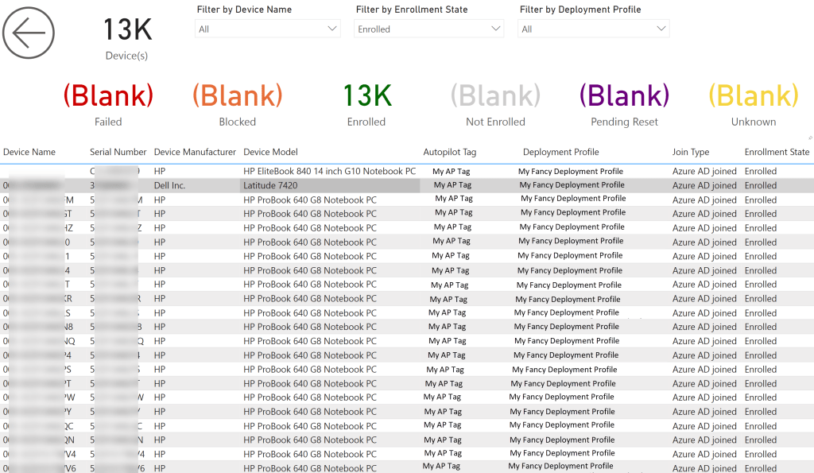
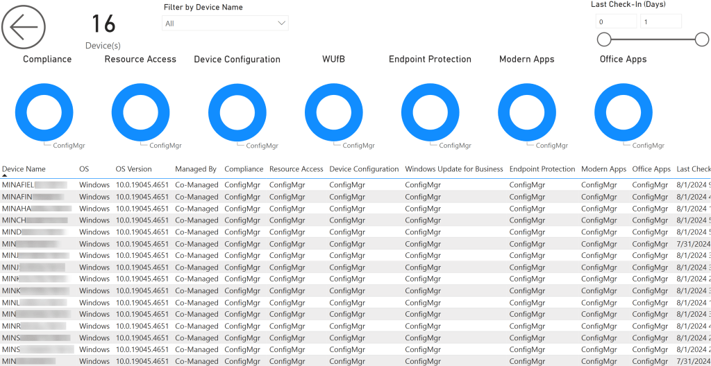
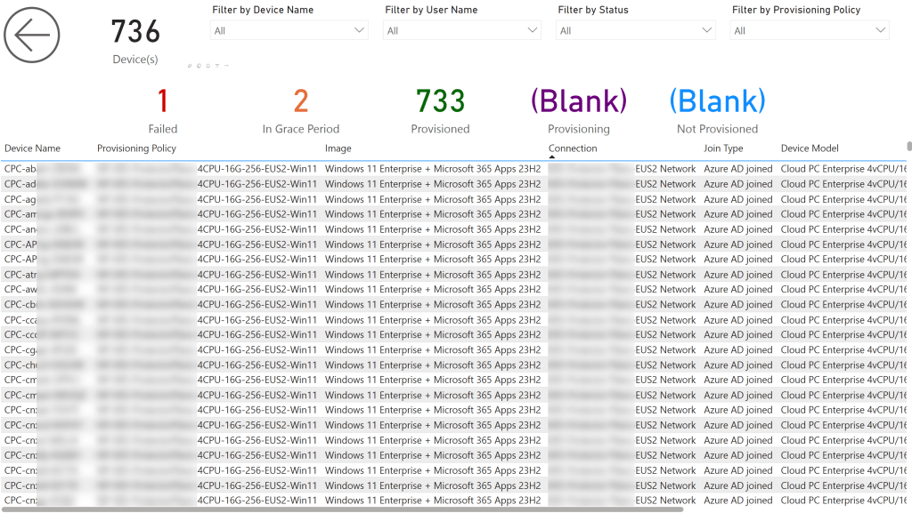
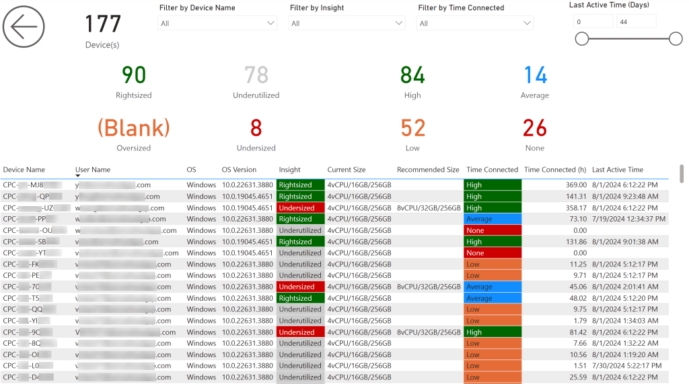
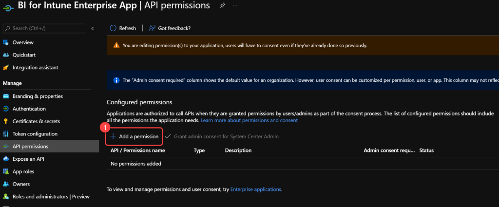
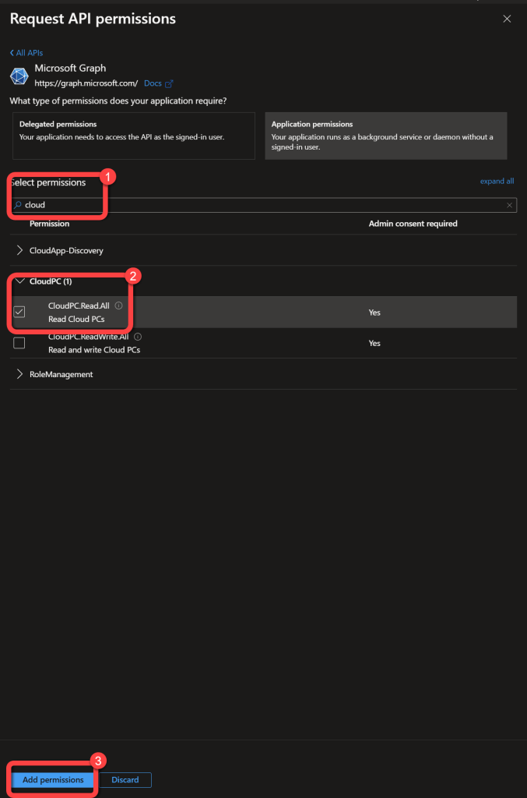
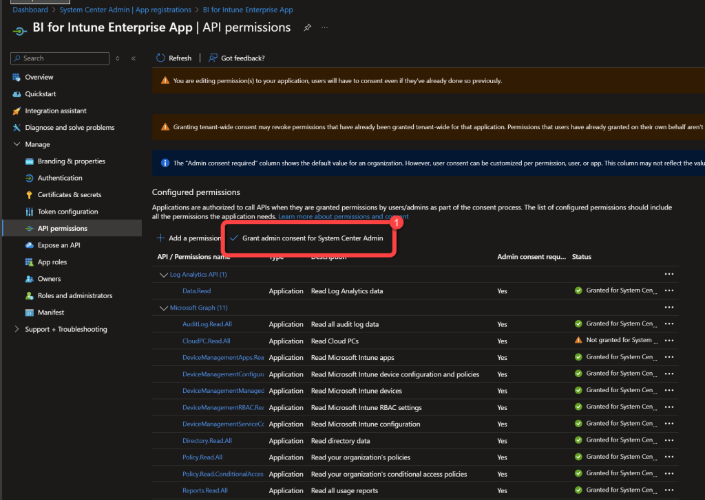

# Version 42.0 (AppSource Version 1037)
This version introduces several new features and enhancements, focusing on Cloud PC management and Autopilot Enrollment. Notable additions include new pages for monitoring enrollment status and cloud provisioning, as well as comprehensive updates to data models with new categories and fields.

**Important Notes:**

- The "Device Info" page might break after the upgrade. The easiest way to fix broken pages is described in this blog: [How To Copy Pages or Visuals from One to Another Report - PowerStacks](https://powerstacks.com/how-to-copy-pages/)
- Several customers have recently reported upgrade failures resulting in the loss of their custom reports. Please do not forget to [backup before you upgrade](backup-custom-reports.md)!
- A new permission must be added to the Azure AD App Registration "CloudPC.Read.All" in order for the Cloud PC pages to populate. (See detailed instructions at the [bottom of this page](#CPCPerm).)
- A new dataset parameter must be configured in order for the Cloud PC pages to populate. Please see the [install documentation](cloud-pc-export-api-parameter.md) to learn how to configure this new parameter.

## Below Are the Changes in Version 42.0

**New Features:**

**New Report Pages:**

- **Autopilot Enrollment Status** - Provides a comprehensive view of all Autopilot devices, including their enrollment status, deployment profile, serial number, manufacturer, model, Autopilot tag, and join type.
- **Co-Managed Workloads** - This page helps you easily identify which management tool—Intune or Configuration Manager (ConfigMgr)—is responsible for specific workloads on your devices. It displays detailed information about the allocation of workloads such as Compliance, Windows Update policies, and Device Configuration, allowing you to quickly assess and manage your hybrid environment. The report provides a clear overview, ensuring that IT administrators can efficiently manage devices across both on-premises and cloud-based infrastructures.
- **Cloud PC Provisioning Status** - Provides a comprehensive view of the provisioning status of your Cloud PC devices, including their provisioning policy, image, join type, and status.
- **Cloud PC Usage** - This report enables you to effectively monitor and optimize Cloud PC usage within your organization. It provides insights into user engagement, including the duration of time spent on Cloud PCs and the most recent connection activity. Additionally, it details the current and recommended sizes for each Cloud PC, offering opportunities to resize them as needed. Optimizing the size of Cloud PCs can enhance the user experience and potentially reduce costs by ensuring that resources are appropriately allocated.

**New Category Added to the Data Model: "Autopilot Enrollment State"**
**New fields in the Autopilot Enrollment State category:****"Ap Enrollment Blocked""Ap Enrollment Enrolled""Ap Enrollment Failed""Ap Enrollment Not Enrolled""Ap Enrollment Pending Reset""Ap Enrollment State""Ap Enrollment Unknown"**New Category Added to the Data Model: "Device Workload"****New fields in the Device Workload category:** "Compliance""Device Configuration""Endpoint Protection""Modern Apps""Office Apps""Resource Access""Windows Update for Business"**New Category Added to the Data Model: "Device Timeline Event"** (Only for customers with "Microsoft Intune Suite Add-on")**New fields in the Device Timeline Event category:** "Event Count""Event Details""Event Level""Event Name""Event Source""Event Time""Event Time (Days)"**New Category Added to the Data Model: "Cloud PC Connection"****New fields in the Cloud PC Connection category:** "AD Domain Name""Connection Name""Join Type""Subscription Name""Virtual Network""Virtual Network Region"**New Category Added to the Data Model: "Cloud PC Connection State"****New fields in the Cloud PC Connection State category:** "Cloud PC Connection Failed""Cloud PC Connection Informational""Cloud PC Connection Passed""Cloud PC Connection Pending""Cloud PC Connection Running""Cloud PC Connection Status""Cloud PC Connection Unknown Future Value""Cloud PC Connection Warning"**New Category Added to the Data Model: "Cloud PC Connection Tag"****New field in the Cloud PC Connection Tag category:** "Tag"**New Category Added to the Data Model: "Cloud PC Image"****New fields in the Cloud PC Image category:** "Expiration Date""Expiration Date (Days)""Image Name""Image OS Release ID""Image Type""Image Version""Last Modified Date""Last Modified Date (Days)"**New Category Added to the Data Model: "Cloud PC Image OS State"****New fields in the Cloud PC Image OS State category:** "Cloud PC Image OS Status""Cloud PC Image OS Supported""Cloud PC Image OS Supported With Warning""Cloud PC Image OS Unknown""Cloud PC Image OS Unknown Future Value"**New Category Added to the Data Model: "Cloud PC Image State"****New fields in the Cloud PC Image State category:** "Cloud PC Image Failed""Cloud PC Image Pending""Cloud PC Image Ready""Cloud PC Image Status""Cloud PC Image Unknown Future Value"**New Category Added to the Data Model: "Cloud PC Image Tag"****New field in the Cloud PC Image Tag category:** "Tag"**New Category Added to the Data Model: "Cloud PC Insight"****New fields in the Cloud PC Insight category:** "Cloud PC Insight""Cloud PC Oversized""Cloud PC Rightsized""Cloud PC Undersized""Cloud PC Underutilized""CPU Current Size""CPU Recommended Size""CPU Usage (%)""Current Size""DISK Current Size (GB)""DISK Recommended Size (GB)""RAM Current Size (GB)""RAM Recommended Size (GB)""RAM Usage (%)""Recommended Size"**New Category Added to the Data Model: "Cloud PC Provisioning Policy"****New fields in the Cloud PC Provisioning Policy category:** "Is Assigned""Provisioning Policy Name"**New Category Added to the Data Model: "Cloud PC Provisioning Policy Assignment"****New fields in the Cloud PC Provisioning Policy Assignment category:** "Assignment Group""Assignment Type"**New Category Added to the Data Model: "Cloud PC Provisioning Policy Tag"****New field in the Cloud PC Provisioning Policy Tag category:** "Tag"**New Category Added to the Data Model: "Cloud PC Provisioning State"****New fields in the Cloud PC Provisioning State category:** "Cloud PC Failed""Cloud PC In Grace Period""Cloud PC Not Provisioned""Cloud PC Provisioned""Cloud PC Provisioned With Warning""Cloud PC Provisioning""Cloud PC Provisioning Status"**New Category Added to the Data Model: "Cloud PC Utilization"****New fields in the Cloud PC Utilization category:** "Cloud PC Utilization Average""Cloud PC Utilization High""Cloud PC Utilization Low""Cloud PC Utilization None""Created Date""Created Date (Days)""Last Active Time""Last Active Time (Days)""Time Connected""Time Connected (h)""Time Connected (m)"**Product Enhancements:****Updated Category "Device":** Removed fields: "Autopilot State""Autopilot Deployment Profile"Added field: "Autopilot Enrolled" (TRUE/FALSE)Renamed Value in the "Managed By" field: "MDE" changed to "Defender"**Updated Category "Application":** Added field: "Notes"**Bug Fixes:**N/A**Important Notes:****New Dataset Parameters:****"AzureAD Driver Updates Enable" (Default: TRUE):** If set to FALSE, "Windows Driver Updates" & "WUfB Drivers Updates" are not loaded. This can significantly reduce sync times in environments with more than 3,000 approved drivers.**"AzureAD Export URL CloudPC" - **Used for the CloudPC Export API when "AzureAD Export URL Enable" is TRUE. **Default: "[https://graph.microsoft.com](https://graph.microsoft.com)" - Default value is simply a placeholder; data will not load without proper value.**Please see the [install documentation](cloud-pc-export-api-parameter.md) to learn how to configure this new parameter.

## Below are the New Pages in Version 42

### Autopilot Enrollment Status

### Co-Managed Workloads

### Cloud PC Provisioning Status

### Cloud PC Usage

### Add CloudPC.Read.All to Enterprise App Registration

		For the new Windows 365 (Cloud PC) pages we must add a new permission to the Enterprise App Registration that was configured when BI for Intune was installed. For reference, please see the documentation on [creating the app registration](create-azure-ad-app-registration.md). **Prerequisites:  **The user performing this step requires Global Admin and Subscription Admin rights.

### Step 1

								Login to **portal.azure.com **or **entra.microsoft.com** using a global administrator account.Search for and select App used for BI for Intune.**

### Step 2

1. On the Enterprise App page select **API Permissions**.

### Step 3

1. Select **Add a permission**.

### Step 4

1. Select **Microsoft Graph**.

### Step 5

1. Select **Application permissions**.

### Step 6

1. Search for **Cloud PC**.
1. Select the following permissions:**CloudPC.Read.All**
Select **Add permissions**.

### Step 7

1. Select **Grant admin consent for **.

### Step 8

1. Select **Yes**at the prompt.
1. You've completed all required steps for adding the new permission to the app registration.

