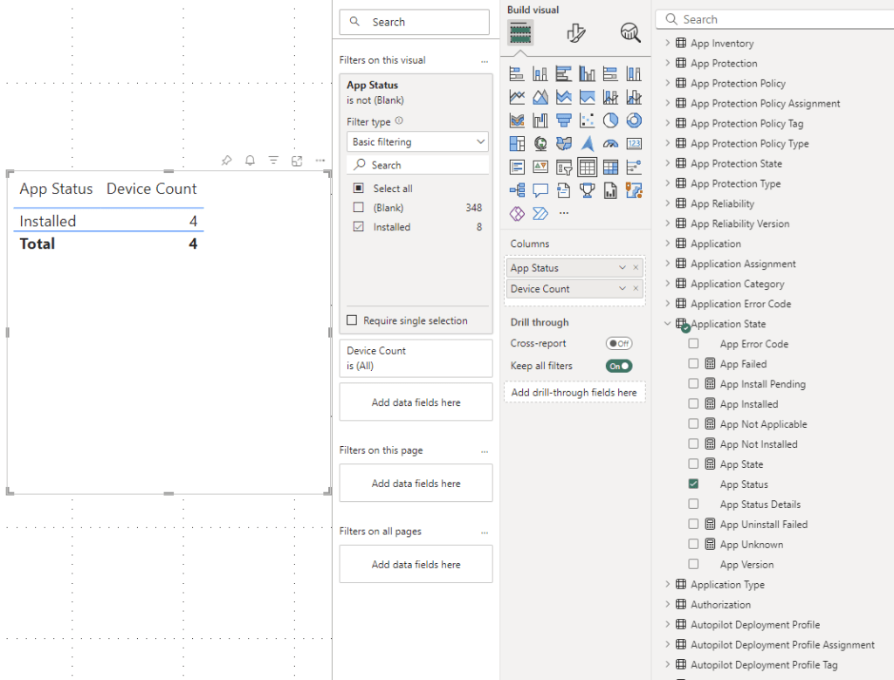

# Version 44.0 (AppSource Version 1039)
Prior to version 44 we only showed application deployment status for devices which had a primary user. This was a design decision that was made very early in the development of BI for Intune. We did this to work around issues in the quality of the data provided by Intune. Specifically, it is not uncommon to see more than one installation status for a given app on a given device and those statuses may not be the same. In most cases it is impossible for an app to both succeed and fail. Our research indicated that the most likely "real" status was the one reported in the context of the primary user, so this was the one we decided to show to eliminate the confusion. Unfortunately, by design, not all devices have a primary user, so we had to change this behavior.

**Important Notes:**

- The "Device Info" page might break after the upgrade. The easiest way to fix broken pages is described in this blog: [How To Copy Pages or Visuals from One to Another Report - PowerStacks](https://powerstacks.com/how-to-copy-pages/)
- Several customers have recently reported upgrade failures resulting in the loss of their custom reports. Please do not forget to [backup before you upgrade](backup-custom-reports.md)!

## Below Are the Changes in Version 44.0

**New Features:**

- **N/A**

**Product Enhancements:**

- Application deployment status was not previously shown for devices with no primary user. We now report Application deployment for Primary User, Enrolled User, and Last Logon User.

**Bug Fixes:**

- Version 43, which was released only for a short time, decreased sync performance. This was resolved in version 44.

**Important Notes:**

- If you want to know the unique status of Application deployed by Device, you will need to use the "Device Count" Measure, and filter on "App Status"

-

##### Below is an example of adding the required filter for accurate app status by device.

