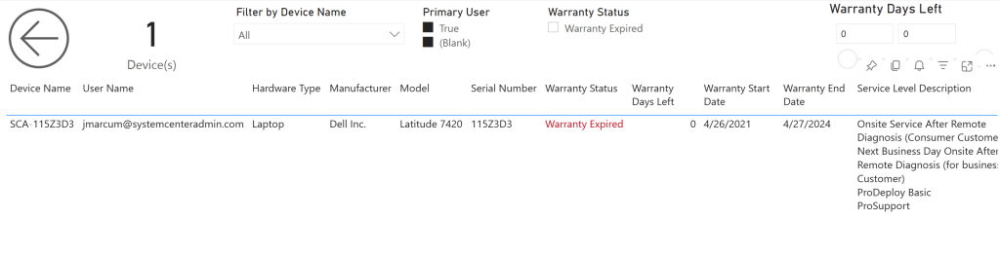
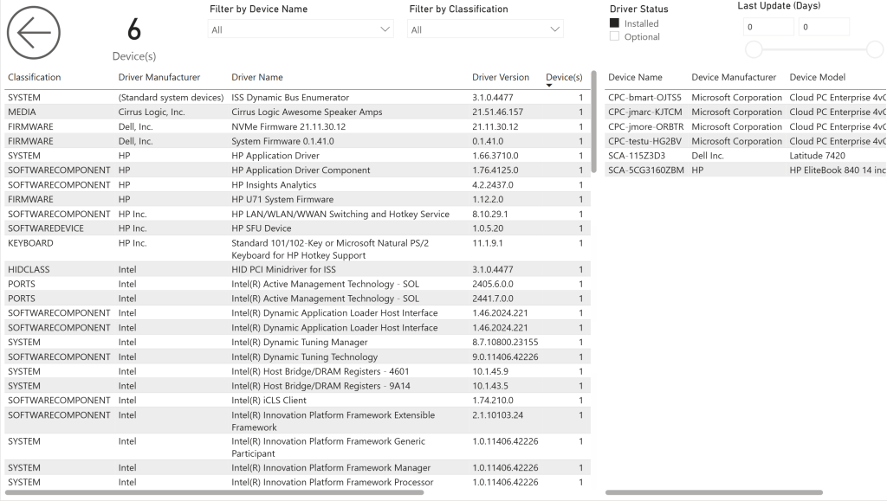
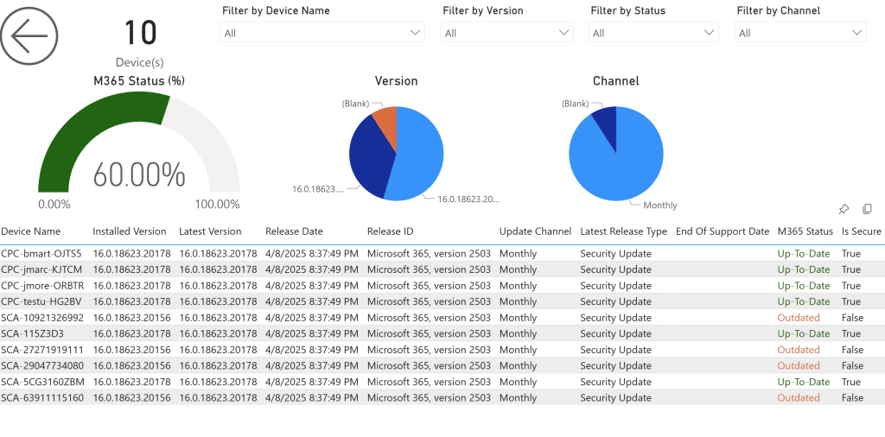

# Versions 58.0 (AppSource Versions 1050)
**BI for Intune Version 58 (April 12, 2025)**

Version 58 is a very large release with many additions to the [custom inventory for Windows process](windows-inventory-collection-script.md). These are some highly requested features. See the details below.

**Important Notes:**
Several customers have recently reported upgrade failures resulting in the loss of their custom reports. Please do not forget to [backup before you upgrade](backup-custom-reports.md)!

## Below Are the Changes in Version 58.0

- **New Report Pages:** (**Note**: To copy the new pages to your custom reports see the article [how to copy pages](http://ec2-52-40-133-66.us-west-2.compute.amazonaws.com/wordpress/how-to-copy-pages/).)New page: **Driver Inventory** (**Note**: Requires updated version of the [Custom Inventory Script](https://github.com/PowerStacks-BI/Windows-Custom-Inventory) for Windows.)The new **Driver Inventory** page provides a means of reporting on the installed drivers on Windows devices.
New page: **Microsoft 365** (**Note**: Requires updated version of the [Custom Inventory Script](https://github.com/PowerStacks-BI/Windows-Custom-Inventory) for Windows.)
- The new **Microsoft 365** page and corresponding semantic model object use an unsupported Microsoft API to report on the security update compliance of installed Microsoft 365 updates. There’s no guarantee that Microsoft will not remove the API.
New page: **Warranty** (**Note**: Requires updated version of the [Custom Inventory Script](https://github.com/PowerStacks-BI/Windows-Custom-Inventory) for Windows.)
- Reports on the warranty status of Dell, Lenovo, and Getac computers. See the Collect Warranty Data article for more information.
**New Features:**
- **Additions to the semantic model:**Added new object: **Driver Inventory** (**Note**: Requires updated version of the [Custom Inventory Script](https://github.com/PowerStacks-BI/Windows-Custom-Inventory) for Windows.) New fields in the Driver Inventory object include:Driver Inventory Classification
- Driver Inventory Count
- Driver Inventory Description
- Driver Inventory Hardware ID
- Driver Inventory ID
- Driver Inventory INF Filename
- Driver Inventory Location
- Driver Inventory Manufacturer
- Driver Inventory Name
- Driver Inventory Provider
- Driver Inventory Status
- Driver Inventory Version
- Last Update
- Last Update (Days)
- Published On
- Published On (Days)
- Release Date
- Release Date (Days)
- Windows Update Name
Added new object: **Device Chassis**(**Note**: Requires updated version of the Custom Inventory Script for Windows.) New fields in the **Device Chassis** object include:
- Chassis Count
- Chassis Tag
- Chassis Type
- Hardware Type
- Last Update
- Last Update (Days)
Added new object: **Device Microsoft 365**(**Note**: Requires updated version of the Custom Inventory Script for Windows.) New fields in the **Device Microsoft 365** object include:
- End Of Support Date
- End Of Support Date (Days)
- Installed Version
- Is Secure
- Last Update
- Last Update (Days)
- Last Release Type
- Last Release Version
- M365 Release ID
- M365 Status
- M365 Status (%)
- Release Date
- Release Date (Days)
- Update Channel
Added new object: **Device Warranty**(**Note**: Requires updated version of the Custom Inventory Script for Windows.) New fields in the **Device Warranty** object include:
- Last Update
- Last Update (Days)
- Service Level Description
- Service Model
- Service Provider
- Service Tag
- Warranty Days Left
- Warranty End Date
- Warranty End Date (Days)
- Warranty Start Date
- Warranty Start Date (Days)
- Warranty Status
**Product Enhancements:**
- Changes to the **Device Info** page:Added filters in the filters pane:OS
- Hardware Type
- Driver Inventory Enrolled
- Device Microsoft 365 Enrolled
- Device Warranty Enrolled
Added fields to the main table:
- Hardware Type
- Driver Inventory Enrolled
- Device Microsoft 365 Enrolled
- Device Warranty Enrolled
Changes to the **Custom Inventory Script for Windows**:
- Default value for **$RemoveBuiltInMonitors**changed to **$false**This was done to remediate a known issue. If the built-in laptop screen was not on when the script ran this variable was caused the first external monitor to not get reported.
Added new parameters:
- **$CollectDriverInventory** = **$true**Control if you want to collect Device, App, and Driver Inventory (True = Collect)
**$CollectMicrosoft365** = **$false**
- Sub-control under Device Inventory
- Data is sent to the Log Analytics as device inventory, but it can have different schedule.
**$CollectWarranty** = **$false**
- **Very Important!**You might not need the warranty to be update each time you collect inventory (API call throttling can be problematic), so instead you can create a proactive remediation script with that on warranty collect enabled only, and run it every 30 days.
- Data is sent to the Log Analytics as device inventory, but it can have different schedule.
**$WarrantyDellClientID** = **$null**
- Add your API key for Dell warranty API.
**$WarrantyDellClientSecret** = **$null**
- Add your secret key for Dell warranty API.
**$WarrantyLenovoClientID** = **$null**
- Add your Client ID for Lenovo warranty API.
**Bug Fixes:**
- Beginning with version 57 we calculated the value of the “OS” field to display as “Windows 10” or “Windows 11” based upon the third octet of the OS version. This caused issues for customers who manage server OS Defender settings using Intune. In this version we corrected this by only calculating the OS field value for known workstation operating systems. For unknown operating systems you will simply see “Windows”, the default value returned by the Microsoft API, instead of “Windows 10” or “Windows 11”.
**Important Notes:**
- Always [backup your custom reports](backup-custom-reports.md) before upgrading!

## The New Warranty Status Page

Many organizations align their hardware lifecycle strategy with warranty coverage to minimize support costs and avoid unexpected failures. Most companies purchase devices with a fixed-term warranty—typically three or four years—and plan to retire or replace them once that warranty expires. The new Warranty Status report in BI for Intune provides clear visibility into each device's warranty start and end dates, enabling customers to proactively plan for replacements, manage budgets, and maintain a healthy, supportable device fleet.​

Extending the use of computers beyond their warranty period can lead to increased costs. These costs stem from higher failure rates, increased maintenance expenses, and potential productivity losses due to outdated hardware. Industry analyses suggest that the total cost of ownership (TCO) for aging devices can rise significantly, sometimes exceeding the cost of newer, more efficient replacements.​

Implementing a Warranty Status report, like the one in BI for Intune, allows organizations to monitor warranty timelines effectively. This proactive approach aids in budgeting for timely replacements, ensuring devices are retired before they become a financial or operational burden.

## The New Driver Inventory Page

The new Drivers Inventory page in BI for Intune gives customers comprehensive visibility into the drivers installed across their device fleet. Reporting on driver inventory helps organizations identify outdated or problematic drivers that may be associated with known vulnerabilities or system instability. By surfacing key details like driver version, release date, and provider, this report enables IT teams to proactively address issues that could lead to crashes, security risks, or performance degradation—helping to improve overall endpoint reliability and reduce support costs.

## The New M365 Updates Page

The new M365 Updates report in BI for Intune gives IT leaders a clear, unified view of both Windows and Office update compliance—without the need to navigate multiple Microsoft portals. Instead of jumping between different tools to track update status, this report brings everything together in one place. By consolidating data across the Microsoft 365 ecosystem, it helps organizations quickly identify gaps, reduce risk, and make more informed decisions around update management. It also makes it easier to tie update compliance to broader business or security goals, with powerful filtering and slicing options built in.

