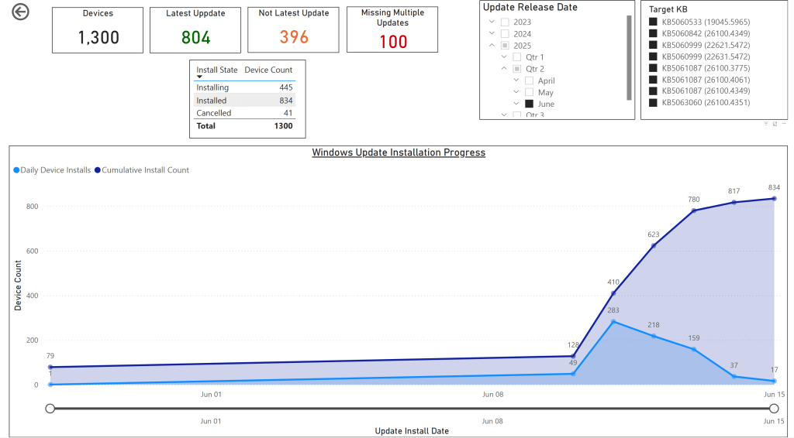

# Version 60

**Release Date:** June 14, 2025
**AppSource Version:** 1052

## Product Enhancements

- **Startup Performance** data now uses the Intune Export API instead of Graph, improving sync performance.
- **Device Enrollment Failure** data now uses the Intune Export API instead of Graph, improving sync performance.
- **Proactive Remediation State** data now uses the Intune Export API instead of Graph, improving sync performance.
- The [Custom Inventory Script for Windows](../installation/custom-inventory.md) now collects HP warranty information. _(In our testing the HP API has been intermittently slow, so it may take a while to populate inventory data for all of your HP devices.)_
- The Custom Inventory Script for Windows now caches warranty data to a local JSON file on each device, eliminating the need to call the warranty APIs every month.

## New Features

- Added the ability to track device enrollments per day.
- Added the ability to track cumulative update installations per day.
- Added the ability to track Windows OS installations per day. _(OS install date updates during feature updates as well as Windows upgrades.)_

## Semantic Model Changes

- Added an **Autopilot ID** column to the **Device** object. This is the **ID** column returned by the **windowsAutopilotDeviceIdentities** API. _(Intune uses this as an object key, but Autopilot does not use the value at all.)_
- Renamed **Enrolled Date** to **Enrolled Time** on the **Device** object.
- Renamed **Enrolled Date (Days)** to **Enrolled Time (Days)** on the **Device** object.
- Added a new **Enrolled Date** column to the **Device** object — used to track enrollment history per day. It is the enrolled date without the time component.
- Added an **Enrolled Cumulative Count** column to the **Device** object, providing a cumulative count of devices enrolled on each day.
- Added an **Update Installed Date** column to the **Update Compliance State Device** object.
- Added an **Update Installed Cumulative Count** column to the **Update Compliance State Device** object — a cumulative count of devices that installed a given update each day.
- Added an **OS Install Time** column to the **Device Details** object.
- Added an **OS Install Time (Days)** column to the **Device Details** object.
- Added an **OS Install Date** column to the **Device Details** object.
- Added an **OS Install Cumulative Count** column to the **Device Details** object.
- Renamed **Battery Design Capacity (MWh)** to **Battery Design Capacity (mWh)** on the **Device Details** object. _(Breaking change — see Important Notes.)_
- Renamed **Battery Full Charge Capacity (MWh)** to **Battery Full Charge Capacity (mWh)** on the **Device Details** object. _(Breaking change — see Important Notes.)_

## Important Notes

- [**Action Required**] The renamed columns on the **Device Details** object will break the Battery page in custom reports. Replace the old column names **Battery Design Capacity (MWh)** and **Battery Full Charge Capacity (MWh)** with the new names **Battery Design Capacity (mWh)** and **Battery Full Charge Capacity (mWh)**.
- [**Action Required**] To populate OS install date information you must upgrade to the latest [Custom Inventory Script for Windows](../installation/custom-inventory.md). The updated script captures `OsInstallDate` from `Get-ComputerInfo` and emits it as `OSInstallDate` in the inventory record.
- Always [back up your custom reports](../administration/backup-custom-reports.md) before upgrading.

## Summary

BI for Intune v60 adds the ability to track actions over time. New fields and measures cover device enrollments, OS installations, and cumulative update installations on a per-day basis. This is useful for reporting on time-to-compliance after updates are released, tracking Intune migration progress, and tracking Windows OS upgrade rollouts.

This release also moves three additional data sources to the Intune Export API for faster syncs and adds HP warranty data and local caching to the Custom Inventory Script for Windows.

## Example: Cumulative Updates Installed Per Day

This report has been added to the Windows Update for Business custom report available on [GitHub](https://github.com/powerstacks-corp/BI-for-Intune/tree/main/Windows%20Update%20for%20Business%20Reports). For more information, see [our blog post](https://powerstacks.com/blog/windows-update-for-business-reports-reimagined-a-simpler-way-to-analyze-updates/).

