# Modern UI Templates for BI for Intune

The Modern UI templates are a visual overhaul of the out-of-the-box BI for Intune reports. Every one of the 51 report pages was redesigned for a cleaner, more contemporary look. Two versions are available so you can match your existing Power BI workspace theme: a light-mode template and a dark-mode template.

The underlying semantic model, KPIs, drill-throughs, and filters are identical to the standard BI for Intune templates. Only the visual layer is different. Connect the template to the same dataset you already use and every report continues to work the same way.

*[Download the Modern UI templates on GitHub](https://github.com/powerstacks-corp/BI-for-Intune/tree/main/Modern%20UI)*

## What's included

Two `.pbit` files in the [Modern UI folder](https://github.com/powerstacks-corp/BI-for-Intune/tree/main/Modern%20UI) of the BI for Intune repository:

| File | Theme |
|------|-------|
| `BI for Intune modern.pbit` | Light mode |
| `BI for Intune modern (dark).pbit` | Dark mode |

Each template contains all 51 pages from the standard BI for Intune reports, redesigned with a refreshed visual language: simplified KPI cards, consistent typography, tighter visual spacing, and a unified color palette that reads cleanly in both themed Power BI workspaces and embedded views.

## Screenshots

### Summary page

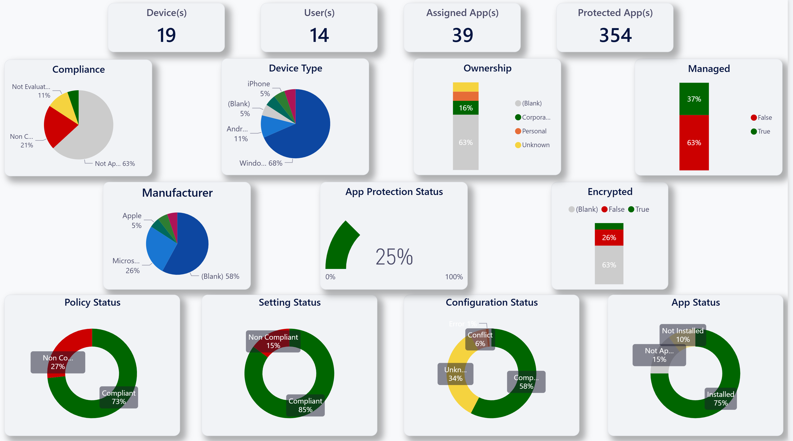

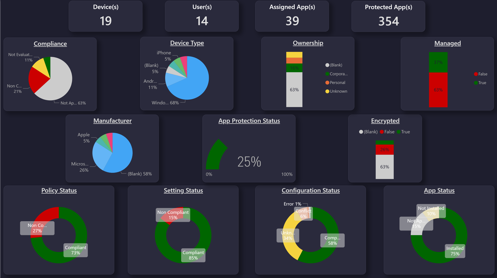

### Device Info

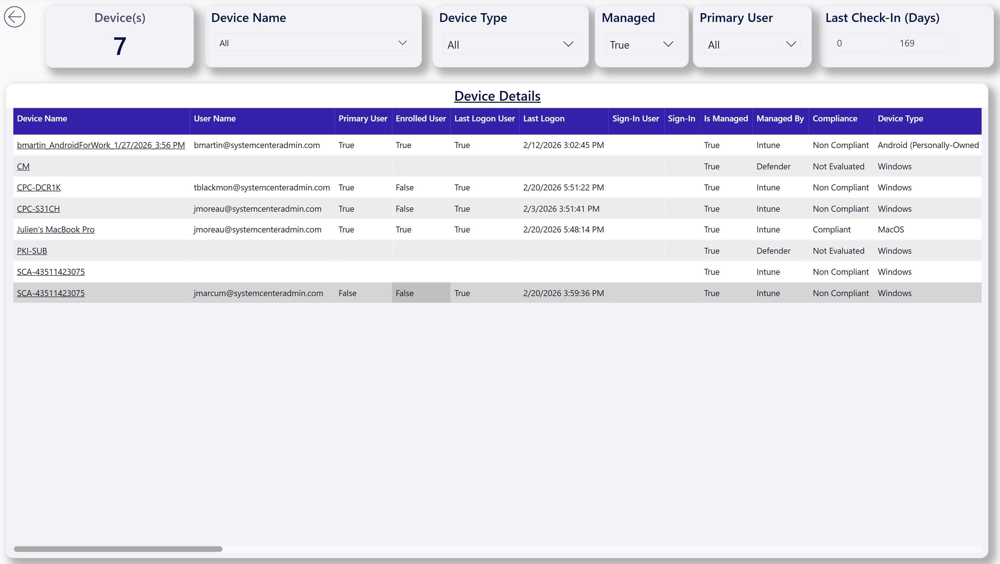

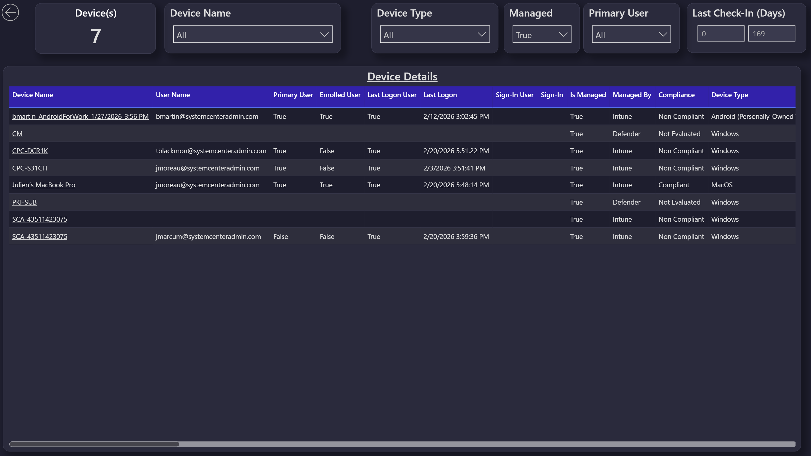

### App Inventory

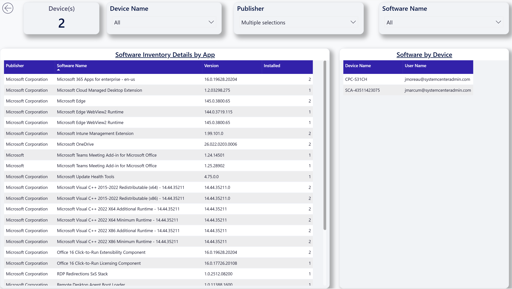

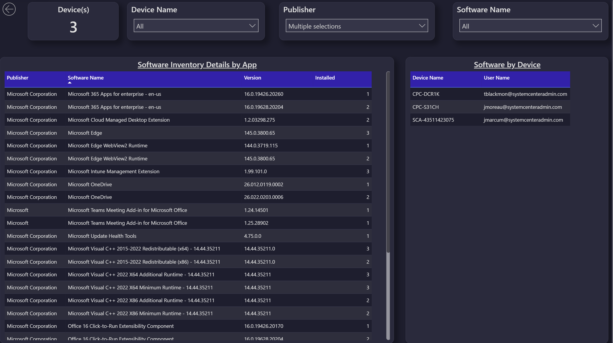

### Conditional Access

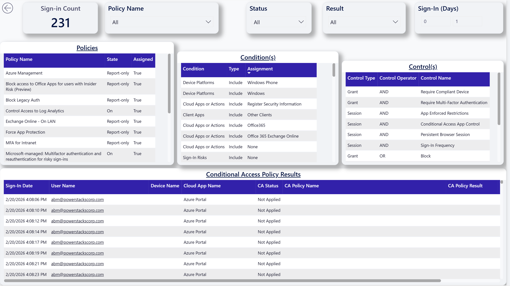

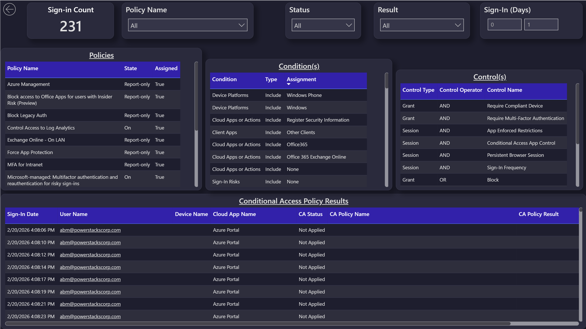

### User Info

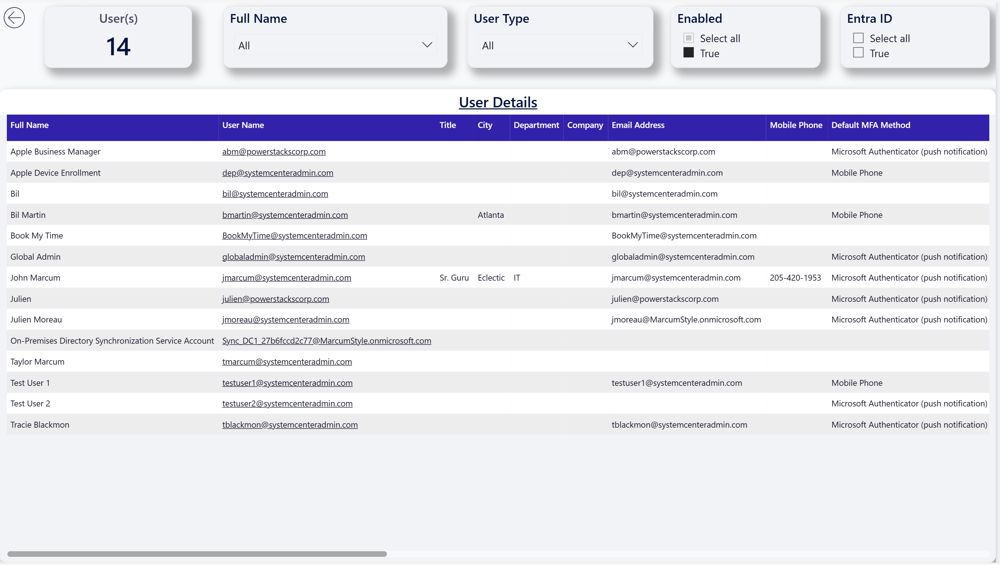

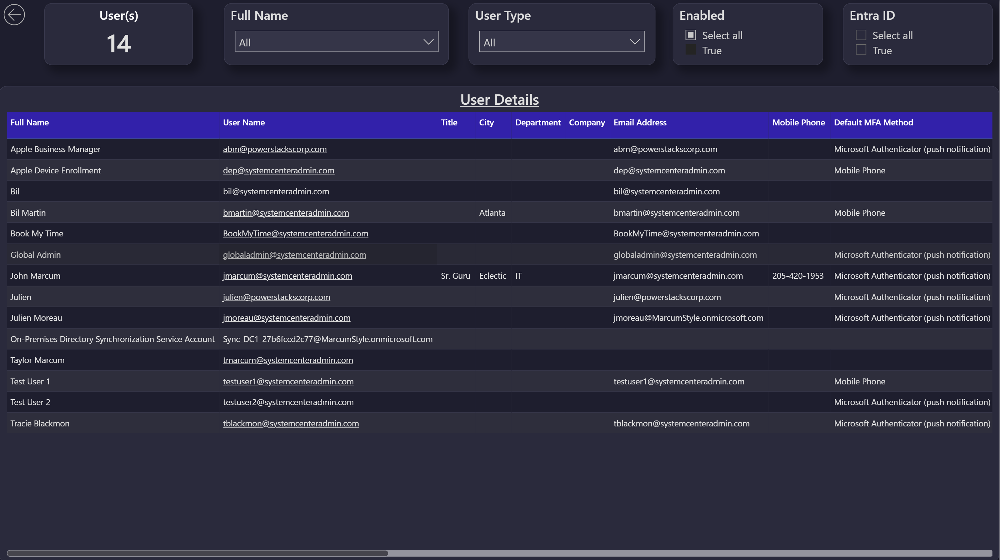

### Windows Update for Business: Quality Updates

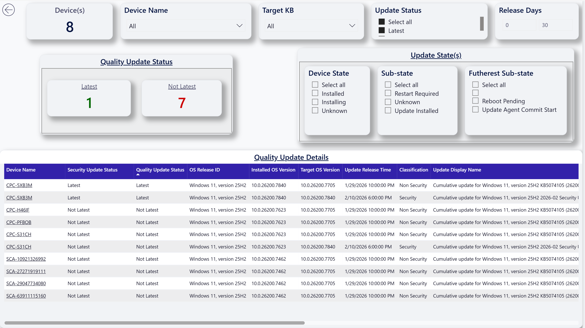

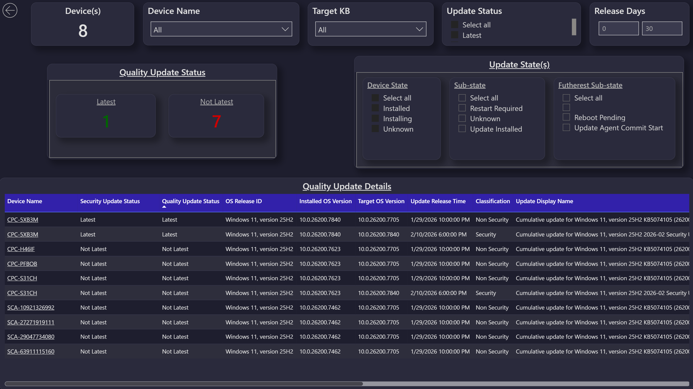

### Windows Update for Business: Driver Updates

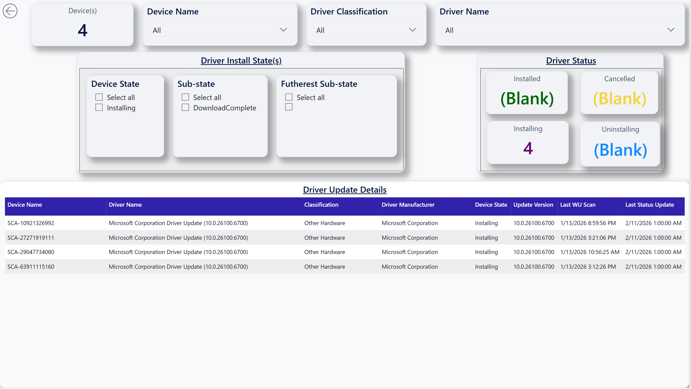

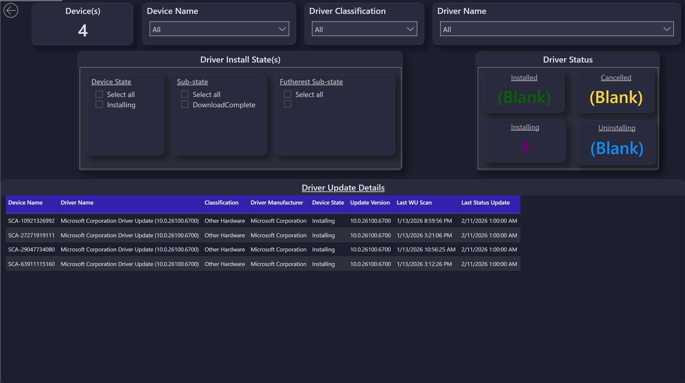

The other pages (compliance, configuration, app deployment, encryption, autopilot, devices missing patches, Cloud PC, and the full report inventory) all share the same redesigned look.

## How to install

The Modern UI templates install the same way as any other custom Power BI template. Follow the steps in [Installing a Custom Power BI Template](../administration/installing-a-custom-power-bi-template.md), pointing the **Download a .pbit file** step at the Modern UI folder in the BI for Intune repository.

Either template connects to your existing BI for Intune semantic model, so there is no need to re-run the setup guide or change any data source configuration. Once the report is connected to your dataset, the new pages are available alongside whichever templates you already have published.

## Notes

These templates are provided as-is alongside the rest of the [custom template library](../administration/installing-a-custom-power-bi-template.md). They are not part of the supported BI for Intune product surface, and they are not auto-updated when you perform a BI for Intune in-place upgrade. If a new version of the standard BI for Intune reports introduces report pages that the Modern UI templates don't yet cover, those pages will be missing until the Modern UI templates are republished with the additions.

If you build a variant of the Modern UI templates that you'd like to share with other BI for Intune customers, contributions back to the [BI for Intune repository](https://github.com/powerstacks-corp/BI-for-Intune) are welcome.
