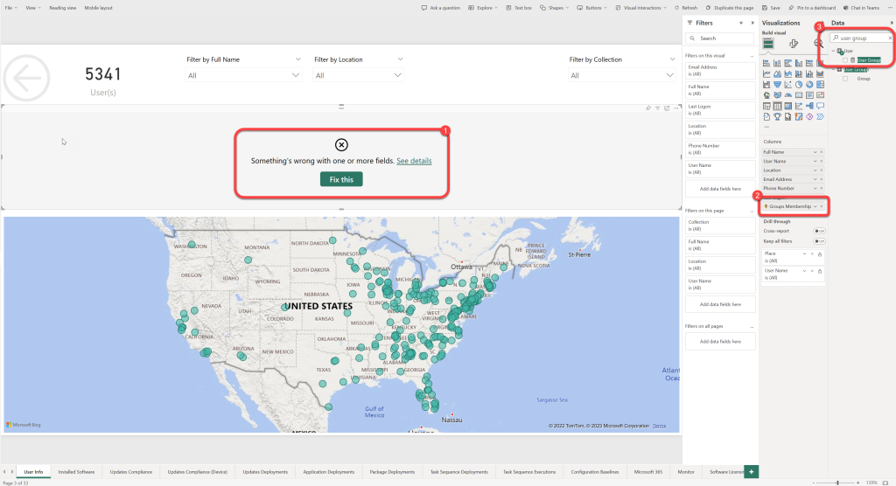

# Repair Broken Visuals
When building our data model, we try very hard to ensure that each field name is unique, and it is simple for our customers to understand the purpose of each field by its name. Of course, sometimes a field name may have made sense when it was created but as we bring new features to the model the name is no longer unique, self-explanatory, nor makes sense. On these rare occasions we rename existing fields. Unfortunately, when this happens any visualization containing a field that has been renamed will be broken after the upgrade contain the new field name. For the reason we recommend that customers always review our release notes prior to upgrading and test each page in their custom reports after each upgrade.

Correcting a visualization that contains a field which has been renamed is quite simple. Just follow the steps within this guide.

### Step 1: Replace Renamed Fields

1. Open the page containing the broken visualization in **Edit** mode.
1. Select the visualization that is broken.
1. On the **Visualizations pane** you will notice one, or more, columns that have an **exclamation point** ("!") on them.
1. Select the "**X**" to remove the column from the visualization.
1. On the **Data pane** search for the new field name. You can find the new name in the "[What's New](https://powerstacks.com/bi-for-sccm-change-log/)" section of our website. Select the field by placing a checkmark in the box beside the field name.
1. You might want to rearrange the order in which items appear within the visualization. Do so by dragging the newly added field up or down in the list of columns on the Visualizations pane. (The same area where you clicked the "X" to remove the old column name)
1. **Save** the changes and return to **Reading view**.

