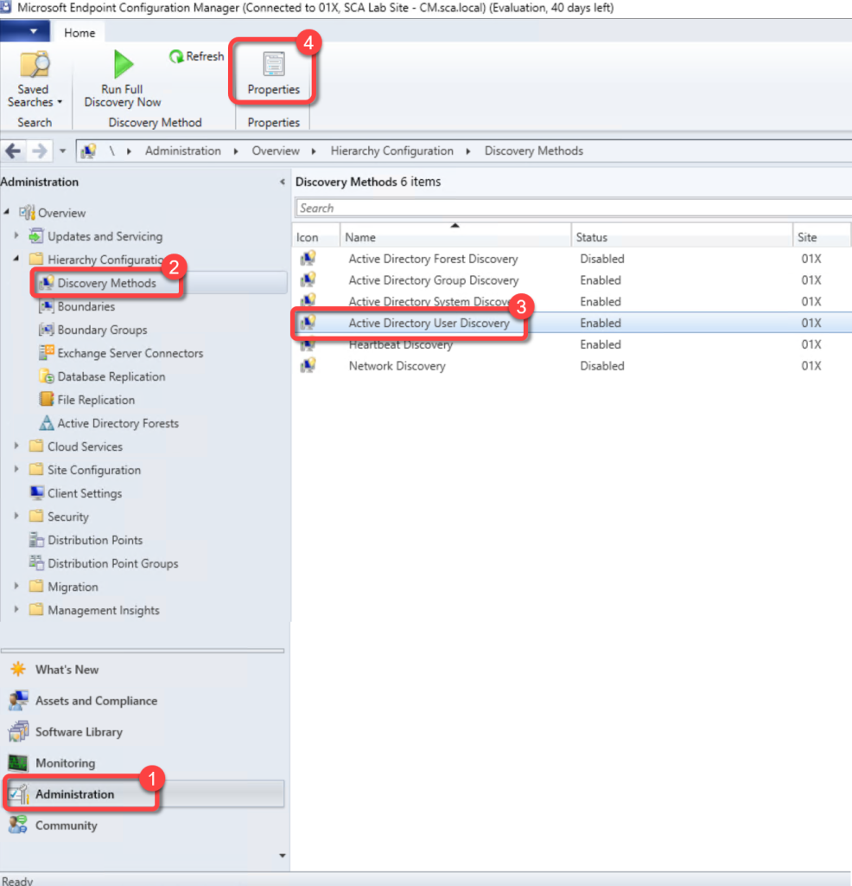
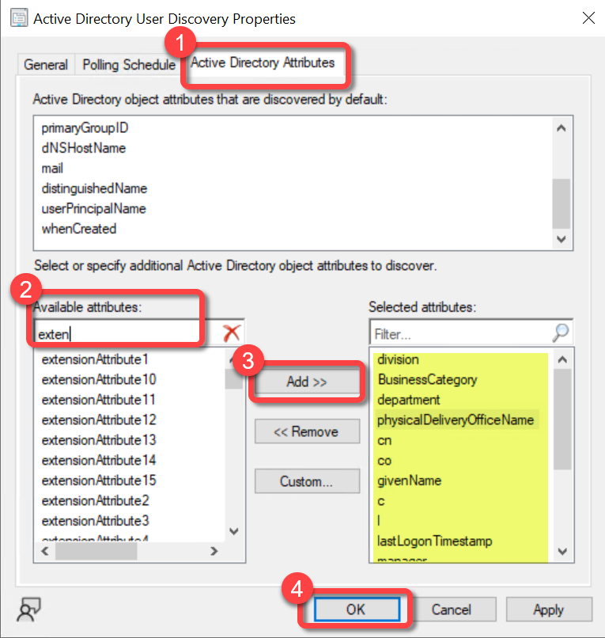

# Configure AD User Discovery
Ensure the following items have been added to AD User discovery. Skipping this step will not generate any errors however some report fields will be blank if your organization does not utilize these active directory attributes.

**Prerequisites:**

Active Directory User Discovery must be enabled.

### Step 1

1. In the Configuration Manager console, go to the **Administration** workspace, expand **Hierarchy Configuration**, and select the **Discovery Methods** node.
1. Select **Active Directory User Discovery**.
1. On the **Home** tab of the ribbon, select **Properties**.

### Step 2

1. Select the **Active Directory Attributes** tab.
1. In the list of **Available attributes** locate each of the following, select **Add** to add each to the list of **Selected attributes**.C
1. cn
1. co
1. department
1. division
1. BusinessCategory
1. physicalDeliveryOfficeName
1. givenName
1. L (in ConfigMgr it looks like an upper case i)
1. lastLogonTimestamp
1. manager
1. postalCode
1. sn
1. st
1. StreetAddress
1. telephoneNumber
1. title
If your organization uses the user **extensionAttributes** (1-15) in Active Directory, consider adding those as well. Select **OK**

