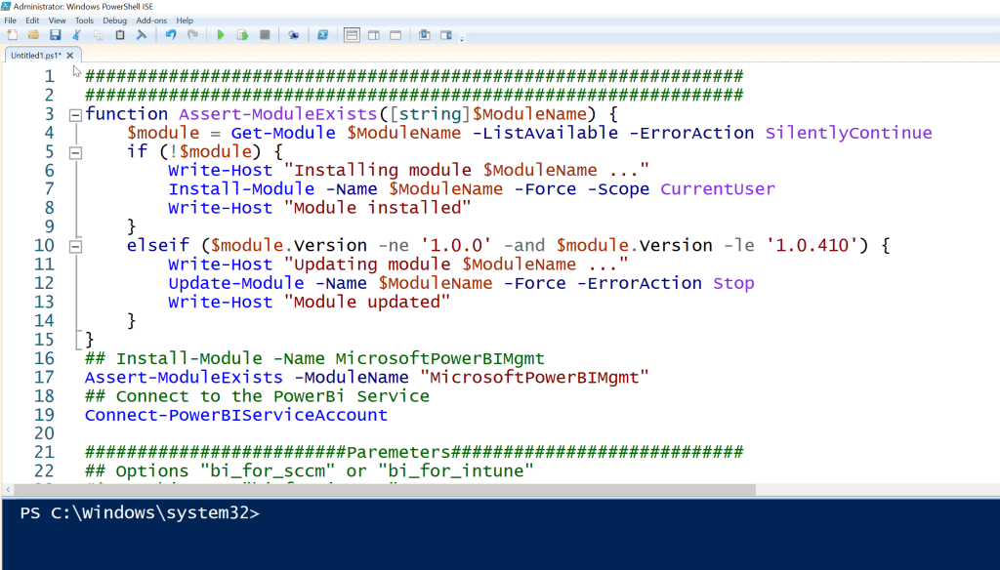
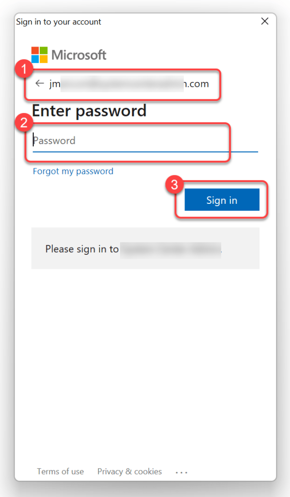
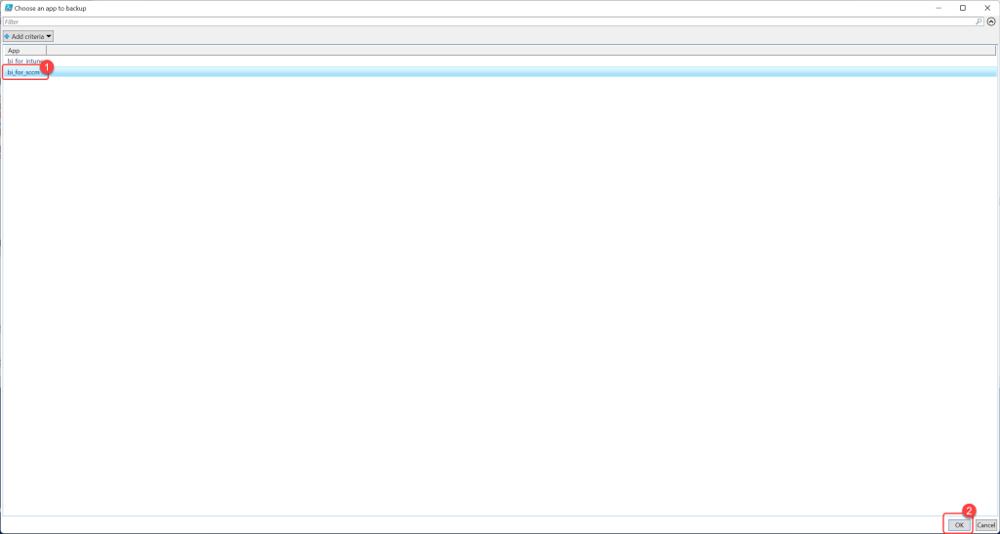
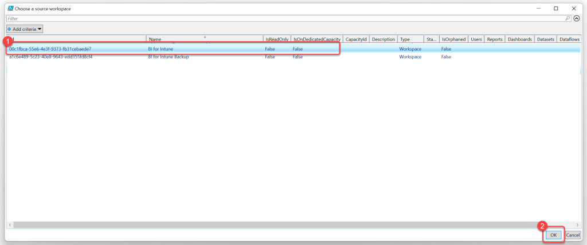
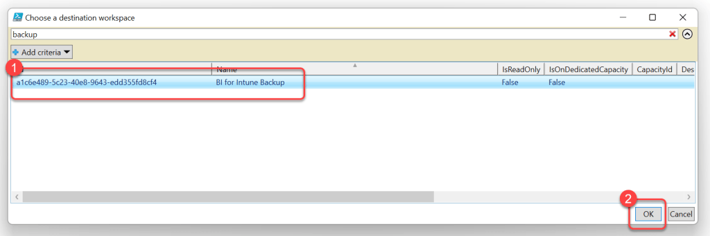

# Backing Up Custom Reports
We strongly advise customers to always backup their custom reports before performing any in-place upgrades. Failure to do so could result in the loss of your custom reports!

**Prerequisites:**

1. The user executing these steps should be an administrator of the BI for SCCM workspace(s).
1. A second install of BI for SCCM to be used as a backup workspace. You do not need to configure the dataset parameters; this workspace is simply a placeholder to store a copy of your custom reports.

### Step 1: Save the PowerShell Script

1. Copy the **PowerShell** code above, save it as a .ps1 file or paste it into your favorite code editor.

### Step 2: Execute and Sign In

1. Execute the code in the **code editor** or by running the .**ps1 file**.
1. When prompted, **Sign-in** to Power BI.

### Step 3: Select Apps to Backup

1. When prompted, select any **BI for SCCM apps** that you may want to backup. (**Note**: This is only required if you have created apps containing custom reports)
1. Select **OK**.

v*

### Step 4: Select Source Workspace

1. When prompted, select your **production BI for SCCM workspace**. This is the **source** from which reports will be copied.
1. Select **OK**.

### Step 5: Select Destination Workspace

1. When prompted, select your **backup BI for SCCM workspace**. This is the **destination** which reports will be copied to.
1. Select **OK**.

### Step 6: Verify Backup Output

1. When running in a shell you should see **output** describing what was **copied** to the **backup workspace**.
1. Login to the **backup workspace** to confirm that your **custom reports** have been **copied** there.

