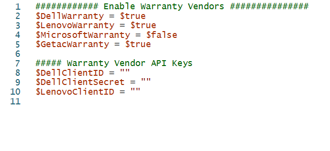
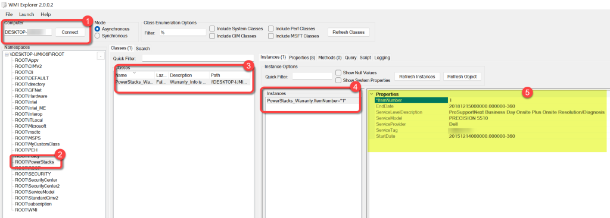
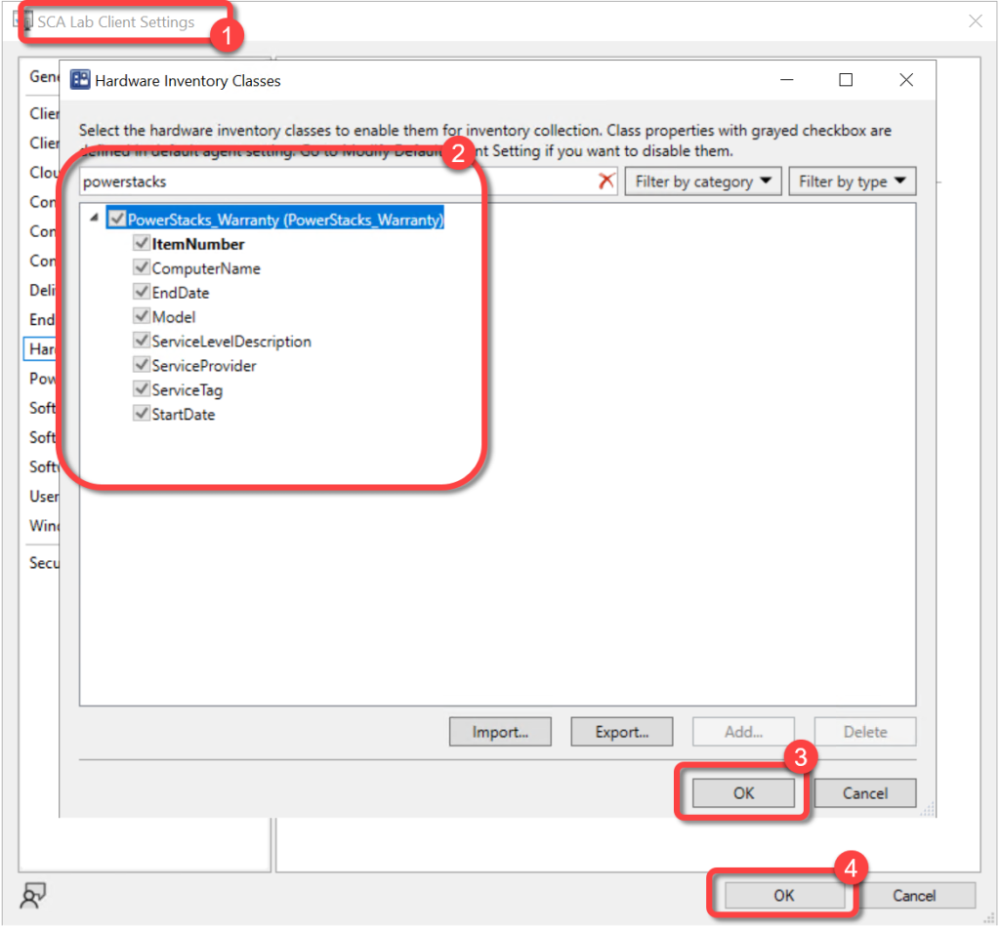
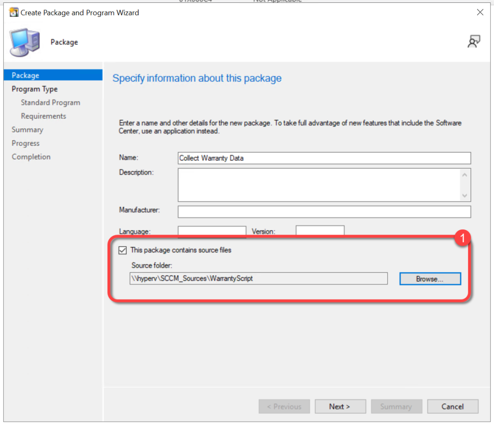
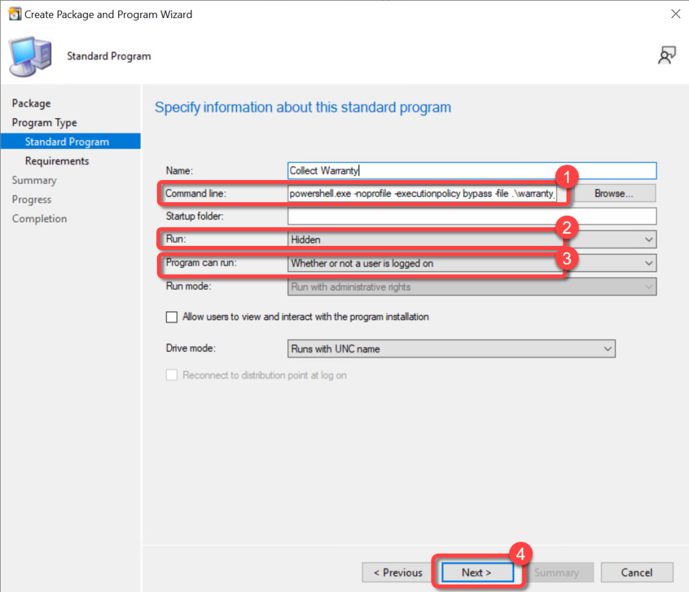
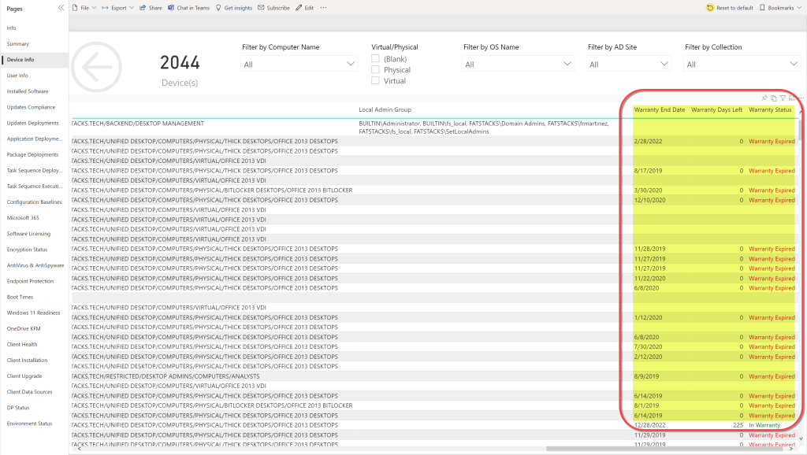
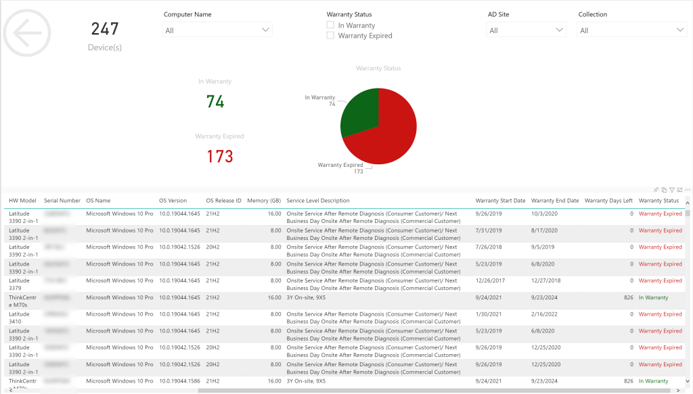

# Collect PC Warranty Data
BI for SCCM can now report on the warranty information for Dell, Lenovo, and GetAC hardware. The data is collected via a PowerShell script that needs to be executed on each computer. Typically using a package and program in ConfigMgr to run the script once on each device is sufficient, the exception to this would be in the event that an additional warranty is purchased after the script has run.

The script creates a custom WMI namespace rootPowerStacks to which the warranty data is written. Hardware inventory in ConfigMgr is then extended to collect the data.

**Note:**The script has code in it to collect warranty data for Microsoft devices however Microsoft has taken their API offline.


**Prerequisites:**

1. Dell requires an API token in order to access their warranty API. You must apply for the token at [https://techdirect.dell.com/Portal/APIs.aspx](https://techdirect.dell.com/Portal/APIs.aspx)
1. Lenovo requires a client token in order to access their warranty API. Getting the token from Lenovo can be a bit more difficult than getting a token from Dell. You will need to have your Lenovo account rep request a key on your behalf.
1. Permissions to extend hardware inventory in ConfigMgr.

					PowerShell

```
############ Enable Warranty Vendors ###############
$DellWarranty = $true
$LenovoWarranty = $true
$MicrosoftWarranty = $false
$GetacWarranty = $true
##### Warranty Vendor API Keys
$DellClientID = ""
$DellClientSecret = ""
$LenovoClientID = ""
######### functions ##########
function Get-DellWarranty([Parameter(Mandatory = $true)]$SourceDevice, $client) {
    $AuthURI = "https://apigtwb2c.us.dell.com/auth/oauth/v2/token"
    if ($Global:TokenAge -lt (get-date).AddMinutes(-55)) { $global:Token = $null }
    If ($null -eq $global:Token) {
        $OAuth = "$DellClientID`:$DellClientSecret"
        $Bytes = [System.Text.Encoding]::ASCII.GetBytes($OAuth)
        $EncodedOAuth = [Convert]::ToBase64String($Bytes)
        $headersAuth = @{ "authorization" = "Basic $EncodedOAuth" }
        $Authbody = 'grant_type=client_credentials'
        $AuthResult = Invoke-RESTMethod -Method Post -Uri $AuthURI -Body $AuthBody -Headers $HeadersAuth
        $global:token = $AuthResult.access_token
        $Global:TokenAge = (get-date)
    }
    $headersReq = @{ "Authorization" = "Bearer $global:Token" }
    $ReqBody = @{ servicetags = $SourceDevice }
    $WarReq = Invoke-RestMethod -Uri "https://apigtwb2c.us.dell.com/PROD/sbil/eapi/v5/asset-entitlements" -Headers $headersReq -Body $ReqBody -Method Get -ContentType "application/json"
    if ($warreq.entitlements.serviceleveldescription) {
        $WarObj = [PSCustomObject]@{
            'Provider'              = 'Dell'
            'Product'               = $warreq.productLineDescription
            'SerialNumber'          = $SourceDevice
            'Warranty'              = $warreq.entitlements.serviceleveldescription -join "`n"
            'StartDate'             = (($warreq.entitlements.startdate | sort-object -Descending | select-object -last 1) -split 'T')[0]
            'EndDate'               = (($warreq.entitlements.enddate | sort-object | select-object -last 1) -split 'T')[0]
            'Client'                = $Client
        }
    }
    else {
        $WarObj = [PSCustomObject]@{
            'Provider'              = 'Dell'
            'Product'               = $null
            'SerialNumber'          = $SourceDevice
            'Warranty'              = 'Could not get warranty information'
            'StartDate'             = $null
            'EndDate'               = $null
            'Client'                = $Client
        }
    }
    return $WarObj
}
function Get-LenovoWarranty([Parameter(Mandatory = $true)]$SourceDevice, $client) {
    $headersReq = @{ "ClientID" = $LenovoClientID }
    $WarReq = Invoke-RestMethod -Uri "http://supportapi.lenovo.com/V2.5/Warranty?Serial=$SourceDevice" -Headers $headersReq -Method Get -ContentType "application/json"
    try{
        $Warlist = $WarReq.Warranty | Where-Object {($_.ID -eq "36Y") -or ($_.ID -eq "3EZ") -or ($_.ID -eq "12B") -or ($_.ID -eq "1EZ")}
        $WarObj = [PSCustomObject]@{
            'Provider'              = 'Lenovo'
            'Product'               = $WarReq.Product
            'SerialNumber'          = $SourceDevice
            'Warranty'              = $Warlist.Name -join "`n"
            'StartDate'             = (($Warlist.Start | sort-object -Descending | select-object -last 1) -split 'T')[0]
            'EndDate'               = (($Warlist.End | sort-object | select-object -last 1) -split 'T')[0]
            'Client'                = $Client
        }
    }catch{
        $WarObj = [PSCustomObject]@{
            'Provider'              = 'Lenovo'
            'Product'               = $null
            'SerialNumber'          = $SourceDevice
            'Warranty'              = 'Could not get warranty information'
            'StartDate'             = $null
            'EndDate'               = $null
            'Client'                = $Client
        }
    }
    return $WarObj
}
function Get-MSWarranty([Parameter(Mandatory = $true)]$SourceDevice, $client) {
    $body = ConvertTo-Json @{
        sku          = "Surface_"
        SerialNumber = $SourceDevice
        ForceRefresh = $false
    }
    $PublicKey = Invoke-RestMethod -Uri 'https://surfacewarrantyservice.azurewebsites.net/api/key' -Method Get
    $AesCSP = New-Object System.Security.Cryptography.AesCryptoServiceProvider
    $AesCSP.GenerateIV()
    $AesCSP.GenerateKey()
    $AESIVString = [System.Convert]::ToBase64String($AesCSP.IV)
    $AESKeyString = [System.Convert]::ToBase64String($AesCSP.Key)
    $AesKeyPair = [System.Convert]::ToBase64String([System.Text.Encoding]::UTF8.GetBytes("$AESIVString,$AESKeyString"))
    $bodybytes = [System.Text.Encoding]::UTF8.GetBytes($body)
    $bodyenc = [System.Convert]::ToBase64String($AesCSP.CreateEncryptor().TransformFinalBlock($bodybytes, 0, $bodybytes.Length))
    $RSA = New-Object System.Security.Cryptography.RSACryptoServiceProvider
    $RSA.ImportCspBlob([System.Convert]::FromBase64String($PublicKey))
    $EncKey = [System.Convert]::ToBase64String($rsa.Encrypt([System.Text.Encoding]::UTF8.GetBytes($AesKeyPair), $false))
    $FullBody = @{
        Data = $bodyenc
        Key  = $EncKey
    } | ConvertTo-Json
    $WarReq = Invoke-RestMethod -uri "https://surfacewarrantyservice.azurewebsites.net/api/v2/warranty" -Method POST -body $FullBody -ContentType "application/json"
    if ($WarReq.warranties) {
        $WarObj = [PSCustomObject]@{
            'Provider'              = 'Microsoft'
            'Product'               = $WarReq.device.title
            'SerialNumber'          = $SourceDevice
            'Warranty'              = $WarReq.warranties.name -join "`n"
            'StartDate'             = (($WarReq.warranties.effectivestartdate | sort-object -Descending | select-object -last 1) -split 'T')[0]
            'EndDate'               = (($WarReq.warranties.effectiveenddate | sort-object | select-object -last 1) -split 'T')[0]
            'Client'                = $Client
        }
    }
    else {
        $WarObj = [PSCustomObject]@{
            'Provider'              = 'Microsoft'
            'Product'               = $null
            'SerialNumber'          = $SourceDevice
            'Warranty'              = 'Could not get warranty information'
            'StartDate'             = $null
            'EndDate'               = $null
            'Client'                = $Client
        }
    }
    return $WarObj
}
function Get-GetacWarranty([Parameter(Mandatory = $true)]$SourceDevice, $client) {
    $WarReq = Invoke-RestMethod -Uri https://api.getac.us/rma-manager/rma/verify-serial?serial=$SerialNumber -Method Get -ContentType "application/json"
    try{
        $WarObj = [PSCustomObject]@{
            'Provider'              = 'Getac'
            'Product'               = $WarReq.model
            'SerialNumber'          = $SourceDevice
            'Warranty'              = $WarReq.warrantyType
            'StartDate'             = $null
            'EndDate'               = (($warreq.endDeviceWarranty | sort-object | select-object -last 1) -split 'T')[0]
            'Client'                = $Client
        }
    }catch{
        $WarObj = [PSCustomObject]@{
            'Provider'              = 'Getac'
            'Product'               = $null
            'SerialNumber'          = $SourceDevice
            'Warranty'              = 'Could not get warranty information'
            'StartDate'             = $null
            'EndDate'               = $null
            'Client'                = $Client
        }
    }
    return $WarObj
}
##############################
########### Main #############
##############################
$Bios = Get-WmiObject Win32_Bios
$Make = $Bios.Manufacturer
$SerialNumber = $Bios.SerialNumber
If ($DellWarranty -and $Make -eq "Dell Inc."){
    write-host "Dell computer found" -ForegroundColor Green
    $WarObj = Get-DellWarranty -SourceDevice $SerialNumber -Client $env:COMPUTERNAME
}
ElseIf($LenovoWarranty -and $Make -eq "LENOVO") {
    write-host "LENOVO computer found" -ForegroundColor Green
    $WarObj = Get-LenovoWarranty -SourceDevice $SerialNumber -Client $env:COMPUTERNAME
}
ElseIf ($MicrosoftWarranty -and $Make -eq "Microsoft Corporation") {
    write-host "Microsoft computer found" -ForegroundColor Green
    $WarObj = Get-MSWarranty -SourceDevice $SerialNumber -Client $env:COMPUTERNAME
}
ElseIf ($GetacWarranty -and $Make -eq "INSYDE Corp.") {
    write-host "Getac computer found" -ForegroundColor Green
    $WarObj = Get-GetacWarranty -SourceDevice $SerialNumber -Client $env:COMPUTERNAME
}
Else{
    write-host "$Make warranty not supported" -ForegroundColor Red
    $WarObj = $null
}
$WarObj
#Clean up bad Namespace
  # gwmi -Namespace root -class __Namespace -Filter "name = '$Namespace'" | rwmi
if ($WarObj){
    # Set Vars for WMI Info
    $Namespace = 'PowerStacks'
    $Class = 'PowerStacks_Warranty'
    # Does Namespace Already Exist?
    Write-Verbose "Getting WMI namespace $Namespace"
    $NSfilter = "Name = '$Namespace'"
    $NSExist = Get-WmiObject -Namespace root -Class __namespace -Filter $NSfilter
    # Namespace Does Not Exist
    If(!($NSExist)){
        Write-Verbose "$Namespace namespace does not exist. Creating new namespace . . ."
        # Create Namespace
   	    $rootNamespace = [wmiclass]'root:__namespace'
        $NewNamespace = $rootNamespace.CreateInstance()
	    $NewNamespace.Name = $Namespace
	    $NewNamespace.Put()
        }
    # Does Class Already Exist?
    Write-Verbose "Getting $Class Class"
      $ClassExist = Get-CimClass -Namespace root/$Namespace -ClassName $Class -ErrorAction SilentlyContinue
    # Class Does Not Exist
    If(!($ClassExist)){
        Write-Verbose "$Class class does not exist. Creating new class . . ."
        # Create Class
        $NewClass = New-Object System.Management.ManagementClass("root$namespace", [string]::Empty, $null)
        $NewClass.name = $Class
        $NewClass.Qualifiers.Add("Static",$true)
        $NewClass.Qualifiers.Add("Description","Warranty_Info is a custom WMI Class.")
        $NewClass.Properties.Add("ComputerName",[System.Management.CimType]::String, $false)
        $NewClass.Properties.Add("ServiceModel",[System.Management.CimType]::String, $false)
        $NewClass.Properties.Add("ServiceTag",[System.Management.CimType]::String, $false)
        $NewClass.Properties.Add("ServiceLevelDescription",[System.Management.CimType]::String, $false)
        $NewClass.Properties.Add("ServiceProvider",[System.Management.CimType]::String, $false)
        $NewClass.Properties.Add("StartDate",[System.Management.CimType]::DateTime, $false)
        $NewClass.Properties.Add("EndDate",[System.Management.CimType]::DateTime, $false)
        $NewClass.Properties.Add("ItemNumber",[System.Management.CimType]::String, $false)
        $NewClass.Properties["ItemNumber"].Qualifiers.Add("Key",$true)
        $NewClass.Put()
    }
    # Write Class Attributes
    $Warranties | ForEach{
        $wmipath = 'root'+$Namespace+':'+$class
        $WMIInstance = ([wmiclass]$wmipath).CreateInstance()
        $WMIInstance.ComputerName = $WarOb.Client
        $WMIInstance.ServiceModel = $WarObj.Product
        $WMIInstance.ServiceTag = $WarObj.SerialNumber
        $WMIInstance.ServiceLevelDescription = $WarObj.Warranty
        $WMIInstance.ServiceProvider = $WarObj.Provider
        $WMIInstance.StartDate = [System.Management.ManagementDateTimeConverter]::ToDmtfDateTime($WarObj.StartDate)
        $WMIInstance.EndDate = [System.Management.ManagementDateTimeConverter]::ToDmtfDateTime($WarObj.EndDate)
        $WMIInstance.ItemNumber = 1
        $WMIInstance.Put()
        Clear-Variable -Name WMIInstance
    }
}
```

			############ Enable Warranty Vendors ###############
$DellWarranty = $true
$LenovoWarranty = $true
$MicrosoftWarranty = $false
$GetacWarranty = $true
##### Warranty Vendor API Keys
$DellClientID = ""
$DellClientSecret = ""
$LenovoClientID = ""
######### functions ##########
function Get-DellWarranty([Parameter(Mandatory = $true)]$SourceDevice, $client) {
    $AuthURI = "https://apigtwb2c.us.dell.com/auth/oauth/v2/token"
    if ($Global:TokenAge -lt (get-date).AddMinutes(-55)) { $global:Token = $null }
    If ($null -eq $global:Token) {
        $OAuth = "$DellClientID`:$DellClientSecret"
        $Bytes = [System.Text.Encoding]::ASCII.GetBytes($OAuth)
        $EncodedOAuth = [Convert]::ToBase64String($Bytes)
        $headersAuth = @{ "authorization" = "Basic $EncodedOAuth" }
        $Authbody = 'grant_type=client_credentials'
        $AuthResult = Invoke-RESTMethod -Method Post -Uri $AuthURI -Body $AuthBody -Headers $HeadersAuth
        $global:token = $AuthResult.access_token
        $Global:TokenAge = (get-date)
    }
    $headersReq = @{ "Authorization" = "Bearer $global:Token" }
    $ReqBody = @{ servicetags = $SourceDevice }
    $WarReq = Invoke-RestMethod -Uri "https://apigtwb2c.us.dell.com/PROD/sbil/eapi/v5/asset-entitlements" -Headers $headersReq -Body $ReqBody -Method Get -ContentType "application/json"
    if ($warreq.entitlements.serviceleveldescription) {
        $WarObj = [PSCustomObject]@{
            'Provider'              = 'Dell'
            'Product'               = $warreq.productLineDescription
            'SerialNumber'          = $SourceDevice
            'Warranty'              = $warreq.entitlements.serviceleveldescription -join "`n"
            'StartDate'             = (($warreq.entitlements.startdate | sort-object -Descending | select-object -last 1) -split 'T')[0]
            'EndDate'               = (($warreq.entitlements.enddate | sort-object | select-object -last 1) -split 'T')[0]
            'Client'                = $Client
        }
    }
    else {
        $WarObj = [PSCustomObject]@{
            'Provider'              = 'Dell'
            'Product'               = $null
            'SerialNumber'          = $SourceDevice
            'Warranty'              = 'Could not get warranty information'
            'StartDate'             = $null
            'EndDate'               = $null
            'Client'                = $Client
        }
    }
    return $WarObj
}
function Get-LenovoWarranty([Parameter(Mandatory = $true)]$SourceDevice, $client) {
    $headersReq = @{ "ClientID" = $LenovoClientID }
    $WarReq = Invoke-RestMethod -Uri "http://supportapi.lenovo.com/V2.5/Warranty?Serial=$SourceDevice" -Headers $headersReq -Method Get -ContentType "application/json"
    try{
        $Warlist = $WarReq.Warranty | Where-Object {($_.ID -eq "36Y") -or ($_.ID -eq "3EZ") -or ($_.ID -eq "12B") -or ($_.ID -eq "1EZ")}
        $WarObj = [PSCustomObject]@{
            'Provider'              = 'Lenovo'
            'Product'               = $WarReq.Product
            'SerialNumber'          = $SourceDevice
            'Warranty'              = $Warlist.Name -join "`n"
            'StartDate'             = (($Warlist.Start | sort-object -Descending | select-object -last 1) -split 'T')[0]
            'EndDate'               = (($Warlist.End | sort-object | select-object -last 1) -split 'T')[0]
            'Client'                = $Client
        }
    }catch{
        $WarObj = [PSCustomObject]@{
            'Provider'              = 'Lenovo'
            'Product'               = $null
            'SerialNumber'          = $SourceDevice
            'Warranty'              = 'Could not get warranty information'
            'StartDate'             = $null
            'EndDate'               = $null
            'Client'                = $Client
        }
    }
    return $WarObj
}
function Get-MSWarranty([Parameter(Mandatory = $true)]$SourceDevice, $client) {
    $body = ConvertTo-Json @{
        sku          = "Surface_"
        SerialNumber = $SourceDevice
        ForceRefresh = $false
    }
    $PublicKey = Invoke-RestMethod -Uri 'https://surfacewarrantyservice.azurewebsites.net/api/key' -Method Get
    $AesCSP = New-Object System.Security.Cryptography.AesCryptoServiceProvider
    $AesCSP.GenerateIV()
    $AesCSP.GenerateKey()
    $AESIVString = [System.Convert]::ToBase64String($AesCSP.IV)
    $AESKeyString = [System.Convert]::ToBase64String($AesCSP.Key)
    $AesKeyPair = [System.Convert]::ToBase64String([System.Text.Encoding]::UTF8.GetBytes("$AESIVString,$AESKeyString"))
    $bodybytes = [System.Text.Encoding]::UTF8.GetBytes($body)
    $bodyenc = [System.Convert]::ToBase64String($AesCSP.CreateEncryptor().TransformFinalBlock($bodybytes, 0, $bodybytes.Length))
    $RSA = New-Object System.Security.Cryptography.RSACryptoServiceProvider
    $RSA.ImportCspBlob([System.Convert]::FromBase64String($PublicKey))
    $EncKey = [System.Convert]::ToBase64String($rsa.Encrypt([System.Text.Encoding]::UTF8.GetBytes($AesKeyPair), $false))
    $FullBody = @{
        Data = $bodyenc
        Key  = $EncKey
    } | ConvertTo-Json
    $WarReq = Invoke-RestMethod -uri "https://surfacewarrantyservice.azurewebsites.net/api/v2/warranty" -Method POST -body $FullBody -ContentType "application/json"
    if ($WarReq.warranties) {
        $WarObj = [PSCustomObject]@{
            'Provider'              = 'Microsoft'
            'Product'               = $WarReq.device.title
            'SerialNumber'          = $SourceDevice
            'Warranty'              = $WarReq.warranties.name -join "`n"
            'StartDate'             = (($WarReq.warranties.effectivestartdate | sort-object -Descending | select-object -last 1) -split 'T')[0]
            'EndDate'               = (($WarReq.warranties.effectiveenddate | sort-object | select-object -last 1) -split 'T')[0]
            'Client'                = $Client
        }
    }
    else {
        $WarObj = [PSCustomObject]@{
            'Provider'              = 'Microsoft'
            'Product'               = $null
            'SerialNumber'          = $SourceDevice
            'Warranty'              = 'Could not get warranty information'
            'StartDate'             = $null
            'EndDate'               = $null
            'Client'                = $Client
        }
    }
    return $WarObj
}
function Get-GetacWarranty([Parameter(Mandatory = $true)]$SourceDevice, $client) {
    $WarReq = Invoke-RestMethod -Uri https://api.getac.us/rma-manager/rma/verify-serial?serial=$SerialNumber -Method Get -ContentType "application/json"
    try{
        $WarObj = [PSCustomObject]@{
            'Provider'              = 'Getac'
            'Product'               = $WarReq.model
            'SerialNumber'          = $SourceDevice
            'Warranty'              = $WarReq.warrantyType
            'StartDate'             = $null
            'EndDate'               = (($warreq.endDeviceWarranty | sort-object | select-object -last 1) -split 'T')[0]
            'Client'                = $Client
        }
    }catch{
        $WarObj = [PSCustomObject]@{
            'Provider'              = 'Getac'
            'Product'               = $null
            'SerialNumber'          = $SourceDevice
            'Warranty'              = 'Could not get warranty information'
            'StartDate'             = $null
            'EndDate'               = $null
            'Client'                = $Client
        }
    }
    return $WarObj
}
##############################
########### Main #############
##############################
$Bios = Get-WmiObject Win32_Bios
$Make = $Bios.Manufacturer
$SerialNumber = $Bios.SerialNumber
If ($DellWarranty -and $Make -eq "Dell Inc."){
    write-host "Dell computer found" -ForegroundColor Green
    $WarObj = Get-DellWarranty -SourceDevice $SerialNumber -Client $env:COMPUTERNAME
}
ElseIf($LenovoWarranty -and $Make -eq "LENOVO") {
    write-host "LENOVO computer found" -ForegroundColor Green
    $WarObj = Get-LenovoWarranty -SourceDevice $SerialNumber -Client $env:COMPUTERNAME
}
ElseIf ($MicrosoftWarranty -and $Make -eq "Microsoft Corporation") {
    write-host "Microsoft computer found" -ForegroundColor Green
    $WarObj = Get-MSWarranty -SourceDevice $SerialNumber -Client $env:COMPUTERNAME
}
ElseIf ($GetacWarranty -and $Make -eq "INSYDE Corp.") {
    write-host "Getac computer found" -ForegroundColor Green
    $WarObj = Get-GetacWarranty -SourceDevice $SerialNumber -Client $env:COMPUTERNAME
}
Else{
    write-host "$Make warranty not supported" -ForegroundColor Red
    $WarObj = $null
}
$WarObj
#Clean up bad Namespace
  # gwmi -Namespace root -class __Namespace -Filter "name = '$Namespace'" | rwmi
if ($WarObj){
    # Set Vars for WMI Info
    $Namespace = 'PowerStacks'
    $Class = 'PowerStacks_Warranty'
    # Does Namespace Already Exist?
    Write-Verbose "Getting WMI namespace $Namespace"
    $NSfilter = "Name = '$Namespace'"
    $NSExist = Get-WmiObject -Namespace root -Class __namespace -Filter $NSfilter
    # Namespace Does Not Exist
    If(!($NSExist)){
        Write-Verbose "$Namespace namespace does not exist. Creating new namespace . . ."
        # Create Namespace
   	    $rootNamespace = [wmiclass]'root:__namespace'
        $NewNamespace = $rootNamespace.CreateInstance()
	    $NewNamespace.Name = $Namespace
	    $NewNamespace.Put()
        }
    # Does Class Already Exist?
    Write-Verbose "Getting $Class Class"
      $ClassExist = Get-CimClass -Namespace root/$Namespace -ClassName $Class -ErrorAction SilentlyContinue
    # Class Does Not Exist
    If(!($ClassExist)){
        Write-Verbose "$Class class does not exist. Creating new class . . ."
        # Create Class
        $NewClass = New-Object System.Management.ManagementClass("root$namespace", [string]::Empty, $null)
        $NewClass.name = $Class
        $NewClass.Qualifiers.Add("Static",$true)
        $NewClass.Qualifiers.Add("Description","Warranty_Info is a custom WMI Class.")
        $NewClass.Properties.Add("ComputerName",[System.Management.CimType]::String, $false)
        $NewClass.Properties.Add("ServiceModel",[System.Management.CimType]::String, $false)
        $NewClass.Properties.Add("ServiceTag",[System.Management.CimType]::String, $false)
        $NewClass.Properties.Add("ServiceLevelDescription",[System.Management.CimType]::String, $false)
        $NewClass.Properties.Add("ServiceProvider",[System.Management.CimType]::String, $false)
        $NewClass.Properties.Add("StartDate",[System.Management.CimType]::DateTime, $false)
        $NewClass.Properties.Add("EndDate",[System.Management.CimType]::DateTime, $false)
        $NewClass.Properties.Add("ItemNumber",[System.Management.CimType]::String, $false)
        $NewClass.Properties["ItemNumber"].Qualifiers.Add("Key",$true)
        $NewClass.Put()
    }
    # Write Class Attributes
    $Warranties | ForEach{
        $wmipath = 'root'+$Namespace+':'+$class
        $WMIInstance = ([wmiclass]$wmipath).CreateInstance()
        $WMIInstance.ComputerName = $WarOb.Client
        $WMIInstance.ServiceModel = $WarObj.Product
        $WMIInstance.ServiceTag = $WarObj.SerialNumber
        $WMIInstance.ServiceLevelDescription = $WarObj.Warranty
        $WMIInstance.ServiceProvider = $WarObj.Provider
        $WMIInstance.StartDate = [System.Management.ManagementDateTimeConverter]::ToDmtfDateTime($WarObj.StartDate)
        $WMIInstance.EndDate = [System.Management.ManagementDateTimeConverter]::ToDmtfDateTime($WarObj.EndDate)
        $WMIInstance.ItemNumber = 1
        $WMIInstance.Put()
        Clear-Variable -Name WMIInstance
    }
}

### Step 1


1. Copy the PowerShell script from above into your favorite code editor.
1. Enable or disable each of the manufacturer's warranty collection in the Enable Warranty Vendors section by entering either $true or $false.
1. If applicable enter the Dell Client ID and Client Secret values. When you retrieve this info from TechDirect it will be in a format similar to xxxxxxxxxx (yyyyyyyyy). The part before the opening parenthesis is the Client ID, the part inside the parenthesis is the Client Secret. (**Note**: Do not enter the parenthesis themselves in the script)
1. If applicable enter the Lenovo Client ID provided to you by your Lenovo account rep.
1. Save the edited script.


### Step 2


1. We recommend manually running the script on a computer to confirm that all of the settings are correct. If you have computers from more than manufacturer run the script on one of each.
1. After running the script manually on a computer use [WMI Explorer](https://github.com/vinaypamnani/wmie2) to confirm that the data has been populated.


### Step 3


1. In ConfigMgr open the **Default Client Settings** properties.
1. Select **Hardware Inventory.**
1. Add the **RootPowerStack**s WMI class. For more detailed instructions see the official Microsoft guidance **How to Extend Hardware Inventory**, specifically the [Add a Class section](https://docs.microsoft.com/en-us/mem/configmgr/core/clients/manage/inventory/extend-hardware-inventory#add-a-new-class).
1. It is not recommended to modify the Default Client Settings. Instead, deselect the newly added class before closing the Default Client Settings and add the settings to your custom client agent settings.


### Step 4


1. Copy the tested PowerShell script to your ConfigMgr package source files share.
1. In ConfigMgr [create a software](https://docs.microsoft.com/en-us/mem/configmgr/apps/deploy-use/packages-and-programs) package pointing the source to the directory containing the PowerShell script.


### Step 5


1. In the package [create a program](https://docs.microsoft.com/en-us/mem/configmgr/apps/deploy-use/packages-and-programs#create-a-program) to run the PowerShell script. As an example, the command line that to be run should look similar to this: **powershell.exe -noprofile -executionpolicy bypass -file .warranty_info.ps1**
1. [Deploy the package and program](https://docs.microsoft.com/en-us/mem/configmgr/apps/deploy-use/packages-and-programs#deploy-packages-and-programs) to a collection of devices from which you would like to report on warranty data.


### Step 6


1. You have now completed the steps required to collect and report on warranty information.
1. Once devices have run the package, hardware inventory has been run, and Power BI has run a sync you will see the warranty data on the default Device Details page.


### Step 7


1. Of course, you can also create a custom warranty info page to display the warranty data in any way that you would prefer to see it. If you need help with this, please contact us.

