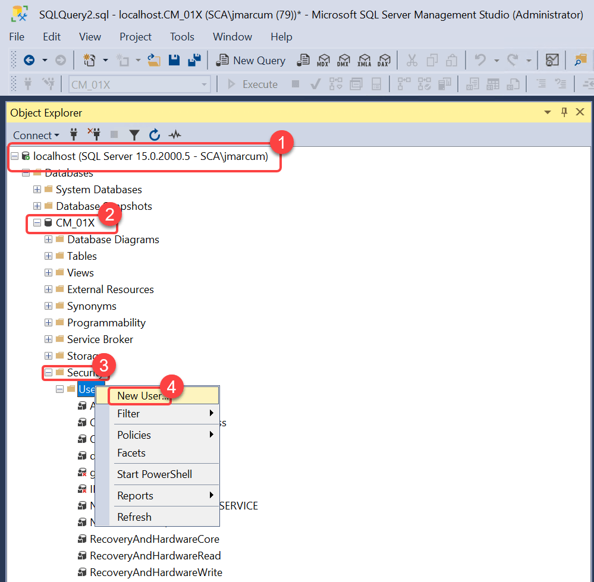
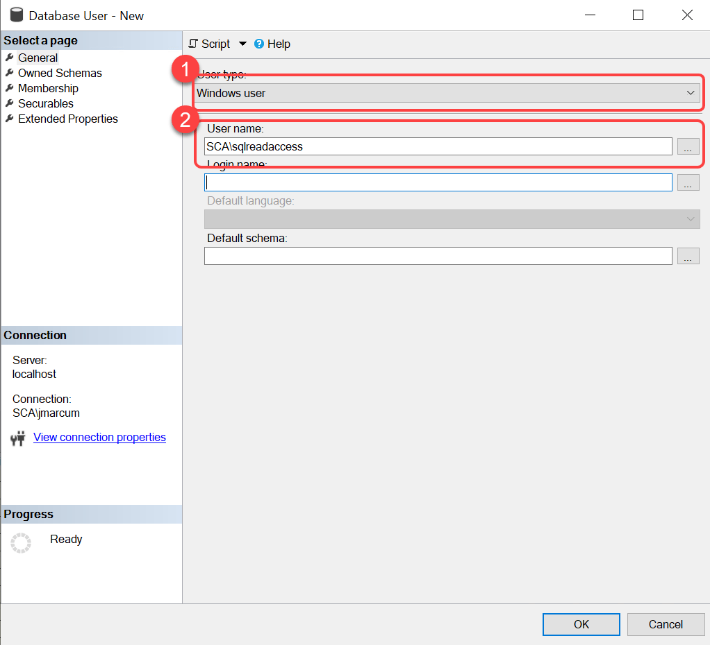
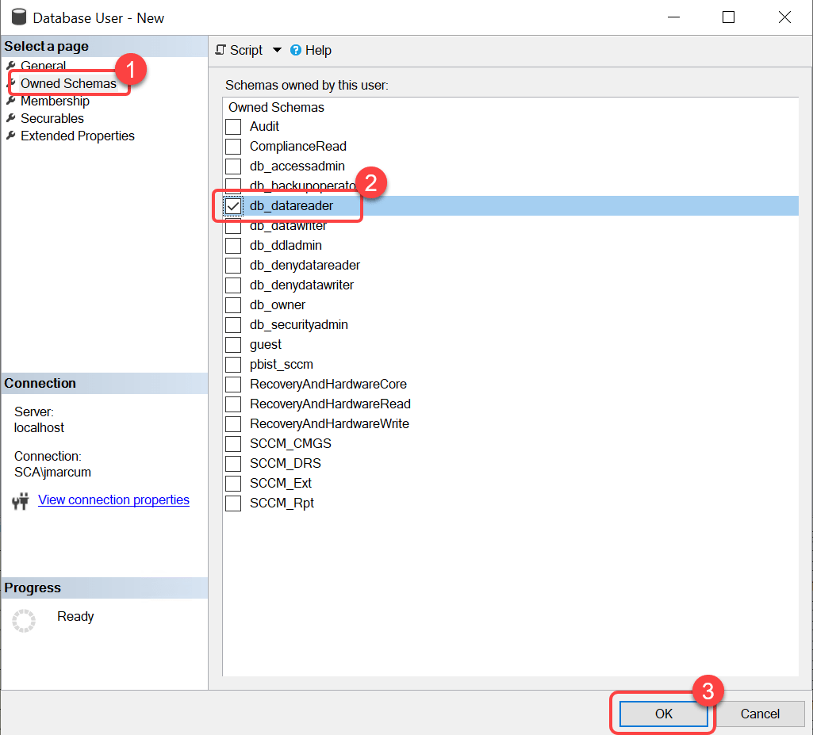

# Configure Database Access
In order to read data from the ConfigMgr database an account with at least read access to the database is required. This can be an Active Directory user or a SQL user account. In this example we are using an Active Directory user account. As a best practice this account should be a dedicated service account following the principle of least privilege.

### Step 1: Create Database User

1. Identify, or create, an account to be used as the database reader account.
1. In **SQL Management Studio** connect to your ConfigMgr database.
1. Expand the database in which to create the new database user.
1. Right-click the **Security** folder, point to **New**, and select **User....**

### Step 2: Configure User Account

1. In the **Database User - New** dialog box, on the **General** page, select a user types from the **User type** list.
1. Enter the **User name** for the database reader account. If you have chosen **Windows user** from the **User type** list, you can also select the ellipsis (**...**) to open the **Select User or Group** dialog box.

### Step 3: Assign Data Reader Role

1. In the **Database User - New** dialog box select the **Owned Schemas** page.
1. Select **db_datareader**.
1. Select **OK**.

