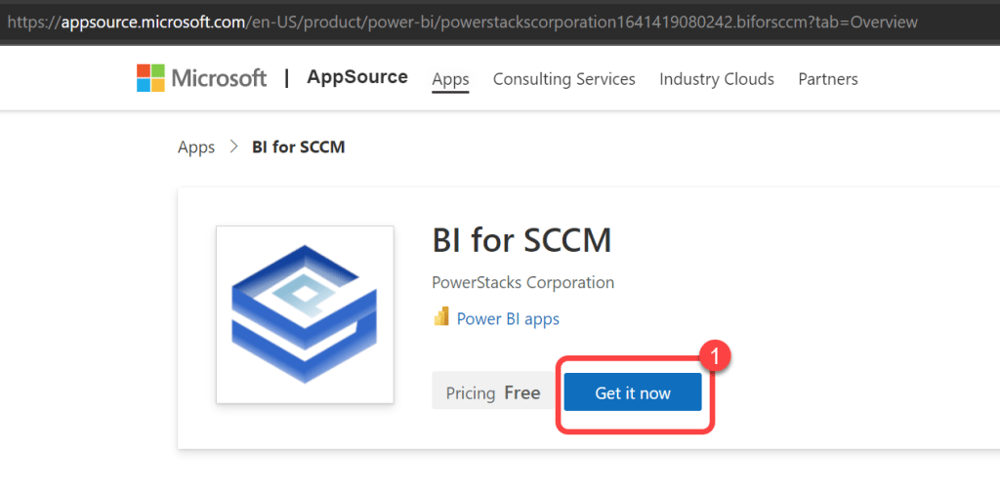
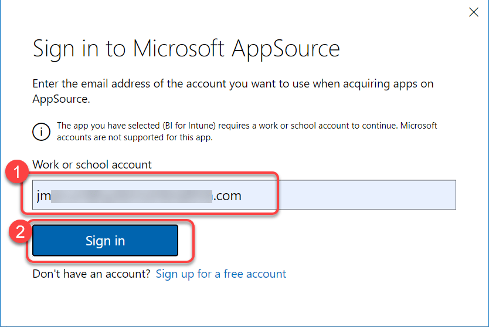
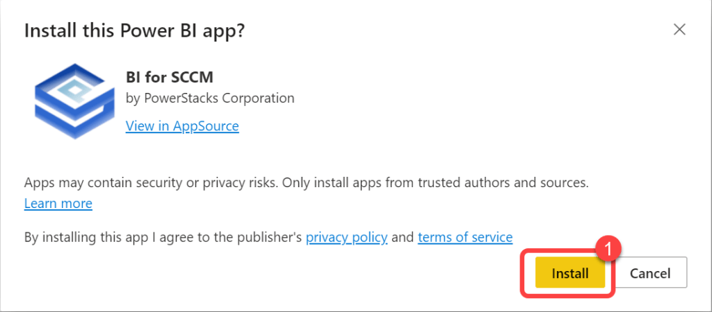
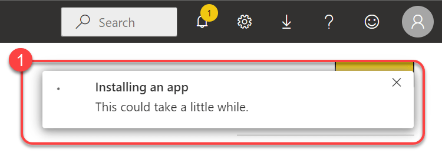
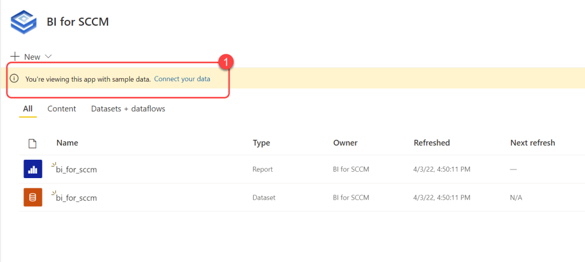

# Install BI for SCCM
Installing BI for SCCM is quite simple. BI for SCCM installs from Microsoft AppSource directly into your Power BI tenant. Once installed you can try the application using the supplier sample data or you can chose to request a fully-functional 30-day trial license to connect your own data to the reports.

**Prerequisites:**The user performing this step requires a Power BI Pro license, Power BI Premium Per User license, or the Power BI tenant must be licensed for Power BI Premium. Microsoft offers a free Power BI Pro trial license via self-service sign-up for those who want to try BI for Intune before purchasing Microsoft licenses.

To get started select the "**Install Now**" button to be directed to Microsoft App Source.
[Install Now](https://appsource.microsoft.com/en-US/product/power-bi/powerstackscorporation1641419080242.biforsccm?tab=Overview)

### Step 1

1. Select the "**Install Now**" button above.
1. On the**BI for SCCM** page in **Microsoft AppSource** select **Get it now**.

### Step 2

1. Enter your **work email address** and select **Sign in**.

### Step 3

1. Select **Install**.

### Step 4

1. You will see a notification that BI for Install is installing. Once this has disappeared you have successfully installed BI for Intune. You may now view the app using the sample data provided or you can connect your data by [requesting a trial license key](request-a-license-key.md).

### Step 5

1. Upon opening the BI for SCCM workspace you may notice a banner that says, "**You're viewing this app with sample data. Connect your data**." This can be safely ignored. If you'd like to try BI for Intune before connecting your data it installs with sample data. If you prefer to go ahead and see your own data proceed to the next step in our documentation.

