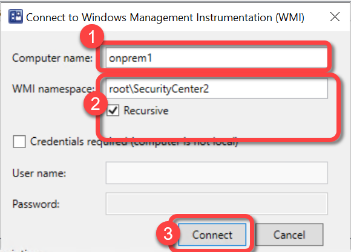
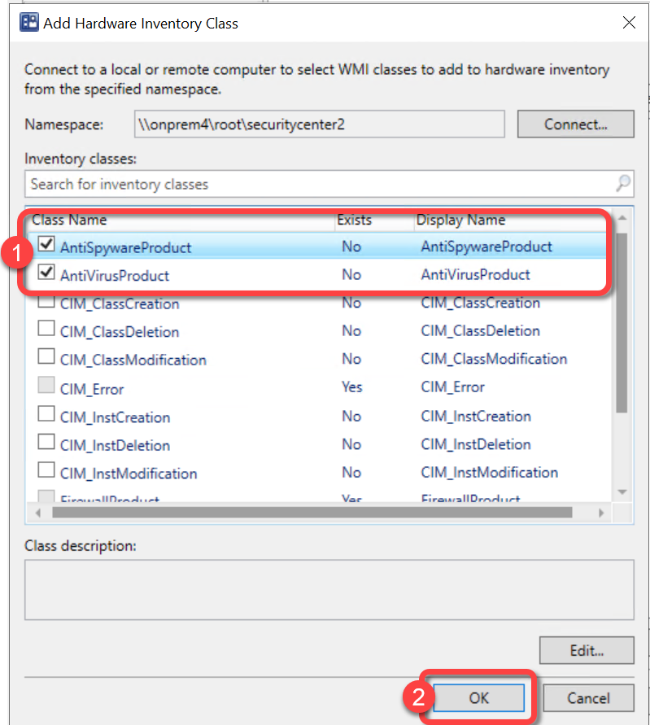
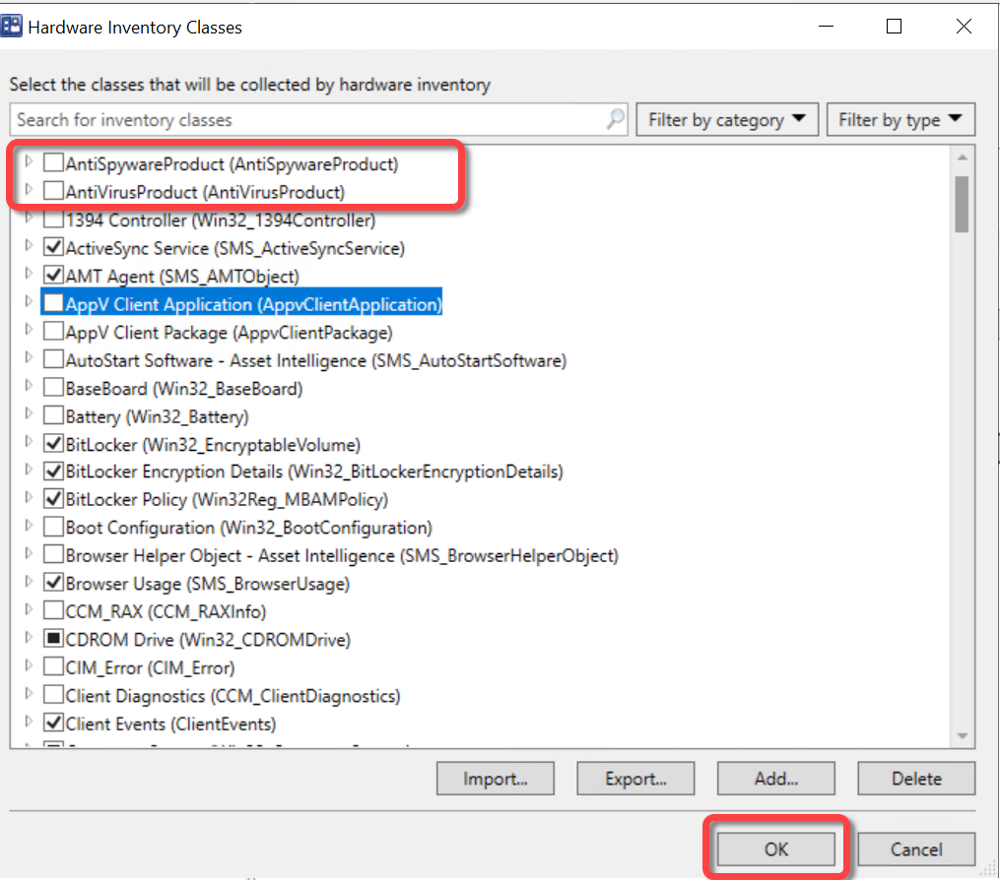

# Inventory Antivirus Software
The Antivirus & Antispyware page shows which Antivirus & Antispyware products are installed, not installed, and which are active. This is very helpful for AV migration projects or to help ensure compliance with your AV product installations. The page reports on both third-party and Microsoft Defender installation and activation status.

To populate the Antivirus & Antispyware page you must extend hardware inventory to include the AntiSpywareProduct and AntiVirusProduct WMI classes from the rootsecuritycenter2 namespace. This namespace only exists on Windows 10 and 11. You can only add new inventory classes from the hierarchy's top-level server by modifying the default client settings. This option isn't available in custom client settings.  Once imported to the default client settings the new class will become available in your custom client settings.

For more information about adding a new WMI class to Configuration Manager hardware inventory see the [Add a New Class](https://docs.microsoft.com/en-us/mem/configmgr/core/clients/manage/inventory/extend-hardware-inventory#add-a-new-class) section in the [How to extend hardware inventory](https://docs.microsoft.com/en-us/mem/configmgr/core/clients/manage/inventory/extend-hardware-inventory) Configuration Manager documentation page.

Skipping this step will not generate any errors however, the "Antivirus & Antispyware" page will not populate.

**Prerequisites:**

1. Hardware inventory must be enabled.
1. Permissions to edit the default hardware inventory settings.

### Step 1: Open Default Client Settings

1. In the Configuration Manager console, go to the **Administration** workspace.
1. Select the **Client Settings** node.
1. Select the **Default Client Settings.** (**Note**: New classes must be added in the Default Client Settings.)
1. On the **Home** tab, in the **Properties** group, choose **Properties**.

### Step 2: Open Hardware Inventory Classes

1. In the **Default Settings** dialog, choose **Hardware Inventory**.
1. In the **Device Settings** list, select **Set Classes**.

### Step 3: Add New Inventory Class

1. In the **Hardware Inventory Classes** dialog select **Add**.

### Step 4: Connect to WMI

1. In the **Add Hardware Inventory Class** dialog, select **Connect**.

### Step 5: Specify WMI Namespace

1. In the **Connect to Windows Management Instrumentation (WMI)** dialog, specify the name of a Windows 10 or 11 computer, specify **rootSecurityCenter2** namespace and select **Recursive**.
1. select **Connect**.

### Step 6: Select Antivirus Classes

1. In the **Add Hardware Inventory Class** dialog, Select the **AntiSpywareProduct** and **AntiVirusProduct** inventory classes.
1. Select **OK**.

### Step 7: Review Inventory Classes

1. In the **Hardware Inventory Classes** dialog, you might want to **clear** the
1. **AntiSpywareProduct** and **AntiVirusProduct** inventory classeses and add them to a custom client agent setting instead. Using a custom client agent setting is typically advised however it is not covered in this document. If you would like to have the monitor inventory collected using the Default Client Settings do not clear **AntiSpywareProduct** and **AntiVirusProduct** inventory classes here.
1. Select **OK**.

### Step 8: Confirm Default Settings

1. In the **Default Settings** dialog, select **OK**.

