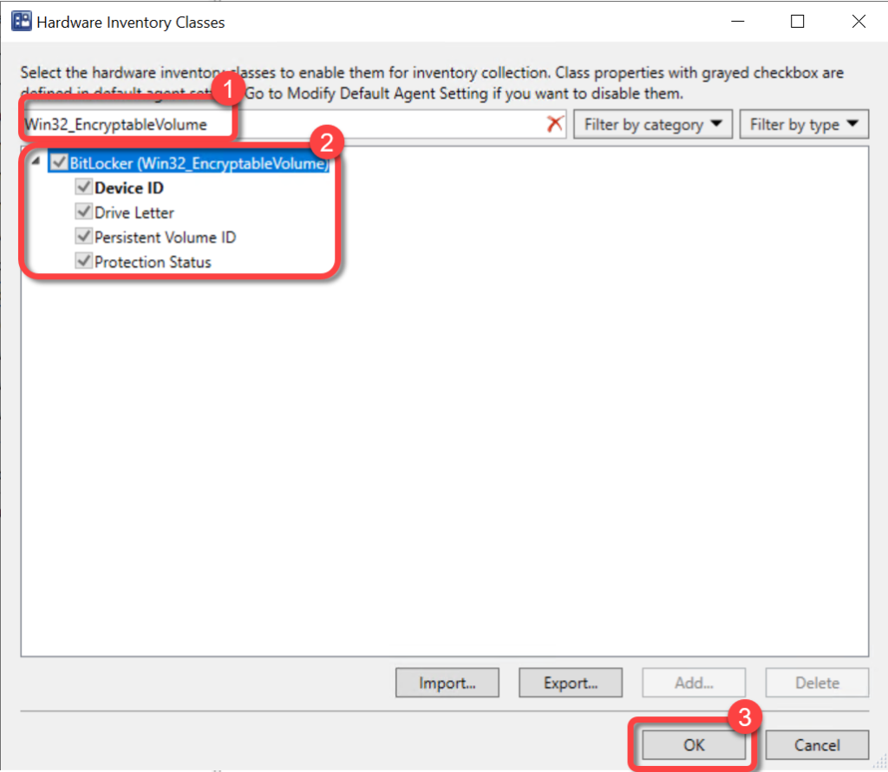

# Inventory BitLocker Status
To populate the data required to see the status of BitLocker encryption ensure that the Win32_EncryptableVolume class has been added to Hardware Inventory. Skipping this step will not generate any errors however, the field "Is Encrypted" under "Computer Disk" will be blank.
For more information on extending Configuration Manager hardware inventory see [Enable or disable existing classes](https://docs.microsoft.com/en-us/mem/configmgr/core/clients/manage/inventory/extend-hardware-inventory#enable-or-disable-existing-classes) in the [How to extend hardware inventory](https://docs.microsoft.com/en-us/mem/configmgr/core/clients/manage/inventory/extend-hardware-inventory) Configuration Manager documentation page.
**Prerequisites:**
Hardware inventory must be enabled.

### Step 1: Open Client Settings Properties

1. In the Configuration Manager console, go to the **Administration** workspace.
1. Select the **Client Settings** node.
1. Select the **client settings** in which you have configured your hardware inventory settings.
1. On the **Home** tab, in the **Properties** group, choose **Properties**.

### Step 2: Open Hardware Inventory Classes

1. In the **client settings** dialog, choose **Hardware Inventory**.
1. In the **Device Settings** list, select **Set Classes**.

### Step 3: Enable EncryptableVolume Class

1. In the **Hardware Inventory Classes** dialog, use the **Search for inventory classes** field to search for the **Win32_EncryptableVolume** class.
1. Select the **Win32_EncryptableVolume** class.
1. Select **OK**

### Step 4: Confirm Client Settings

1. In the **client settings** dialog, select **OK**.

