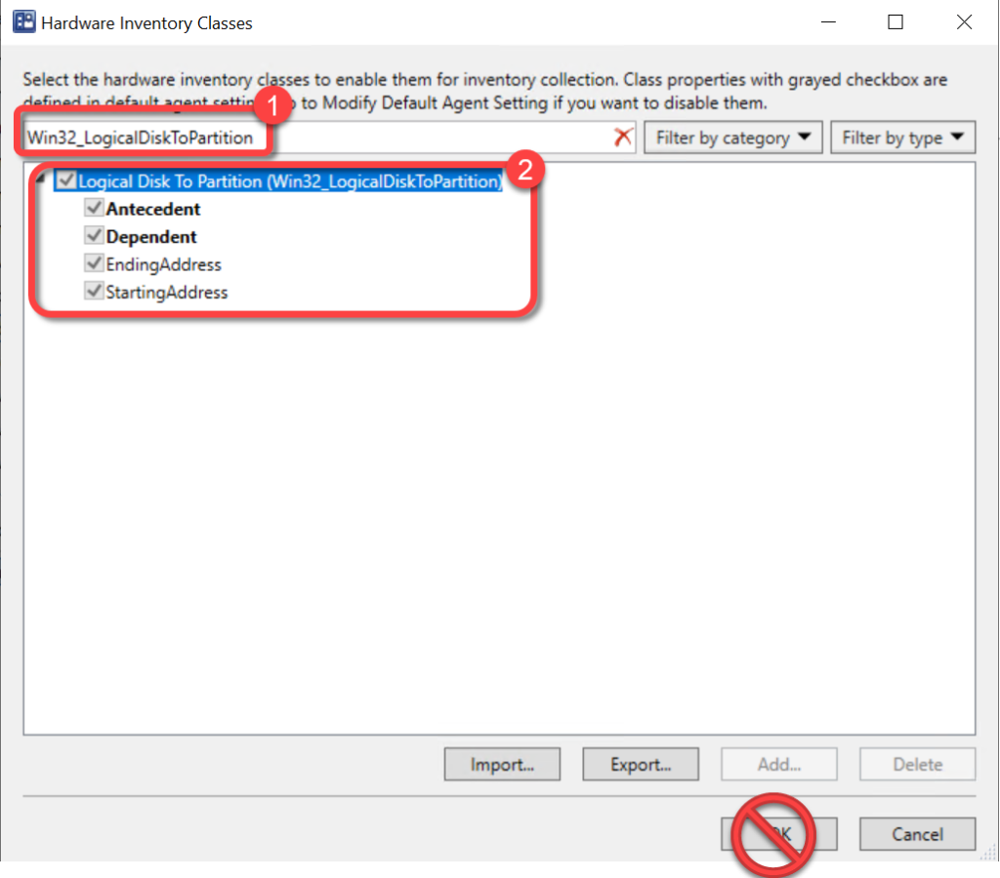
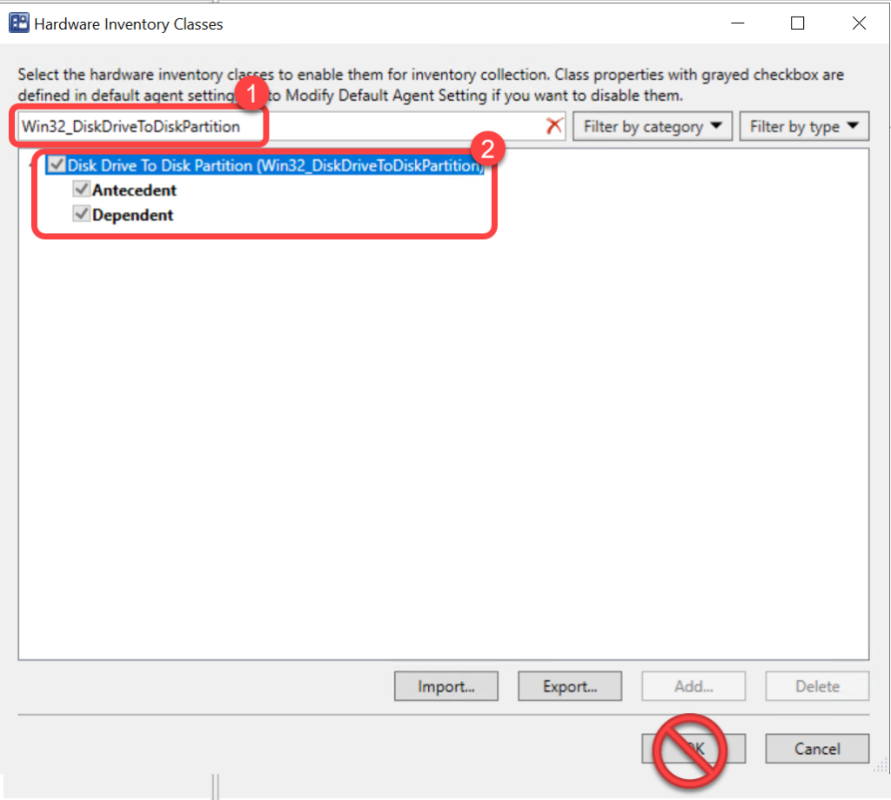
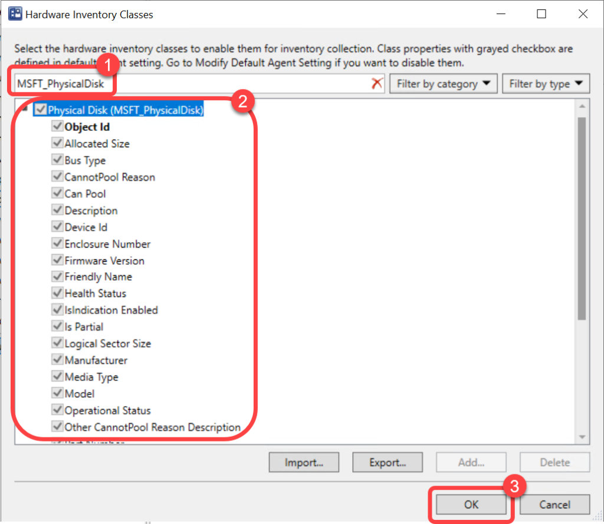

# Inventory Disk Types (SSD or HDD)
To populate the data required for reporting on the drive type, Solid State Drive or Hard Disk Drive, you must extend hardware inventory to include the Logical Disk to Partition and the Disk Drive to Disk Partition classes. You must also add the Device_ID column to the default data collected from the Physical Disk WMI class. Skipping this step will not generate any errors however, you will not be able to report on the drive type. This may not be a concern for some environments as they already know that all devices have SSD's in them.

For more information on extending Configuration Manager hardware inventory see [Enable or disable existing classes](https://docs.microsoft.com/en-us/mem/configmgr/core/clients/manage/inventory/extend-hardware-inventory#enable-or-disable-existing-classes) in the [How to extend hardware inventory](https://docs.microsoft.com/en-us/mem/configmgr/core/clients/manage/inventory/extend-hardware-inventory) Configuration Manager documentation page.

**Prerequisites:**

Hardware inventory must be enabled.

### Step 1: Open Client Settings Properties

1. In the Configuration Manager console, go to the **Administration** workspace.
1. Select the **Client Settings** node.
1. Select the **client settings** in which you have configured your hardware inventory settings.
1. On the **Home** tab, in the **Properties** group, choose **Properties**.

### Step 2: Open Hardware Inventory Classes

1. In the **client settings** dialog, choose **Hardware Inventory**.
1. In the **Device Settings** list, select **Set Classes**.

### Step 3: Enable LogicalDiskToPartition Class

1. In the **Hardware Inventory Classes** dialog, use the **Search for inventory classes** field to search for the **Win32_LogicalDiskToPartition**class.
1. Select the **Win32_LogicalDiskToPartition**class.
1. Do not select **OK.**

### Step 4: Enable DiskDriveToDiskPartition Class

1. In the **Hardware Inventory Classes** dialog, use the **Search for inventory classes** field to search for the **Win32_DiskDriveToDiskPartition**class.
1. Select the **Win32_DiskDriveToDiskPartition**class.
1. Do not select **OK.**

### Step 5: Enable PhysicalDisk Class

1. In the **Hardware Inventory Classes** dialog, use the **Search for inventory classes** field to search for the **MSFT_PhysicalDisk**class.
1. Select the **MSFT_PhysicalDisk**class.
1. Select **OK.**

### Step 6: Confirm Client Settings

1. In the **client settings** dialog, select **OK**.

