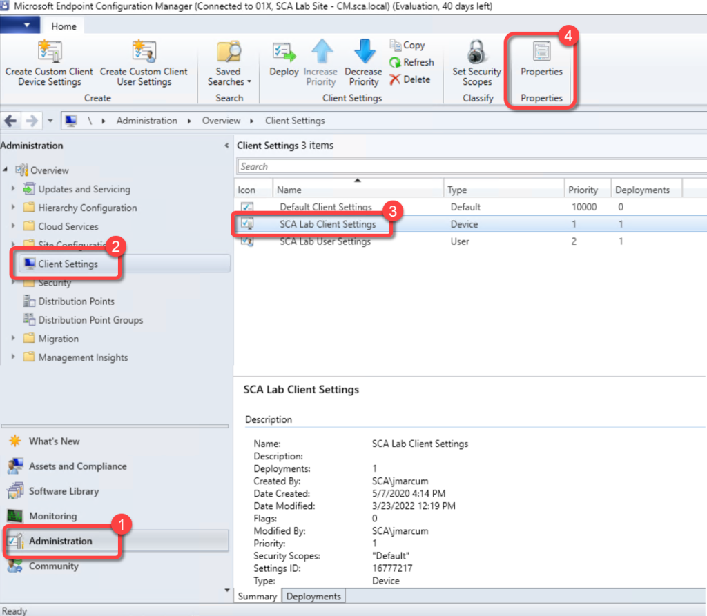
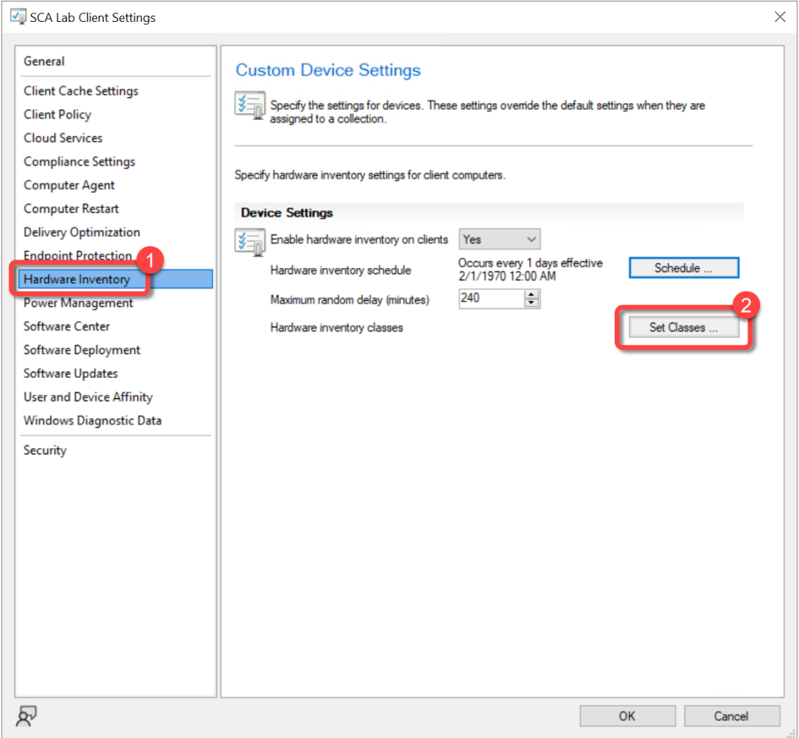
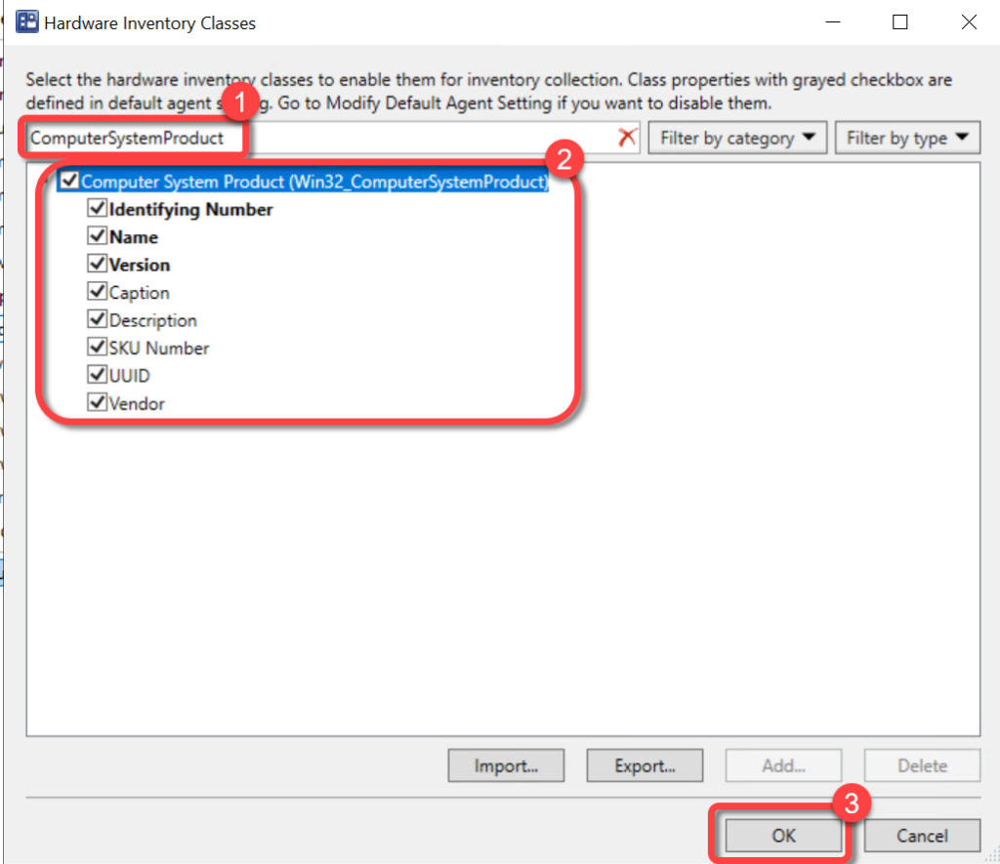
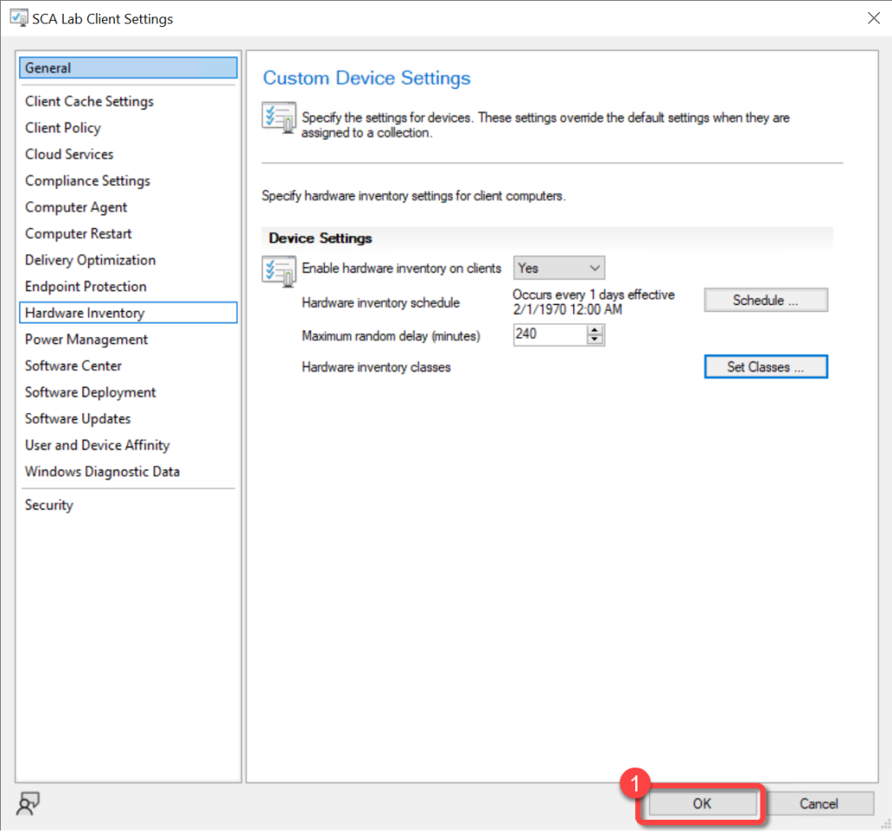

# Inventory Lenovo Model Names
Lenovo stores its friendly model names in a different WMI class that any other manufacturer. By default, ConfigMgr does not inventory this WMI class. In order to populate the Lenovo model names you must extend hardware inventory to include the ComputerSystemProduct WMI class. Adding this class will ensure that the reports in BI for SCCM contain model names such as, "X1 Carbon" rather than something like "20K3".
For more information on extending Configuration Manager hardware inventory see [Enable or disable existing classes](https://docs.microsoft.com/en-us/mem/configmgr/core/clients/manage/inventory/extend-hardware-inventory#enable-or-disable-existing-classes) in the [How to extend hardware inventory](https://docs.microsoft.com/en-us/mem/configmgr/core/clients/manage/inventory/extend-hardware-inventory) Configuration Manager documentation page.
**Prerequisites:**

Hardware inventory must be enabled.

### Step 1

1. In the Configuration Manager console, go to the **Administration** workspace.
1. Select the **Client Settings** node.
1. Select the **client settings** in which you have configured your hardware inventory settings.
1. On the **Home** tab, in the **Properties** group, choose **Properties**.

### Step 2

1. In the **client settings** dialog box, choose **Hardware Inventory**.
1. In the **Device Settings** list, select **Set Classes**.

### Step 3

1. In the **Hardware Inventory Classes** dialog box, use the **Search for inventory classes** field to search for the **ComputerSystemProduct** class.
1. Select the **ComputerSystemProduct**class.
1. Select **OK**

### Step 4

1. In the **client settings** dialog box, select **OK**.

