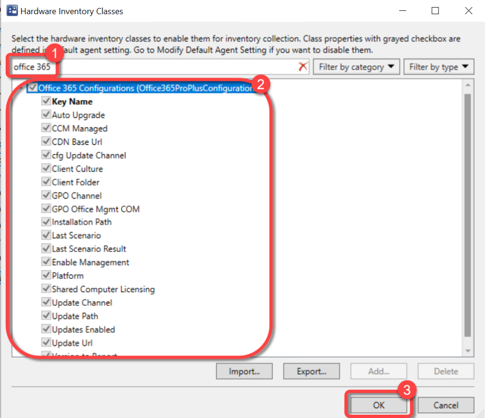

# Inventory Microsoft 365 Apps
To populate the Microsoft 365 page you must extend hardware inventory to include the Office 365 ProPlus Configurations WMI classes from the rootcimv2 namespace from a Windows 10 computer. Ensure the following items have been added to Hardware Inventory. Skipping this step will not generate any errors however, the Microsoft 365 page will be blank.

For more information on extending Configuration Manager hardware inventory see [Enable or disable existing classes](https://docs.microsoft.com/en-us/mem/configmgr/core/clients/manage/inventory/extend-hardware-inventory#enable-or-disable-existing-classes) in the [How to extend hardware inventory](https://docs.microsoft.com/en-us/mem/configmgr/core/clients/manage/inventory/extend-hardware-inventory) Configuration Manager documentation page.

**Prerequisites:**

Hardware inventory must be enabled.

### Step 1: Open Client Settings Properties

1. In the Configuration Manager console, go to the **Administration** workspace.
1. Select the **Client Settings** node.
1. Select the **client settings** in which you have configured your hardware inventory settings.
1. On the **Home** tab, in the **Properties** group, choose **Properties**.

### Step 2: Open Hardware Inventory Classes

1. In the **client settings** dialog, choose **Hardware Inventory**.
1. In the **Device Settings** list, select **Set Classes**.

### Step 3: Enable Office 365 Class

1. In the **Hardware Inventory Classes** dialog, use the **Search for inventory classes** field to search for the **Office 365 Configurations**class.
1. Select the **Office 365 Configurations**class.
1. Select **OK**

### Step 4: Confirm Client Settings

1. In the **client settings** dialog, select **OK**.

