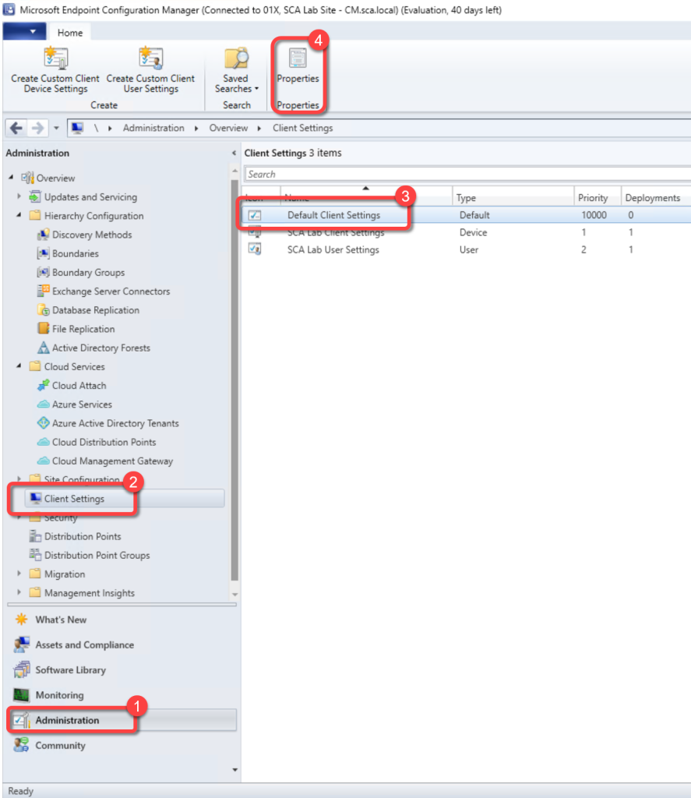
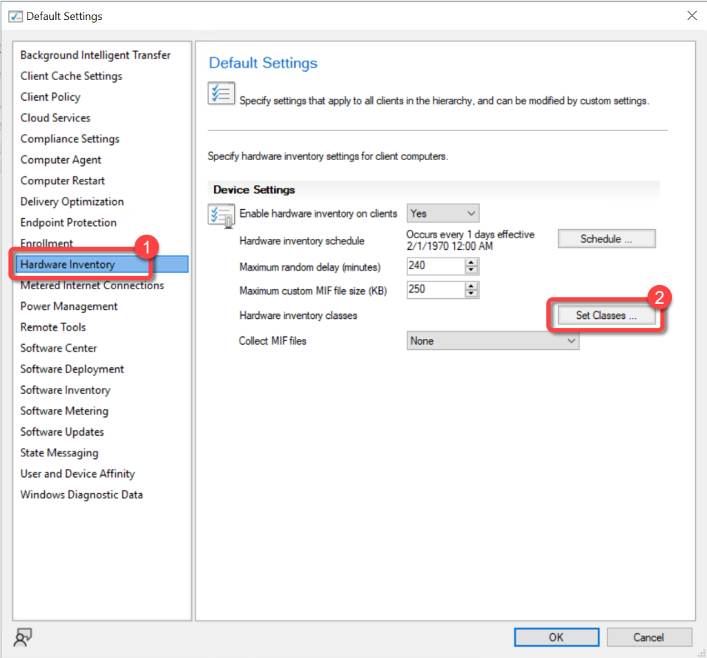
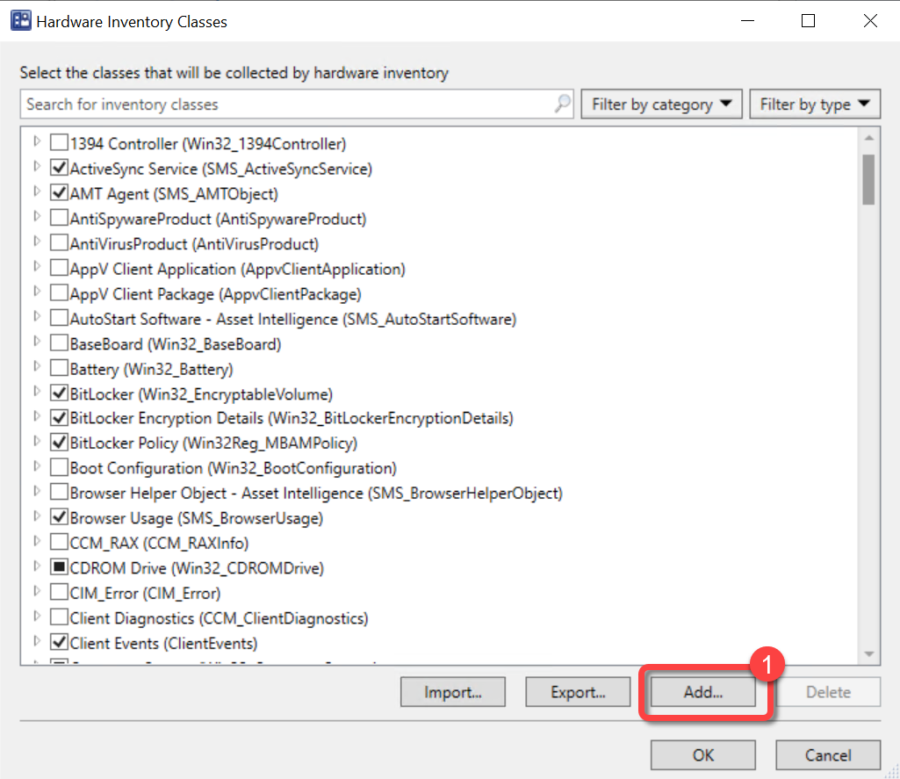
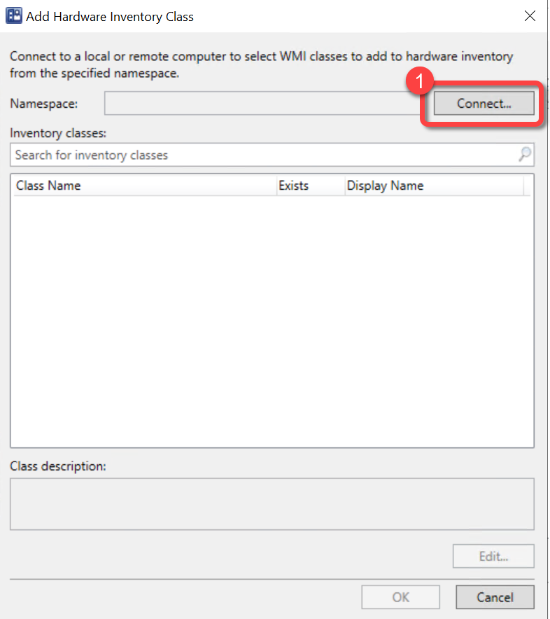
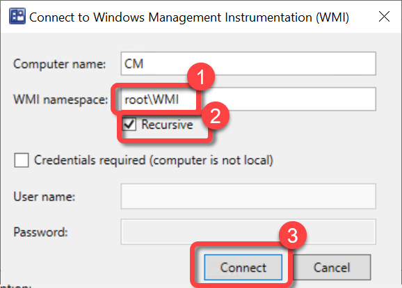
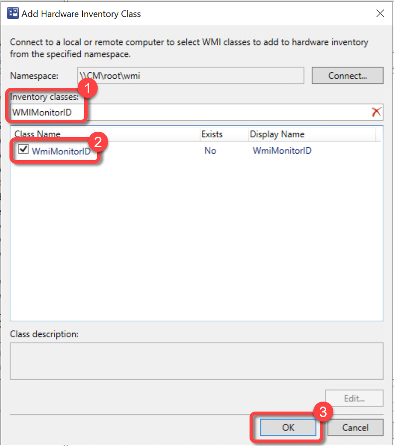
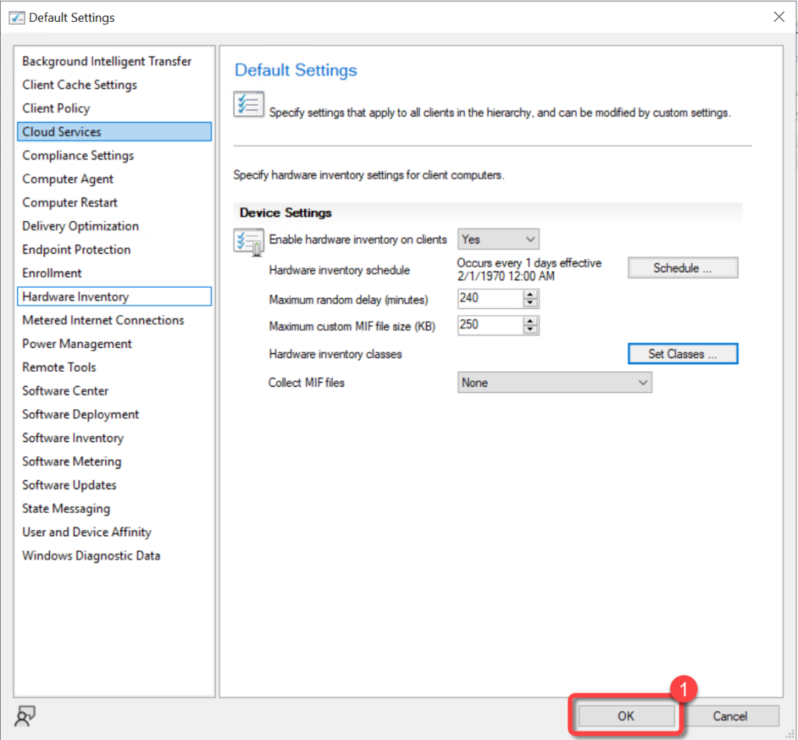

# Inventory Monitors
BI for SCCM can report on the monitors connected to devices. This information includes the make, model, and manufacture date.

To populate the data required for [reporting on monitors](http://ec2-34-220-217-132.us-west-2.compute.amazonaws.com/wordpress/monitor-windows-update-installation-progression/) you must extend hardware inventory to include the "WMIMonitorID" WMI class from the "rootWMI" namespace. You can only add inventory classes from the hierarchy's top-level server by modifying the default client settings. This option isn't available in custom client settings.

For more information about adding a new WMI class to Configuration Manager hardware inventory see the [Add a New Class](https://docs.microsoft.com/en-us/mem/configmgr/core/clients/manage/inventory/extend-hardware-inventory#add-a-new-class) section in the [How to extend hardware inventory](https://docs.microsoft.com/en-us/mem/configmgr/core/clients/manage/inventory/extend-hardware-inventory) Configuration Manager documentation page.

**Prerequisites:**

1. Hardware inventory must be enabled.
1. Permissions to edit the default hardware inventory settings.

Skipping this recommended configuration will not generate any errors however, you will not be able to report on monitors and the out of the box Monitors page will be blank.

### Step 1: Open Default Client Settings

1. In the Configuration Manager console, go to the **Administration** workspace.
1. Select the **Client Settings** node.
1. Select the **Default Client Settings.** (**Note**: New classes must be added in the Default Client Settings.)
1. On the **Home** tab, in the **Properties** group, choose **Properties**.

### Step 2: Open Hardware Inventory Classes

1. In the **Default Settings** dialog, choose **Hardware Inventory**.
1. In the **Device Settings** list, select **Set Classes**.

### Step 3: Add New Inventory Class

1. In the **Hardware Inventory Classes** dialog select **Add**.

### Step 4: Connect to WMI

1. In the **Add Hardware Inventory Class** dialog, select **Connect**.

### Step 5: Specify WMI Namespace

1. In the **Connect to Windows Management Instrumentation (WMI)** dialog, specify the **rootWMI** namespace and select **Recursive**.
1. select **Connect**.

### Step 6: Select WMIMonitorID Class

1. In the **Add Hardware Inventory Class** dialog, use the **Search for inventory classes** field to search for the **WMIMonitorID** class.
1. Select the **WMIMonitorID** class.
1. Select **OK**.

### Step 7: Review Inventory Classes

1. In the **Hardware Inventory Classes** dialog, you might want to clear the WMIMonitorID and add it to a custom client agent setting instead. Using a custom client agent setting is typically advised however it is not covered in this document. If you would like to have the monitor inventory collected using the Default Client Settings do not clear WMIMonitorID here.
1. Select **OK**.

### Step 8: Confirm Default Settings

1. In the **Default** **Settings** dialog, select **OK**.

