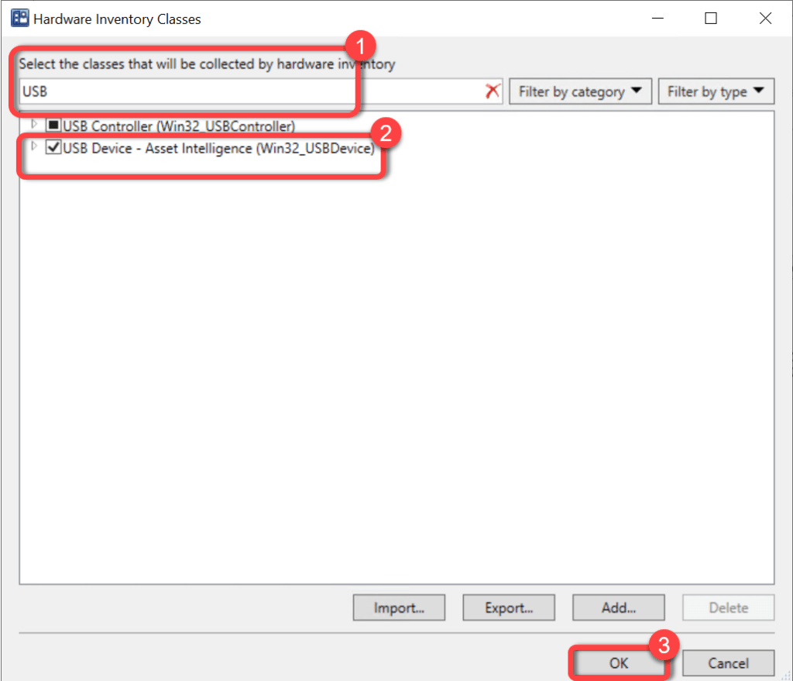

# Inventory USB Devices
In order to populate the data required to report on USB devices you must add the "USB Device - Asset Intelligence (Win32_USBDevice)" class to Hardware Inventory. Skipping this step will not generate any errors however, the fields in the "Computer USB" will be blank.

For more information on extending Configuration Manager hardware inventory see [Enable or disable existing classes](https://docs.microsoft.com/en-us/mem/configmgr/core/clients/manage/inventory/extend-hardware-inventory#enable-or-disable-existing-classes) in the [How to extend hardware inventory](https://docs.microsoft.com/en-us/mem/configmgr/core/clients/manage/inventory/extend-hardware-inventory) Configuration Manager documentation page.

**Prerequisites:**
Hardware inventory must be enabled.

### Step 1

1. In the Configuration Manager console, go to the **Administration** workspace.
1. Select the **Client Settings** node.
1. Select the **client settings** in which you have configured your hardware inventory settings.
1. On the **Home** tab, in the **Properties** group, choose **Properties**.

### Step 2

1. In the **client settings** dialog box, choose **Hardware Inventory**.
1. In the **Device Settings** list, select **Set Classes**.

### Step 3

1. In the **Hardware Inventory Classes** dialog box, use the **Search for inventory classes** field to search for the **USB Device - Asset Intelligence (Win32_USBDevice)** class.
1. Select the **USB Device - Asset Intelligence (Win32_USBDevice)** class.
1. Select **OK**

### Step 4

1. In the **client settings** dialog box, select **OK**.

