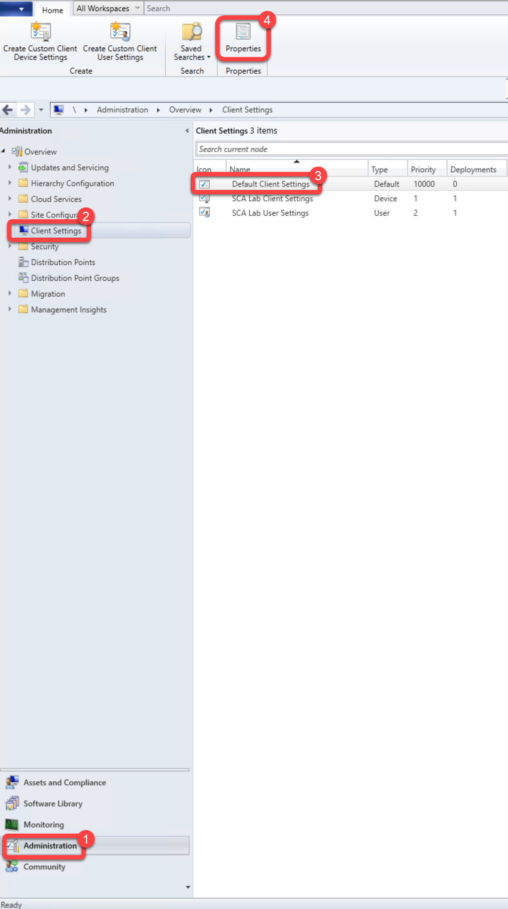
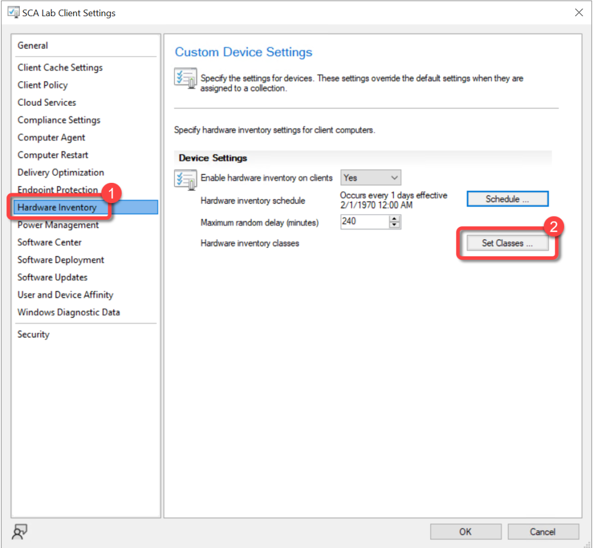
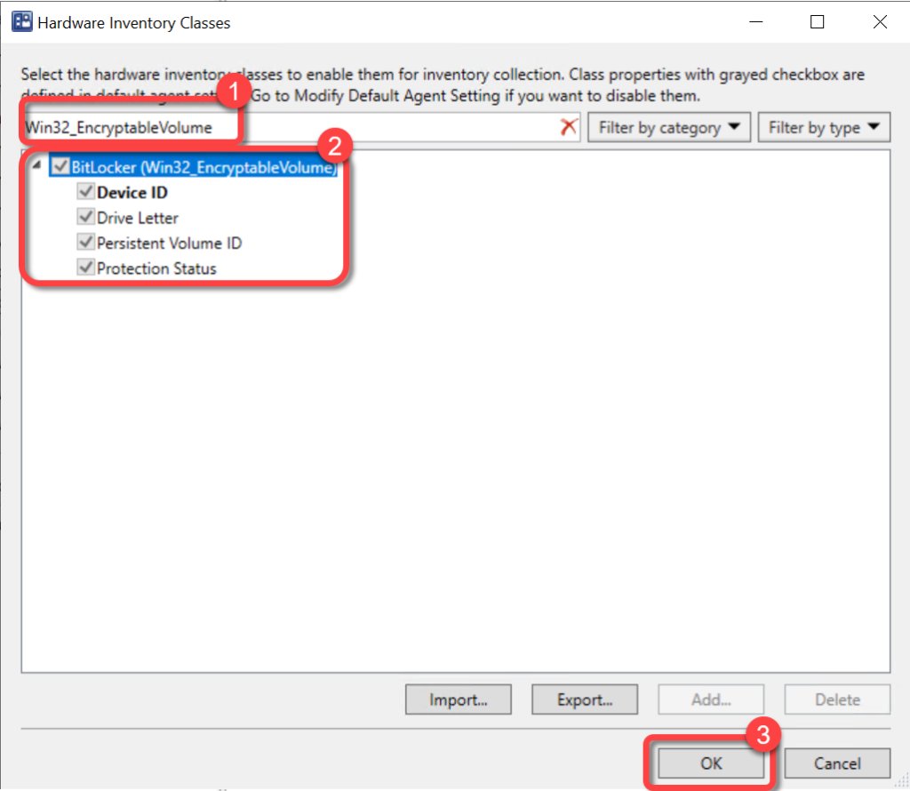
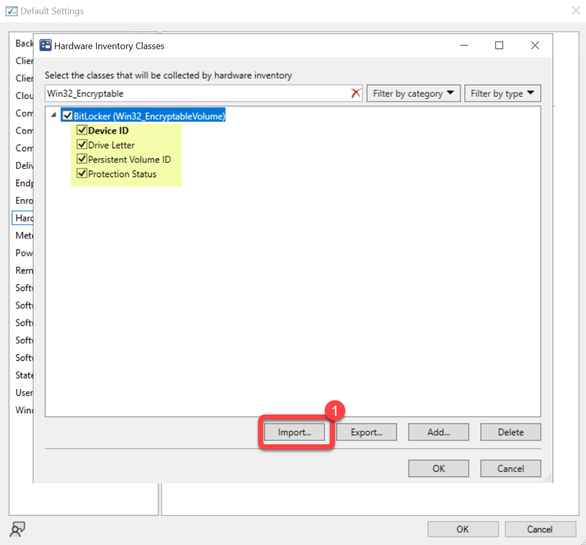
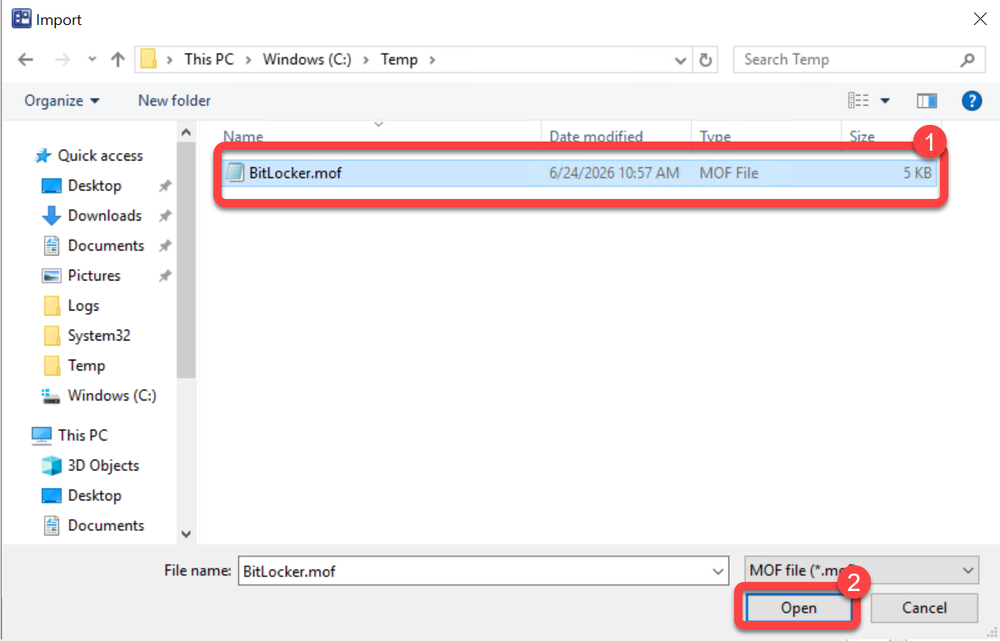
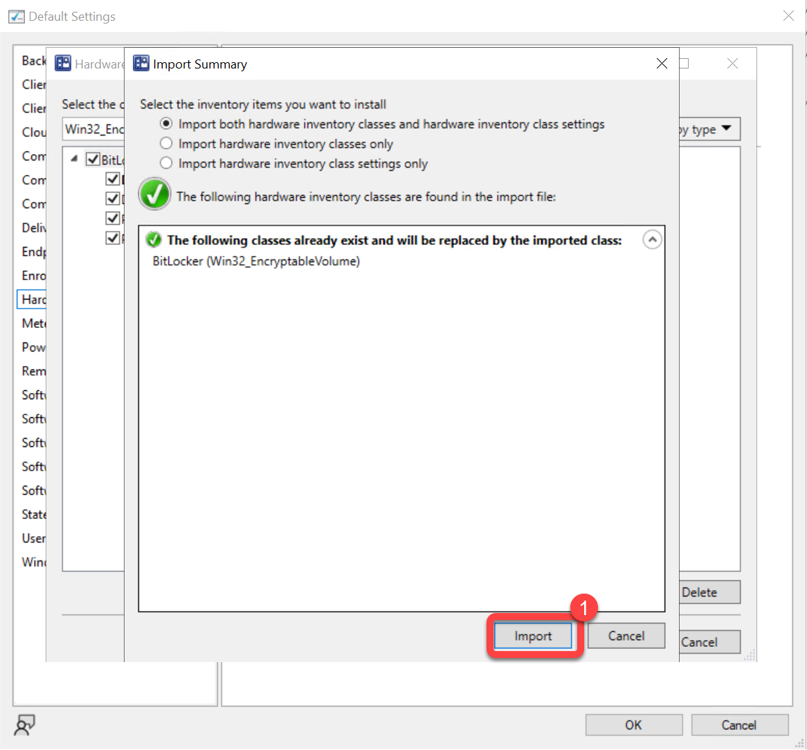
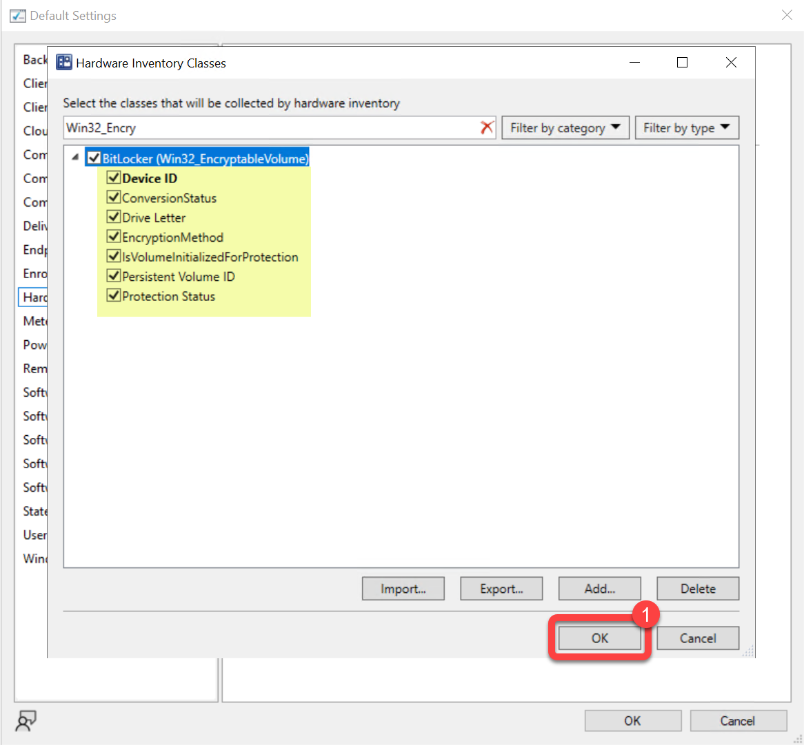
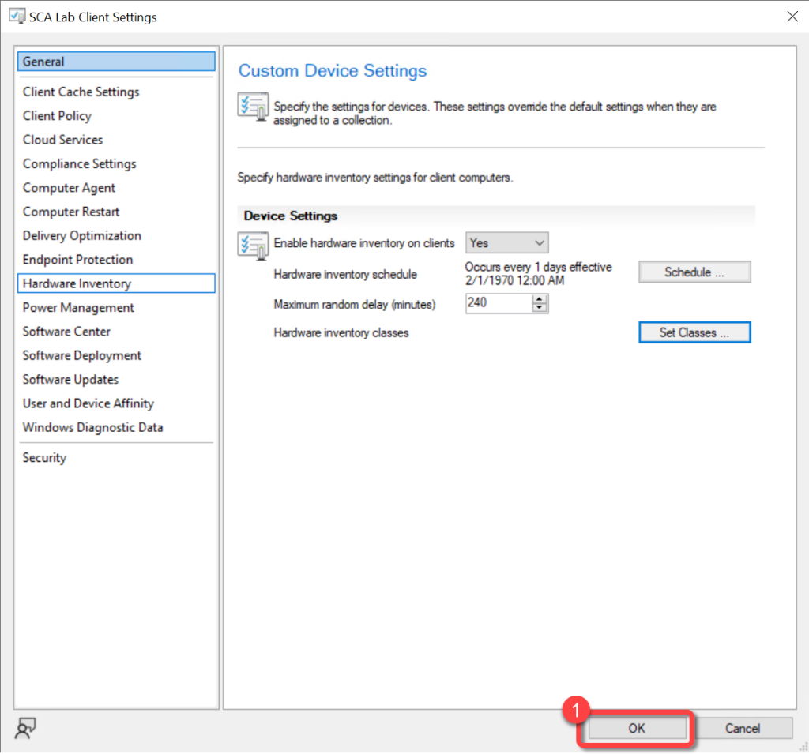

# Inventory BitLocker Status

To populate the data required to see the status of BitLocker encryption, add the **Win32_EncryptableVolume** class to hardware inventory and import the PowerStacks BitLocker MOF to extend it with additional encryption properties. Skipping this step will not generate any errors, but the encryption fields under **Computer Disk** (for example, **Is Encrypted**) will be blank.

The default `Win32_EncryptableVolume` class reports only Device ID, Drive Letter, Persistent Volume ID, and Protection Status. Importing the BitLocker MOF adds **Conversion Status**, **Encryption Method**, and **Is Volume Initialized For Protection**, giving a fuller picture of each volume's encryption state.

For background on extending Configuration Manager hardware inventory, see [How to extend hardware inventory](https://learn.microsoft.com/mem/configmgr/core/clients/manage/inventory/extend-hardware-inventory) in the Configuration Manager documentation.

**Prerequisites:**

1. Hardware inventory must be enabled.
1. Permissions to edit the default hardware inventory settings.

### Step 1: Save the BitLocker MOF File

Download [BitLocker.mof](../../files/BitLocker.mof) and save it somewhere on your Configuration Manager **Primary Site Server** (for example, `C:\Temp\BitLocker.mof`). You will import it in a later step.

### Step 2: Open the Default Client Settings

1. In the Configuration Manager console, go to the **Administration** workspace.
1. Select the **Client Settings** node.
1. Select the **Default Client Settings**.
1. On the **Home** tab, in the **Properties** group, choose **Properties**.

### Step 3: Open Hardware Inventory Classes

1. In the **Default Settings** dialog, choose **Hardware Inventory**.
1. In the **Device Settings** list, select **Set Classes**.

### Step 4: Enable the Win32_EncryptableVolume Class

1. In the **Hardware Inventory Classes** dialog, use the **Search for inventory classes** field to search for **Win32_EncryptableVolume**.
1. Select the **Win32_EncryptableVolume** class.

At this point the class reports only the basic properties: **Device ID**, **Drive Letter**, **Persistent Volume ID**, and **Protection Status**. Leave the dialog open and continue to the next step to extend it.

### Step 5: Import the BitLocker MOF

1. In the **Hardware Inventory Classes** dialog, select **Import**.

    

1. Browse to the **BitLocker.mof** file you saved in Step 1, then select **Open**.

    

1. In the **Import Summary** dialog, leave **Import both hardware inventory classes and hardware inventory class settings** selected. The summary confirms the existing **BitLocker (Win32_EncryptableVolume)** class will be replaced by the imported class. Select **Import**.

    

### Step 6: Confirm the Extended Properties

After the import, the **Win32_EncryptableVolume** class reports the full set of properties, all selected: **Device ID**, **ConversionStatus**, **Drive Letter**, **EncryptionMethod**, **IsVolumeInitializedForProtection**, **Persistent Volume ID**, and **Protection Status**. Confirm they are all selected, then select **OK**.

### Step 7: Confirm Client Settings

1. In the **Default Settings** dialog, select **OK**.

